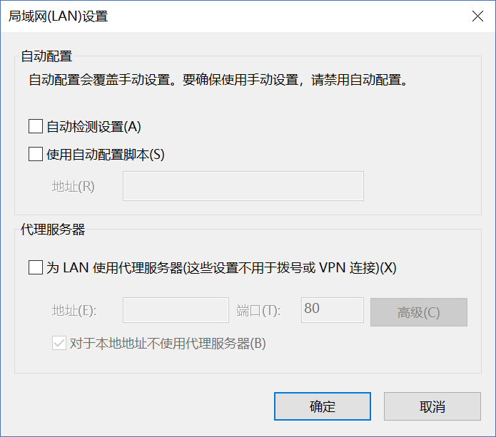

# 科学上网的一些软件的原理和使用技巧

[原文地址](https://fanzheng.org/archives/2)

# 1 Shadowsocks

先说说[Shadowsocks](https://github.com/shadowsocks/shadowsocks)（简称ss），这个已经被封杀的软件。它的原理是：假设我们有一台在美国的服务器，我们可以在它上面安装ss的服务端（通常使用8388端口）。之后我们在我们的系统上安装ss的客户端（通常使用1080端口），这样客户端就可以与服务端通信并交换数据。于是，~~remotehost:8388与localhost:1080建立了通信~~（很抱歉，一开始这么写并没有考虑太多，后来想一想，外行人可以这么去理解，但是内行人不应该这么表述，因为存在科学性错误。实际上**客户端进行通信所使用的端口并不固定**，且不止一个，为方便表述，这里假设为A端口。假设现在**服务端有个数据包要过来，ss在localhost:A与remotehost:8388通信的同时，利用客户端监听的1080端口，将数据包转发至1080端口，这样应用程序就可以通过localhost:1080访问到remotehost:8388**。因此，remotehost:8388与localhost:1080并不是直接建立的通信，而是经过了ss的处理，看起来像是直接通信的），我们访问localhost:1080就相当于通过remotehost:8388访问。Shadowsocks使用的是SOCKS5代理协议。

在SS Windows客户端上设置时，会有一个**“启用系统代理”**的选项，如果启用该选项，那么软件会在IE的Internet选项--连接--局域网设置里添加localhost:1080。

这样，IE和其他的支持这种代理设置的软件就会自动遵循设置。**事实上，支持系统代理的软件非常少，一般来说只被浏览器普遍支持。**

取消**“启用系统代理”**的选项后，“使用自动配置脚本”这就会清空。

ss还有一个选项，就是“系统代理模式”，可以选择是“PAC模式”还是“全局模式”。因为毕竟有些网站我们是不想走科学上网的，比如国内网站。如果我们选“PAC模式”，那么ss会自动从PAC list中判断你访问的网站有没有被墙，只有被墙了才会走代理，其他的直连。

**需要注意的是，ss在1080端口开启了SOCKS5代理，但是它为了兼容http代理模式，在8123端口使用ss_privoxy.exe开启了一个http代理。不仅如此，ss在1080端口也支持http代理。我们知道，IE的代理设置不论是PAC还是全局，都是只支持http代理的。也正式因为ss支持http方式，才能使IE以及一些其他不支持SOCKS5（但支持http代理）的软件科学上网。**

当我们要用chrome浏览网页时，情况又有些复杂。

首先，如上文所说，如果ss启用了系统代理，由于chrome支持系统代理（http方式的代理），因此会遵循该设置。即在chrome网络设置那一栏中显示“Google Chrome会使用您计算机的系统代理设置连接到网络”。这样就可以通过系统代理实现chrome科学上网。

此外，chrome支持使用扩展程序控制代理。例如[Proxy SwitchyOmega](https://chrome.google.com/webstore/detail/proxy-switchyomega/padekgcemlokbadohgkifijomclgjgif)（原名Proxy SwitchySharp，并不知道为什么作者要改名）。Proxy SwitchyOmega有几种模式：直接连接、系统代理、自己设置的情景模式、自动切换。

- 直接连接，即为不使用任何代理，这样即使我给ss启用了系统代理，chrome也不使用代理。
- 系统代理，即chrome跟着系统代理设置走。这跟关闭这个扩展程序是一样的。
- 自设代理（情景模式），即把代理设置填入，起个名，例如给一个代理协议为SOCKS5，代理服务器为127.0.0.1，代理端口为1080的代理起名叫“Shadowsocks”。选择这个模式时，chrome的所有流量就会从你设置的这个代理走。此外，这里可以设置多个代理服务器，可以在使用时自己选择使用哪一个服务器。不过通常来说多个代理服务器是给下面的自动切换使用的。
- 自动切换，即依据通配符、正则表达式或者规则列表，对不同地址使用不同的情景模式或直接连接。

**需要注意的是，除了“系统代理”模式，其他模式都与系统代理无关，因为ss一旦运行，就在localhost:1080架设了SOCKS5的代理服务，只要软件设置好了走这个代理，那么系统代理就跟它无关了。不论开不开系统代理，ss的代理服务就在那，只要软件调用，就可以使用。**

**也正是这个原因，在“自动切换”模式，Proxy SwitchyOmega扩展程序需要使用gfwlist作为规则列表来识别某网站是不是墙外网站，由此决定是使用某种情景模式还是直接连接。系统代理的PAC模式跟这个没有关系，PAC list只与Internet选项有关。**

也就是说，给ss开PAC模式的系统代理，chrome不使用扩展程序控制代理（走系统代理）或者使用Proxy SwitchyOmega且调至系统代理模式，chrome就可以科学上网了，且国内墙内网站还是直连的，速度快。那么这么麻烦配置Proxy SwitchyOmega干什么呢？

结合我个人的使用，我认为有以下几点：

- 当我们想要科学上网上墙内某网站或gfwlist有误时，在浏览器右上角点击切换全局比在右下角ss切换全局的操作速度快。
- Proxy SwitchyOmega可以配置多个代理，切换方便。但ss的开启系统代理只能自动配置ss的代理本身，想切换别的代理还得手动在Internet选项里设置。
- 系统代理走的是http代理，而使用Proxy SwitchyOmega可以配置SOCKS5代理。

PS：Shadowsocks的3.0.0版本非常不稳定，BUG很多，推荐继续使用2.5.8版本。

# 2 GoAgent

[GoAgent](https://github.com/goagent/goagent)是在Shadowsocks出现之前非常流行的工具。类似于Shadowsocks，都是在本地建立代理服务器，本地服务器与远程服务器通信实现科学上网。不同点在于，GoAgent使用的是http方式，本地端口通常使用8087。此外，GoAgent比较特殊，使用的是[Google App Engine](https://appengine.google.com/)(GAE)作为远程服务器。

# 3 VPN

[VPN](https://github.com/shadowsocks/shadowsocks)的原理不太一样，它是使用一台远程服务器做中转，连接到该服务器之后，所有的流量均通过该服务器中转，相当于使用那台服务器上网。也就是说软件是不知道我在使用VPN的，因此也就不需要软件本身支持什么代理服务了。

# 4 使用Shadowsocks配合Proxifier实现VPN的效果

[Proxifier](http://proxifier.com/)是一款可让不支持通过代理服务器工作的网络程序能通过HTTP或SOCKS代理。可以单独对进程设置代理，也可以针对系统所有进程。