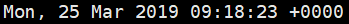
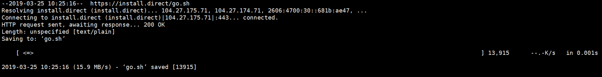
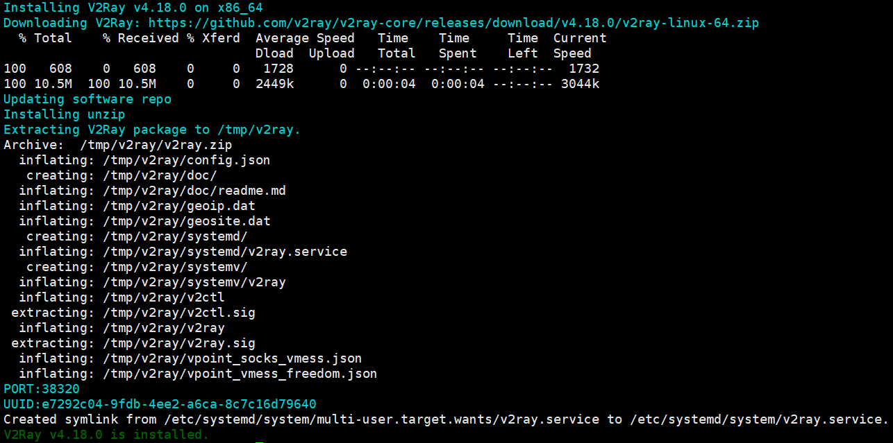

[官方文档](https://www.v2ray.com/)

[白话文教程](https://toutyrater.github.io/)

[从零开始：史上最详尽V2Ray搭建图文教程](https://www.4spaces.org/digitalocean-build-v2ray-0-1/)

[V2Ray完全使用教程](https://yuan.ga/v2ray-complete-tutorial/)

[项目地址](https://github.com/v2ray/v2ray-core)

[IPIP](https://www.ipip.net/) 服务器速度测 “工具” -> “TraceRouter” 最好低于80，点击下面的查看“查看地图”可以查跳转路径

[v2ray配置生成器](https://intmainreturn0.com/v2ray-config-gen/)

[v2rayN](https://github.com/2dust/v2rayN)

# 简介

V2Ray 是 Project V 下的一个工具。Project V 是一个包含一系列构建特定网络环境工具的项目，而 V2Ray 属于最核心的一个。 官方中介绍`Project V 提供了单一的内核和多种界面操作方式。内核（V2Ray）用于实际的网络交互、路由等针对网络数据的处理，而外围的用户界面程序提供了方便直接的操作流程。`

与 Shadowsocks 不同，从软件上 **V2Ray 不区分服务器版和客户端版**，也就是说在服务器和客户端运行的 V2Ray 是同一个软件，区别只是配置文件的不同。因此 V2Ray 的安装在服务器和客户端上是一样的，但是通常情况下 VPS 使用的是 Linux 而 PC 使用的是 Windows。**V2Ray 上的图形客户端大多是调用 V2Ray 内核套一个图形界面的外壳**，类似于 Linux 内核和 Linux 操作系统的关系；而 Shadowsocks 的客户端都是自己重新实现了一遍 Shadowsocks 协议。

# 服务器端配置

*注：以下使用到的命令均需要root权限*

## 时间校准

**V2Ray 对于时间有比较严格的要求**，要求服务器和客户端**时间差绝对值不能超过 2 分钟**，所以一定要保证时间足够准确。还好 V2Ray **并不要求时区一致**。比如说自个儿电脑上的时间是北京时间（东 8 区）2017-07-31 12:08:31，但是 VPS 上的时区是东 9 区，所以 VPS 上的时间应该是2017-07-31 13:06:31 到 2017-07-31 13:10:31 之间才能正常使用 V2Ray。当然，也可以自行改成自己想要的时区。

Linux查看系统时间：

```shell
date -R
```

输出结果：



输出结果中的 -0500 代表的是时区为西 5 区，+0000表示中央时区

修改时间：

```shell
date --set="YYYY-MM-DD HH:Mi:SS"
```

## 安装

Linux 操作系统， V2Ray 的安装有脚本安装、手动安装、编译安装 3 种方式，选择其中一种即可，本指南仅提供使用使用脚本安装的方法，并仅推荐使用脚本安装，该脚本由 V2Ray 官方提供。该脚本仅可以在 Debian 系列或者支持 Systemd 的 Linux 操作系统使用。

下载安装脚本:

```shell
wget https://install.direct/go.sh
```

输出结果：



执行脚本安装 V2Ray:

```shell
bash go.sh
```

输出结果：



上面的输出中，有一行 "PORT:38320" 代表着端口号为 38320，还有一行 "UUID:e7292c04-9fdb-4ee2-a6ca-8c7c16d79640" 代表着 id 为 e7292c04-9fdb-4ee2-a6ca-8c7c16d79640。这两个都是随机生成的，会在配置文件中出现。

以上两条命令也可直接使用一条命令代替：

```shell
bash <(curl -L -s https://install.direct/go.sh)
```

运行这条指令下载安装脚本并执行。当 yum 或 apt-get 可用的情况下，此脚本会自动安装 unzip 和 daemon。这两个组件是安装 V2Ray 的必要组件。如果你使用的系统不支持 yum 或 apt-get，请自行安装 unzip 和 daemon。

脚本会自动安装以下文件：

- `/usr/bin/v2ray/v2ray`：V2Ray 程序；
- `/usr/bin/v2ray/v2ctl`：V2Ray 工具；
- `/etc/v2ray/config.json`：配置文件；
- `/usr/bin/v2ray/geoip.dat`：IP 数据文件
- `/usr/bin/v2ray/geosite.dat`：域名数据文件

脚本会**配置开机自动运行**。自动运行脚本会在系统重启之后，自动运行 V2Ray。目前自动运行脚本只支持带有 Systemd 的系统，以及 Debian / Ubuntu 全系列。运行脚本位于`/etc/systemd/system/v2ray.service`。

首次安装完成之后，V2Ray 不会自动启动，需要手动执行启动命令。而在已经运行 V2Ray 的 VPS 上再次执行安装脚本，安装脚本会自动停止 V2Ray 进程，升级 V2Ray 程序，然后自动运行 V2Ray。在升级过程中，配置文件不会被修改。

安装脚本还有更多用法，可以执行 `bash go.sh -h` 查看帮助。

## 升级更新

重新执行一遍安装脚本就可以更新了，在更新过程中会自动重启 V2Ray，配置文件保持不变。

```shell
bash go.sh
```

V2Ray 的更新策略是快速迭代，每周更新(无意外的情况下)。版本号的格式是 `vX.Y.Z`，如 `v2.44.0`。v是固定的字母v，version 的首字母；X、Y、Z都是数字，X是大版本号，每年更新一个大版本(现在是 v4.Y.Z，V2Ray 已经走到了第四个年头)，Y 是小版本，每周五更新一个小版本。Z是区分正式版和测试版，Z是0代表着是正式版，不是0说明是测试版。例如，v4.7.0 是正式版，v4.7.1是测试版，**建议只使用正式版，不手动指定的情况下V2Ray 的安装脚本也只会安装最新的正式版**。

## 配置文件

安装脚本生成的初始脚本如下：

```json
{
  "inbounds": [{
    "port": 38320,
    "protocol": "vmess",
    "settings": {
      "clients": [
        {
          "id": "e7292c04-9fdb-4ee2-a6ca-8c7c16d79640",
          "level": 1,
          "alterId": 64
        }
      ]
    }
  }],
  "outbounds": [{
    "protocol": "freedom",
    "settings": {}
  },{
    "protocol": "blackhole",
    "settings": {},
    "tag": "blocked"
  }],
  "routing": {
    "rules": [
      {
        "type": "field",
        "ip": ["geoip:private"],
        "outboundTag": "blocked"
      }
    ]
  }
}
```

基本不需要修改，可以直接使用

## 启动命令

- 启动

```shell
systemctl start v2ray
```

或者

```shell
service v2ray start
```

- 停止

```shell
service v2ray stop
```

- 查看状态

```shell
service v2ray status
```

- 重载

```shell
service v2ray reload
```

- 重启

```shell
service v2ray restart
```

- 强制重载

```shell
service v2ray force-reload
```

# Windows客户端配置

# Android客户端配置