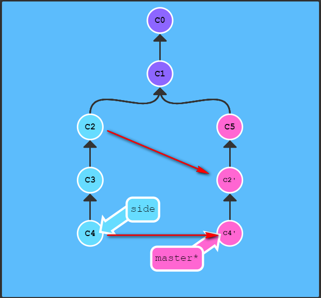

参考:廖雪峰的官方网站 git教程
# 配置

git config --global user.name "Your Name"

git config --global user.email "email@example.com"

git config --system http.sslcainfo "D:/Program Files/Git/mingw64/ssl/certs/ca-bundle.crt"

解决以下问题：
```
fatal: unable to access 'https://github.com/citerus/dddsample-core.git/': error setting certificate v	erify locations:
  CAfile: D:/Program Files/Git/mingw64/libexec/ssl/certs/ca-bundle.crt
  CApath: none
```
git config --list 查看所有配置项
git config [配置项名称] 查看指定配置项


当被修改的文件中带有中文字符时，中文字符会被转换为 unicode 代码，看不出原来的文件名。

这时，只要配置：

git config --global core.quotepath false

git 就不会就不会对路径进行转换，显示原来完整的中文路径名。https://blog.csdn.net/u014028063/article/details/82455215

# 初始化仓库

git init

# 提交

git add


git commit -m "注释"

git commit --amend

git status


# 提交记录

git log [文件名]  查看变更记录，无文件名查看仓库变更日志，有文件名查看指定文件变更日志

git log -p -[n] [文件名]   查看变更记录-p选项展开显示每次提交的内容差异，用 -[n] 则仅显示最近的n次更新

git log --pretty=oneline

git log --graph --pretty=oneline --abbrev-commit

git log -p -2  -p 选项展开显示每次提交的内容差异，用 -2 则仅显示最近的两次更新

git reflog 查看所有操作记录

# 回滚

git reset 提交记录 

把分支记录回退几个提交记录来实现撤销改动，向上移动分支，原来指向的提交记录就跟从来没有提交过一样 ，在reset后， C2 所做的变更还在，但是处于未加入暂存区状态。这种“改写历史”的方法对大家一起使用的远程分支是无效的。版本号没必要写全，前几位就可以了，Git会自动去找。当然也不能只写前一两位，因为Git可能会找到多个版本号，就无法确定是哪一个了。

git reset --hard 提交记录 #返回到某个节点，不保留修改。

eg: git reset --hard HEAD^, git reset --hard 3628164

git reset --soft 提交记录 #返回到某个节点。保留修改

git reset HEAD [文件名] 文件名可选，有，将指定文件退回到HEAD指向的变更记录，无，将工作区所有文件退回到HEAD指向的变更记录

git revert HEAD  撤销的提交记录后面会增加一个新提交，新提交记录 C2' 引入了更改 —— 这些更改刚好是用来撤销 C2 这个提交的。也就是说 C2' 的状态与 C1 是相同的。revert 之后就可以把你的作为一次更改推送到远程仓库与别人分享。

# 对比文件

git diff 文件名

git diff HEAD [readme.txt] 查看工作区和当分支中最近提交的区别

git diff 本地分支 origin/xxxx

git diff --stat local_branch origin/remote_branch


git clean -df #返回到某个节点

git clean 参数

    -n 显示 将要 删除的 文件 和  目录
    
    -f 删除 文件
    
    -df 删除 文件 和 目录


git rm test.txt

ssh-keygen -t rsa -C "youremail@example.com"

https://segmentfault.com/a/1190000002645623

# 远程仓库

`git remote`  列出你指定的每一个远程仓库地址的名称，origin - 这是 Git 给你克隆的仓库服务器的默认名字

`git remote -v`  列出远程仓库名称及使用的push fetch 地址

`git remote add 名称 服务器地址`  添加一个新的远程仓库名称，并指定push fetch 地址

`git remote show 名称`  查看某一个远程仓库的更多信息，会列出远程仓库的 URL 与跟踪分支的信息

`git remote rename 老名称 新名称`  修改一个远程仓库地址的名称

`git remote rm 名称`  删除一个远程仓库信息

`git remote prune 名称`  删除本地仓库遗留的远程仓库中已删除的分支

`git remote set-url --add 名称 远程仓库地址`  给一个已存在的远程仓库增加一个push地址，可同时向两个远程仓库推送代码

一个远程仓库名称下，fetch地址只能有一个，但是push地址可以有多个，即使用 `git push` 时可通过默认远程仓库 origin 向多个远程仓库地址同时推送代码，但是 `git pull` 只能从一个远程仓库地址（orgin的fetch url值，默认 `.git/config` 文件中第一个url）拉代码，如果需要从两个仓库拉代码，需要有两个远程仓库名称，两个名称使用不同的fetch url，并使用 `git pull 远程仓库名称` 指定使用的远程仓库。

> 参考资料
>
> [git 给远程库 添加多个url地址 ](https://www.cnblogs.com/caicaizi/p/14358077.html)
>
> [git同时连接多个远程仓库](https://blog.csdn.net/soul_sky/article/details/105200077)


git push -u origin master （参考git branch [分支名] -u或--set-upstream-to 远程分支）


git clone git@github.com:michaelliao/gitskills.git


git fetch 命令从服务器上抓取本地没有的数据时，它并不会修改工作目录中的内容。 它只会获取数据然后让你自己合并

git pull 在大多数情况下它的含义是一个 git fetch 紧接着一个 git merge 命令


> 参考资料
>
> [Connection reset by 服务器ip port 22 (hexo d 部署博客出错)](https://www.cnblogs.com/wumz/p/9820314.html)

这表明 git 软件无法通过 SSH 连接到 Github：如果您的防火墙或 ISP 设置的防火墙阻止端口 22 上的 SSH 连接，通常会发生这种情况。一个快速的解决方法，尝试 Github 提供的HTTPS URL：

git remote add origin-https https://github.com/github.com:MaugerWu/MaugerWu.github.io.git

git push -u origin-https master

如果可以，那肯定是你的SSH端口被关闭了。 您可以继续使用此替代语法，尝试在您的计算机或 ISP 上取消阻止端口 22，或查看建议：http：//stackoverflow.com/a/8081292/27310 。

# 合并分支

## merge
git merge 分支名  将指定分支合并到当前分支

git merge --no-ff -m "merge with no-ff" dev

合并分支时，加上--no-ff参数就可以用普通模式合并，合并后的历史有分支，能看出来曾经做过合并，而fast forward合并就看不出来曾经做过合并


## rebase

git rebase 分支名

git rebase --interactive或-i  Git 会打开一个列出将要被复制到目标分支的备选提交记录，它还会显示每个提交记录的哈希值和提交说明

eg:

git rebase -i HEAD~4

## cherry-pick

git cherry-pick <提交号>...  一些提交复制到当前所在的位置（HEAD）下面

git cherry-pick C2 C4




# 分支

git branch

git branch 分支名  创建一个新分支

git branch -d 分支名 删除指定分支

git branch -f 分支名 HEAD~[n]  将指定分支强制指向HEAD的第n级父提交，-f 则容许我们将分支强制移动到指定位置

git branch -vv 查看本地分支关联（跟踪）的远程分支之间的对应关系，将所有的本地分支列出来并且包含更多的信息，如每一个分支正在跟踪哪个远程分支与本地分支是否是领先、落后或是都有

git branch [分支名] -u或--set-upstream-to 远程分支  修改本地分支和远程分支的映射，无分支名修改当前分支，有分支名修改指定分支

git branch [分支名] --unset-upstream 解除本地分支和远程分支的映射

P.S. 也可以将本地分支跟踪到另一个本地分支，但不知道有什么作用

git branch []

# 切换位置

cat .git/HEAD 查看 HEAD 指向

如果 HEAD 指向的是一个引用，还可以用 git symbolic-ref HEAD 查看 HEAD 指向·

HEAD 是一个对当前检出记录的符号引用 —— 也就是指向你正在其基础上进行工作的提交记录。

HEAD 总是指向当前分支上最近一次提交记录。大多数修改提交树的 Git 命令都是从改变 HEAD 的指向开始的。HEAD 通常情况下是指向分支名的。

HEAD表示当前版本，上一个版本就是HEAD^，上上一个版本就是HEAD^^，当然往上100个版本写100个^比较容易数不过来，所以写成HEAD~100。

git checkout -b 新分支名  创建并切换到新分支

git checkout -b 新分支名 远程分支 创建一个新分支，把新分支和远程分支关联，切换到新分支，eg:git checkout -b 20180606161627205_1001309 origin/20180606161627205_1001309

git checkout 分支名  切换到指定分支

git checkout -- 文件名  撤销文件在工作区的修改

git checkout . 撤销本地所有修改的。没有的提交的，都返回到原来的状态（新增的文件不会恢复到未增加的状态，需要手动删除）

git checkout 提交记录的hash值  切换到指定提交记录

git checkout master^ 把^符号加在引用名称的后面，表示让 Git 寻找指定分支的父提交，master^^ 是 master 的第二个父节点

git checkout HEAD^  切换到当前提交记录的前一个提交

git checkout HEAD~<num> 向上移动多个提交记录，如 ~3，不跟数字时与 ^ 相同，向上移动一次

# 储藏

git stash 获取你工作目录的中间状态——也就是你修改过的被追踪的文件和暂存的变更——并将它保存到一个未完结变更的堆栈中，随时可以重新应用

git stash list 查看现有的储藏

git stash apply [储藏的名称] 重新应用指定的储藏，如不指定 储藏的名称 ，默认应用最近的储藏。这个命令会使对文件的变更被重新应用，但是被暂存的文件没有重新被暂存。

git stash apply --index [储藏的名称] 重新应用指定的储藏，同时把储藏中暂存的文件重新暂存 

git stash drop [储藏的名称] 移除指定的储藏，如不指定 储藏的名称 ，默认删除最新的储藏

git stash pop [--index] [储藏的名称] 重新应用指定储藏，同时立刻将其从堆栈中移走

git stash show [储藏的名称或索引] 显示储藏的文件


# 彻底删除敏感文件

包含涉及该文件的提交记录

git filter-branch --force --index-filter 'git rm --cached --ignore-unmatch <敏感文件路径>' --prune-empty --tag-name-filter cat -- --all

敏感文件路径，基于仓库根目录的相对路径，eg: src/main/resources/proxy_links.json


Git 使用一系列配置文件来保存你自定义的行为。 它首先会查找 /etc/gitconfig （D:\Program Files\Git\mingw64\etc\gitconfig ）文件，该文件含有系统里每位用户及他们所拥有的仓库的配置值。 如果你传递 --system 选项给 git config，它就会读写该文件。

接下来 Git 会查找每个用户的 ~/.gitconfig 文件（或者 ~/.config/git/config 文件）。 你可以传递 --global 选项让 Git 读写该文件。

最后 Git 会查找你正在操作的版本库所对应的 Git 目录下的配置文件（.git/config）。 这个文件中的值只对该版本库有效。

以上三个层次中每层的配置（系统、全局、本地）都会覆盖掉上一层次的配置，所以 .git/config 中的值会覆盖掉 /etc/gitconfig 中所对应的值。
