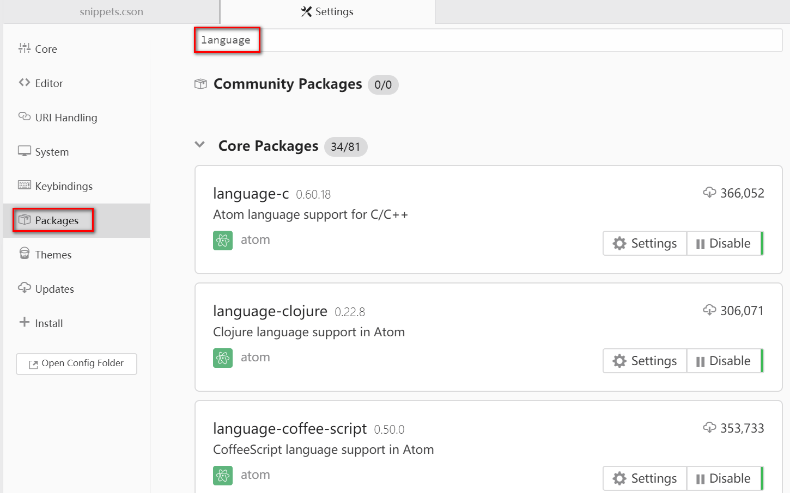
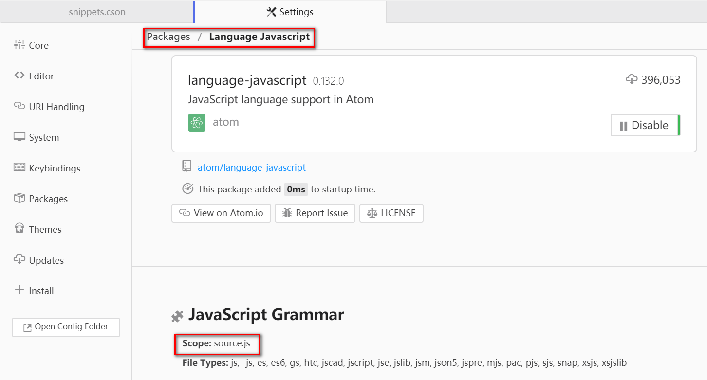

# 设置
打开设置

Packages -> Settings View -> Open

shortcuts `ctrl+,`

# 命令面板
1. 打开命令面板

   Packages -> Command Palette -> Toggle

   shortcuts `ctrl + shift + p`

2. 用法

   打开命令面板后,在搜索框中输入关键词查找相关命令,显示结果中左边是完整命令,右边是该命令使用的快捷键

# Packages

> [Atom飞行手册-Atom中的包](https://wizardforcel.gitbooks.io/atom-flight-manual-zh-cn/content/2.1-Atom-Packages.html)

1. 包管理

   Packages -> Settings View -> Open -> Packages

2. 安装 Package
   - 通过程序界面安装

      Packages -> Settings View -> Open -> Install

      然后在搜索框中输入包名搜寻,找到所需的保后点击 install

   - 通过命令行安装

      | 命令                                           | 说明                   |
      | ---------------------------------------------- | ---------------------- |
      | `apm install <package_name>`                   | 安装最新版本           |
      | `apm install <package_name>@<package_version>` | 安装指定版本           |
      | `apm search <package_name>`                    | 包注册处搜索想要找的包 |
      | `apm view <package_name>`                      | 查看指定包的详细信息   |

3. 配置代理

   >  [Atom飞行手册-安装Atom-配置代理](https://flight-manual.atom.io/getting-started/sections/installing-atom/#proxy-and-firewall-settings)

   如果你在使用代理，那可以通过设置 `~/.atom/.apmrc` 文件里的 `https-proxy` 字段来配置 [apm](https://github.com/atom/apm)（Atom Package Manager）：

   ```
   https-proxy = https://9.0.2.1:0
   ```

   或者使用命令

   ```
   apm config set https-proxy socks5://127.0.0.1:1080
   ```

   如果你开启了防火墙并且在安装 packages 时看到 SSL 错误，那可以在 `~/.atom/.apmrc` 里添加这样一行来禁用对 SSL 证书的检查：

   ```
   strict-ssl = false
   ```

   你可以使用 `apm config get https-proxy` 来验证代理是否设置成功，使用 `apm config list` 来列出所有自定义设置。

# Markdown
1. 支持 markdown 的常用包

   [How to Set Up & Use Atom as a Markdown Editor](https://www.portent.com/blog/copywriting/content-strategy/atom-markdown.htm)

   | 插件名称 | 说明 |
   |--|--|
   | markdown-preview | markdown 预览， core package |
   | language-gfm | GitHub Flavored Markdown 语法高亮，常用语法代码段， core package |
   | language-markdown | 除 GitHub 风格的 markdown 以外，支持更多的 markdown 语法，但是默认会禁用 language-gfm 中配置的代码段 |
   | markdown-writer | markdown 语法快捷输入，支持换行继承上一行的语法 |

2. Markdown Preview

   - 打开 Markdown 预览

     Packages -> Markdown Preview -> Toggle Preview

     shortcuts `ctrl + shift + m`

   - 其他[快捷键](快捷键.md#Markdown-Preview)

3. [Markdown Writer](https://atom.io/packages/markdown-writer)

   - 快捷键设置

     执行`Markdown Writer: Create Default keymaps`命令,会在`～\.atom\keymaps.cson`追加默认快捷键设置，默认的快捷键配置如下：

     ```coffeescript
     # Default Keymaps for Markdown Writer
     # https://atom.io/packages/markdown-writer
     #
     # Wiki: https://github.com/zhuochun/md-writer/wiki/Settings-for-Keymaps
     #

     # Default Keymaps for Markdown Writer
     # https://atom.io/packages/markdown-writer
     #
     # Wiki: https://github.com/zhuochun/md-writer/wiki/Settings-for-Keymaps
     #
     ".platform-linux atom-text-editor:not([mini])":
       "shift-ctrl-K": "markdown-writer:insert-link"
       "shift-ctrl-I": "markdown-writer:insert-image"
       "shift-ctrl-X": "markdown-writer:toggle-taskdone"
       "ctrl-i":       "markdown-writer:toggle-italic-text"
       "ctrl-b":       "markdown-writer:toggle-bold-text"
       "ctrl-'":       "markdown-writer:toggle-code-text"
       "ctrl-h":       "markdown-writer:toggle-strikethrough-text"
       "ctrl-1":       "markdown-writer:toggle-h1"
       "ctrl-2":       "markdown-writer:toggle-h2"
       "ctrl-3":       "markdown-writer:toggle-h3"
       "ctrl-4":       "markdown-writer:toggle-h4"
       "ctrl-5":       "markdown-writer:toggle-h5"
     ```

     可以修改这部分内容来自定义快捷键,我的自定义快捷键如下:

     | 快捷键       | 命令                                      | 说明           |
     | ------------ | ----------------------------------------- | -------------- |
     | alt-k        | markdown-writer:insert-link               | 插入超链接     |
     | alt-i        | markdown-writer:insert-image              | 插入图片       |
     | alt-b        | markdown-writer:toggle-bold-text          | 加粗           |
     | ctrl-i       | markdown-writer:toggle-italic-text        | 倾斜           |
     | ctrl-shift-h | markdown-writer:toggle-strikethrough-text | 删除线         |
     | ctrl-'       | markdown-writer:toggle-code-text          | 行内代码       |
     | ctrl-`       | markdown-writer:toggle-codeblock-text     | 代码块         |
     | ctrl-shift-1 | markdown-writer:toggle-h1                 | 标题1          |
     | ctrl-shift-2 | markdown-writer:toggle-h2                 | 标题2          |
     | ctrl-shift-3 | markdown-writer:toggle-h3                 | 标题3          |
     | ctrl-shift-4 | markdown-writer:toggle-h4                 | 标题4          |
     | ctrl-shift-5 | markdown-writer:toggle-h5                 | 标题5          |
     | alt-u        | markdown-writer:toggle-ul                 | 无序列表       |
     | alt-o        | markdown-writer:toggle-ol                 | 有序列表       |
     | ctrl-shift-X | markdown-writer:toggle-task               | 未完成待办列表 |
     | alt-q        | markdown-writer:toggle-blockquote         | 引用           |
     | alt-t        | markdown-writer:insert-table              | 插入表格       |
     | alt-n        | markdown-writer:jump-to-next-heading      | 跳到下一个标题 |
     | alt-p        | markdown-writer:jump-to-previous-heading  | 跳到前一个标题 |

   - 修改全局配置

     打开 `~/.atom/config.cson` 文件,找到 `"markdown-writer":` (如果没有就在 `"*":` 层级下新建一个),结构样例如下:

     ```coffeescript
     "*": # 配置文件的第一行
       "...": # 其他插件
       "markdown-writer":
         "...": # markdown-writer 的配置项
     ```

     修改完成后,点击 `View -> Developer -> Reload Window` (shortcuts `ctrl + shift + f5`),或者运行 `Window:Reload` 命令,重载窗口,加载刚才修改的配置。

     **使用 `*` 代替 `_` 表示斜体**

     ```coffeescript
     "markdown-writer":
       "textStyles":
         "italic": "before": "*", "after": "*"
     ```

# 多光标选择

> [Atom飞行手册-编辑和删除文本-多光标选择](https://flight-manual.atom.io/using-atom/sections/editing-and-deleting-text/#multiple-cursors-and-selections)

Atom可以做的一件非常酷的事情，就是支持多个光标，开箱即用。这在处理一个很长的文本列表时会相当有用。

[多光标选择快捷键](快捷键.md#选择)

通过这些命令，你可以在文档的多个位置放置光标，并且一次性有效地在多个位置执行相同操作。

在你执行许多重复性操作时，比如重命名变量或者修改一些文本的格式时，会十分有帮助。你可以一起使用几乎任何插件或命令 —— 比如，修改大小写，以及整行移动或者复制。

[sublime-style-column-selection](https://atom.io/packages/Sublime-Style-Column-Selection) 插件可以拓展列选择操作方式，安装插件后可使用以下方式完成列选择

| 系统  | 用法 |
|--|--|
| Windows | alt + 鼠标左键拖拽 |
| linux | shift + 鼠标左键拖拽 |
| OS X | Option + 鼠标左键拖拽 |

  可以在插件的settings中修改键盘和鼠标组合的配置

# 空格和tab转换

Atom自带一些命令来帮助你管理你文档中的空白字符。一对非常有用的命令是把空格转换为tab，以及把tab转换为空格。如果你的文档中混用了多种空白字符，这些命令对文档的标准化有巨大帮助。空白字符命令没有相关的快捷键，所以你只能在命令面板中寻找 `Convert Spaces to Tabs`（或者反过来），并且选取一个来执行。

空白字符命令在atom/whitespace中实现。空白字符命令的设置，在 `whitespace` 包的页面中提供。

# bracket-matcher

Atom自带一种对括号的智能处理方式。

括号功能在 `atom/bracket-matcher` 包中实现。和所有这些包一样，想要修改括号处理相关的默认行为，或者直接禁用它，你可以浏览设置视图（Settings view）中这个包的页面。

当你的光标覆盖他们时，Atom会自动高亮`{}`、`()`和`[]`。匹配的xml和html标签也会高亮显示。

Atom也会自动补全`[]`, `()`, `{}`, `“”`, `''`, `“”`, `‘’`, `«»`, `‹›`和反引号。当你输入开头的一个时，Atom会补全另一个。如果你在一段选择区域上面输入这些括号或引号的开头，Atom会用对应符号的结尾使区域闭合。

同时，还提选中括号内容和自动闭合 xml 或 html 标签的功能，快捷键 `Alt + Ctrl + .`。

# 代码段

> [Atom飞行手册-代码段](https://flight-manual.atom.io/using-atom/sections/snippets/)

代码段是一个非常有效的工具，可以从一个快捷方式中快速生成常用的代码语法。

这就是说，你可以输入一些类似于`habtm`的东西，然后按下回车键，他就会扩展为`has_and_belongs_to_many`。

许多语言包自带他们自己特定语法的代码段。比如，提供了html语法高亮和语法的`language-html`包提供了许多代码段，来创建一些你想使用的不同HTML标签。如果你在Atom中创建一个新的HTML文件，你可以输入`html`然后按下`tab`，它会扩展为：

```html
<!DOCTYPE html>
<html lang="en" dir="ltr">
  <head>
    <meta charset="utf-8">
    <title></title>
  </head>
  <body>

  </body>
</html>
```

同时它会把光标放在`lang="end"`属性的值上，以便你立即开始修改这个属性。许多代码段具有多个焦点位置，你可以按下`tab`在他们之间切换 —— 比如，在这个HTML代码段之中，选中`lang` 属性值之后，可以按下 `tab` 键，然后光标就会移动到 `dir`属性值上，然后到 `<title>` 标签中间，最后到 `<body>` 标签中间。

命令面板中输入 `Snippets: Available` (shortcuts `alt + shift + S` ) 查看当前打开文件拥有的所有代码段。

- 自定义代码段

  在`~/.atom`目录下的`snippets.cson`文件，存放了所有自定义的代码段，他们会在Atom运行时加载。但是，你也可以通过`File > Snippets...`菜单，轻易打开这个文件。

  基本的代码段格式像这个样子：

  ```
  '.source.js':
    'console.log':
      'prefix': 'log'
      'body': 'console.log(${1:"crash"});$2'
  ```

  1. 第一层键是选择器，决定哪种语法会加载这个加载代码段。在 Packages 中找到你要添加代码段的语言的包，点击这个包，找到它的 `scope` 属性值，代码段最顶层的键就应该是它前面加上一个点（就像CSS选择器那样）。

     

     

  2. 第二层键是代码段的名称，它用于在代码段菜单中描述这个代码段，起什么名字都可以。

  3. 代码段的名称下面， `prefix` 属性定义触发代码段的关键字， `body` 定义代码段的内容。跟有数字的 `$` 定义代码段中光标的位置。

     上面的例子向Javascript文件添加了`log`代码段，它会被扩展为：

     ```
     console.log("crash");
     ```

     其中的"crash"字符串会在开始时被选中，再次按下`tab`键之后，光标会移动到分号之后。

  4. 不同于 CSS 选择器，代码段定义中的键每层中只能出现一次，如果同一层中有重复出现的键，只有最后一个有效。

  5. 根据 CoffeeScript 多行语法，使用 `"""` 定义多行的代码段内容，示例如下：

     ```
     '.source.js':
       'if, else if, else':
         'prefix': 'ieie'
         'body': """
           if (${1:true}) {
             $2
           } else if (${3:false}) {
             $4
           } else {
             $5
           }
         """
     ```

  6. 在 `snippets.cson` 文件中，输入 `snip` ，摁下 `tab` ，可插入定义代码段的语法，保存修改， Atom 就会重新加载代码段，刚刚定义的新代码段就可以使用了。

  7. 在同一个 ` scope` 中定义多个代码段，只需要在同一个顶层选择器下，定义不同的代码段名称键，然后指定它们各自的 `prefix` 和 `body` 属性即可，示例如下：

     ```
     '.source.gfm':
       'Hello World':
         'prefix': 'hewo'
         'body': 'Hello World!'

       'Github Hello':
         'prefix': 'gihe'
         'body': 'Octocat says Hi!'

       'Octocat Image Link':
         'prefix': 'octopic'
         'body': '，更多代码段的示例，参考 [language-html](https://github.com/atom/language-html/blob/master/snippets/language-html.cson) 和 [language-javascript](https://github.com/atom/language-javascript/blob/master/snippets/language-javascript.cson) 包。

# 配置文件

除了样式表和初始脚本以外的配置文件都是 CSON 格式，全称是CoffeeScript Object Notation。就像JSON（JavaScript Object Notation）的名字一样，CSON是一个储存结构化数据的文本格式，表现为由键值对组成的简单对象的形式。

```coffeescript
key:
  key: value
  key: value
  key: [value, value]
```

对象是CSON的基础，由缩进描述（像上面的文件那样）。一个键的值可以是字符串、数字、对象、布尔值、`null` 或者上述数据类型的一个数组。

CSON的键在每个对象中只能重复一次。如果存在重复的键，最后一次出现的那个会覆盖其他所有同名的键。在Atom配置文件中也是如此。

避免这种情况：

```coffeescript
# DON'T DO THIS
'.source.js':
  'console.log':
    'prefix': 'log'
    'body': 'console.log(${1:"crash"});$2'

# Only this snippet will be loaded
'.source.js':
  'console.error':
    'prefix': 'error'
    'body': 'console.error(${1:"crash"});$2'
```

而是要写成这样：

```coffeescript
# DO THIS: Both of these will be loaded
'.source.js':
  'console.log':
    'prefix': 'log'
    'body': 'console.log(${1:"crash"});$2'
  'console.error':
    'prefix': 'error'
    'body': 'console.error(${1:"crash"});$2'
```

## 样式调整

如果你只是对个人样式做一些应急的修改，而不打算发布整个主题，你可以在你的`~/.atom`目录的`styles.less`文件中添加样式。从 `File > Stylesheet...` 打开这个文件。

例如，要修改状态栏的颜色，可以再 `style.less` 文中添加以下内容：

```less
.status-bar {
  color: white;
  background-color: black;
}
```

了解都有哪些class可用的最简单方式，是通过开发者工具手动查看DOM。 `Ctrl+Shift+I` 打开 Chromium 的开发者工具。

你可以轻易查看到当前编辑器的所有元素。如果你想更新一些东西的样式，你需要先知道它拥有哪个class，然后再你的样式文件中添加一条Less规则。

如果你不熟悉Less，它是一个让CSS变得更简单的CSS预处理器，你可以访问lesscss.org来了解关于它的更多信息。如果你更愿意使用 CSS ，也可以直接在 `style.less` 中使用 CSS 语法， CSS 在 Less 中同样有效。

## 快捷键配置

Atom 的快捷键配置和样式表类似，样式表使用选择器将样式应用到元素上，快捷键映射使用选择器将按键组合和特定的事件及上下文环境关联起来。以下示例是内置的键盘配置：

```coffeescript
'atom-text-editor':
  'enter': 'editor:newline'

'atom-text-editor[mini] input':
  'enter': 'core:confirm'
```

这个键盘映射定义了 `enter` 在两个不同上下文中的作用。在普通的编辑器中，按下 `enter` 键会触发 `enter:newline` 命令，会在编辑器中插入新的一行。基于第二个更加具体的选择器配置，如果是在选中列表的小编辑区中输入（例如文件名编辑区）， `enter` 会触发 `core:cofirm` 事件。

Atom 会在启动时加载 `~/.atom/keymap.cson` 文件中的键盘配置。每次都会加载最新的内容，你可以在其中修改键盘配置，覆盖 Atom 核心和第三方包定义的默认键盘配置。

从 `File > Keymap...` 打开快捷键配置文件。从 `File > Settings > Keybingings` 可以查看所有现在已有的键盘绑定。 `ctrl + .` 会打开 Key Binding Resolver 面板，它可以显示 Atom 捕捉到的键盘组合以及该组合触发的事件，这个功能非常便于解决键盘冲突的问题。

## 全局配置

Atom 从 `~/.atom/config.cson` 文件中加载全局的自定义配置。文件中全局配置位于 `*` 下级，语言特有配置在语言的 scope 属性值选择器（例如 `.python.source` 、 `.gfm.source` ）的下级。在它们的下面，按 `core` 、 `editor` 和 包名 来组织配置项。结果示例如下：

```coffeescript
# 全局配置
"*":
  # bracket-matcher 包配置
  "bracket-matcher":
    highlightMatchingLineNumber: true
  # core 配置
  core:
    packagesWithKeymapsDisabled: []
    telemetryConsent: "no"
    themes: [
      "one-light-ui"
      "one-light-syntax"
    ]
  # editor 配置
  editor:
    showIndentGuide: true
    showInvisibles: true
  # welcome 包配置
  welcome:
    showOnStartup: false
# 语言特有配置
".gfm.source":
  editor:
    showIndentGuide: true
    showInvisibles: true

```

从 `File > Config...` 打开 `config.cson` 文件。

下面是一些常用配置项说明：

- core
  - customFileTypes: 关联语言的 scope 属性值和特定的文件后缀名
  - disabledPackages: 被禁用的包名的一个列表                   
  - excludeVcsIgnoredPaths: 不要搜索 `.gitignore` 指定的文件         
  - ignoredNames: 在Atom中要忽略的文件名                   
  - projectHome: 假定项目被存放的目录                     
  - themes: 要加载的主题名称的数组，按照层叠顺序     
- editor
  - autoIndent : 开启或关闭基本的自动缩进（默认为true）
  - nonWordCharacters : 一个非单词字符的字符串，来指定单词边界
  - fontSize : 编辑器中的字体大小
  - fontFamily : 编辑器中的字体
  - invisibles :一个Atom用来渲染空白字符的哈希表。键是空白字符的类型，值是被渲染成的字符（使用false来屏蔽单个的空白字符）
    - `tab` ：硬tab字符
    - `cr` ：回车（Carriage return，微软风格的行末尾）
    - `eol` ：字符 `\n`
    - `space` ：在开头或末尾的空格字符
  - lineHeight : 行高
  - preferredLineLength : 设定一行的长度（默认为80）
  - showInvisibles : 是否将不可见字符渲染为 invisibles 中指定字符（默认为false）
  - showIndentGuide : 是否在编辑器中显示缩进标识
- showLineNumbers : 显示或者隐藏行号
  - softWrap : 开启或关闭编辑器中的软换行
  - softWrapAtPreferredLineLength : 开启或关闭在`preferredLineLength`处软换行
  - tabLength : tab字符所占空格字符的宽度（默认为2）
- fuzzy-finder
  - ignoredNames ：只在模糊查找中忽略的文件名


- whitespace
  - ensureSingleTrailingNewline：是否将文件末尾的多个换行减少为一个
  - removeTrailingWhitespace：开启或关闭清除行尾的空白字符（默认为true）


- wrap-guide
  - columns : `pattern` 和 `column` 键值对的数组，用来将当前编辑器的目录匹配到列中的位置

## 语言特定配置

以下编辑器的配置项适用于各种语言，可以在不同语言中设置不同的编辑器属性。

```
editor.autoIndent
editor.autoIndentOnPaste
editor.invisibles
editor.nonWordCharacters
editor.preferredLineLength
editor.scrollPastEnd
editor.showIndentGuide
editor.showInvisibles
editor.softWrap
editor.softWrapAtPreferredLineLength
editor.softWrapHangingIndent
editor.tabLength
```

有两种方式进行配置：

1. 通过包管理界面配置，在 `File > Settings > Packages` 中找到相应的语言包修改配置。

2. 直接修改 `config.cson` 文件，全局配置使 `*` 作为顶层键名，每种语言特定配置使用 `.` + scope 属性值 作为顶层键名。语言的特有配置会在该语言文件中覆盖全局配置。示例如下：

   ```coffeescript
   '*': # all languages unless overridden
     'editor':
       'softWrap': false
       'tabLength': 8

   '.source.gfm': # markdown overrides
     'editor':
       'softWrap': true

   '.source.ruby': # ruby overrides
     'editor':
       'tabLength': 2

   '.source.python': # python overrides
     'editor':
       'tabLength': 4
   ```

两种方式找到语言的 scope 属性:

1. `File > Settings > Packages` 搜索相应的语言包，语言包的界面中标题的下面。
2. 打开一种语言的文件，打开命令面板，执行 `Editor: Log Cursor Scope` 会显示当前光标所在位置的所有 scope 属性值。第一行通常是文件语言的 scope ，后面的是光标位置的详细 scope 。这些 scope 值也可以用来改变编辑器的样式，因为它们同样可以用作你的样式表的类名。

## 自定义语法识别

通过编辑 `config.cson` 文件，可以让 Atom 将一种文件类型识别为特定的语法。举个例子，如果你想将后缀名是 `foo` 的文件识别为 coffeescript 文件，你需要将以下内容添加到配置文件的 `*.core` 的下级:

```coffeescript
'*':
  core:
    customFileTypes:
      'source.coffee': [
        'foo'
      ]
```

在上面的例子中， `source.coffee` 是语言的 scope 属性值， `foo` 是不带 `.` 的文件后缀名，这里的配置如果在 scope 值或文件后缀名前加上了 `.` 会导致配置失效。

# 配置文件位置

CSON 配置文件默认存放在用户根目录的 `.atom` 文件夹下。环境变量可以让 Atom 使用不同的路径，环境变量 `ATOM_HOME` 用于指定一个可选的位置。如果这个环境变量已经存在，它指定的位置会被用来加载和存储 Atom 的配置信息。配置环境变量可让同一台机器的多个用户帐户使用相同的 Atom 家目录。

除了使用 `ATOM_HOME` 环境变量，Atom 还可以设置便携模式。当 Atom 的可执行文件所在目录和 .atom 目录处于同级目录时，Atom 处于便携模式。

# 格式化代码

`atom-beautify` 可以格式化不同语言的代码文件

安装完成后按 `Ctrl+Alt+b` 格式化
