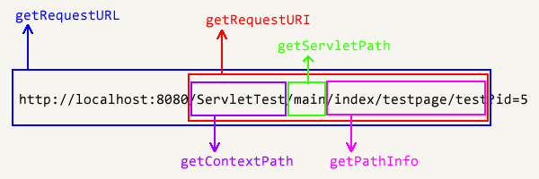

HttpServletRequest类里，有以下六个取URL的函数：

getContextPath 取得项目名

getServletPath 取得Servlet名

getPathInfo 取得Servlet后的URL名，不包括URL参数

getRequestURL 取得不包括参数的URL

getRequestURI 取得不包括参数的URI，即去掉协议和服务器名的URL

getContextPath：/ServletTest

getServletPath：/main

getPathInfo：/index/testpage/test

getRequestURL：`http://localhost:8080/ServletTest/main/index/testpage/test`

getRequestURI：/ServletTest/main/index/testpage/test