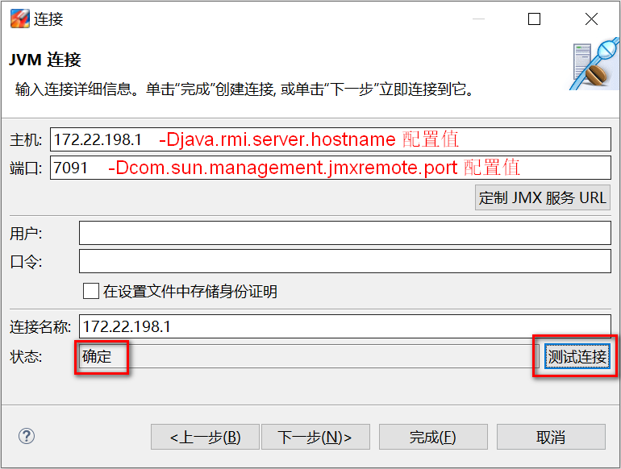

> 参考资料
>
> [JMC连接远程jvm](https://blog.csdn.net/FlyLikeButterfly/article/details/116164839)

# JDK Mission Control

## 远程连接

1. 被监控的jvm添加启动参数

   ```
   -Dcom.sun.management.jmxremote.port=7091 -Djava.rmi.server.hostname=172.22.198.1 -Dcom.sun.management.jmxremote.ssl=false -Dcom.sun.management.jmxremote.authenticate=false
   ```

   `-Dcom.sun.management.jmxremote.port` 指定连接端口

   `-Djava.rmi.server.hostname` 指定连接地址

   `-Dcom.sun.management.jmxremote.ssl` 是否开启ssl

   `-Dcom.sun.management.jmxremote.authenticate` 是否开启用户名、密码校验

2. jmc中创建连接，点击 `文件 -> 连接 -> 创建新连接 -> 下一步`，进入连接信息填写

   

   填写完成点击 `测试连接` 状态变成 `确定` 表示远程jvm可正常连接，点击 `完成` 连接创建成功。
   

## MBean服务器


## 飞行记录 JFR

