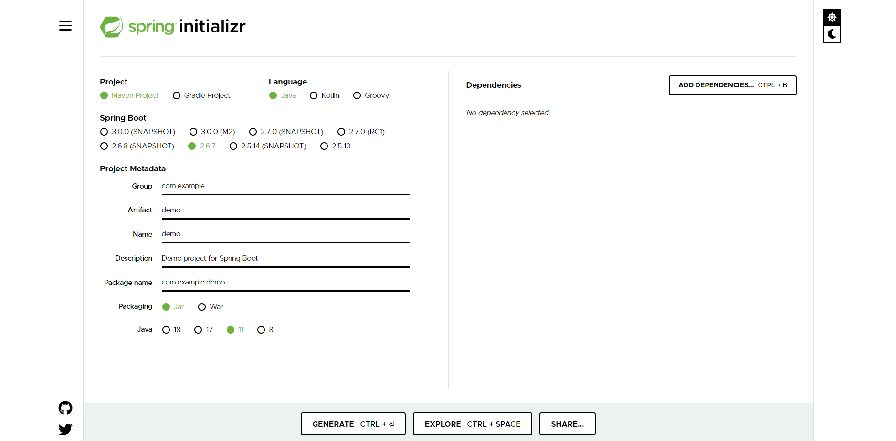
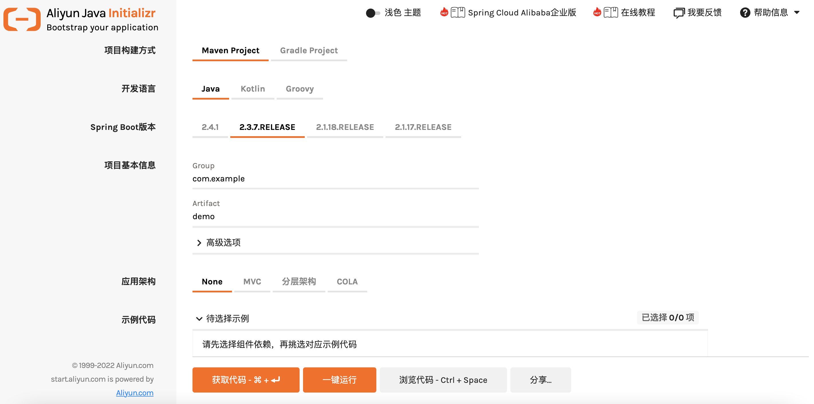
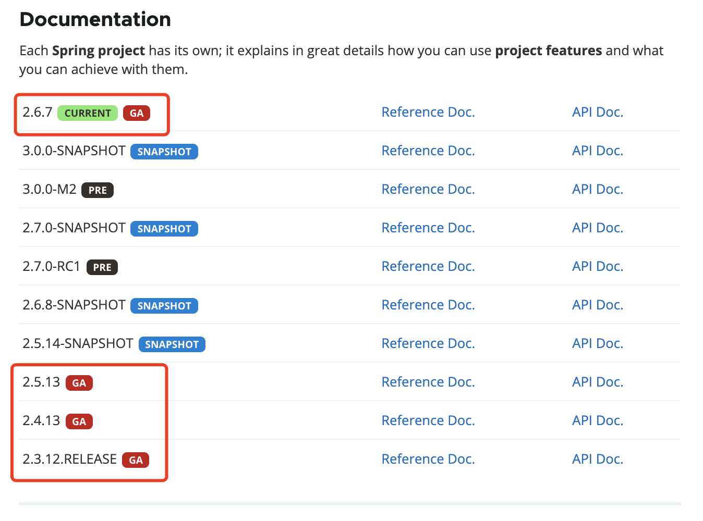
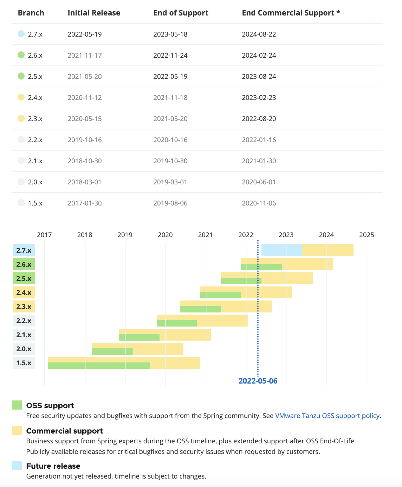

### 调研背景

研发中心现在spring boot版本是2.1.9，想要升级。

### 调研版本

调研了技术社区广大群友，spring boot的版本分裂得很厉害。

1.5.x也有人在用。

2.0.x ~ 2.5.x 都有。

当前GA是2.6.7，2.6.x版本很少见人用。

调研这几个版本用的稍多一些：

* 2.1.6
* 2.2.6  ==> 最多
* 2.3.1
* 2.3.2  ==> 次多
* 2.4.2
* 2.5.6
### spring的initializer

[https://start.spring.io/](https://start.spring.io/)

官方spring的initializer支持的不算Snapshot和3.0版本，只有2.6.7/2.5.13

### 阿里云的initializer

[https://start.aliyun.com/bootstrap.html](https://start.aliyun.com/bootstrap.html)

阿里云的initializer支持的是2.4.1,2.3.7.RELEASE，2.1.18.RELEASE，2.1.17.RELEASE

### 建议升级版本

当前RELEASE的版本是 2.3.12.RELEASE，不过开源版本2.3/2.4都已经不维护了。2.5马上也到期了。2系列最后一个大版本2.7还没有正在发布GA（3.0在pre，预计今年底应该能发布，不过只支持JDK17+）。

对于spring boot每个2.x.y版本，建议y都选取稳定版本GA/RELEASE的最大值，即最小的版本用最新的，以保证兼容性稳定性的同时，提升各种bug修复和安全问题更新程度。

所以，我建议可以考虑：

1）保守路径：稳妥起见，可以升级到 2.3.12.RELEASE或者 2.4.13。

2）进取路径：跨越发展，跳跃几个middle版本，升级到 2.5.13或最新的 2.6.7版本。

2.4.x的稳定版只有13，Snapshot有14：[https://repo.spring.io/ui/artifactSearchResults?name=spring-boot-dependencies-2.4.13&type=artifacts](https://repo.spring.io/ui/artifactSearchResults?name=spring-boot-dependencies-2.4.13&type=artifacts)

### 官方文档版本清单

[https://spring.io/projects/spring-boot#learn](https://spring.io/projects/spring-boot#learn)

### SpringBoot版本路线图

[https://spring.io/projects/spring-boot#support](https://spring.io/projects/spring-boot#support)

官方release仓库貌似版本不全：

[https://repo.spring.io/ui/native/release/org/springframework/boot/spring-boot/](https://repo.spring.io/ui/native/release/org/springframework/boot/spring-boot/)

