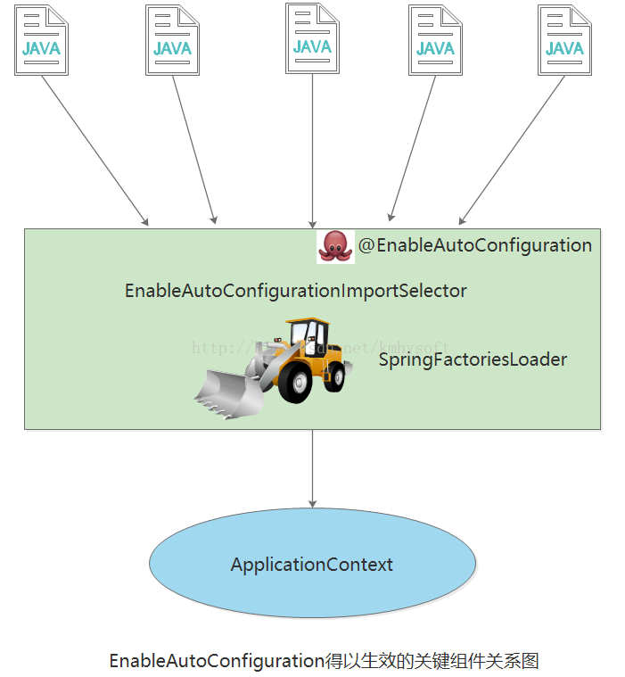

> [@EnableAutoConfiguration和@SpringbootApplication注解](https://www.cnblogs.com/geekdc/p/7048555.html)

**说明：这两个注解是spring boot专有注解**

# @EnableAutoConfiguration

## 功能及用法

告诉SpringBoot基于你已经添加jar依赖项，“猜”你将如何想配置Spring。如果spring-boot-starter-web已经添加Tomcat和Spring MVC,这个注释自动将假设您正在开发一个web应用程序并添加相应的spring设置。

自动配置被设计用来和“Starters”一起更好的工作,但这两个概念并不直接相关。您可以自由挑选starter依赖项以外的jar包，springboot仍将尽力自动配置您的应用程序。

spring通常建议我们**将main方法所在的类放到一个root包下**， `@EnableAutoConfiguration` **（开启自动配置）注解通常都放到main所在类的上面**（demo中的Application.java），下面是一个典型的结构布局：

```
com
 +- example
     +- myproject
         +- Application.java
         |
         +- domain
         |   +- Customer.java
         |   +- CustomerRepository.java
         |
         +- service
         |   +- CustomerService.java
         |
         +- web
             +- CustomerController.java
```

这样 `@EnableAutoConfiguration` 可以从逐层的往下搜索各个加注解的类，例如，你正在编写一个JPA程序（如果你的pom里进行了配置的话），spring会自动去搜索加了@Entity注解的类，并进行调用。

## 源码解析

> [@EnableAutoConfiguration](https://blog.csdn.net/kmhysoft/article/details/71056027)

Spring框架提供的各种名字为 `@Enable` 开头的注解，比如 `@EnableScheduling`、`@EnableCaching` 、`@EnableMBeanExport` 等，`@EnableAutoConfiguration` 的理念和做事方式其实一脉相承，简单概括一下就是，借助 `@Import` 的支持，收集和注册特定场景相关的bean定义。

`@EnableScheduling` 是通过 `@Import` 将Spring调度框架相关的bean定义都加载到IoC容器。
`@EnableMBeanExport` 是通过 `@Import` 将JMX相关的bean定义加载到IoC容器。
而 `@EnableAutoConfiguration` 也是借助 `@Import` 的帮助，将所有符合自动配置条件的bean定义加载到IoC容器。

`@EnableAutoConfiguration` 作为一个复合注解,其自身定义关键信息如下：

```java
@SuppressWarnings("deprecation")
@Target(ElementType.TYPE)
@Retention(RetentionPolicy.RUNTIME)
@Documented
@Inherited
@AutoConfigurationPackage
@Import(AutoConfigurationImportSelector.class)
public @interface EnableAutoConfiguration {
    ...
}
```

最关键的要属` @Import(AutoConfigurationImportSelector.class)`，借助 `AutoConfigurationImportSelector`，`@EnableAutoConfiguration` 可以帮助SpringBoot应用将所有符合条件的 `@Configuration` 配置都加载到当前SpringBoot创建并使用的IoC容器。

借助于Spring框架原有的一个工具类：`SpringFactoriesLoader` 的支持，`@EnableAutoConfiguration` 可以智能的自动配置功效才得以大功告成！



**自动配置幕后英雄：SpringFactoriesLoader**

`SpringFactoriesLoader` 属于Spring框架私有的一种扩展方案，其主要功能就是从指定的配置文件 `META-INF/spring.factories` 加载配置。

```java
public abstract class SpringFactoriesLoader {
    //...
    public static <T> List<T> loadFactories(Class<T> factoryClass, ClassLoader classLoader) {
        ...
    }
    public static List<String> loadFactoryNames(Class<?> factoryClass, ClassLoader classLoader) {
        ....
    }
}
```

配合 `@EnableAutoConfiguration` 使用的话，它更多是提供一种配置查找的功能支持，即根据 `@EnableAutoConfiguration` 的完整类名 `org.springframework.boot.autoconfigure.EnableAutoConfiguration` 作为查找的Key,获取对应的一组 `@Configuration` 类.
就是从SpringBoot的 `autoconfigure` 依赖包中的 `META-INF/spring.factories` 配置文件中摘录的一段内容，可以很好地说明问题。
所以， `@EnableAutoConfiguration` 自动配置的魔法骑士就变成了：从 `classpath` 中搜寻所有的 `META-INF/spring.factories` 配置文件，并将其中 `org.springframework.boot.autoconfigure.EnableutoConfiguration` 对应的配置项通过反射（Java Refletion）实例化为对应的标注了 `@Configuration` 的JavaConfig形式的IoC容器配置类，然后汇总为一个并加载到IoC容器。

# @SpringBootApplication

使用 `@SpringbootApplication` 注解  可以解决根类或者配置类（我自己的说法，就是main所在类）头上注解过多的问题，一个 `@SpringbootApplication` 相当于`@Configuration`,`@EnableAutoConfiguration`和 `@ComponentScan` 并具有他们的默认属性值

# 使用注意

如果项目中使用的**多数据源**，首先要将spring boot自带的`DataSourceAutoConfiguration`禁掉，因为它会自动配置单数据源。在`@SpringBootApplication`或者`@EnableAutoConfiguration`注解中添加`exclude`属性即可：
```java
@SpringBootApplication(exclude = { DataSourceAutoConfiguration.class})
```
否则会出现：No qualifying bean of type 'javax.sql.DataSource' available: expected single matching bean but found 2 的错误。
