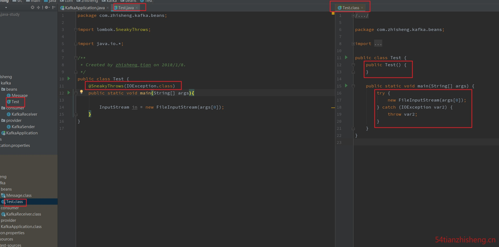

[Java效率工具之Lombok](https://juejin.im/post/5b00517cf265da0ba0636d4b)

[Lombok 看这篇就够了](https://zhuanlan.zhihu.com/p/32779910)

# IDEA安装lombok插件

点击File-- Settings--Plugins，在 Marketplace 中搜索lombok，下图为2019版idea的操作方法。


之前的版本略有不同，需点击底部 Browse repositories... ，然后搜索lombok。

找到lombok的插件后点击install，安装完成重启ide即可。

# 项目中使用

## 引入相应的依赖

```xml
<dependency>
  <groupId>org.projectlombok</groupId>
  <artifactId>lombok</artifactId>
  <version>1.16.18</version>
  <scope>provided</scope>
</dependency>
```

Lombok的scope=provided，说明它只在编译阶段生效，不需要打入包中。事实正是如此，Lombok在编译期将带Lombok注解的Java文件正确编译为完整的Class文件。

## 常用注解

### @Getter/@Setter

作用类上，生成所有成员变量的getter/setter方法；作用于成员变量上，生成该成员变量的getter/setter方法。可以设定访问权限及是否懒加载等。

### @ToString

作用于类，覆盖默认的toString()方法，可以通过`of`属性限定显示某些字段，通过`exclude`属性排除某些字段，`callSuper=true` 调用父类`toString()` 方法。

### @EqualsAndHashCode

作用于类，覆盖默认的equals和hashCode

### @NonNull

主要作用于成员变量和参数中，标识不能为空，否则抛出空指针异常。

### @NoArgsConstructor

生成无参构造器；

### @RequiredArgsConstructor

生成包含final和@NonNull注解的成员变量的构造器；

### @AllArgsConstructor

生成全参构造器。

上面这三个作用于类上，用于生成构造函数。有staticName、access等属性。staticName属性一旦设定，将采用静态方法的方式生成实例，access属性可以限定访问权限。

### @Data

作用于类上，是以下注解的集合：@ToString @EqualsAndHashCode @Getter @Setter @RequiredArgsConstructor

### @Value

这个注解用在 **类** 上，会生成含所有参数的构造方法，get 方法，此外还提供了equals、hashCode、toString 方法。


### @Builder

作用于类上，将类转变为建造者模式

### @Log

作用于类上，生成日志变量。针对不同的日志实现产品，有不同的注解：@CommonsLog、@JBossLog、@Log、@Log4j、@Log4j2、@Slf4j、@XSlf4j

### @Accessors(chain = true)

链式调用

### @Cleanup

自动关闭资源，针对实现了java.io.Closeable接口的对象有效，如：典型的IO流对象


编译后结果如下：


### @SneakyThrows

这个注解用在 **方法** 上，可以将方法中的代码用 try-catch 语句包裹起来，捕获异常并在 catch 中用 Lombok.sneakyThrow(e) 把异常抛出，可以使用 @SneakyThrows(Exception.class) 的形式指定抛出哪种异常，也会生成默认的构造方法。



### @Synchronized

作用于方法级别，可以替换synchronize关键字或lock锁，用处不大。

这个注解用在 **类方法** 或者 **实例方法** 上，效果和 synchronized 关键字相同，区别在于锁对象不同，对于类方法和实例方法，synchronized 关键字的锁对象分别是类的 class 对象和 this 对象，而 @Synchronized 的锁对象分别是 私有静态 final 对象 lock 和 私有 final 对象 lock，当然，也可以自己指定锁对象，此外也提供默认的构造方法。


# Lombok实现原理

自从Java 6起，javac就支持“JSR 269 Pluggable Annotation Processing API”规范，只要程序实现了该API，就能在javac运行的时候得到调用。

Lombok就是一个实现了"JSR 269 API"的程序。在使用javac的过程中，它产生作用的具体流程如下：

- javac对源代码进行分析，生成一棵抽象语法树(AST)
- javac编译过程中调用实现了JSR 269的Lombok程序
- 此时Lombok就对第一步骤得到的AST进行处理，找到Lombok注解所在类对应的语法树(AST)，然后修改该语法树(AST)，增加Lombok注解定义的相应树节点
- javac使用修改后的抽象语法树(AST)生成字节码文件

