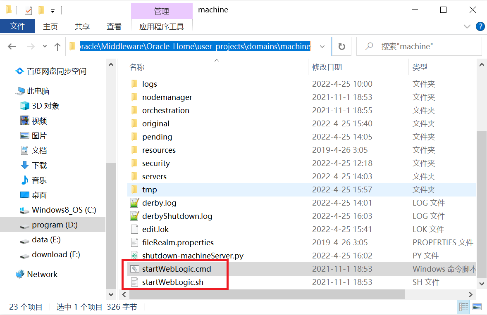
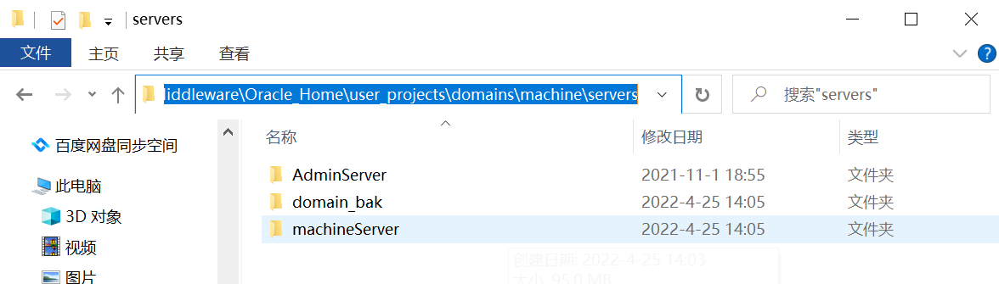
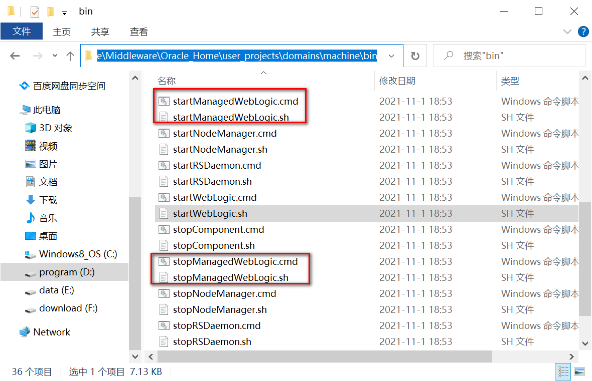
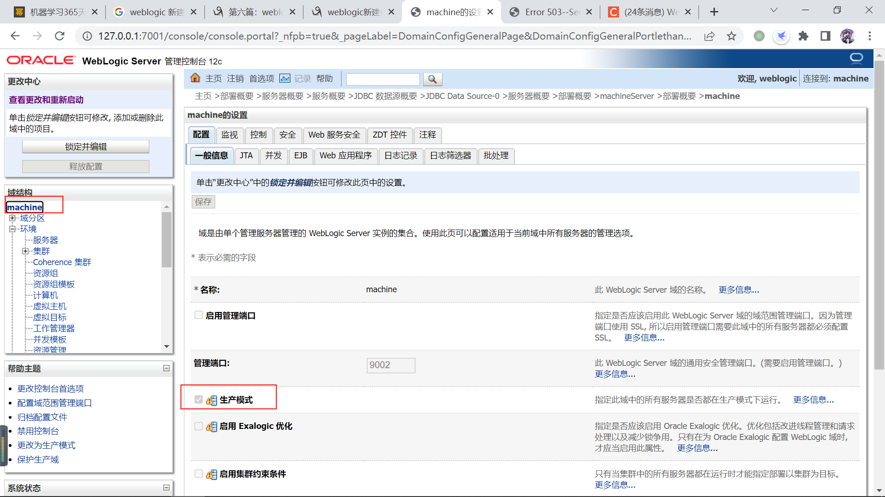
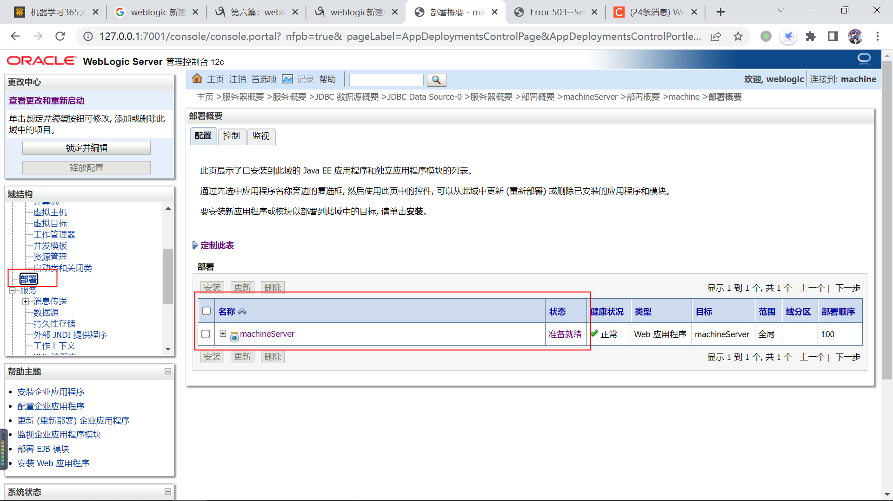
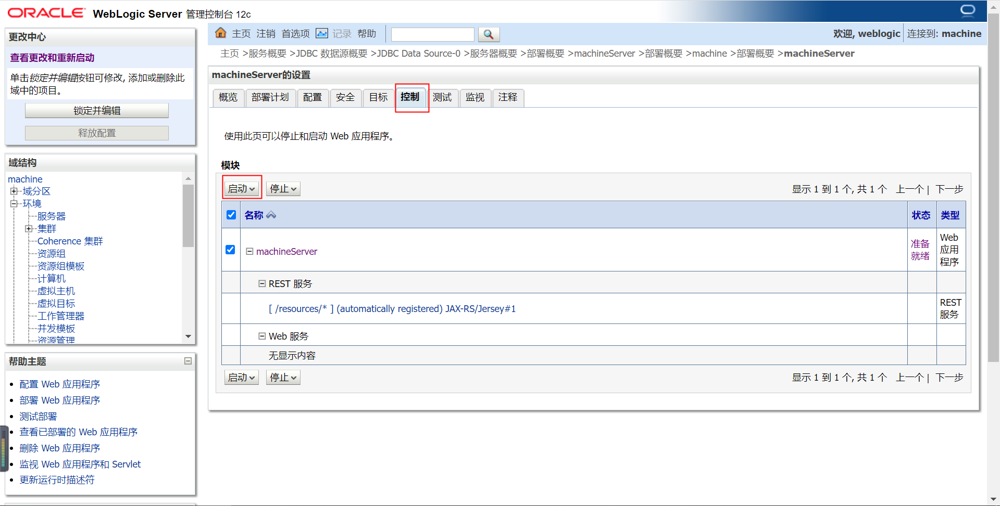
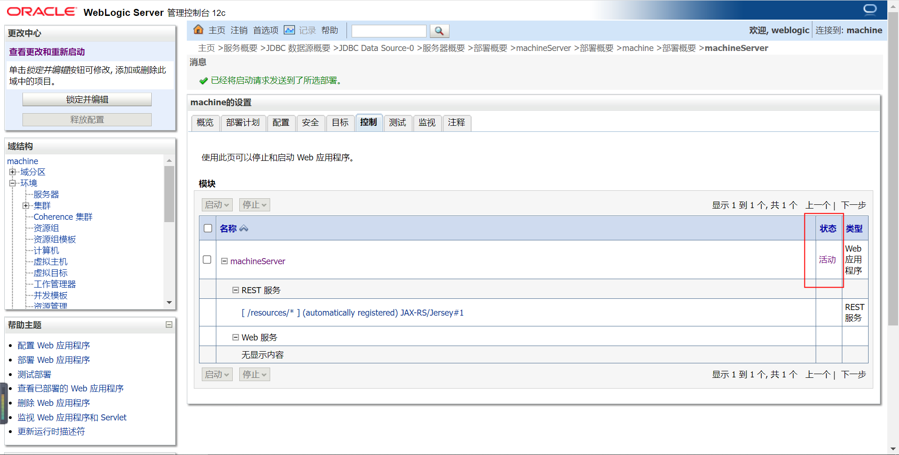

> 参考文档
>
> [直接使用AdminServer部署应用](https://blog.csdn.net/magi1201/article/details/46280507)
>
> [创建启动关闭server](https://www.cnblogs.com/shisheng/p/9810047.html)
>
> [切换Production、Development模式](http://oraclesoaosbbpmapi.blogspot.com/2018/05/how-to-change-weblogic-domain-mode-to.html)
>
> [Production、Development模式的区别](http://serversideposts.blogspot.com/2014/10/difference-between-development-mode-and.html)

# domain 域

一整套服务环境，其下有 服务器、集群、应用程序、数据源…… 各种web应用组件。

每一个 domain 对应 %weblogic_home%/user_projects/domains 下一个目录，目录名就是 domain 名。


安装weblogic后，需要先创建domain，启动 domain，然后在domaim下进行服务环境的应用部署、组件配置。

使用每个domain目录下startWebLogic脚本启动当前domain。



每个domain创建后都会默认创建一个AdminServer，domain启动后，访问 `http://ip:port/console` 进入当前domain的控制台界面，进行服务部署及管理操作，port 默认 7001。

# server 服务器

一个服务器对应一个JVM进程实例，创建服务时，需要指定server监听端口。

一个server中可以部署多个web应用，同一个server中的web应用共用同一个jvm进程，同一个端口号，不同contextPath。

这里的一个server和一个tomcat进程有些类似。

每一个server，会在当前domain目录的servers目录（%weblogic_home%/user_projects/domains/%domain_name%/servers）下对应一个同名目录，该目录不会在console中添加后就创建，而是会在首次启动server时创建。



server创建后为SHUTDOWN状态，使用当前domain下bin目录中的startManagedWebLogic脚本启动



启动命令格式如下：

```
./startManagedWebLogic.sh [server_name] [http://AdminServerip:port]
eg:
startManagedWebLogic.cmd machineServer http://127.0.0.1:7001
```

linux服务器上使用 sh 后缀脚本，Windows 上使用 cmd 后缀脚本，`http://127.0.0.1:7001` 就是我的机器上AdminServer服务的访问地址。

# 应用程序

我平时所说的web应用（war包），就是一个应用程序。

每个应用程序，必须部署到server中，如果当前domain有多个server，需要选择部署到哪个server中，如果domain创建后，未添加自定义server，默认部署到 AdminServer中。

# Production mode vs Development mode

Production mode 生产模式

Development mode 开发模式

可以从左侧“域结构”窗口中，点击最顶层的%domain_name%页，查看当前domain使用的模式，如果“生产模式”为勾选状态，则当前模式为 Production mode。



Production mode 下所有对环境配置的变更，如 增删改server，web应用，数据源... 都需要在左上角的更改中心进行“锁定并编辑->激活更改->释放配置” 操作。

Production mode 下部署的web应用，不会立即启动，server启动后，web应用的状态为“准备就绪”：



需要在web应用页的“控制”选项卡中，选中应用，点击启动后，web应用的状态变为“活动”:





server的jvm实例才会装载并运行web应用。

启动server时，如果只启动了server，但是没启动web应用（状态为“准备就绪”），这时访问web应用，返回 503。

如果只停止了web应用（状态变为“准备就绪”），未停止server，这时访问web应用，返回 404。

如果停止了server（状态变为“SHUTDOWN”），这时访问web应用，返回 拒绝连接（ERR_CONNECTION_REFUSED）。

如果停止了server时，未停止web应用（状态为“活动”），下次启动server是同时自动装载并运行web应用，无需在web应用页的“控制”选项卡中手动启动。

Development mode 下部署的web应用，直接是“活动”状态，server的jvm实例会立即装载并运行web应用。