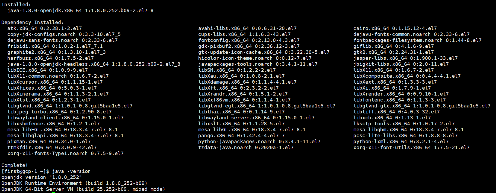

# Linux中安装Java

## 使用yum安装

该方法安装管理都非常简单，可以省略环境变量配置

1. 查找可安装的jdk软件包

   ```shell
   yum list *jdk*
   ```

2. 安装 openjdk 1.8

   ```shell
   sudo yum install java-1.8.0-openjdk.x86_64
   ```

   

   ***注意：安装openjdk那么只会安装 jre，并不会安装 jdk，如果要安装jdk，需要安装 openjdk-devel***

   仅安装 openjdk 的话会安装 openjdk 和 openjdk-headless，openjdk-headless 是无界图形面的最简运行时环境，openjdk 是在 headless 基础上增加对图形界面支持的运行时环境。

3. 安装完成后查看安装位置

   ```
   rpm -ql java-1.8.0-openjdk.x86_64
   rpm -ql java-1.8.0-openjdk-headless.x86_64
   ```

   