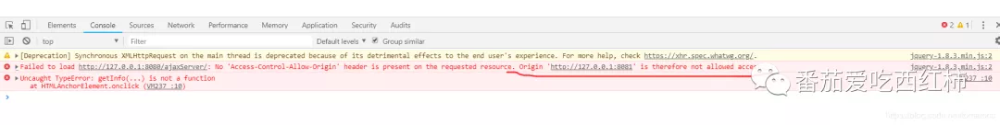
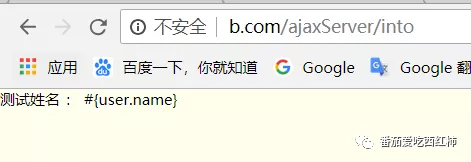

作者：番茄爱吃星汉砂 [原文地址](https://mp.weixin.qq.com/s/dumJSm5cAumn8cN8Hcrn-Q)

# 问题描述

产生ajax跨域问题的场景：由于目前的开发方式都偏向于前后端分离，因此前端需要多次对后台的接口进行调用，**但是如果前端和后台不在相同的web服务器下面（哪怕是相同服务器的不同端口），就一定会产生跨域问题。**

# 场景模拟

- 首先我们创建一个名为ajaxServer的web项目，使其作为服务端。并创建一个controller，创建一个方法并返回jsond对象

  ```java
  package com.demo.web;
  
  import com.demo.model.User;
  import com.jfinal.core.Controller;
  
  public class IndexController extends Controller {
  
      public void index() {
          User user = User.dao.getUserById("1");
          setAttr("user", user);
          System.out.println("into ");
          renderJson(user);
      }
  }
  ```

- 浏览器中访问效果如下

- 接下来，我们在创建一个ajaxClient的web项目，作为客户端，并新建一个页面，在页面上通过ajax的方式去请求我们的服务器。

  ```html
  <!DOCTYPE html>
  <html>
  <head>
  <meta http-equiv="Content-Type" content="text/html; charset=utf-8" />
  <title>跨域问题：客户端</title>
  <script type="text/javascript" src="#(basepath)/file/js/jquery-1.8.3.min.js"></script>
  </head>
  <body>
  <form action="" method="post">
      <a href="javascript:void(0)" onclick="getInfo()()">获取服务端请求</a>
  </form>
  
   <script>
      function getInfo(){
                 $.ajax({
                      type: 'GET',
                      url: 'http://127.0.0.1:8080/ajaxServer/',
                      async: false,
                      async:false,
                      success: function(result){
                          console.log(result);
                      },
                  });
      }
   </script>
  </body>
  </html>
  ```

- 页面效果如下： 

- 然后我们打开控制台，并触发这个请求，会看到控制台出现下列报错：（但是我们查看Network去发现服务可以调通) 

  
  
  
  > 该错误信息的含义表示：你当前处于 `IP：127.0.0.1端口：8081`的服务下，但是你请求了 `IP:127.0.0.1端口:8080`该服务器下的应用，因此 `浏览器`认为你的请求属于跨域。这里要着重说明一点：`跨域问题是浏览器的行为，并非该请求不能正常访问`。我们通过控制台可以看到 `我们客户端的请求是可以正常请求到服务端`，并且可以正常返回json对象。
  > 

- 到这里，我们对跨域问题的产生原理就有了一个大致的了解，下面，我们将通过三种不同的方式来解决跨域问题。

# 解决跨域

```
  之所以发生跨域问题，主要有以下三种情况
  1）浏览器限制
  2）跨域（ip或者端口存在不一致）
  3）客户端发出去的请求是XHR(XMLHttpRequest)方式。
```

> 解决思路：我们已经知道，之所以发生跨域问题，是由于上面三种原因导致的，下面我们就针对这三种原因，逐一介绍解决这三种跨域问题的方法。

1. 让浏览器支持跨域问题（不推荐，因为我们无法让用户自己去操作） **首先，我们通过命令行的凡是重新启动一个Chrom窗口**

   ```
   C:\Users\55386\AppData\Local\Google\Chrome\Application>chrome --disable-web-security
   ```

   然后，我们在这个浏览器中输入我们客户端的地址：http://127.0.0.1:8081/ajaxClient/ ，进行相同的操作，就会发现跨域问题完美解决。**（ 但是并不推荐）**

2. 针对请求方式为XHR的，通过JSONP的方式来实现跨域

   > JSONP（JSON with Padding）是 JSON的一种"使用模式"（非官方），主要通过利用script标签，可以让网页从别的域名（网站）那获取资料，即实现跨域获取资源的问题。使用JSONP的时候，后台代码也需要进行调整

   后台代码如下:

   ```java
   package com.demo.web;
   
   import com.demo.model.User;
   import com.jfinal.core.Controller;
   
   public class IndexController extends Controller {
   
       public void index() {
           User user = User.dao.getUserById("1");
           setAttr("user", user);
           System.out.println("into server");
   
           //renderJson(user);
           String callback = getRequest().getParameter("callback"); 
           String jsonp = "";
           if(StrKit.isNotBlank(callback)) {//判断是否为JSONP进来
                jsonp = "jsonpCallback({\"data\":"+user.toJson()+"})";
           }
           renderJson(jsonp);  
       }
   }
   ```

   前端代码如下：

   ```javascript
       function getJosnp(){
              $.ajax({
                   type: 'GET',
                   url: 'http://127.0.0.1:8080/ajaxServer/',
                   dataType:'jsonp',
                   jsonp:'callback',// jsonp带的参数
                   async: false,
                   jsonpCallback:"jsonpCallback",
                   success : function(data) {
                       console.log(data);
                       console.log(data.data.name);
                   },
               });
   ```

   然后我们触发这个方法，在控制台中我们可以看到已经获取到相应(返回的是javascript)。

   

   

   > 这里要说明一点，JSONP会带一个默认参数叫做，callback，因此后台需要获得这个参数来判断前端是不是通过JSONP的方式请求进来。

   ```
   JSONP的弊端：
   服务器需要改动代码来支持JSONP。
   只支持GET请求。
   发送的不是XHR请求，因此JSONP不支持XHR的很多特性。
   ```

3. 真正解决请求是跨域的问题

   > 从上面的两种方式我们可以看到，都是间接性的去“绕过”跨域问题，并不是真正的解决跨域，下面我们来实现真正的跨域问题。常用的解决方式有两种：被调用方解决、调用方解决。

## 1）被调用方解决

> 在响应头中增加指定的字段，告诉浏览器，允许它进行调用

**解决前提**首先，通过上述的实验，我们知道我们浏览器判断是否跨域的顺序是，先调用服务，等服务正常返回之后，浏览器才会判断该请求是否属于跨域请求。其次，我们来对比一下跨域请求，和非跨域请求的两个请求的内容

**非跨域请求头**


**跨域请求头**


通过对比，我们发现跨域请求的请求头中多出一个参数，这个值就是我们客户端的域名信息。（浏览器其实是通过判断该请求是否是跨域，如果跨域，则会在**请求头**中增加当前域名字段，然后通过判断**响应头**里面判断是否有跨域的信息，如果没有，则会报错）

```
Origin: http://127.0.0.1:8081
```

### 拦截器解决方案

> 服务端的后台创建一个拦截器，拦截所有的请求，

```java
package com.demo.invocation;
import javax.servlet.http.HttpServletResponse;
import com.jfinal.aop.Interceptor;
import com.jfinal.aop.Invocation;
import com.jfinal.core.Controller;
import com.jfinal.log.Log;

public class AjaxInterceptor implements Interceptor {
    public void intercept(Invocation inv) {
        Controller controler = inv.getController();
        // 获得响应信息
        HttpServletResponse res = controler.getResponse();
        // 修改响应信息
        res.addHeader("Access-Control-Allow-Origin", "http://127.0.0.1:8081");//这里增加客户端调用地址
        res.addHeader("Access-Control-Allow-Methods", "GET");
        //增加客户端调用的方法
        inv.invoke();
    }
}
```

然后我们在触发一次之前的跨域请求，会发现已经可以正常获取到数据，


> 上面拦截器的代码中我们发现，客户端地址和方法都是固定的，这显示不符合常规操作，如果我们需要满足所有的请求地址则用 * 号，如果需要满足所有的请求方式，一样用 * 号即可。

#### 简单请求和非简单请求

浏览器在发送跨域请求的时候，实际上还会先判断请求是不是 **简单请求**，如果是简单请求（ **使用设定的请求方式请求数据**：^简单请求），则会像上述那样，先执行后判断。如果是 **非简单请求**^非简单请求，则会先发一个“预检”命令( **OPTIONS**)，如果“预检”通过后，才会把真正的跨域请求发送过去。

**非简单请求DEMO:**

后代代码

```java
package com.demo.web;
import com.demo.invocation.AjaxInterceptor;
import com.demo.kit.StrKit;
import com.demo.model.User;
import com.jfinal.aop.Before;
import com.jfinal.core.Controller;

public class IndexController extends Controller {
    public void index() {
        System.out.println("into post json");
        renderJson(getPara());      
    }
}
```

前端代码

```javascript
    function postJson(){
           $.ajax({
                type: 'post',
                url: 'http://127.0.0.1:8080/ajaxServer',
                contentType:'application/json;charset=utf-8',
                async: false,
                date:JSON.stringify({name:"tomatocc"}),
                success: function(data){
                    console.log(data);
                },
            });
}
```

运行前端调用方法后，发现控制台报错。并且请求方法是OPTIONS。


该报错信息表示，我们的请求头没有被允许访问，这时候我们需要在之前的拦截器种增加请求头的信息即可。

```java
    public void intercept(Invocation inv) {
        Controller controler = inv.getController();
        // 获得响应信息
        HttpServletResponse res = controler.getResponse();
        res.addHeader("Access-Control-Allow-Origin", "http://127.0.0.1:8081");//客户端地址
        res.addHeader("Access-Control-Allow-Methods", "GET");
        // 增加请求头
        res.addHeader("Access-Control-Allow-Headers", "Content-Type");
        inv.invoke();
    }
```

然后我们刷新浏览器，重新进行请求。就会发现之前的问题已经不存在了。


我们会发现，浏览器其实发送了两个请求，其中方式位OPTIONS的是“预检”命令，另一个POST则为预检通过后的请求。

```
另外我们可以设置预检缓存，避免多次预检
//设置响应预检命令的缓存时间（设置后，浏览器在该时间内只会预检一次） 单位秒
res.addHeader("Access-Control-Max-Age", "3600");
```

#### 带Cookie的跨域问题

> 我们知道，http里面的会话（session）是要依赖于cookie的，sessionid是存放在cookie里面的，所以在实际工作中，带cookie的跨域是很常见的。

前端代码

```html
<!DOCTYPE html>
<html>
<head>
<meta http-equiv="Content-Type" content="text/html; charset=utf-8" />
<title>跨域问题：客户端</title>
<script type="text/javascript" src="#(basepath)/file/js/jquery-1.8.3.min.js"></script>
</head>
<body>
<form action="" method="post">
      <a href="javascript:void(0)" onclick="getCookie()">Cookie请求</a>
</form>

 <script>
    // cookie跨域
    function getCookie(){
           $.ajax({
                type: 'get',
                url: 'http://127.0.0.1:8080/ajaxServer/getCookie',
                xhrFields: {
                    withCredentials: true// 发送ajax请求的时候会带上cookie
                },
                success: function(data){
                    console.log(data);
                },
            });
}
 </script>
</body>
</html>
```

服务端后台代码

```java
package com.demo.invocation;

import javax.servlet.http.HttpServletResponse;

import com.jfinal.aop.Interceptor;
import com.jfinal.aop.Invocation;
import com.jfinal.core.Controller;
import com.jfinal.log.Log;

public class AjaxInterceptor implements Interceptor {

    private static Log log = Log.getLog(AjaxInterceptor.class);

    public void intercept(Invocation inv) {
        Controller controler = inv.getController();
        // 获得响应信息
        HttpServletResponse res = controler.getResponse();
        //客户端地址
        res.addHeader("Access-Control-Allow-Origin", "http://127.0.0.1:8081");// * 号不能满需带cookie的跨域请求
        // 设置响应方法
        res.addHeader("Access-Control-Allow-Methods", "GET");
        // 设置响应头
        res.addHeader("Access-Control-Allow-Headers", "Content-Type");
        //设置响应预检命令的缓存时间（设置后，浏览器在该时间内只会预检一次） 单位秒
        res.addHeader("Access-Control-Max-Age", "3600");
        inv.invoke();
    }
}
```

然后我们在服务端的页面中增加cookie。


然后，我们在客户端进行调用，发现控制台有如下报错


该报错信息表示，响应头中没有发现 **Access-Control-Allow-Credentials**并且，需要见该参数的值设置为 **true**，下面我们改造下服务端的拦截器，在响应头增加该参数。

```java
res.addHeader("Access-Control-Allow-Credentials", "true");
```

接下来，我们重新刷新客户端。便可以正常访问。并且可以或得到cookie


> 备注：如果是cookie跨域，则Access-Control-Allow-Origin 的参数值必须是全匹配，不能用*号，这就会有一个问题，跨域cookie显示不可能只是一个客户端进行调用，那么又不能用 * 号，我们该怎么解决多个客户端的跨域问题？从上面关于跨域的讲解中，我们知道，浏览器认为请求属于跨域请求后，会在请求中加上 **Origin**这个参数，而这个参数的值恰好是当前域名，那么我们就可以在拦截器中获取请求头中的 **Origin**参数，然后把它的值放进响应头的 **Access-Control-Allow-Origin**参数中。改造代码如下：

```java
// 请求
HttpServletRequest req = controler.getRequest();
// 获取请求头的 Origin 参数
String origin = req.getHeader("Origin");
//客户端地址
res.addHeader("Access-Control-Allow-Origin", origin);// * 号不能满需带cookie的跨域请求
```

```
总结：
1.cookie跨域的时候，使用的是被调用方（服务端）的cookie，而不是调用方(客户端)的cookie。
2.响应头中的Access-Control-Allow-Origin参数不能用 * 号，必须要用全域名。
3.响应头中必须增加 该参数 ：res.addHeader("Access-Control-Allow-Credentials", "true");
```

#### 带自定义头的跨域

前端代码

```javascript
// 自定义头的跨域
function getHeader(){
    $.ajax({
        type: 'get',
        url: 'http://127.0.0.1:8080/ajaxServer/header',
        // 发送自定义头的两种方式
        headers:{
        	"x-header1":"AAA"
        },
        beforeSend:function(xhr){
        	xhr.setRequestHeader("x-header2","BBB")
        },
        success: function(data){
        	console.log(data);
        },
    });
}
```

后台代码

```java
@Before(AjaxInterceptor.class)
public void header() {
    System.out.println("into get header ");
    // 返回header信息
    renderJson(getHeader("x-header1")+getHeader("x-header2"));
}
```

接下来，我们请求客户端，可以看到请求头已经添加进去。


然后，我们可以在控制台看到如下报错信息，该报错信息表示：在响应头中的Access-Control-Allow-Headers参数中没有找到我们自定义的两个header。

通过查看发现，响应头中的确只有一个ContentType。


下面，我们就需要在拦截器中，对 Access-Control-Allow-Headers参数进行修改即可。

```java
res.setHeader("Access-Control-Allow-Headers", "Content-Type,x-header1,x-header2");
```

然后，我们在刷新客户端，重新请求一次。就可以正常请求。当然也可以用之前的方式，从请求中获取参数，来实现更便

```java
        // 请求
        HttpServletRequest req = controler.getRequest();
        // 获取请求头的 Access-Control-Allow-Headers参数
        String headers= req.getHeader("Access-Control-Allow-Headers");
        //客户端地址
        res.addHeader("Access-Control-Allow-Headers", headers);
```

### NGINX解决跨域

> 在真实开发环境中，调用方（客户端）和被调用方（服务端）进行交互的时候，首先要经过HTTP服务器，然后HTTP服务器才会将请求转到应用服务器，才能实现通信正常。我们上面用到的方式是，在被调用方的应用服务器中进行处理响应头，下面我们就要在HTTP服务器上直接处理响应头。


1. 我们要对被调用方的虚拟主机（ 多个域名指向同一个服务器，服务器根据不同的域名，把请求转到不同的应用服务器）进行配置.

2. 首先我们打开windos的hosts文件，增加一个映射域名 `127.0.0.1 b.com`


3. 然后打开nginx的conf目录：D:\Development\nginx-1.15.7\conf，创建一个文件夹 **vhost** ,准备在里面存放虚拟主机的配置文件。

4. 然后我们打开当前目录下的 **nginx.conf**文件，在最后增加如下配置（让nginx载入vhost目录下的所有以conf结尾的文件）
    

5. 然后我们在vhost目录下，增加一个 b.com.conf文件，并进行编辑

   ```
   server{
       # 监听80端口
       listen 80;
       # 域名为：b.com
       server_name b.com;
   
       location /{
           # 把所有的请求都转到该地址下
           proxy_pass http://127.0.0.1:8080/;
       }
   }
   ```

6. 然后我们打开dos窗口，cd到nginx目录下


7. 然后输入命令 `nginx.exe -t` 来测试配置文件。这样就表示配置成功


8. 然后输入命令 `start nginx.exe` 来启动nginx。

9. 在浏览器中输入 `http://127.0.0.1/` 查看nginx是否成功启动


10. 打开原来的被调用方（服务端）项目 `http://127.0.0.1:8080/ajaxServer/into/` ，然后我们将ip和端口改为b.com， `http://b.com/ajaxServer/into` ，就会发现网站一样可以访问。
    
    

11. 到这里，我们的虚拟主机就配置完成。接着我们把直接拦截器里面关于允许跨域的代码全部注释掉。


12. 修改我们的 b.com.conf配置文件。内容如下

     ```
     server{
         # 监听80端口
         listen 80;
         # 域名为：b.com
         server_name b.com;
         location /{
             # 把所有的请求都转到该地址下
             proxy_pass http://127.0.0.1:8080/;
             # 设置所有方法都允许跨域
             add_header Access-Control-Allow-Methods *;
             # 设置响应预检命令的缓存时间（设置后，浏览器在该时间内只会预检一次） 单位秒
             add_header Access-Control-Max-Age 3600;
             #  cookie跨域的问题  请求头解决方式
             add_header Access-Control-Allow-Credentials true;
             # 获取请求头的 Origin 参数,并写入响应头
             add_header Access-Control-Allow-Origin $http_origin;
             # 获取请求头的 Headers 参数,并写入响应头(请求头必须小写，-变_)
             add_header Access-Control-Allow-Headers 
             $http_access_control_request_headers;
     
             # 处理预检命令，让预检命令直接在nginx返回，无需经果应用服务器 if 后面必须加空格
             # 判断请求方法是不是OPTION，如果是则返回200
             if ($request_method = OPTIONS){
                     return 200;
                 }
         }
     }
     ```

13. 然后输入命令 `nginx.exe -t`来测试配置文件。这样就表示配置成功


14. 然后输入命令 `nginx.exe-s reload`重启nginx。

15. 将直接html页面中调用域名的ip和端口统一改为 b.com。

     ```
     http://b.com/ajaxServer/header
     ```
    
16. 然后重新用客户端去调用服务端，会发现，跨域问题一样可以解决。

---

### Spring框架处理跨域

> Spring的最大特点就是注解开发，所以说，我们可以在需要支持跨域的类名上或者方法放增加 @CrossOrigin注解，来实现整个类支持跨域和某个方法支持跨域。

## 2）调用方解决

> 基于隐藏跨域的解决思路。这种方式下跨域请求不会直接从调用方发送到被调用方，而是从中间的http服务器转发过去。解决思路：跨域请求是通过调用方的http服务器的 反向代理，转发到被调用方服务器的。反向代理：**访问同一个域名的两个不同url，最终会解析到两个不同服务器**。

### Nginx反向代理解决跨域

1. 首先我们打开windos的hosts文件，增加一个映射域名 `127.0.0.1 a.com` 

   
   

2. 然后在nginx的vhost目录下增加a.com的配置文件，并进行配置。

   

   ```
   server{
       # 监听80端口
       listen 80;
       # 域名为：a.com
       server_name a.com;
   
       location /{
           # 把所有的请求都转发到该地址下
           proxy_pass http://127.0.0.1:8081/;
       }
       # 增加代理(需要调用的服务器的地址，请求的前缀)
       location /ajaxserver{
           proxy_pass http://127.0.0.1:8080/ajaxServer/;
       }
   
   }
   ```

3. 将客户端的html进行修改。

   

   将方框中的地址更换为上面配置文件中的 `/ajaxserver/header`

   ```
     url: '/ajaxserver/header',
   ```

4. 然后我们打开dos窗口，cd到nginx目录下

   

5. 然后输入命令 `nginx.exe -t` 来测试配置文件。这样就表示配置成功

   

6. 然后输入命令 `start nginx.exe` 来启动nginx。

7. 在浏览器中输入客户端的地址 `http://a.com/ajaxClient/` ,发现可以正常访问。（原来地址是：`http://127.0.0.1:8081/ajaxClient/` ）

---

# 总结-- 重要

最近学习跨域资源共享（CORS）漏洞后，发现上文中的处理跨域方式存在不妥之处，并且JSONP和Servlet服务器中处理的区别也有理解不当之处，这里做补充

> 首先JSONP目前主要适用于一些低版本浏览器，比如老版本的ie浏览器，而主流浏览器和新版ie，处理跨域的方式都是通过在Servlet这种服务器（nginx,apache,拦截器等）中进行处理的。
>
> 其次，关于跨域处理，如果响应中的Access-Control-Allow-Origin参数值是从请求中获取的话，其实会存在CORS漏洞，而本文推荐了这种不合适的处理方式。正确的方式为*号，或者下面所示更为安全的处理方式。

```
// 指定可信的源
res.addHeader("Access-Control-Allow-Origin", "http://127.0.0.1:8082");
```
