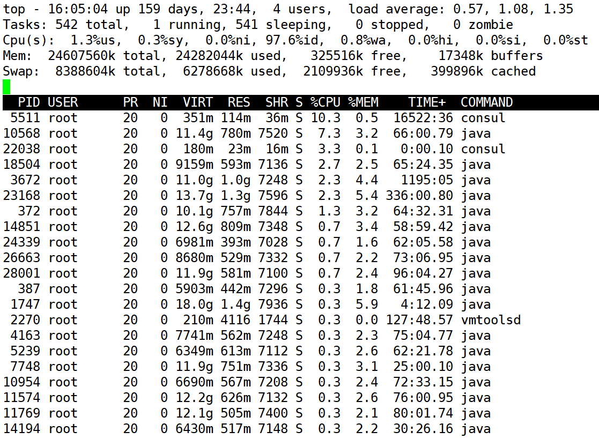

> 参考资料
>
> [为什么设置-Xmx4g但是java进程内存占用达到8g？](https://blog.csdn.net/w1014074794/article/details/113340344)

实时显示进程的系统资源占用情况，类似 Windows 任务管理器。

# 界面说明



## 统计信息

## 进程信息

**各进程状态字段说明如下：**

PID — 进程id

USER — 进程所有者

PR — 进程优先级

NI — nice值。负值表示高优先级，正值表示低优先级

VIRT — 进程使用的虚拟内存总量，单位kb。VIRT=SWAP+RES

RES — 进程使用的、未被换出的物理内存大小，单位kb。RES=CODE+DATA

SHR — 共享内存大小，单位kb

S — 进程状态。D=不可中断的睡眠状态 R=运行 S=睡眠 T=跟踪/停止 Z=僵尸进程

%CPU — 上次更新到现在的CPU时间占用百分比

%MEM — 进程使用的物理内存百分比

TIME+ — 进程使用的CPU时间总计，单位1/100秒

COMMAND — 进程名称（命令名/命令行）

**VIRT：virtual memory usage 虚拟内存**
1、进程“需要的”虚拟内存大小，包括进程使用的库、代码、数据等
2、假如进程申请100m的内存，但实际只使用了10m，那么它会增长100m，而不是实际的使用量

**RES：resident memory usage 常驻内存**
1、进程当前使用的内存大小，但不包括swap out
2、包含其他进程的共享
3、如果申请100m的内存，实际使用10m，它只增长10m，与VIRT相反
4、关于库占用内存的情况，它只统计加载的库文件所占内存大小

**SHR：shared memory 共享内存**
1、除了自身进程的共享内存，也包括其他进程的共享内存
2、虽然进程只使用了几个共享库的函数，但它包含了整个共享库的大小
3、计算某个进程所占的物理内存大小公式：RES – SHR
4、swap out后，它将会降下来

# 常用命令

## 交互命令


## 命令行选项

### 查看指定进程

```
top -p 进程id
```

