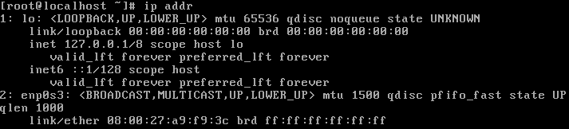
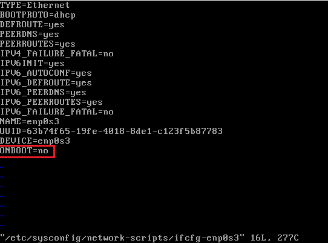
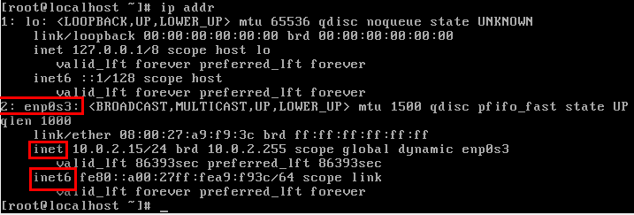

# 网络配置

查看网卡、ip等信息

```
ip addr 
```

如果网络信息如下:



网卡 2 enp0s3 没有 inet 信息，表示该网卡未开启，此时无法访问外部网络。

执行以下命令查看网卡配置信息：

```
vi /etc/sysconfig/network-scripts/ifcfg-enp0s3
```

`enp0s3` 为网卡名称，需根据 ip addr 中的信息调整。



`ONBOOT=no` 表示该网卡未开启，把这个值改为 `yes` 保存，然后执行以下命令，重启网络服务：

```
service network start
```

执行完成，使用 `ip addr` 再次查看网络信息，显示如下：



表示网络已开启，可访问外部网络。