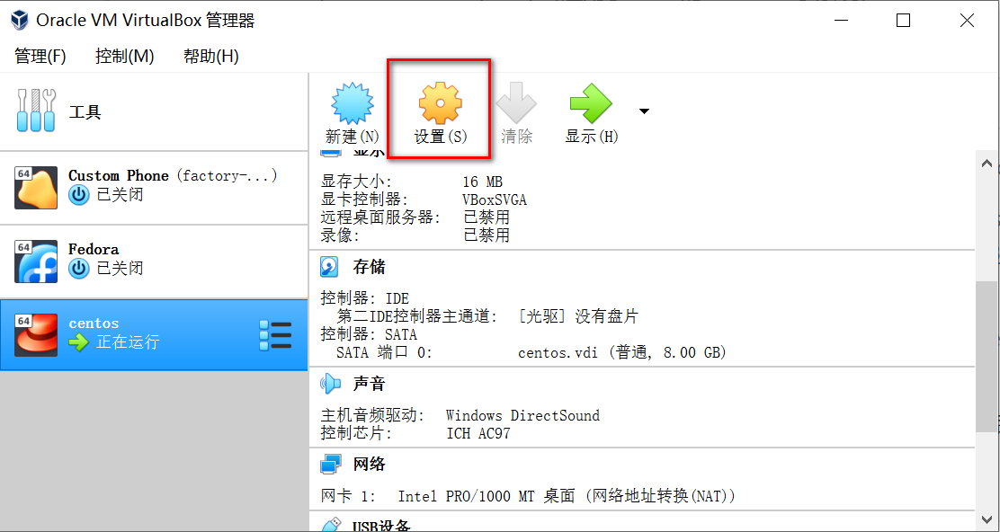
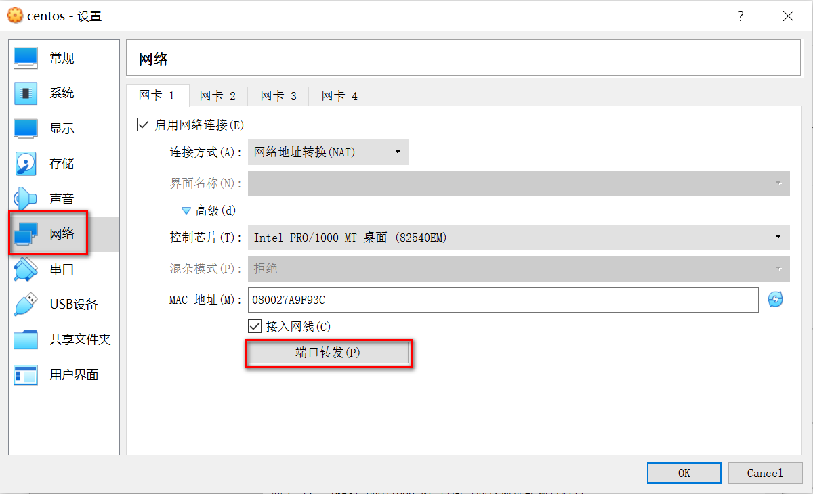
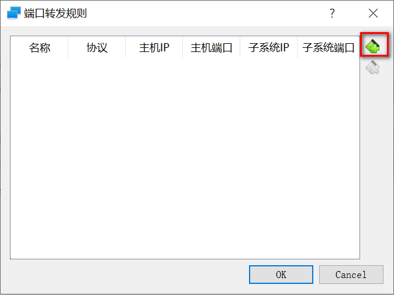
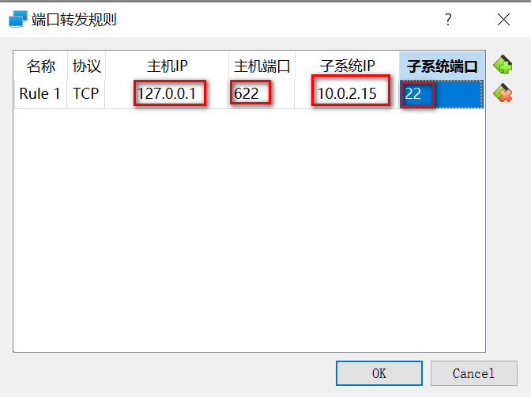
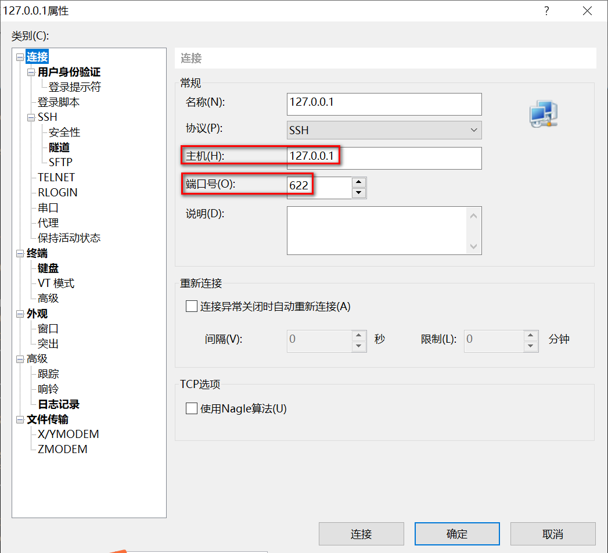
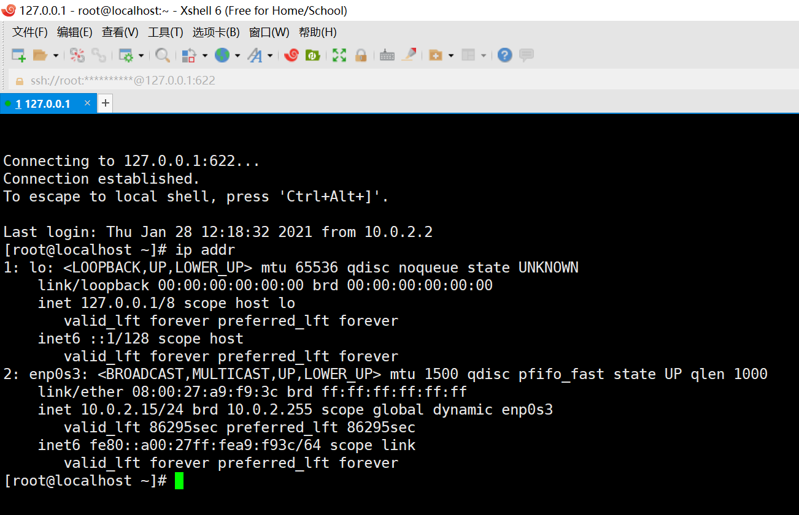

# VirtualBox虚拟机屏幕太小
> [在VirtualBox中安装增强功能](https://www.cnblogs.com/ruanjiantest0405/p/10542472.html)
>
> [在 VirtualBox，VBoxVGA，VMSVGA和VBoxSVGA之间有什么区别？](https://www.kutu66.com//diannao/article_176642)

VirtualBox 的虚拟机屏幕的默认分辨率是 800\*600，虚拟机安装完成后即使在系统中调整了屏幕分辨率，系统重启之后依然会再次变成800\*600。

需要安装 VirtualBox 增强工具(VBoxGuestAdditions)来解决这个问题。

安装步骤：

1. 启动虚拟机 -> 设备 -> 安装增强功能
2. 如果出现“未能加载虚拟光盘 XXX(VBoxGuestAdditions.iso的路径) 到虚拟电脑 XXX”的提示，来 Fedora 系统中用 File 弹出当前加载的光盘，然后再次点击“安装增强功能”
3. 加载成功后会出现一个提示框“VBox_GAs_[版本号]包含打算自动启动的软件。您是否想要运行它？”点击“运行”。然后系统会打开一个命令行窗口运行增强工具的安装程序。
4. 命令行会出现确认安装的提示“Do you wish to continue? [yes or no]”，输入“yes”
5. 安装程序执行完后会提示按 `enter` 关闭安装命令行窗口，然后重启系统。
6. 如果重启系统后虚拟机屏幕依然很小，`视图 -> 虚拟显示屏1` 中的分辨率重设选项都是灰色，且系统中设置的分辨率在重启之后依然失效。检查一下虚拟机的 `设置 -> 显示 -> 显卡控制器`，如果是 `VMSVGA` 关闭虚拟机，把它改成 `VBoxVGA` 或 `VBoxSVGA`。重新启动即可通过 `视图 -> 虚拟显示屏1` 调整分辨率，或者是在系统中调整分辨率重启后依然有效。
7. 此时如果再将“显卡控制器”改为“VMSVGA”增强功能对虚拟机屏幕的优化依然有效。

> 注意：
> 1. 如果“显卡控制器”初始设置是“VBoxVGA”，安装完增强工具重启后就可通过虚拟机或系统内正常设置分辨率了。
> 2. 如果“显卡控制器”初始设置是 **“VBoxSVGA”，不安装增强工具也可以直接调整屏幕分辨率** （通过虚拟机或系统内均可）。是如果换成其他的“显卡控制器”它的设置可能会失效或者无法重设。
> 3. **如果想要使用高分辨率，虚拟机的“显存大小”要设置大一些（我设成64M时不会出现问题）**。默认的是16M，分辨率一调高系统就会死机（无论是通过虚拟机设置还是系统内设置），如果强制关机重启后，如果不将分辨率重新设回800\*600就无法正常显示登陆界面进入系统。
>
> ***重要总结！！！***
>
> ***创建虚拟机的时候“显卡控制器”直接选择“VBoxSVGA”，想用高分辨率的图形化界面“显存大小”设高些，增强工具还是装一下比较好。***

- VBoxSVGA: 使用Linux或者 Windows 7或者更高版本的新vm的默认图形控制器。传统VBoxVGA选项相比，这里图形控制器提高了性能和 3D 支持。
    - Linux或者 Windows> 7
    - 提高性能和 3D 支持
- VBoxVGA: 将这里图形控制器用于旧版客户机操作系统。 这是 Windows 7之前 Windows 版本的默认图形控制器。
    - ( 通过推理) 稍微降低性能，但与旧操作系统更兼容
    - 旧操作系统或者 Windows <7
- VMSVGA: 使用这里图形控制器来模拟 VMware SVGA图形设备。
    - 模拟VMWare设备
    - 可能最好是你的VM最初在VMWare上设置并且安装了它们的工具
    - 可能不像VBox卡那样快，因为它试图与其他对象兼容。
- 无: 不模拟图形适配器类型。
    - 你不希望使用图形适配器，即你想要无图或通过SSH运行机器，并且不需要模拟图形的开销。
    - 可以在删除层或者仿真时提高性能

# VirtualBox独占/非独占键盘鼠标

如果 VirtualBox 设置的是非独占键盘时，桌面版系统在使用中会出现 `alt + tab` 快捷键无法切换虚拟机内部的窗口，依然是切换虚拟机窗口和真机的其他窗口的问题。

可以在 `工具 -> 全局设定 -> 热键` 中选择是否“自动独占键盘”。

集成/非集成鼠标设置在虚拟机启动后的窗口的工具栏 `热键 -> 鼠标集成`。但是选择非集成鼠标，在鼠标被虚拟机捕获时，系统内无法正常显示鼠标图标，所以还是用集成鼠标吧。

# VirtualBox启动虚拟机失败

> [win10 WSL2 引起的 VirtualBox 启动问题](https://blog.csdn.net/engrossment/article/details/99431539)
>
> [Windows 10 Version 1903: Failed to open session; call to WHvSetupPartition failed](https://forums.virtualbox.org/viewtopic.php?f=6&t=93443)

错误信息

不能为虚拟电脑 Ubuntu 打开一个新任务.

Call to WHvSetupPartition failed: ERROR_SUCCESS (Last=0xc000000d/87) (VERR_NEM_VM_CREATE_FAILED).

返回 代码: E_FAIL (0x80004005)

组件: ConsoleWrap

界面: IConsole {872da645-4a9b-1727-bee2-5585105b9eed}

> Look in the "Control Panel" » "Programs and Features" » "Turn Windows features on or off", and make sure that the none of the following are active *(the list keeps getting bigger by the day)*:
>
> - Application Guard
> - Credential Guard
> - Device Guard
> - <any>  Guard
> - Containers
> - Hyper-V
> - Virtual Machine Platform （虚拟机平台）
> - Windows Hypervisor Platform
> - Windows Sandbox
> - Windows Subsystem for Linux (WSL) （适用于Linux的Windows子系统）
>
> If that doesn't work, enter the following command:
>
> - ```
>   bcdedit /set hypervisorlaunchtype off
>   ```
>
> followed by a cold boot, i.e. shut down the computer, pull the power plug for 10", reboot.
>
> The VERR_NEM_VM_CREATE_FAILED has been observed since 1903 was a pre-release, see the really busy [VERR_NEM_VM_CREATE_FAILED with Win10 10.0.18362 (#18536)](https://forums.virtualbox.org/viewtopic.php?f=38&t=92453) and ticket [#18536](https://www.virtualbox.org/ticket/18536). The problem with that error is that it's not universal, we got to find what's triggering it...
>
> See also the thread [VirtualBox 6.0 and Hyper-V](https://forums.virtualbox.org/viewtopic.php?f=6&t=90853), several reports with the same error, I even thought of merging your thread...

我在`程序和功能` -> `启用或关闭Windows功能` 中关闭`虚拟机平台`和`适用于Linux的Windows子系统`后，解决该问题。

# ssh连接NAT网络虚拟机

设置虚拟机网络端口转发，在 VirtualBox 主界面，选中虚拟机，点`设置`



进入网络设置界面，点 `高级` -> `端口转发`



添加端口转发规则



填写 主机ip：真机的本地ip；主机端口：真机上的一个空闲端口；子系统ip：虚拟机的ip；子系统端口：虚拟机实施服务监听端口，默认22，然后点 OK 保存就行了，虚拟机的配置就搞定了。



然后打开xshell连接虚拟机，主机填本地ip，端口填上virtualBox 端口转发中配置的主机端口



后续步骤和xshell远程连接linux的常规步骤一样，xshell 就可以成功连接到NAT网络虚拟机

