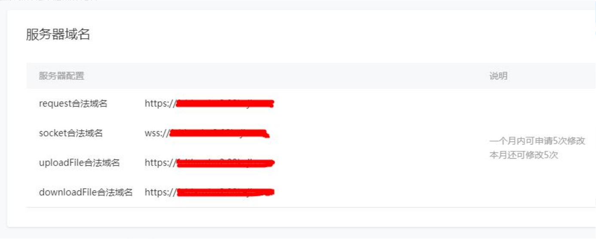
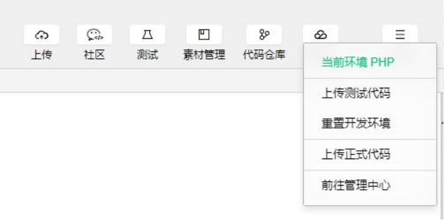
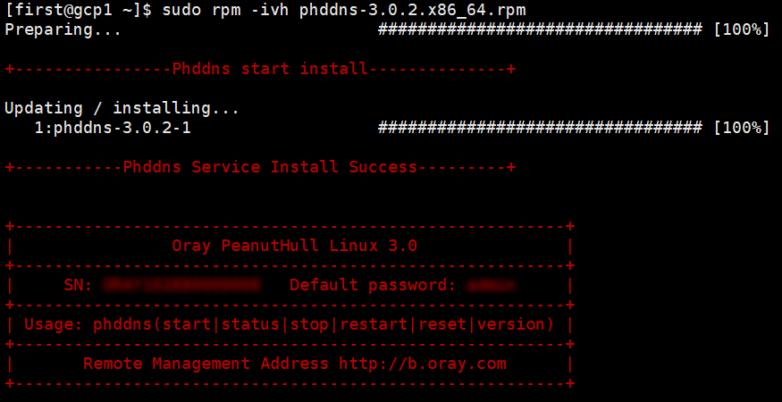
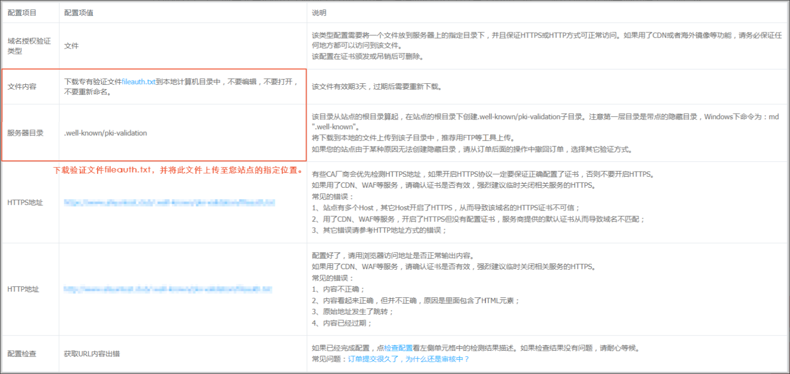

# 小程序生产环境必须要购买腾讯云作为服务器吗？

[原文链接](https://blog.csdn.net/king3062211087/article/details/83547825)

- 小程序的后端放哪里？

  后端可以放在任何其他国内服务器上，只需要绑定一个https开头的域名（二级域名也可以），然后配置好ssl数字证书（一般申请ssl证书成功之后会提示如何下载并配置ssl，如果没有请自行百度）。最后一步小程序管理中心服务器域名配置：

  

- 小程序的前端放哪里？

  只需要通过开发者工具上传即可！

  

# 搭建小程序后端

## 花生壳

> 参考资料
>
> [微信小程序个人服务器搭建](https://blog.csdn.net/ziliwangmoe/article/details/81660414)
>
> [如何在本地搭建微信小程序服务器](https://www.jianshu.com/p/49bb886fc297)

### Linux安装内网穿透工具

1. 从[官网下载页面](https://hsk.oray.com/download/)找到工具下载地址

2. 下载

   ```bash
   wget http://download.oray.com/peanuthull/linux/phddns-3.0.2.x86_64.rpm
   ```

3. 安装

   ```bash
   sudo rpm -ivh phddns-3.0.2.x86_64.rpm
   ```

4. phddns使用

   ```bash
   # 启动/查看状态/停止/重启/重置/查看版本
   phddns (start|status|stop|restart|reset|version)
   ```

   > 2020-3-13
   >
   > 不知道重置功能具体会重置什么内容，造成什么影响。
   >
   > phddns这个程序在服务器上正常运行时，*才能把域名和ip正常绑定（这里不是很确定）*，也才能使用SN码作为用户名登陆控制台。
   >
   > 如果phddns是正常的，域名列表中的 **“域名诊断”** 功能，这时域名诊断的结果会显示“域名已激活动态域名解析功能，并与客户端IP指向一致”。在控制台左侧的菜单中也会出现 **“设备信息”** 选项，点击该选项会进入[设备管理](https://b.oray.com/device/)页面并可以看到SN码等账号信息。控制台右上角账号信息中会显示服务器地址，地址后面有个“重登”，点击它可远程发送重登指令（我不知道这个重登指定到底是干嘛的）。
   >
   > 如果phddns没在服务器上正常运行，比如说像今天，在操作服务器的ssh命令行中输入 `phddns status` 返回结果 `Phddns Service Is not working ! ` 。控制台中是看不到“设备信息”的，对服务器发送的远程“重登”指令也不能正常执行。

5. 记录 **SN** 和 **登录密码**

   安装完成的输出结果中会包含 SN 码 和 登录密码，这个在后面登录花生壳远程管理页面时会用到

   

6. 使用SN码登录[远程管理页面](https://b.oray.com/passport/login)

   初次登录时会要求微信扫码绑定账号，如果之前已注册账号，可将之前的账号和这个SN账号绑定，绑定账号的密码会成为SN账号的新密码

   >  2020-1-8
   >
   >  我一开始并不知道SN码可以直接初始化成账号，所以先注册了一个，这个账号分配一个域名，但是我不知道怎么把这个域名和我机器的公网ip绑定。然后才找到 [linux的安装教程](http://service.oray.com/question/4287.html) 通过 SN码账号又获得了两个域名，SN码和注册账号绑定后，这三个域名都绑到了机器的公网ip（用这3个域名都可以访问到我的服务器）。
   >
   >  2020-1-31
   >
   >  申请证书时我使用的是 SN码 账户下的域名，但是当证书申请并配置完成过了几天之后，SN码下的域名好像被收回了。刚注册那天，**使用注册账号用户名登录**看到的是注册账号下的域名，**使用SN码做用户名登录**看到的是SN码下的域名，两个账号虽然绑定了，可以彼此切换，但感觉并是一个账号。
   >
   >  现在变成即使使用SN码登录，也会直接登录到注册账号下，只能看到注册账号分配的域名，SN码的用户名找不到了，我直接访问申请了证书的域名，浏览器也只会返回**找不到这个域名的服务器IP**，我白申请了一张证书，还浪费了好多时间去配置它 （T_T) 。
   >
   >  然后我只好再弄个域名重新配证书。我的注册账号下分配的那个域名有一串数字太难记了，我就又申请了一个壳域名。在[花生壳管理控制台域名列表](https://b.oray.com/domain/)页面点“**壳域名注册**”进入一个新的域名选择页面，只选**标准型**下面两个**有免费标记的主域名**，在上面的输入框里填写网站想叫的域名（这里填的是二级域名）。接下来点“查询”，在查询结果中选一个点击“立即注册”即可。
   >
   >  我的证书的验证方式是**文件验证**，注销证书时也需要能用域名访问到服务器才能通过验证提交注销申请。所以，那张浪费掉的证书本来是想注销掉的，但是通过域名访问不到服务器了，没法提交注销申请，只能把它扔在那等过期了。
   >
   >  2020-3-13
   >
   >  今天用SN码登录又可以看到刚注册时SN码下的域名了，用一开始申请证书的域名又可以访问到我的服务了。(＃￣～￣＃) 莫名奇妙的不能用，又莫名其妙的好了。我怀疑它和phddns程序有关，但我找不到证据。
   >
   >  感觉它很不稳定，还是趁此机会吧开始申请的那张证书注销掉，老老实实用注册账号下的域名吧。

7. 配置内网映射

   > 因为我的服务器有公网ip，不配置内网映射也可以直接用域名访问到，所以并没有实际操作这一步
   >
   > [官网参考文档](https://service.oray.com/category/126_1.html)
   >
   > [CSDN-花生壳内网穿透图文教程](https://blog.csdn.net/niaonao/article/details/91411044)

### 内网穿透

如果采用本地运行服务器程序，本地计算机一般只有内网ip，可以使用花生壳提供的内网穿透功能。

具体原理是在本地运行一个后台程序，小程序和花生壳的服务器相互通行。也就是把后台程序运行的这台机器和一个花生壳提供的域名绑定在一起。外部访问这个域名的时候，就知道这是要访问后台程序所在的这台机器。

### 花生壳二级域名

微信小程序和服务端的通行只能通过微信提供的wx.request这个函数。而这个函数内部会对访问的域名有所要求：

1. 域名必须是有备案的

2. 域名必须是https

域名备案一般需要几个星期的时间，而且步骤非常之多。虽然建议读者有空还是去做一个域名的备案，不过这里提出一个替代方案。

**花生壳在做内网窜穿透的时候，同时需要申请一个域名。这个域名是花生壳备好案了的**，比如我的域名是：

rabienrose.iicp.net:21070

而域名iicp.net是有备案信息的，个人的不同体现在二级域名rabienrose上。

另外如果自己有已经备好案的其他域名的话。可以通过CNAME把自己的域名转接到花生壳的这个域名上。这样就可以使用自己的域名做内网穿透了。不清楚的请自行了解：**域名解析CNAME**

如果要用自己的域名备案的话，推荐使用域名提供商提供的备案服务。

> 2020-05-27
>
> 本来想使用花生的免费二级域名作为服务器的域名，一是因为它的顶级域名已经备案，不需要我再额外备案，二是出于想要不花钱的目的。结果在我折腾了很久注册了两个花生壳账号，并且对两个域名完成了证书申请后，花生壳政策改了，所有绑定境外服务器的免费二级域名都会被封号，域名无法正常解析到服务器。
>
> 因为想用免费的已备案域名，还有心疼被占用的阿里云免费证书额度，我就想试试看能不能配合花生壳的内网映射工具来我的PC作为服务器。结果一用才发现花生壳的内网映射工具免费的只支持TCP协议，HTTP，HTTPS协议都需要另外付费，而且还必须年付。因此，我就彻底放弃花生壳了。
>
> 白瞎了我那两个阿里云免费证书，花生壳二级域名的条件所限我只能采用文件验证方式来完成验证，而在域名无法绑定服务器后，我连吊销证书都没法完成，这两张证书只能扔在那等过期了。总而言之，花生壳的免费服务给我的使用体验相当糟糕，感觉非常不靠谱的样子。

## 购买域名

1. 从阿里云上搜索并选择一个域名 **“加入清单”**，在 **“域名清单”** 模块点击 **“立即结算”**
2. 提交订单时需要选择**域名持有者信息**，如果已经填写过持有者信息可以直接选择；如果没有填写过，或者现有信息不适用，需要**“创建新信息模板”**，新创建的信息需要完成**“邮箱验证”** 才可继续结算，还需要填写**“实名认证”**信息等待审核，该步骤不影响结算。
3. 提交订单、完成支付，域名即购买成功。
4. 实名认证通过域名的各项功能即可正常使用。

## 域名解析配置

1. 从“域名服务” -> “域名列表” 中，“操作”列点击 “解析”
2. 进入“域名解析” -> “解析设置”，点击 “添加记录”，根据需要选择“记录类型”并设置相应的“记录值”。我的需求比较简单，直接把域名指向我的服务器公网IP即可。“记录类型”选的是“A-将域名指向一个IPV4地址”，“记录值”直接是服务器公网IP，“主机记录”填“@”将“记录值”直接绑定到主域名，也可以填写需要的子域名。
3. 启动服务器上的web程序绑定80端口，通过域名访问，可正常访问，说明配置成功。

## 域名备案

***注意：境外服务器无法备案！！！***

## 申请免费https证书

[免费SSL证书(https网站)申请](https://www.cnblogs.com/osfipin/p/freessl.html)

> 我选择的是阿里云的免费数字证书，主要是因为腾讯云“同一主域最多只能申请20张亚洲诚信品牌免费型DV版SSL证书”，花生壳分配的域名都超过这个限制了

操作步骤如下：

[阿里云教程-购买申请](https://help.aliyun.com/document_detail/144488.html)

[阿里云教程-文件验证](https://help.aliyun.com/knowledge_detail/48016.html#h2-url-2)

1. 注册阿里云，完成实名制认证

2. 产品与服务 ->  安全（云盾）-> SSL证书 -> 购买证书

3. 在证书选购页面，选择 “免费版（个人）DV” -> 立即购买

4. 购买完成后回到“SSL证书控制台 ” -> 申请证书

5. 填写申请信息，**注意：域名验证方式 要选 文件验证**，因为花生壳的免费域名我好像没办法配DNS解析

6. 申请信息提交后就会进入验证页面，这个页面中会出现一个类似下图的表格，点击 “fileauth.txt” ，会下载一个包含 **fileauth.txt文件的压缩包** 。

   

7. 部署 fileauth.txt 文件。我使用的是 spring boot 内置的 tomcat，要把 fileauth.txt 文件放到 `resources/public/.well-known/pki-validation` 然后重新打包发布。

8. 访问上面表格中生成的 http 地址，如果可以访问，点击“验证”，完成证书申请。

## 证书配置

[阿里云教程-安装PFX格式证书](https://help.aliyun.com/document_detail/98576.html)

[SpringBoot配置HTTPS](https://jiangwr.github.io/2019/03/05/SpringBoot%E9%85%8D%E7%BD%AEHTTPS/)

1. 下载证书，“SSL证书控制台 ” -> “下载” -> 下载 Tomcat 服务器的证书。

   下载的证书文件是个压缩包，包含以下两个文件：

   - 证书文件（domain name.pfx）：以.pfx为后缀或文件类型。
   - 密码文件（pfx-password.txt）：以.txt为后缀或文件类型。

   > Tomcat支持 PFX 格式和 JKS 两种格式的证书，阿里云提供 PFX 证书。如果需要 JKS 可使用 jdk 中的 keytool 转换一下。

2. 服务器配置证书。spring boot 内嵌 tomcat，把 `.pfx` 放到 resources 目录下，配置文件中添加如下设置：

   ```yml
   server:
     port: 443
     ssl:
       key-store: classpath:xxx.pfx
       key-store-password: .txt文件中的密码
       keyStoreType: PKCS12
   ```

3. 支持 http80 端口转发到 https443 端口。新增一个 HttpsConfig 类如下：

   ```java
   package org.fcx.mytool.configuration;

   import org.apache.catalina.Context;
   import org.apache.catalina.connector.Connector;
   import org.apache.tomcat.util.descriptor.web.SecurityCollection;
   import org.apache.tomcat.util.descriptor.web.SecurityConstraint;
   import org.springframework.boot.web.embedded.tomcat.TomcatServletWebServerFactory;
   import org.springframework.context.annotation.Bean;
   import org.springframework.context.annotation.Configuration;

   @Configuration
   public class HttpsConfig {
       @Bean
       public Connector httpConnector(){
           Connector connector=new Connector("org.apache.coyote.http11.Http11NioProtocol");
           connector.setScheme("http");
           //Connector监听的http的端口号
           connector.setPort(80);
           connector.setSecure(false);
           //监听到http的端口号后转向到的https的端口号
           connector.setRedirectPort(443);
           return connector;
       }
       @Bean
       public TomcatServletWebServerFactory tomcatServletWebServerFactory(Connector connector){
           TomcatServletWebServerFactory tomcat=new TomcatServletWebServerFactory(){
               @Override
               protected void postProcessContext(Context context) {
                   SecurityConstraint securityConstraint=new SecurityConstraint();
                   securityConstraint.setUserConstraint("CONFIDENTIAL");
                   SecurityCollection collection=new SecurityCollection();
                   collection.addPattern("/*");
                   securityConstraint.addCollection(collection);
                   context.addConstraint(securityConstraint);
               }
           };
           tomcat.addAdditionalTomcatConnectors(connector);
           return tomcat;
       }
   }
   ```

上述步骤完成后，后端的服务器就搭建完成了，然后把域名到 小程序后台 -> 开发 -> 开发配置 -> 服务器域名 模块配置一下就可以在小程序的前端中使用 `wx.request` 等网络通信 API 来调用了。
