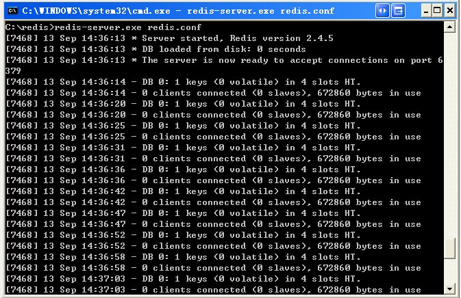
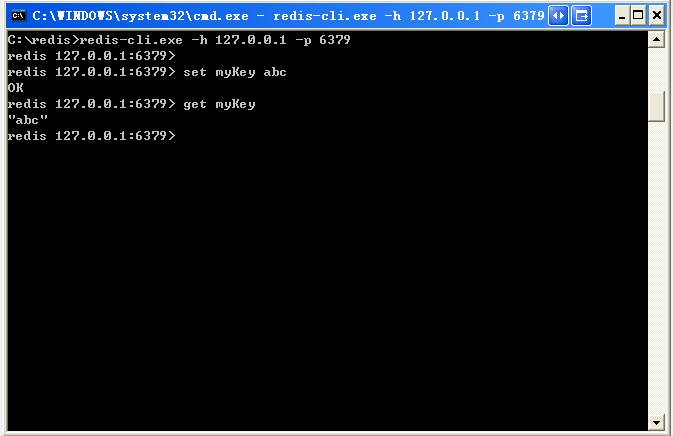
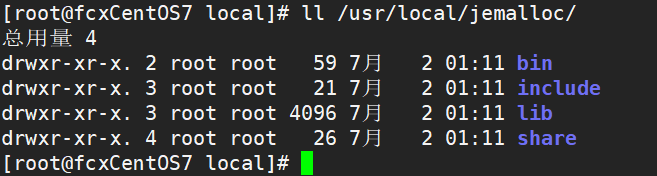

# Windows

## 使用 Windows 版的 Redis

***!!! 不推荐使用该方法，应为该版本不是官方版本，而且版本太老了。***

[下载地址](https://github.com/MicrosoftArchive/redis/releases。)

官网上不提供Windows版redis，需要到github下载

下载到的Redis支持32bit和64bit。根据自己实际情况选择，将64bit的内容cp到自定义盘符安装目录取名redis。 如 C:\reids

打开一个cmd窗口 使用cd命令切换目录到 redis安装目录 运行 `redis-server.exe redis.windows.conf` 。

如果想方便的话，可以把redis的路径加到系统的环境变量里，这样就省得再输路径了，后面的那个`redis.conf` 可以省略（），如果省略，会启用默认的。输入之后，会显示如下界面：



这时候另启一个cmd窗口，原来的不要关闭，不然就无法访问服务端了。

切换到redis目录下运行 `redis-cli.exe -h 127.0.0.1 -p 6379 `。

> 注：直接使用 redis-cli.exe 会在get时无法显示原始的中文字符，可加上--raw

设置键值对 `set myKey abc`

取出键值对 `get myKey`



## 使用 WSL 运行 Linux 版 Redis（推荐）

>参考资料
>
>[Running Redis on Windows 10 – Part I of III](https://redislabs.com/blog/redis-on-windows-10/)

WSL (Windows Subsystem for Linux) 相当于在 Windows 系统内部构建一个 Linux 的子系统，WSL 2 基本可支持所有 Linux 程序，它的运行速度比虚拟机要快，而且更节约系统资源，使用起来也更简单，所以推荐使用该方法。

安装步骤：

1. 先启用 WSL，安装 Linux 发行版，具体步骤参见“[Windows --> PowerShell --> 常用命令 --> 启用可选功能 --> WSL](../../Windows/PowerShell.md)”章节
2. 启动 Linux 发行版，在启动的命令行窗口中按在 Linux 中安装的方法安装。

# Linux

## 下载源码编译安装

> 参考资料
>
> [redis download](https://redis.io/download)
>
> [Linux下Redis的安装和部署](https://www.cnblogs.com/wangchunniu1314/p/6339416.html)
>
> [Linux 下的 Redis 安装 && 启动 && 关闭 && 卸载](https://www.cnblogs.com/java-wp/p/7885848.html)

优点：可以下载最新版的 redis ，且自主程度比较大，可以自己决定 redis 的安装位置、配置文件位置、服务配置；缺点：操作起来比较麻烦。

***!!! 源码包中的 README.md 文件包含安装和启动的关键操作说明***

1. 下载

   ```bash
   $ wget http://download.redis.io/releases/redis-<版本号>.tar.gz 
   ```

2. 解压

   ```bash
   $ tar xzf redis-<版本号>.tar.gz
   $ cd redis-<版本号>
   ```

3. 编译redis源码

   ```bash
   $ make
   ```

4. 将可执行文件安装到 `/usr/local/bin` 目录下**（不需要配置环境变量）**

   ```bash
   $ make install
   ```

   为方便管理和使用，可将可执行文件和配置文件放到独立的目录中**（需要配置环境变量）**

   - redis-benchmark  redis性能检测工具
   - redis-check-rdb 检查rbd日志的工具
   - redis-sentinel  Redis集群的管理工具 监控多个master-slave集群，发现master宕机后能进行自动切换
   - redis-check-aof  检查aof日志的 工具
   - redis-cli	客户端
   - redis-server	服务端
   
   指定 `PREFIX` 参数
   
   ```bash
   make PREFIX=<自定义路径> install
   ```
   
   然后将<自定义路径>配置到环境变量中

5. 直接使用 `redis-server` 启动 Redis 数据库**（不推荐）**

   ```bash
   $ redis-server
   ```

   **默认非守护进程启动**，断开ssh连接 或 ctrl+c 终止程序，默认关闭程序后会在当前目录先创建dump.rdb文件。

   启动时指定配置文件（必须使用配置文件的全路径）:

   ```bash
   $ redis-server <配置文件所在路径>/redis.conf
   ```

   将 `redis.conf` 中 `daemonize` 的值改为 `yes` ，以**守护进程启动**，修改 `dir` 的值，指定**数据文件保存目录**。

   使用reids 客户端命令,来正常关闭守护进程的redis:

   ```bash
   $ redis-cli shutdown
   ```

   如果停止不了,则采取杀死进程的方式：

   ```bash
   $ kill -9 PID
   ```

6. 启动客户端

   ```bash
   $ redis-cli
   redis> set foo bar
   OK
   redis> get foo
   "bar"
   ```
   
7. 安装 redis 服务**（可选，但推荐安装）**

   使用源码包中的 `utils` 目录下的 `install_service.sh` 脚本安装服务：

   ```bash
   $ ./install_server.sh
   ```

   安装过程中可以设置服务的端口、配置文件地址、日志文件地址、数据文件地址、可执行文件地址。设置完成后该脚本会根据你的配置在 `/etc/init.d/` 生成名为 `redis_<端口号>` 的服务启动脚本，还会将服务添加到启动项并启动服务。

   有了服务启动脚本，就可以使用 `service` 命令启动、关闭 redis 服务，并查看服务状态**（推荐运行方式）**：

   ```bash
   $ service redis_<端口号> start|stop|restart|status
   ```

***!!! 注意事项：提前安装gcc编译器、jemalloc***

http://www.ywnds.com/?p=6957

编译错误：

zmalloc.h:50:31: 致命错误：jemalloc/jemalloc.h：没有那个文件或目录

原因：Redis 2.4版本之后，默认使用jemalloc来做内存管理，因为jemalloc被证明解决fragmentation problems（内存碎片化问题）比libc更好。默认没有安装jemalloc。

解决方案1：make MALLOC=libc #执行make命令时指定使用libc

解决方案2：如果想用jemalloc，安装jemalloc即可。

下载、解压、编译jemalloc源码

```bash
$ wget https://github.com/jemalloc/jemalloc/releases/download/5.1.0/jemalloc-5.1.0.tar.bz2
$ tar xvf jemalloc-5.1.0.tar.bz2
$ cd jemalloc-5.1.0
$ ./configure --prefix=/usr/local/jemalloc
$ make && make install
```

安装完成后 `/usr/local/jemalloc/` 目录下会出现以下几个目录:



然后再编译redis的时候指定MALLOC，如下：

```bash
$ make MALLOC=/usr/local/jemalloc/lib
```

## 软件包管理工具安装

优点：操作简单，傻瓜式安装可执行文件及服务，卸载升级也很简单；缺点：不一定能安装最新版，只能安装仓库有的版本，可控程度小，安装位置、服务名称等无法自定义。

以 Ubuntu 为例的安装过程如下，如果是其他 Linux 发行版，替换成相应的软件包管理工具即可，eg：RedHat 系的 dnf。

1. 更新仓库索引（可选）

   ```bash
   $ sudo apt update
   ```

2. 更新可更新的已安装软件（可选）

   ```bash
   $ sudo apt upgrade
   ```

3. 安装 redis-server

   ```bash
   $ sudo apt install redis-server
   ```

4. 安装完成后查看相关安装位置

   ```bash
   $ dpkg -L redis-server
   ```

   结果如下：

   ```bash
   /.
   /etc
   /etc/default
   /etc/default/redis-server
   /etc/init.d
   /etc/init.d/redis-server	# 服务脚本
   /etc/logrotate.d
   /etc/logrotate.d/redis-server
   /etc/redis
   /etc/redis/redis.conf	# 配置文件
   /lib
   /lib/systemd
   /lib/systemd/system
   /lib/systemd/system/redis-server.service
   /lib/systemd/system/redis-server@.service
   /usr
   /usr/bin	# 6个主要可执行文件
   /usr/share
   /usr/share/doc
   /usr/share/doc/redis-server
   /usr/share/doc/redis-server/MANIFESTO.gz
   /usr/share/doc/redis-server/README.md.gz
   /usr/share/doc/redis-server/copyright
   /usr/share/man
   /usr/share/man/man1
   /usr/share/man/man1/redis-server.1.gz
   /usr/bin/redis-server
   /usr/share/doc/redis-server/00-RELEASENOTES.gz
   /usr/share/doc/redis-server/NEWS.Debian.gz
   /usr/share/doc/redis-server/changelog.Debian.gz
   ```

5. 后台启动服务

   ```bash
   $ sudo service redis-server restart
   ```
