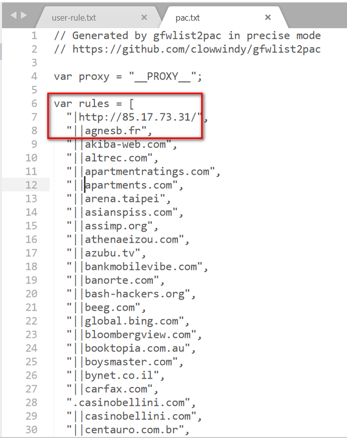
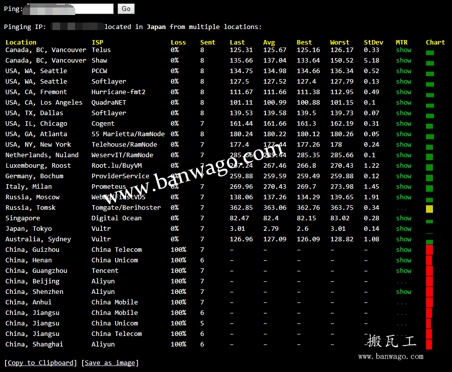

# SS
Windows客户端地址  
https://github.com/shadowsocks/shadowsocks-windows

Android客户端地址  
https://github.com/shadowsocks/shadowsocks-android

## Windows客户端配置

### 服务器配置
根据服务器的信息，在客户端配置好以下几项：  
  

### PAC配置
  

**"编辑本地 PAC 文件..."**，打开本地的 pac.txt 文件所在目录（一般会和Shadowsock.exe在同一路径下），第一次会自动创建一份。rules中定义了所有的访问规则。  


**“从 GFWList 更新本地 PAC”**，会用远程规则更新本地的gfwlist.js（在 ss_win_temp 目录下）和 pac.txt，如果之前修改过pac.txt，会覆盖之前修改。

**"编辑 GFWList 的用户规则"**，打开本地的 user-rule.txt 文件所在目录（一般会和Shadowsock.exe在同一路径下），第一次会自动创建一份。

**最终的pac 文件**是根据 gfwlist.js 和 user-rule.txt 两个文件共同生成的，如果用户想要添加某些网站进入 PAC，最好的方式是写入 user-rule.txt 这个文件，而不是修改 gfwlist.js 或 pac.txt 这个文件，因为gfwlist.js这个文件会时不时的和 github 上做同步，可能会造成已有的修改会被覆盖掉。

**user-rule文件的语法规则**，详见 adblock 过滤规则 <https://adblockplus.org/en/filter-cheatsheet>
自定义代理规则的设置语法与pac.txt rules 中相同，但是 user-rule.txt 中每一行表示一个URL通配符。
1. 通配符支持，如 `*.example.com/*` 实际书写时可省略`*` 如`.example.com/` 意即`*.example.com/*`

2. 正则表达式支持，以\开始和结束， 如 `\[\w]+:\/\/example.com\`

3. 例外规则 @@，如`@@*.example.com/*` 满足@@后规则的地址不使用代理

4. 匹配地址开始和结尾 |，如 `|http://example.com`、`example.com|`分别表示以`http://example.com`开始和以`example.com`结束的地址

5. || 标记，如`||example.com` 则`http://example.com`、`https://example.com`、`ftp://example.com`等地址均满足条件

6. 注释 ! 如 ! Comment

**user-rule.txt中的规则并不能直接被shadowsocks使用**，如要添加到user-rule.txt中的规则生效，你还要执行下面重要的一步：更新本地的PAC，更新后user-rule.txt中的自定义规则会添加到PAC.txt文件内。（备注：**每次编辑完user-rule.txt后，均需执行“从GFWList更新本地PAC”**，使本次规则也生效。）

## 服务器端配置

https://github.com/shadowsocks/shadowsocks/wiki

### 安装

Debian / Ubuntu:
```shell
apt-get install python-pip
pip install shadowsocks
```
CentOS:
```shell
yum install python-setuptools && easy_install pip
pip install shadowsocks
```

### 配置文件
不会自动生成，需要手动创建，通常在 /etc/shadowsocks.json ，可自定义
```json
{
	"server":"my_server_ip",
	"server_port":8388,
	"local_address": "127.0.0.1",
	"local_port":1080,
	"password":"mypassword",
	"timeout":300,
	"method":"aes-256-cfb",
	"fast_open": false
}
```
| Name |  Explanation |
| --- | --- |
| server |  the address your server listens 服务器监听地址 |
| server_port | server port 服务器访问端口 |
| local_address | the address your local listens |
| local_port | local port |
| password | password used for encryption 密码 |
| timeout | in seconds |
| method | default: "aes-256-cfb", see Encryption  加密方式 |
| fast_open | use TCP_FASTOPEN, true / false |
| workers | number of workers, available on Unix/Linux |

### 后台运行或停止(通过配置文件)
```shell
ssserver -c /etc/shadowsocks.json -d start
ssserver -c /etc/shadowsocks.json -d stop
```
### 问题排查
- 可以检查服务器地址及端口能否访问  
https://www.infobyip.com/tcpportchecker.php
- 查看服务器监听的ip和端口  
```shell
netstat -lntp
```
- [检查服务ip是否被墙](https://www.banwago.com/1265.html)
	* https://ping.chinaz.com
	
	输入我们需要检测的IP地址，然后选择“海外”如图：  
	
	
	
	输入需要检测的IP地址，点击“ping检测”
	
	1. 如果出现全部超时，如下图
	
	
	
	这种情况基本可以确定你的IP没有被封，可能的原因就是没有开机。
	解决办法：开机或者重启。
	
	2. 如果国外能ping通，国内ping不通，如图：
	
	
	
	
	
	如果是这样的话，国外能通，国内却不通了，那么你的IP已经可以确定被墙了。
	
	* https://ping.pe
	
	输入IP地址，如图
	
	
	
	点击“Go”进行检测
	
	  
	
	上面为国外监测点，下面为国内监测点，可以看到国外都通，国内全红“表示不通”，这个已经说明你的搬瓦工IP被墙了。

总结：
1. 国外+国内都不通：说明IP没有被封，可以检测你的VPS解决。
2. 国外通+国内不通，很遗憾你的搬瓦工IP被封了。

----

# SSR

Windows客户端地址  
https://github.com/HMBSbige/ShadowsocksR-Windows

Android客户端地址  
https://github.com/doio/Akkariiin-shadowsocksr-android


