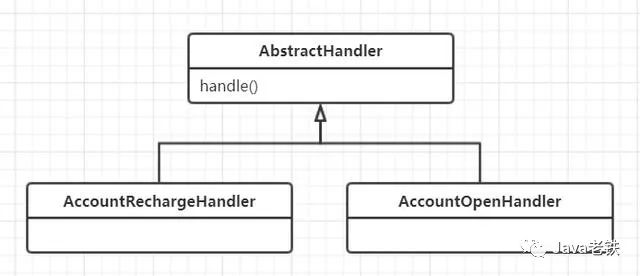

# 状态设计模式--冗长判断分支的优化思路                


**导读：**我们在实际项目开发的过程中常常会因处理多状态的情况导致代码中产生了大量的if-else，过多的判断语句及嵌套会导致一个方法变得很冗长，而且当新增状态时需要改动代码逻辑也是违背了设计模式中开放-封闭原则。本文将通过一个优化的Demo，**主要运用状态设计模式优化if-else语句并使其遵循开放-封闭原则。其中还会运用到包括：IOC容器、BeanFactoryPostProcessor后置处理器、自定义注解、ResourceLoaderAware资源加载、反射等知识概念**。通过本案例希望能给朋友们带来一些代码优化的思路和启发，如果觉得本例有不足之处或者有更好的优化建议欢迎提出，共同讨论与进步。

# 场景

后台系统提供一个通用处理审核结果的方法，该接口根据审核类型和审核结果进行相应的后续逻辑处理。类图如下：


CheckResultHandleManager是一个审核结果处理类，其提供了一个deal() 方法用于根据审核类型和审核结果进行相应的后续逻辑处理。

**审核类型枚举（CheckTypeEnum）**

- 账户开户（ACCOUNT_OPEN）
- 账户禁用（ACCOUNT_DISABLE）
- 账户启用（ACCOUNT_ENABLE）
- 账户充值（ACCOUNT_RECHARGE）
- 账户提款（ACCOUNT_DRAWING）
- 账户绑卡（ACCOUNT_BINDCARD）

**审核结果枚举（CheckReusltEnum）**

- 审核通过（SUCCESS）
- 审核不通过（FAIL）

由于不同的审核类型后续处理方式不同，如账户开户要做的后续处理为创建一条账号记录，而账户充值则是变动对应账户的余额及新增明细等。因为审核类型很多处理情况又不同，所以会导致代码产生很多的if -else判断，如下所示：

```
/**
* 审核结果处理类
*/
@Component
public class CheckResultHandleManager  {
  
  public void deal(CheckResultReq req) {
            //审核类型为--账户开户
           if (CheckTypeEnum.ACCOUNT_OPEN.getCode().equals(req.getCheckType())){
                 if (CheckResultEnum.SUCCESS.getCode().equals(req.getResult())){
                    //新增账户
                 } else {
                   log.info("审核不通过");
                 }
           }
    			 //审核类型为-账户充值
    			else
             if (CheckTypeEnum.ACCOUNT_RECHARGE.getCode().equals(req.getCheckType())){
                  if (CheckResultEnum.SUCCESS.getCode().equals(req.getResult())){
                       //增加账户余额
               				//新增交易明细
                   } else {
                     log.info("审核不通过");
                   }
             }
          ......此处省略其他的 if-else
}
```

# 引入状态设计模式

上面deal()方法中之所以出现很多的判断分支，其本质原是因为“状态”太多。我们可以对其进行优化，优化的方案可选用设计模式中的状态设计模式，基础的**状态设计模式**类图如下：


**简单描述：**抽取一个"状态"抽象类并提供一个抽象handle()方法，接着把"状态"枚举改为多个继承抽象类的“状态”实现类，在各个实现类中进行各自的逻辑判断和处理。这么做虽然会导致增加了很多的类，但是优势在于其遵循了开放-封闭原则，当有新“状态”加入时只需要新增类，而不用去变动到deal()方法中的逻辑。

# 基于状态设计模式对代码进行优化的思路

在应用状态设计模式的同时，我们再结合自定义注解、扫描器、反射等技术使代码变得更加灵活。即将新增以下这些类：


**优化大致思路如下：**

- 应用状态设计模式，创建一个 审理类型 抽象类，抽象类提供一个handle()方法。将每一个审核类型都创建为一个实现类，继承审理类型抽象类

- 自定义一个HandlerType注解，每一个 审核类型 实现类都加上该注解，注解值为 审核类型 对应的枚举值

- 创建一个HandlerContext处理上下文，其作用：1、提供一个HashMap用于存放信息 2、提供一个getInstance()获取实例Bean的方法

- 创建一个Processer类实现BeanFactoryPostProcessor用于做预处理（1、扫描获取符合条件的Class信息并存入HashMap 2、创建HandlerContext并交由Spring管理）

- 最后修改CheckResultHandleManager的deal()方法，化繁为简

# 实际操作

下面将划分为四步进行代码优化

- 状态设计模式的应用 + 标记上自定义注解
- 创建一个处理上下文
- 实现BeanFactoryPostProcessor的后置处理器进行预处理
- 优化CheckResultHandleManager的deal()方法中的逻辑

**一、状态设计模式的应用 + 自定义注解**




1、建立一个自定义注解

```
@Target({ElementType.TYPE})
@Retention(RetentionPolicy.RUNTIME)
@Documented
@Inherited
public @interface HandlerType {
    String value();
}
```

2、创建一个 审核类型 抽象类

```
/**
 * @Description: 审核类型 抽象类
 */
public abstract class AbstractHandler {
   //抽象处理方法
    abstract public void handle(CheckResultReq req);
}
```

3、将每一个 审核类型 都创建为一个实现类并继承抽象类（以账户开户为例子），同时加上自定义注解

```
/**
 * @Description: 账户开户
 */
@Slf4j
@Component
@HandlerType("ACCOUNT_OPEN")
public class AccountOpenHandler extends AbstractHandler {
     
    //将该状态的处理逻辑移到类中处理
    @Override
    public void handle(CheckResultReq req) {
        // 审核通过
        if (CheckTypeEnum.ACCOUNT_OPEN.getCode().equals(req.getCheckType())){
             //新增账户逻辑
        }else {
           log.info("审核不通过");
        }
}
```

**目的：**通过使用状态设计模式后将判断逻辑分散到多个审核类型实现类中，每个实现类专注于处理自己的逻辑，而自定义注解则是为后续操作做准备。

**二、创建一个处理上下文**

- 创建一个处理器上下文（其主要职责为存放信息及提供一个实例化Bean的方法）
- 创建一个GetBeanTool工具类（提供一个方法，使非spring管理的类通过该工具可获取注册到spring的Bean）

创建一个获取Spring容器中Bean的工具。Tip：由于非Spring管理的类没有被component-scan扫描加载所以没有注入所依赖的Bean。非Spring管理的类想获取容器内的Bean可通过实现ApplicationContextAware接口获取Spring容器，再通过getBean()的方式获取

```
/**
 * @Description: 工具的用途--使非spring管理的类通过该工具可获取注册到spring的Bean
 */
@Component
public class GetBeanTool implements ApplicationContextAware {

    private static ApplicationContext applicationContext;

    @Override
    public void setApplicationContext(ApplicationContext context) throws BeansException {
        if (applicationContext == null) {
            applicationContext = context;
        }
    }
    
    public static <T> T getBean(Class<T> clazz) {
        return applicationContext.getBean(clazz);
    }

}
```

创建一个处理上下文

```
/**
 * @Description: 处理器容器
 */

public class HandlerContext {
 
  //存放信息
  private Map<String, Class> handlerMap;

    public HandlerContext(Map<String, Class> handlerMap) {

    }

   //获取Bean
    public AbstractHandler getInstance(String type) {
        Class clazz = handlerMap.get(type);
        if (clazz == null) {
            throw new IllegalArgumentException("not found handler for type: " + type);
        }
        return (AbstractHandler)applicationContext.getBean(clazz);
    }
}
```

**目的：**通过借助 处理上下文 来实现类型管理和获取Bean。

**三、实现BeanFactoryPostProcessor的后置处理器进行预处理**

- 创建一个HandlerProcessor并实现BeanFactoryPostProcessor
- 扫描审核类型实现类，并将信息装载入HashMap中
- 创建一个HandlerContext容器，将HashMap存入容器中，并将HandlerContext容器交给Spring管理


创建一个HandlerProcessor后置处理器，Tip：BeanFactoryPostProcessor是spring容器启动时暴露给用户的一个扩展点，允许用户在spring创建bean之前做修改或动态添加bean等

```
/**
 * @Description: BeanFactory后置处理器
 */
@Component
public class HandlerProcessor implements BeanFactoryPostProcessor {
 
    private static final String HANDLER_PACKAGE = "这里指定要扫描的包路径";

    //扫描指定路径下的所有拥有HandlerType注解的class，并将信息存入到一个HashMap<String,Class>中
    @Override
    public void postProcessBeanFactory(ConfigurableListableBeanFactory beanFactory) throws BeansException {
      //自定义设定HashMap初始容量，阅读HashMap源码可得知最好预先指定hashmap的size为2的整数次幂次方
      //关于HashMap这里不做详解，不过其组成结构和扩容机制是不错的知识点，感兴趣的朋友可以深入了解学习
      Map<String, Class> handlerMap = new HashMap(8);
        ClassScaner.scan(HANDLER_PACKAGE, HandlerType.class).forEach(clazz -> {
            String type = clazz.getAnnotation(HandlerType.class).value();
            handlerMap.put(type, clazz);
        });
        //创建一个HandlerContext容器，并将HandlerContext
        HandlerContext context = new HandlerContext(handlerMap);
        beanFactory.registerSingleton(HandlerContext.class.getName(), context);
    }

}
```

通过该处理器在Spring启动时会扫描指定包下包含指定注解的类，并将信息装载入HashMap中。创建一个 处理上下文 同时交由Spring管理，可方便其他Bean方便地注入使用。下面讨论关于扫描器ClassScaner的详情：

```
/**
* 类扫描器
*/
public class ClassScaner implements ResourceLoaderAware {

    private final List<TypeFilter> includeFilters = new LinkedList<TypeFilter>();
    private final List<TypeFilter> excludeFilters = new LinkedList<TypeFilter>();

    private ResourcePatternResolver resourcePatternResolver；
    private MetadataReaderFactory metadataReaderFactory；

     //扫描方法
    @SafeVarargs
    public static Set<Class<?>> scan(String[] basePackages, Class<? extends Annotation>... annotations) {
        ClassScaner cs = new ClassScaner();
        
        //设定要过滤的注解，存入列表中
        if (ArrayUtils.isNotEmpty(annotations)) {
            for (Class anno : annotations) {
                cs.addIncludeFilter(new AnnotationTypeFilter(anno));
            }
        }
   
        Set<Class<?>> classes = new HashSet<>();
        //扫描指定包路径下的类，将符合条件的Class存入Set集合中
        for (String s : basePackages) {
            classes.addAll(cs.doScan(s));
        }

        return classes;
    }

    @SafeVarargs
    public static Set<Class<?>> scan(String basePackages, Class<? extends Annotation>... annotations) {
        return ClassScaner.scan(StringUtils.tokenizeToStringArray(basePackages, ",; \t\n"), annotations);
    }

    public final ResourceLoader getResourceLoader() {
        return this.resourcePatternResolver;
    }

    @Override
    public void setResourceLoader(ResourceLoader resourceLoader) {
        this.resourcePatternResolver = ResourcePatternUtils
                .getResourcePatternResolver(resourceLoader);
        this.metadataReaderFactory = new CachingMetadataReaderFactory(
                resourceLoader);
    }

    public void addIncludeFilter(TypeFilter includeFilter) {
        this.includeFilters.add(includeFilter);
    }

    public void addExcludeFilter(TypeFilter excludeFilter) {
        this.excludeFilters.add(0, excludeFilter);
    }

    public void resetFilters(boolean useDefaultFilters) {
        this.includeFilters.clear();
        this.excludeFilters.clear();
    }
    
    //执行扫描
    public Set<Class<?>> doScan(String basePackage) {
        Set<Class<?>> classes = new HashSet<>();
        try {
            String packageSearchPath = ResourcePatternResolver.CLASSPATH_ALL_URL_PREFIX
                    + org.springframework.util.ClassUtils
                    .convertClassNameToResourcePath(SystemPropertyUtils
                            .resolvePlaceholders(basePackage))
                    + "/**/*.class";
            //获取指定路径下的资源
            Resource[] resources = this.resourcePatternResolver
                    .getResources(packageSearchPath);
            
          //遍历，将拥有指定注解的Class加入到Set集合中
            for (int i = 0; i < resources.length; i++) {
                Resource resource = resources[i];
                if (resource.isReadable()) {
                    MetadataReader metadataReader = this.metadataReaderFactory.getMetadataReader(resource);
                    if ((includeFilters.size() == 0 && excludeFilters.size() == 0) || matches(metadataReader)) {
                        try {
                            classes.add(Class.forName(metadataReader
                                    .getClassMetadata().getClassName()));
                        } catch (ClassNotFoundException e) {
                            e.printStackTrace();
                        }
                    }
                }
            }
        } catch (IOException ex) {
            throw new BeanDefinitionStoreException(
                    "I/O failure during classpath scanning", ex);
        }
        return classes;
    }

    protected boolean matches(MetadataReader metadataReader) throws IOException {
        for (TypeFilter tf : this.excludeFilters) {
            if (tf.match(metadataReader, this.metadataReaderFactory)) {
                return false;
            }
        }
        for (TypeFilter tf : this.includeFilters) {
            if (tf.match(metadataReader, this.metadataReaderFactory)) {
                return true;
            }
        }
        return false;
    }

}
```

**四、优化CheckResultHandleManager的deal()方法**


```
public class CheckResultHandleManager {
    @Resource
    private HandlerContext handlerContext;
  
    //化繁为简
    public void deal(CheckResultReq req) {
        AbstractHandler handler = handlerContext.getInstance(dto.getAuditType());
 				handler.handle(dto);
    }
}
```

# 最后

至此整个优化过程结束，优化目的是为减少deal()方法中的判断分支，代码虽然变复杂但其遵循开放-封闭原则，变得更佳灵活且可扩展。其中结合了后置处理器用于预操作、实现ApplicationContextAware用于获取注册在Spring容器中Bean、实现ResourceLoaderAware来获取资源制作类扫描器等。在优化的过程中也涉及到了很多知识点，是一个不错的成长方式。以上例子的优化方式不一定在其他地方是最优解决方案，需要结合实际场景对优化方案进行调整才能达到优化效果。优化并不是代码越复杂越好，而是使其更具灵活和拓展性。