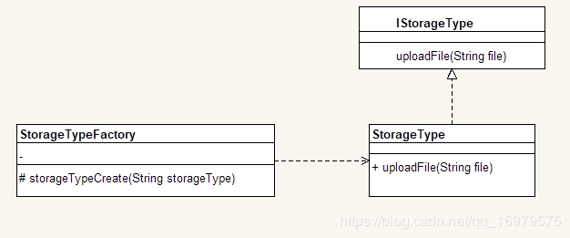

# 如何使用设计模式优化 if else

[原文地址](https://www.bianchengquan.com/article/134946.html)

> 超过 3 层的 if-else 的逻辑判断代码可以使用卫语句、策略模式、状态模式等来实现。—— 阿里巴巴java开发手册@[toc]

# 需求：

文件上传功能是一个常用的系统功能。那么上传后的文件保存到哪里呢？不同公司综合不同因素，可能会打算把文件上传到不同的服务器中，比如：服务器本地，传输到 ftp 服务器，FastDFS 服务器，hdfs 服务器等。

## if else

一般的话条件判断我们使用的是if else

```
/**
 * if else 版本的上传文件代码
 */
public class FileClient{

    private final static String LOCAL = "local";
    private final static String FTP = "ftp";
    private final static String FASTDFS = "fastdfs";
    private final static String HDFS = "hdfs";


    /**
     * 上传文件
     *
     * @param storageType 文件存储方式
     * @param file        文件
     */
    public void uploadFile(String storageType, String file) {
        if (storageType.equals(LOCAL)) {
            System.out.println("文件" + file + "已上传到 本地服务器");
        } else if (storageType.equals(FTP)) {
            System.out.println("文件" + file + "已上传到 ftp服务器");
        } else if (storageType.equals(FASTDFS)) {
            System.out.println("文件" + file + "已上传到 fastdfs服务器");
        } else if (storageType.equals(HDFS)) {
            System.out.println("文件" + file + "已上传到 hdfs服务器");
        } else {
            System.out.println("输入的文件存储类型错误");
        }
    }
    
    public static void main(String[] args) {
        FileClient fileClient = new FileClient();
        fileClient.uploadFile("hdfs","ifelse.txt");
    }
}
```

## 卫语句

代码中大量的 if else 语句让人看着着实觉得眼花，并且在读代码的时候，容易自然地走完整段代码。因此出现了卫语句，用来简化一下代码查看时需要的处理量。

```
    /**
     * 上传文件
     *
     * @param storageType 文件存储方式
     * @param file        文件
     */
    public void uploadFileWithoutElse(String storageType, String file) {
        if (storageType.equals(LOCAL)) {
            System.out.println("文件" + file + "已上传到 本地服务器");
            return;
        } 
        if (storageType.equals(FTP)) {
            System.out.println("文件" + file + "已上传到 ftp服务器");
            return;
        } 
        if (storageType.equals(FASTDFS)) {
            System.out.println("文件" + file + "已上传到 fastdfs服务器");
            return;
        } 
        if (storageType.equals(HDFS)) {
            System.out.println("文件" + file + "已上传到 hdfs服务器");
            return;
        } 
        System.out.println("输入的文件存储类型错误");
    }
```

去掉了 else 后，代码也变得比较有段落感，看起来更舒服了些。

# 需求变更：给我加一个方式，上传到七牛云

这里代码很简单，我们只需要增加 if 或者 if else 条件就好了，但是这样整个 FileUtils 文件的代码都会有改动，因此这个时候新的方法出现了。

下面讲一下使用设计模式来减少 if else 的情况：

## 简单工厂模式

简单工厂模式属于创建型模式又叫做静态工厂方法模式，它属于类创建型模式。**在简单工厂模式中，可以根据参数的不同返回不同类的实例。** 简单工厂模式专门定义一个类来负责创建其他类的实例，被创建的实例通常都具有共同的父类。





这里我们把各个存储方式的上传行为给抽象出来：

- 抽象

```
	/**
	 * 抽出各个方式共同的行为接口：上传文件
	 */
	public interface IStorageType {
	    void uploadFile(String file);
	}
```

- 简单工厂（静态工厂）

```
/**
 * 简单工厂
 */
public class StorageTypeFactory {

    private final static String LOCAL = "local";
    private final static String FTP = "ftp";
    private final static String FASTDFS = "fastdfs";
    private final static String HDFS = "hdfs";

   public static IStorageType storageTypeCreate(String storageType) { 
        IStorageType iStorageType = null;
        switch (storageType) {
            case LOCAL:
                iStorageType = new LocalStorageType();
                break;
            case FTP:
                iStorageType = new FtpStorageType();
                break;
            case FASTDFS:
                iStorageType = new FastDfsStorageType();
                break;
            case HDFS:
                iStorageType = new HdfsStorageType();
                break;
        }
        return iStorageType;
    }

}
```

- 具体的上传方式（ 以 hdfs 为例，其他类似）

```
public class HdfsStorageType implements IStorageType {
    @Override
    public void uploadFile(String file) {
        System.out.println("文件" + file + "已上传到 hdfs服务器");
    }
}
```

- 客户端调用

```
/**
 * 简单工厂模式 版本的上传文件代码
 */
public class FileClient {

    public static void main(String[] args) {
        IStorageType iStorageType = StorageTypeFactory.storageTypeCreate("hdfs");
        iStorageType.uploadFile("simpleFactory.txt");
    }
}
```

回到场景中：这时候我们一旦要增加一个七牛云的存储方式，我们就可以直接在工厂里加一个 switch 条件，再加一个具体的七牛云存储行为即可。

- 优点：

1. 客户端可以在更改参数的条件下，不用变更其他代码，客户端不负责创建具体的存储方式，减少了对具体的存储方式的依赖，而是把这这件事交给了工厂。体现了职责单一原则。
2. 当增加其他方式或者减少其他方式时，可以直接通过增加类以及 switch 条件，不会影响到具体的逻辑代码，修改较为简单。

- 缺点 （即使这里违背了**开闭原则**，因为在对拓展开放时，对修改也进行了开放。个人觉得耦合到的代码量并没有特别大，个人有时候还是会考虑以这样的方式进行修改代码）

简单工厂模式适合的场景： 1、判断分支数量不多，或者判断逻辑简单 2、客户端只需记住参数，不用关系具体的实现细节

参考文档：

[工厂模式--简单工厂模式](https://www.jianshu.com/p/5cb52d84bd6d)

## 策略模式

在《大话设计模式》中对策略模式的解释是这样子的：它通过定义和封装算法，使得算法之间可以相互替换，让算法的变化不会影响到使用算法的用户。 这句话理解起来有些拗口，我们先按照策略模式实现一下代码：

- 策略

```
	public abstract class StorageStrategy{
	    public abstract void uploadFile(String file);
	}
```

- 具体策略

```
public class FtpStorageStrategy extends StorageStrategy {
    @Override
    public void uploadFile(String file) {
        System.out.println("文件" + file + "已上传到 ftp服务器");
    }
}
```

- 策略上下文

```
/**
 * 策略模式的上下文。
 * 这里策略模式让我觉得有些类似像代理模式，于是去查了一下。
 * 简单代理模式与策略模式在功能上的很大的区别是：
 *
 * 简单代理模式中，代理类知道被代理类的行为，因为代理类与被代理类实现的是同一个接口，因此代理类与被代理类的结构是相同的；
 *
 * 而策略模式中，策略容器并不知道内部策略的详细信息，因为容器并没有实现与内部策略相同的接口，
 * 即容器与内部策略只是简单的组合关系，容器只是将内部策略的行为抽取出来，进行了统一的实现。
 *
 */
public class StorageContext {

    private StorageStrategy storageStrategy;

    public StorageContext(StorageStrategy storageStrategy) {
        this.storageStrategy = storageStrategy;
    }

    public void uploadFileAction(String file){
        storageStrategy.uploadFile(file);
    }
}
```

### 思考一：代理模式和策略模式的区别：

上下文看着和代理模式很像，实际上代理模式和策略模式的区别如下：

1. 简单代理模式中，代理类知道被代理类的行为，因为**代理类与被代理类实现的是同一个接口，因此代理类与被代理类的结构是相同的**；
2. 而策略模式中，策略容器并不知道内部策略的详细信息，因为容器并没有实现与内部策略相同的接口， 即容器与内部策略只是简单的组合关系，容器只是将内部策略的行为抽取出来，进行了统一的实现。

- 客户端调用

```
/**
 * 策略模式 版本的上传文件代码
 */
public class FileClient {

    private final static String LOCAL = "local";
    private final static String FTP = "ftp";
    private final static String FASTDFS = "fastdfs";
    private final static String HDFS = "hdfs";

    public static void main(String[] args) {
        StorageContext storageContext = null;
        //模拟入参
        String storageType = "ftp";
        switch (storageType) {
            case LOCAL:
                //客户端需要知道具体有哪些策略，能做什么。但是不需要知道策略具体怎么做
                storageContext = new StorageContext(new LocalStorageStrategy());
                break;
            case FTP:
                storageContext = new StorageContext(new FtpStorageStrategy());
                break;
            case FASTDFS:
                storageContext = new StorageContext(new FastDfsStorageStrategy());
                break;
            case HDFS:
                storageContext = new StorageContext(new HdfsStorageStrategy());
                break;
        }
        storageContext.uploadFileAction("strategy.txt");
    }
}
```

### 思考二：

这里实际上是把 if else 的逻辑交给调用方（客户端）去处理了（用了switch），很不解，虽然说具体的策略解除了 if else ，但是调用方却要用到了。 网上看到一些用 Map 来先预存好判断条件和策略的映射关系，觉得是治标不治本，因为这种方法我可以直接用 map 代替掉最原始的 if else 。 看了下面这篇文章，依旧没有接触我困惑。 [使用策略模式拯救满屏的 if-else](https://zhuanlan.zhihu.com/p/62621083)

个人觉得修改掉 if else 的话，输入参数不应该改变，也就是（String storageType, String file）。这两个作为客户端的输入参数。

而网上现有的解决方案是：

- 使用枚举
- 使用 swich
- 使用 Map 不过每次一增加策略，就需要往上述的方法中增加条件。 **那能不能让我每次只加对应的策略，不加判断条件就可以直接使用新的策略呢？** 其实是可以的，下面将结合我们常用的 Spring 框架来看看如何进行操作？

## Spring的处理方式

首先引入maven依赖，这里直接使用 springboot-web 的依赖（比较方便）

```
    <dependencies>
        <dependency>
            <groupId>org.springframework.boot</groupId>
            <artifactId>spring-boot-starter-web</artifactId>
        </dependency>
    </dependencies>
```

然后我们的策略接口要继承 Spring 的 InitializingBean 接口

```
public interface IStorageType extends InitializingBean {
    void uploadFile(String file);
}
```

然后我们用一个单例模式来维护一下字符串与存储策略的对应关系：

```
/**
 * 使用了饿汉式的单例模式
 */
public class StorageMapSingleton {

    private HashMap<String, IStorageType> map = new HashMap<>();

    private static StorageMapSingleton storageMapSingleton = new StorageMapSingleton();

    private StorageMapSingleton(){

    }

    public static StorageMapSingleton getInstance(){
        return storageMapSingleton;
    }

    public IStorageType getStorageType(String type){
        return map.get(type);
    }

    /**
     * 这里使用默认的访问权限，允许在同一个package下面调用该方法。当前类必须和具体的实现类在同一个package下
     * @param type
     * @param storageType
     */
    void putStorageType(String type, IStorageType storageType){
        map.put(type, storageType);
    }

}
```

下面就是将具体的策略实现给注册并维护映射关系

```
@Component
public class FastDfsStorageType implements IStorageType {

   @Autowired
   private FastDfsStorageType fastDfsStorageType;

   private final static String LOCAL = "local";

   @Override
   public void uploadFile(String file) {
       System.out.println("文件" + file + "已上传到 fastdfs服务器");
   }

   /**
    * 当前 bean 被实例化后，会执行下面方法把字符串和策略的对应关系传进去
    */
   @Override
   public void afterPropertiesSet() {
       StorageMapSingleton.getInstance().putStorageType(LOCAL, fastDfsStorageType);
   }
}
```

下面我们建一个测试类来看一下是否能够正确运行：

```
@RunWith(SpringRunner.class)
@SpringBootTest(classes = StorageApplication.class)
public class StorageTypeTest {


    @Before
    public void testBefore(){
        System.out.println("测试前");
    }

    @After
    public void testAfter(){
        System.out.println("测试后");
    }

    @Test
    public void storageTest(){
        IStorageType iStorageType = StorageMapSingleton.getInstance().getStorageType("hdfs");
        iStorageType.uploadFile("策略模式.txt");
    }
}
```

控制台能够正常输出：`文件策略模式.txt已上传到 本地服务器`

当我们加一个策略类：七牛云存储方式

```
@Component
public class QiniuStorageType implements IStorageType {
    @Autowired
    private QiniuStorageType qiniuStorageType;

    private final static String QINIU = "qiniu";

    
    @Override
    public void uploadFile(String file) {
        System.out.println("文件" + file + "已上传到七牛云");

    }

    @Override
    public void afterPropertiesSet() throws Exception {
        StorageMapSingleton.getInstance().putStorageType(QINIU, qiniuStorageType);
    }
}
```

然后执行测试方法：

```
    @Test
    public void storageTest(){
        IStorageType iStorageType = StorageMapSingleton.getInstance().getStorageType("qiniu");
        iStorageType.uploadFile("策略模式.txt");
    }
```

输出：`文件策略模式.txt已上传到七牛云` 就可以达到只增加一个类，不用修改其他文件，就能够使用新的策略的目的

小结：当前其实也是用了 Map 的映射关系来维护策略关系，但是通过单例模式和 Spring 的 InitializingBean  接口，避免了我们再去修改其他类。虽然代码复杂了一些，但是我们在对策略进行改动时，减少了改动的地方，也不用再去改动 if else 条件。 PS：这里其实如果不依赖 Spring 的 InitializingBean  的话，还可以通过java 反射来达到维护 map 映射的效果。