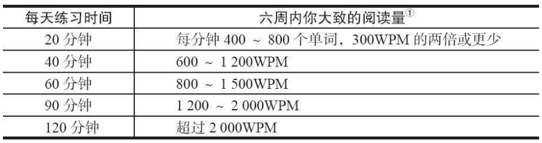
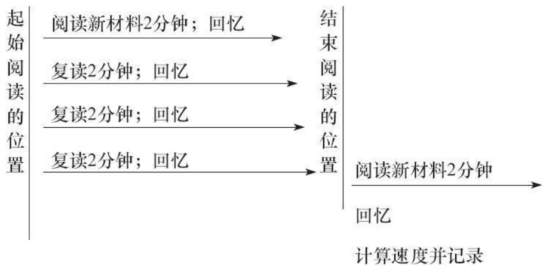
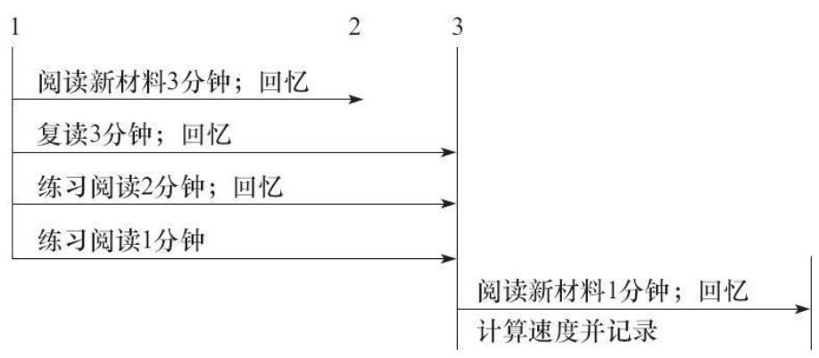
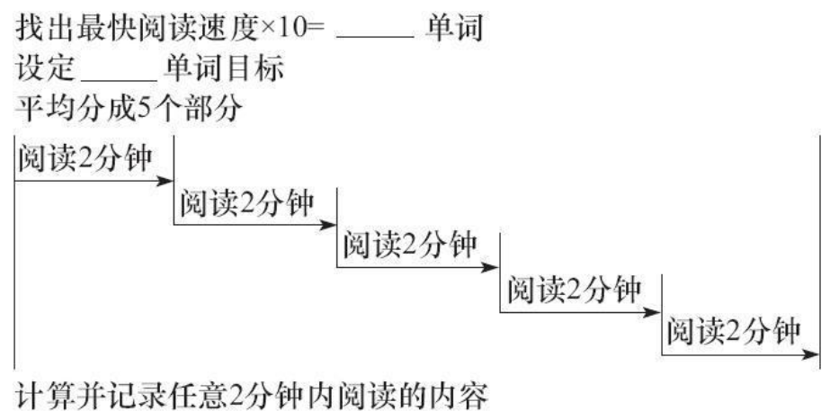
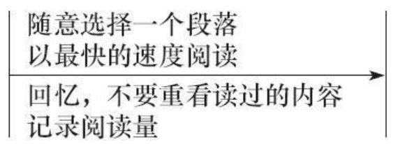

# 第一章 节省时间从今天开始

## 高效阅读是一项技能

概念学习本身主要是一个培养对事物认识的过程，通常通过听读来实现。概念学习主要是知识性学习。而对于技能培养而言，认识的过程必须结合对学习对象的练习。有时候，进行练习时可能还没有理解，但之后你会慢慢认识学习对象。

概念学习与技能培养还有另外一个区别。学习概念性事物有时候很快就能完成，特别是对成年人而言。但对技能的培养，比如阅读，确实很复杂，不能即时习得，你应该逐一掌握阅读技能。

## 成功的技能学习

学习新的技能时，最好每天进行一点练习。

学习一项技能入门通常很难。人们总是倾向于把事情往后拖，特别是初次学习时。每天都要有固定的学习时间。早上最好，因为一到晚上今天的事就可能被拖到明天。

## 大龄学员都做到了

一句忠告：不要先读完本书，稍后再回过头来做练习，因为一旦你知道了后面的内容再去做的话，前面的练习就失去了应有的效果。因此，在进入下一章的学习前，一定要掌握每个概念并进行实践训练。如果能这样做的话，你的阅读技能肯定会提高。

## 好的读者是灵活的读者

高效的读者会根据材料的难度、读物的组织结构、对题材的熟悉度以及阅读目的来决定阅读的快慢。因此，不要读任何材料都用一种方法。从开始的逐字逐句阅读到最后，你将学到许多不同的阅读方法以及在阅读时如何适应具体的目的。

# 第二章 测试阅读速度，找到自己的位置

要是想获得对自己的阅读技能更全面的了解，你应该使用不止一本书进行自测。这样的话，第二本书同第一本书就能进行对比，比如，第一本书优选的是非小说文学作品，第二本最好是小说或传记。如果你打算使用多本书进行自测，你会发现自己阅读能力的波动。这是因为大多数人总是对某一领域了解得更多，而你的阅读速度通常能反映这一点。

## 自测

1.选择自测用书的一部分，约 10 页你没有读过的内容。

2.以尽可能快的速度阅读 3 分钟。用你的计时器进行计时。

3.3 分钟到后，用铅笔或钢笔标记下你读到的位置。然后合上书。

4.单独准备一张纸，在左边编号 1~20 对你阅读的记忆力进行评估。在纸上记下你能记住的所有内容，不要回头翻阅读过的内容。限时6分钟。

## 计算你的阅读速度

第一，你须找出书中每行的平均字数。数一下任意 3 个整行的字数，然后除以 3。比如，如果 3 个整行的总字数是 33 个，平均每行的字数就是 11。但如果一共就 31 或 32 个字，那么每行字数应计为 10，因为确定字数时四舍五入更精确。

第二，在分配的时间内数一数你阅读的行数。你必然会遇到一些不足一行的情况，此时每两个半行计为一行。只有一个或两个字的行应忽略不计。如果一行就差一两个字就满行的话，则计为一行。

第三，用总行数乘以每行的平均字数，得出你阅读的总字数。

第四，然后再用阅读的时间去除阅读的总字数，得出你每分钟的阅读速度或者叫作 WPM。

## 评估你的记忆力

对你的记忆力进行评估，计算你在开始阅读评估时能记住的总字数。这一数字会告诉你能记住多少材料的内容。采用这一非正式的评估方式，就能很好地观察你的进步。

> 统计记住的总字数的办法好像不是很实用，我又不能把原文记下来，只能做到用自己的语言总结该概括一下阅读内容。
> 
> 所以我采用这样的办法评估记忆力：回忆要点写下来，然后重读文章，统计我觉得需要记住的要点，然后和回忆结果对比，看看命中了几个。
> 
> 对于知识性文章比较适用，如果是小说的话感觉不是很适用，我看小说又不是为了背小说。所以对于小说就是统计作者的描写中想要传达的信息点。非小说类的文学作品目前没有测试过。

要评估你的阅读能力，最简单最恰当的方法是再读一遍材料，并记下你认为应该理解记住的所有观点或细节。检查你的答卷，你是否记住了应该记住的所有内容？自己定级：良好或有待改进。

# 第三章 开始使用你的内在阅读加速器

## 阅读时眼睛在干什么

阅读时，眼睛会持续进行有规律的跳止运动。要看到事物，眼睛必须短暂停顿在某个对象上摄取有效信息

我们都知道阅读时一次阅读一个单词，意味着你的阅读量是每分钟 240 个单词，因为你的眼睛需在每个对象上停留 1/4 秒。

回读分两种，即有意识回读与无意识回读。有时候，你会觉得一些内容理解得不透，于是决定返回去重读。这属于有意识的回读。这样做没有错，虽然这不算是一种透彻理解材料的最有效方法，但肯定是方法之一。

无意识的回读也存在，主要是由于你开始学习阅读时养成的不良习惯。当眼睛无意识回看时就会产生回读。

学习如何消除回读是提高阅读速度的第一步。

## 你应该知道的阅读条件

阅读的灯光既不能太亮也不能太暗，太亮或太暗都能引起眼睛疲劳。

阅读时的最佳灯光是漫射灯光，或者来自不同光源从而不炫光的光线。如果你阅读时没有丝毫的疲劳，那么光线就可能正好。太亮或太暗都能引起疲劳。一个好的测光方法是把你的手放在阅读材料上面 30 厘米左右的位置。如果出现了较深色的阴影，就说明光线太强了，最好是一点阴影都没有。不建议使用高强度的灯具。

## 阅读姿势

最好的阅读位置是坐在椅子上，背部紧紧靠着椅背。低头垂肩坐着、躺着或其他坐姿都不是阅读的最好方法。

书的位置最好同眼睛构成 45 度角，如图 3-1 所示。在这个位置，你的眼睛不用持续调整视角。这能减少眼睛的运动量，进而减轻眼睛疲劳程度。拿一本书，在书下垫 6~9 厘米高的物体，很容易就能形成 45 度的阅读视角。

## 阅读时如何用手

用手提高你的阅读速度。开始时用食指指着阅读，然后指尖沿着阅读单词的所在行掠过。边移动手指边阅读，手指指到行尾时，抬高 1.5 厘米，迅速移到第二行再次开始这一过程。

几乎是在你开始使用手指引导阅读时，你的阅读速度就开始提高了，因为手指能帮助你消除无意识的回读。事实上，在消除无意识回读后，普通读者的阅读速度都能提高 10%~20%。但是，需要进行一些练习才能实现。

之后你需要使用手指来完成所有的阅读，尤其是你在学习本书阅读技能时。让手指成为你阅读的第二习惯，这对你的成功至关重要。

## 练习3

材料：简单的书籍，测试用书除外。

计时器：（手表或电脑上的钟表）

目的：学习利用手指作为节拍器来消除回读。

1. 打开书，从任意位置开始阅读。每秒手指从每行下面划过，练习 3 分钟。每读过一行都在心里计为「一」。使用计时器，确保练习 3 分钟时间。

2. 使用同一本书中未读过的内容时，利用手指再练习 3 分钟。标记开始与结束的位置。

3. 计算你 3 分钟内的阅读速度。

   要计算阅读速度，请遵照下列步骤：

   a.找出每行的平均单词数（3 行的总字数除以 3）。

   b.计算阅读的总行数。

   c.算出阅读的总字数，用 b 乘以 a。

   d.用 3 除 c 得出每分钟的阅读量。

得出每分钟的阅读量后，记录在你的进步文件中。

重复步骤 2~ 步骤 4，阅读一篇新文章，计算阅读速度。

# 第四章 消除回读，加速前进
## 怎样读书才快
刚开始学习阅读时，你看到的可能都是字母。

你的眼睛会在进入视线的物体上停留 1/4 秒，据此便能知道你的初始阅读速度。如果在每个字母上停留 1/4 秒，那么一秒才能读完一个由 4 个字母组成的单词。假设阅读的每个单词平均由 4 个字母组成，读者每分钟只能阅读 60 个单词，或者每个单词用时一秒钟。

眼睛能一次注意到整个单词时就进入了阅读的下一阶段。

对于较长的词，可能需要分开前后两部分看。随着认识的完整单词数量的增多，你的阅读速度将从 60 跳跃到 175。

你读得多了，速度就会继续缓慢上升，增长到大约 240 个单词/分钟。

##  下一个关键步骤

每分钟阅读超过 240 个单词的唯一方式是每一次捕捉到不止一个单词。

学会对整个单词而不是单个字母做出反应时，你就已经做好了第一步。学会对一组单词做出反应不过是反复练习的问题，需要正确的实践训练。

## 消除回读
使用了手指引导阅读后，阅读时的回读就会很少，同时还培养了眼部运动同手指的配合。

反复的阅读练习能帮助你更快地消除回读，原因是大脑得到了放松，不必担心漏掉什么内容。你已经读完了，所以能轻易地加快阅读速度。知道自己没有丢掉什么内容时，你就可以开始练习只读一遍。

## 练习4
计时器（手表或电脑上的钟表）。

目的：学习通过反复阅读消除回读来加快速度。

1. 打开课本从任意位置开始阅读。以尽可能快的速度，使用手指引导阅读 3 分钟。在结束阅读的位置标记「1」。

2. 返回到开始并利用 3 分钟重读前面的部分。试着加快阅读速度，超过上面标记的位置「1」。

如果你阅读了更多的内容，在新的结束位置做标记「2」。

3. 返回去再利用 3 分钟重读前面的部分，试着阅读得更快。你已经读了两遍，因此速度应该会更快。3 分钟结束时，再次做标记「3」。

4. 再利用 3 分钟重读前面的部分，试着再快些。超过前面的标记时，要再次做新标记「4」。

5. 最后，利用 3 分钟阅读新内容（你也可以从标记「4」开始）。记着要用你的手指。完成后，做下标记「5」。

6. 计算最后 3 分钟的阅读速度，从「4」到「5」。按照下列步骤进行：

   a.找出每行的平均单词数（3 行的总字数除以 3）。

   b.计算阅读的总行数。

   c.算出阅读的总字数，用 b 乘以 a。

   d.用 3 除 c，找出每分钟的阅读量。

7. 得出每分钟的阅读量后，记录在你的进步文件中。

## 更进一步
一些学生问我：除了本书中的练习外，怎样才能取得更大的进步。练习大多数技能的最好方法是每天练习，同时在建议的时间外进行练习。一句忠告：如果你此时没有比前一刻进步，一定不要灰心，这可能是你的一次不好的经历。但对于这一点，额外的练习将非常有价值。要是你有其他时间，并想在下一节课前更进一步，可以遵照下面的步骤进行练习：

1. 任意找一本书，按照练习 4 进行练习。

2. 完成练习后，以尽可能快的速度，利用你的手指继续阅读 10 分钟。

3. 使用新材料重复练习 4。

4. 完成练习后，马上尽可能快地阅读10 分钟。

如有时间，重复一个半小时的练习将非常有收获，你将发现自己的阅读速度开始攀升。消除回读只是一个开始，不久你就会发现你能迅速地开始更快地阅读。

# 第 5 章　通过实践训练了解你的阅读速度
除了回读外，默读是导致你读书慢的第二个原因。

我们大多数人通过看单词和默读单词来理解阅读材料，而天生速读者培养了眼睛看到单词就能理解的能力，因此他们读书读得就很快。

但对于大多数人而言，阅读速度紧随我们默读的速度。

## 默读的三个阶段 
尽管一些老师宣称可以让读者不再默读，但目前完全做到这一点还不实际。我发现，要是人一直注意自己的默读，那么读完后就只记得自己有没有阅读，理解得很少。学习快速阅读，是让你学习如何比默读的速度更快，但你阅读时肯定会默读。

## 如何学习快速识别信息
你的眼睛正在看一页读物，和我看到的是相同的事物，然而我能以更快的速度读完页面上的内容。换句话说，我能在更短时间内从同样的文字中获取更多的信息。你看的时间跟我一样，却不能获取跟我一样多的信息。

你阅读时只是在回忆你心灵之耳中词语的音调。良好的实践训练的秘诀是让你以超过默读的速度来阅读。当然你的眼睛还得看着所有单词。

下列练习将帮助你学会如何适当地练习。你需要设定计时器，间距逐步减小。开始三分钟的阅读，然后是两分钟，继而是一分钟。

## 练习 5 
材料：  任选一本书、计时器（优选录音机）。

目的：  学习如何通过做标记来练习一次捕捉超过一个单词。

1. 利用手指引导阅读三分钟新材料，完成阅读时做下标记。可选项：计算你的阅读速度。
2. 再利用三分钟阅读同一材料。如果你在三分钟之内就完成了阅读，返回开头重新阅读。
3. 练习在两分钟内阅读相同部分的内容。一定要达到标记位置。在这里，你读不完所有的内容，但没关系。让你的手指快速移动，在两分钟内移动到最后，眼睛跟着你的手指运动。
4. 练习在一分钟内阅读完相同部分的内容。记住要在设定的时间内完成。备注：一分钟内完成的话，你的阅读速度就是目前的 3 倍。这称为练习或练习阅读。 
5. 利用一分钟，从前面部分的结尾处开始阅读。在阅读结束位置做下标记，并计算阅读速度如下：
    1. 找出每行的平均单词数。
    2. 计算阅读行数的总字数。
    3. 用 a 乘以 b 计算每分钟的阅读量（由于阅读的时间为 1 分钟，没必要用任何数除 c）。
6. 得出你的阅读速度后，记录到进步文件中。

如果你很放松并且每次达到标记位置都很容易，你可能会想这么简单是不是方法有误。真的，就是这么简单。如果到不了标记位置，可能是你还在尝试去阅读，而不是学习阅读。但要知道，你现在是在学习如何阅读得更快，这是练习的目的。

你总是在阅读练习与实践训练的第一步和最后一步进行阅读，从未在中间部分阅读。中间部分你是在练习阅读，而不是阅读。最重要的是，要使用手指来完成阅读任务。没有读完所有内容也没关系，跳过单词或整行内容也无关紧要，最重要的是做标记。任何人都能轻而易举地完成。你只需以足够快的速度移动你的手指。

学习如何适当地练习对学习任何技能都至关重要。「熟能生巧」只有在练习适当时才是真理。最后的练习太重要了，至少应重复进行一次。重复练习一次，但要提高阅读速度！

## 练习 6 
材料：  同练习 5

目的：  同练习 5
1. 以最快的速度阅读 1 分钟，在阅读结束位置做标记。
2. 利用 45 秒阅读相同部分的内容，达到标记位置。提前读完后，返回并重新开始阅读。
3. 利用 35 秒阅读相同部分的内容。
4. 利用 25 秒阅读相同部分的内容，达到标记位置，并尝试在适当的时间内完成。要知道，速度太快也是一个问题。
5. 利用一分钟阅读新材料，在阅读结束的位置做下标记。计算你的速度并记录到进步文件中。

通常，经过一系列练习后，你会注意到阅读速度的提高。开始进行适当的练习后，你总能轻松地阅读到标记位置。要是这样的话，你已经在开始培养一次捕捉不止一个单词的能力。之后，你的阅读速度将迅速提高。

## 更进一步
你可以反复重复本章最后一个练习，然后阅读 30 分钟。记住，手指用得越多，进步就越快。只要能理解，读得越快越好。

# 第 6 章　弄懂一个简单问题，开始提高你的理解能力 
培养良好的阅读或理解能力意味着培养良好的思维习惯。任何人都教不会你在一夜之间提高思维能力，但却可以提供现成的步骤帮助你以比你的想象还快的速度提高理解能力。

在本书中，阅读理解能力指的是理解或了解所读材料的能力。

## 段落是理解的首要关键 
段落是由句群组成的单位，因此段落中的句子都跟某一主题有关。

培养阅读能力的第一步是练习找出段落的主题句。在大多数情况下，你甚至没有思考就能理解段落的主题。

## 练习 7
材料：  本书、纸、铅笔或钢笔。

目的：  学习确认段落的主旨或主题句。
1. 利用手指，尽可能快地一次读完每个句子或段落，找出句子或段落的主题句。
2. 阅读 A 到 F。读完一句话或一个段落后，眼睛离开阅读材料，在纸上用尽可能少的词记下段落的主旨。注意：重要的是每个段落只读一次！避免回读。 
   
    A. 大部分树是绿色的。
    
    B. 许多鸟类一到冬天就迁徙到南方去了。
    
    C. 约翰把盘子洗了。他妻子让他洗的。
    
    D. 比尔爱踢足球。他希望有一天能踢职业赛。
    
    E. 斯宾诺沙是荷兰最著名的哲学家，犹太教徒。
    
    F. 马茜是个美丽的妙龄女郎，留着乌黑的短发。她有个不寻常的名字，是她的绰号。她的双亲都是日本人。

事实上，95%的段落主题句都在第一句。这也是为什么第一句通常被称为主题句或中心句。

## 练习 8 
材料：  本书、纸张、铅笔。
目的：  尽可能快地找出段落主题。利用手指，阅读一次。
1. 从 G 到 M。
2. 以最快速度读一遍段落内容，找出段落主题。读完后合上书，这样你就不会回头翻看了。
3. 在纸上用一个或多个词写出段落的主题。
   
    G. 农场里所有的动物都很惬意。牛群开心地吃草，马儿围着牧场跑，而鸡群则四处觅食。
    
    H. 路德维希二世是巴伐利亚的最后一个国王。他被认为患有精神病，最终被推翻。他修建了好几座城堡，让皇室几乎破产。今天，这些城堡都成了巴伐利亚的主要旅游景点。
    
    I. 学校孩子都出去打篮球了。有一个男孩留了下来。他是个残疾人，不能打球。孩子们有时会取笑他。
    
    J. 爷爷是一个非常严厉的老头，他很少出门。雷切尔一点也不喜欢他。他是雷切尔的爷爷，但雷切尔认为爷爷太严厉了。爷爷的严厉让雷切尔的父亲也常常心烦。
    
    K. 池塘内外生活着许多昆虫、鱼类及其他动物。有一种益虫游起泳来像鱼，但长大后却喜欢吃虫子。它们总是懒洋洋地趴在荷叶上。
    
    L. 黛安娜去逛商场了。科琳娜与布兰达已经到了。萨拉不想去，但最终还是去了。他们几个见面后在一家泰国餐馆玩得很开心。
    
    M. 约翰出去挤牛奶了。母亲正在烤面包。父亲正在摘西红柿。他哥哥回来也有活儿干。农场生活并不容易。

答案：A.树；B.鸟；C.约翰；D.比尔；E.斯宾诺沙；F.马茜；G.农场动物；H.路德维希二世；I.残疾的男孩；J.爷爷；K.青蛙；L.商场；M.农场生活。

## 理解能力与速度
在理解阅读材料的时候，你很容易忘记阅读速度。

阅读速度与理解能力的培养将分开进行，之后才开始兼顾阅读速度与理解能力。除非在练习时，否则理解能力将一直约束阅读速度。很明显，读书但不理解算不上是阅读。

在培养快速识别单词技能时，我们将不关注理解能力。

进行阅读练习时，阅读速度也不是首要考虑的内容。

当为阅读指定了具体的目标后，比如找出文章大意，你应该尽快完成阅读任务。已经找出了文章大意后，不要过分关注对文章其他部分的阅读与分析。快速浏览其他部分，检查一下其他部分是否与你选择的主题句有关。

## 更进一步
任意选择一本书，准备一张纸、一支铅笔，看看你在 5 分钟内能找出多少段落的主题句。

随意选择一个段落，尽快一次性读完，尝试找出段落大意。视线离开书本，在纸上简单地记下文章大意。然后跳到另外一个不相邻的段落，因为这样更有难度，继续看你能找出多少其他段落的主题句。快速确认段落主题句的能力将极大地帮助你在未来的学习中培养良好的阅读能力。

## 第二周实践训练
花尽可能多的时间，完成下面的实践训练。

花在实践训练上的时间将直接关系到学完本书后你的阅读速度有多快。假设你开始学习本课程时阅读速度一般（每分钟的阅读量大约是 200 个单词），且你按照教授的进行了练习，那么下面的图标将暗示你能取得多大的提高。

注:超过90分钟应该分成两个学时。

阅读速度将随材料类型、阅读目的及其他因素变化。这意味着简单的阅读材料速度就快。

假如每天能练习 20 分钟，单做实践训练 1 即可。每天练习 40 分钟的话，先做实践训练 1，再做实践训练 2，等等。

达不到练习目标要求时，你最好重复练习直至达到目标。达到目标并不难。如果你未达到目标，那么你可能对自己的要求过高了。你可能设定了超过我们期望你做到的标准，比如想更多地理解材料，而不仅仅是所述的阅读目的。

### 本周实践训练用到的材料 
1. 计时器。分别计时 1，2，3 分钟。
2. 钢笔或铅笔。
3. 纸张。优选使用 A4 纸，打印机用纸。
4. 一两本书。难度不大的小说、传记或散文。
5. 从进步文件列表中选一两本书。

### 实践训练 1 

> 同练习4

材料：  基本书目

目的：  开始消除回读

预计时间：1  5 分钟

目标：  每次复读时多读 1~2 行内容

应重复本实践训练，直到阅读速度达到 400WPM，然后开始实践训练 2 的练习。

练习说明： 
1. 阅读新材料 2 分钟。在结束位置标记「2」。开始书面总结，用尽可能少的字在纸上记下文章大意，不要回头翻看材料。可选项：计算今天你的起始阅读速度。
2. 重读相同部分的内容 2 分钟，尝试阅读更多的内容。读了更多内容时，做标记「3」。增加书面总结内容，不要回头翻看材料。
3. 复读相同部分 2 分钟，尝试提高阅读速度。如果你阅读了更多的内容，做标记「4」。增加书面总结内容。
4. 复读相同部分 2 分钟，尝试再快些。如果你阅读了更多的内容，做标记「5」。增加书面总结内容。
5. 从上面标记「5」处开始，以最快的速度往后阅读，时间 2 分钟。在阅读结束位置标记「X」。把记住的新内容添加到书面总结中或重新做书面总结。

计算从「5」到「X」的阅读速度，记录在进步文件中。注意：一直用手指作为节拍器。 

### 实践训练 2

> 同 练习5、6

材料：  基本书目

目的：  在理解的前提下提高阅读速度

预计时间：  15 分钟

目标：  每次都读到标记位置

本练习可以重复进行。

练习说明： 
1. 阅读新材料 3 分钟。在结束位置标记「2」。开始书面总结，简要回忆。
2. 重读相同部分 3 分钟，尝试阅读更多内容。如果你阅读了更多的内容，做标记「3」。可能的话，简要增加书面总结的内容。
3. 在 2 分钟内练习阅读尽可能多的内容。如果你能把所有记住的新内容都添加到书面总结中去，那就添加吧。不要为了记住内容而放慢速度。一定要达到标记位置。
4. 在 1 分钟内练习阅读整个部分的内容，达到标记位置。直接进入以下步骤，不要回忆。

    注意：未能在规定的时间达到标记位置时，继续练习 1 分钟内读完整个部分，直到能及时达到标记位为止。记住，这不是阅读，不必把每一个词甚或每一行都读到，但要试着做到。 

5. 阅读新材料 1 分钟。在阅读结束位置标记「X」。可能的话，简要地把记住的新内容都添加到书面总结中。

计算你从「3」到「X」的阅读速度，记录在进步文件中。

### 实践训练 3 
材料：  从你准备的 10 本书中任选一本

目的：  在一般阅读环境下练习新的阅读技巧

预计时间：  15 分钟

目标：  设定时间目标并保持

本实践训练可以重复进行。

练习说明：
1. 找出你在实践练习 1，2 或 3 达到的最快速度。用 10 乘以该速度。你从阅读书目中任选了一本完成了练习1的书。安排一个长度等于你刚刚测定长度的阅读章节。然后平均分成 5 个部分。
2. 使用手指作为节拍器。利用 2 分钟时间阅读第一部分。
3. 利用 2 分钟时间阅读第 2 部分。
4. 继续进行，在 2 分钟或更短的时间内阅读每一部分。
5. 计算每一部分的阅读速度，并记录到你的进步文件中。

### 实践训练 4 

> 同 练习7、8

材料：  基本书目

目的：  培养寻找段落主题的意识

预计时间：  5 分钟

目标：  看看你能在多短的时间内找出段落大意

每个练习部分进行一次这个实践训练。

练习说明： 
1. 选择一本书中的任意段落。
2. 用尽可能少的词在纸上记录下段落主题。不要回看读过的段落。
3. 选择书中的另一个段落，继续该练习。尝试在 5 分钟内阅读更多的段落。必须记住阅读是为了找出段落主题。在进步文件上记录下 5 分钟内完成的阅读量。
