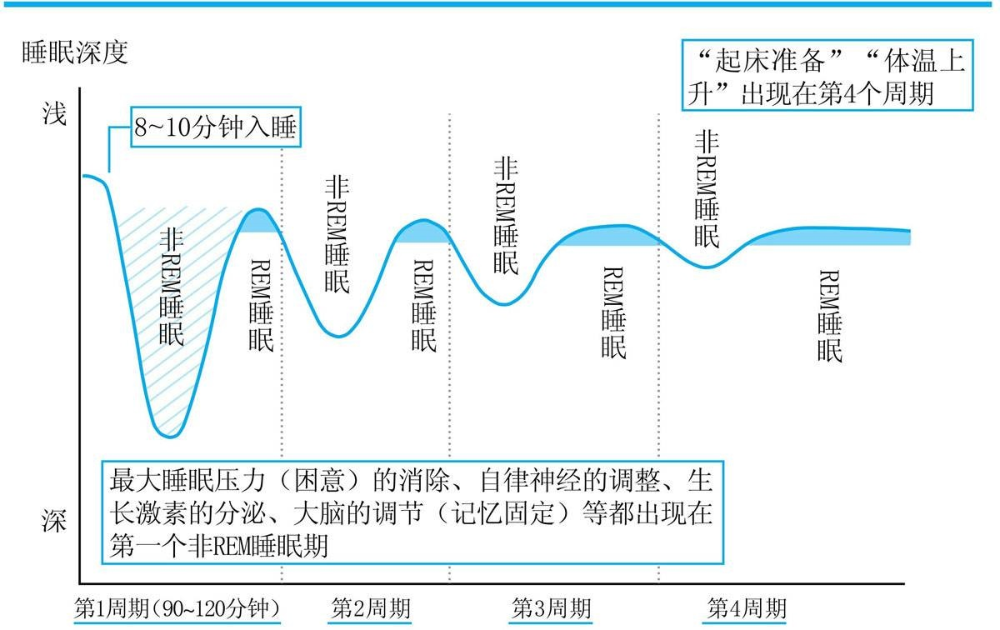

# 序言

确保最佳的睡眠，能使白天的效率达到最大化。

从睡眠时间来看，人们常常认为REM睡眠[插图]和非REM睡眠[插图]的周期为90分钟，所以总体的睡眠时长应以90分钟的倍数为宜，但实际情况是，“90分钟”未必就是一个准确的周期时间。

所以，即使睡眠时长为90分钟的倍数，但醒来时依旧不舒服的情况也是常有的。

## 斯坦福大学睡眠研究所

睡眠医学的发展历史并不长。在很长一段时间里，人们都认为睡眠不就是休息嘛，所以几乎没有人对此进行专门的研究。

真正的转机出现在1953年，当时科学界发现了所谓的REM睡眠。

身体处于睡眠状态，但大脑依旧在运转，这种被称为REM睡眠

在美国的大学中，斯坦福大学是最早关注睡眠医学的学校。

1963年，斯坦福大学设立了世界上首个正式的睡眠研究机构——斯坦福大学睡眠研究所。

REM睡眠发现者之一的威廉·德门特（Wiliam C.Dement）。

1972年，德门特教授和克里斯琴·耶基米诺（Christian Guilleminault）教授在全世界范围内第一次就睡眠障碍进行了科学系统的论述。

1989年，斯坦福大学编写出了第一本睡眠医学的教科书。

德门特教授于1975年建立了睡眠学会，并通过发行学术杂志Sleep等方式超越了大学范畴，在全世界的睡眠研究中发挥着领军的作用。

现在，哈佛大学的“睡眠计划”项目、威斯康星大学的睡眠医学·睡眠研究所和匹兹堡大学针对失眠症的研究都取得了让人惊叹的成果。同时，在基础研究方面，法国里昂大学和美国加利福尼亚大学洛杉矶分校也都做出了很大的贡献。

以哈佛大学为首的、当今仍活跃于世界的睡眠研究人员，基本上都有短期或长期在斯坦福大学工作的经历。 “世界睡眠的研究始于斯坦福大学。”

## “睡得久”就是“睡得好”吗？

比起“量”来，“质”才更重要。吃饭也好，物品也好，工作也好，都是“质”重于“量”。可以说，这是一个全球性的认知。

现在很多人都有睡眠方面的精神压力，诸如白天犯困、大脑迷糊、起床痛苦等，而且大家会有意地去追求睡眠的“量”，认为还是应该再多睡一会儿。 然而，对于每天都很忙碌的现代人来说，要想确保“比之前更多”的睡眠时间，是一件很不现实的事情。 很少有人能做到每晚在零点前入睡，同时每天早晨睡到自然醒。时间原本就很有限，要在工作、家务、育儿、兴趣爱好等大量的“应该要做的事”和“想做的事”的夹缝中，获得充足的睡眠时间是异常困难的。 “如果很忙的话，就只能缩短睡眠的时间了”这样的想法看似有点悲哀，但这也是无可奈何的事。 假设我们有足够的时间，可以在床上待多久都行，但这样一来，可能又会遇到很多其他的睡眠问题，如睡不着、睡醒依旧不解乏等。甚至有研究表明睡眠时间过长，反而对身体不利。 那么，我们就先从结论开始说吧。 与睡眠有关的烦恼和精神压力，是无法仅仅通过“对量的确保”来解决的。

## 清醒与睡眠

重新思考一下最佳睡眠究竟是什么呢？ 答案就是，只有在大脑、身体、神经都处于最佳状态时，才能真正实现的高质量睡眠。 “睡眠”与“清醒”相辅相成。 无论是对于工作还是学习来说，大脑、神经、身体都状态极佳的高质量睡眠，会让一整天的效率得以提高。反之，如果只是一味地追求睡眠的“量”，没完没了地睡觉的话，身体状况就会变得紊乱。

同时，如果白天状态好，工作上想要有所成绩，那么需要大脑和身体高强度的运转。这样的一天结束后，也非常需要一个有效的“保养型”睡眠。 睡觉时，我们的大脑和身体依然在以不同的方式运转着。为了早上起床时能有一个最好的状态，在睡眠的过程中，大脑和身体中的自律神经、脑内化学物质以及激素等，都在不停地工作着。 睡眠期间，保持大脑和身体都处于最佳的状态，彻底提升睡眠的质量，从而实现“最强的清醒状态”。这才是本书所说的“最佳睡眠”。

## 斯坦福大学的睡眠法则

“睡眠的质量”直接关系到“清醒时的质量”。

睡眠质量是由睡眠初期的90分钟决定的，而不是取决于REM睡眠、非REM睡眠的周期。 只要“最初90分钟”的睡眠质量得到了保证，剩余时间的睡眠质量也会相应变得更好。 相反，如果在最初的睡眠阶段就不顺利的话，无论睡多久，自律神经都会失调，而支持白天活动的激素的分泌也会变得紊乱。 可以说，即便忙到没有时间，只要能在“最初90分钟”里有一个良好的深度睡眠，就能够实现最佳睡眠。

# 第1章 睡得多不等于睡得好

## 你陷入“睡眠负债地狱”了吗？

这种睡眠时间不足的情况，不应该叫作睡眠不足，而应称为“睡眠负债”。就像欠债一样，睡眠不足一旦堆积，人们就会无力偿还、债台高筑，最终大脑和身体都会不受控制，导致睡眠的自行“破产”。

所谓的睡眠负债是睡眠时间不足引起的，其中涉及很多难以解决的消极因素。

这些危险因素在自己还没有意识到的时候堆积起来，就会给身体带来损害。最可怕的是，很多人对此还很漠不关心。

睡眠负债问题会给白天的表现带来消极的影响。 乍一看，好像正常清醒着的人，但其全部的身体机能有极大可能并没有在正常运转。

瞬间睡眠指1秒到10秒的睡眠状态，它是保护大脑的一种防御反应。 总之，已经导致出现防御反应的睡眠负债对大脑是不利的。 睡眠负债导致的瞬间睡眠的一大问题就在于，因为时间只有仅仅几秒钟，所以当事者本人和周围的人都很难注意到。

## 遗传基因决定理想的睡眠时间

睡眠负债堆积的话，出现瞬间睡眠的危险就会相应增加。

在研究短时间睡眠的过程中，我曾经调研过一对美国父子，他们在数十年里，每天的睡眠时间都不足6个小时，却依然很健康。 调查发现，他们的遗传基因中与生物规律（人体内所具备的规律）相关的时间遗传基因发生了变异。于是，通过培养一只与这对父子拥有同样的时间遗传基因的老鼠，观察其睡眠模式后发现，它的睡眠时间果真也很短。

一般来说，无论是老鼠还是人，总是不睡觉的话，“睡眠负债”就会不断积压，这将导致之后的极深度睡眠的时间有所增加。

这种短时间睡眠之后，深度睡眠来袭的睡眠模式，被称为反弹式睡眠。

时间遗传基因发生变异的老鼠，在长时间不睡觉之后，深度睡眠的时间并没增加。

有遗传性变异的动物，对于睡觉的欲望变得低下，完全能适应短时间的睡眠。

你自己是否每天只需睡4\~5个小时就能健康地生活，大脑清醒并且反应敏捷？ 如果是的话，那就没必要勉强自己睡很长时间了，因为你极有可能携带了短时间睡眠的遗传基因。 但是，如果你总因睡眠时间很短而感到痛苦的话，这就意味着你并不是那种可以只睡很短时间的人。

绝大多数人都没有短时间睡眠的遗传基因，如果将“成为可以只睡很短时间的人”作为目标的话，那将是极其错误的。

睡眠负债会给大脑和身体带来损害。

结果显示睡眠时间接近平均值7个小时的人，其死亡率是最低的。以他们的睡眠时间为基准，比此时间短的人和长的人，其死亡率都要高出1.3倍。

“违背遗传因素，强迫自己短时间睡眠。” “认为应该保持充足的睡眠，于是睡很久。” 如果上述情况在你身上也发生过的话，那就需要注意了，因为这样做或许会给你的健康带来损害。

睡眠时间短的女性，其肥胖度BMI值（身体指数）也较高，即属于肥胖体形。

- 不睡觉的话，会导致胰岛素分泌紊乱，血糖值升高，诱发糖尿病。
- 不睡觉的话，会导致控制饮食过量的瘦素停止分泌，引起肥胖。
- 不睡觉的话，会导致增加食欲的胃饥饿素分泌，引发肥胖。
- 不睡觉的话，会导致交感神经长期处于紧张状态，引起高血压。
- 不睡觉的话，会导致精神方面的疾病的发病率上升。同时，还会导致酒精依赖、药物依赖等情况的产生。

你也有过半夜不睡，吃很多的经历吧？那就是激素导致的，通过前面的介绍我们能清楚地知道，睡眠时间短与肥胖、糖尿病、高血压等生活习惯类疾病的发生有直接的关系。

关于人类的实验，也有报告显示存在睡眠负债或是睡眠质量低下的人，有易患痴呆症的可能。

一天午休时间超过1个小时，会加大患痴呆症的风险。同时，东京大学的研究团队在欧洲糖尿病学术会上也表示，一天午休时间超过1个小时，会加大患糖尿病的风险。

睡眠负债会带来很多的伤害，但是反过来看，如果能偿还这些“负债”，表现水平就会发生戏剧性的提升。

## 充足的睡眠仍无法让大脑满足

偿还睡眠负债绝非易事

睡眠负债带来的身心伤害是可怕的。 而一旦睡眠负债得以还清后，个人的表现就会变得很棒。

作为快速解决的对策，会有人说周末养精蓄锐，可以解决平时睡眠不足的问题，所以不要紧。但事实上，这样做基本没有效果。

也有证据表明金钱的负债可以偿还，而睡眠的负债无法偿还。

有一项强迫10名健康人睡14个小时的实验。实验开始前，这10个人的平均睡眠时间为7.5小时。

第一天大家都睡了13个小时，第二天也接近13个小时。但是，之后就很难睡较长的时间了，睡眠时间渐渐变短，甚至在床上躺五六个小时也睡不着。 结果，3周以后平均睡眠时间固定为8.2小时。这也可以看作是这10个人的生理必要睡眠时间。

假如把8.2小时设定为理想的睡眠时间，那么平均睡眠时间只有7.5小时的这些人，在很长的一段时间里，每天都担负着40分钟的睡眠负债。 而恢复到正常的8.2小时，花了他们3周的时间。也就是说，要偿还40分钟的睡眠负债，必须连续3周每天睡14个小时才行。而这是极其不现实的。

从现实角度来看，想用一两天的时间改善平时睡眠不足的问题是很难的。

归根结底，通过时间来管理睡眠问题很困难。

## 黄金90分钟：培养最强大脑和体魄

“睡眠（睡着的时间）”和“清醒（起床的时间）”二者本就是一体的。

我是这样认为的，没有一个良好的睡眠就不可能有最佳的清醒状态，而最佳的清醒状态也能让人拥有良好的睡眠。

以斯坦福大学为代表的研究学者以及日本、美国的生意人，他们这些很有成就的人都有很强的睡眠意识。他们都已经开始注重睡眠保养了。

注意饮食、锻炼身体，以此来养生，这已经成为了商务人士的普遍认识。

而全球的精英、运动员也同样很重视睡眠的作用。

只有睡眠这个良好基础，才能提高饮食和训练的效果。

这些人都能迅速获得最前沿的信息。如果认为能从中获益，就会比任何人抢先一步接受和采纳。

用商业交易方面的用语来解释的话，我们这样的专业人士就是提出最新知识的创新者，而这些人就是早期的适应者（初期使用者）。

从入睡到醒来，人并非一直保持同一状态。睡眠的类型，包括REM睡眠（大脑已经清醒，但身体还处于熟睡的一种状态）和非REM睡眠（大脑和身体都处于沉睡中的一种状态）两种。在睡觉的过程中，这两种睡眠状态会交替反复出现。

入睡之后，马上迎来的就是非REM睡眠。 特别是最初90分钟的非REM睡眠，可以说是睡眠的全过程中最深度的睡眠。在这个阶段是很难叫醒一个人的，即便勉强叫醒，他的大脑也处于混沌的状态。

入睡约90分钟后会出现第一次REM睡眠。这时，眼球会在眼皮下快速转动，即快速眼球运动，这种情况下会做（较为实际的）梦。虽然在REM睡眠的状态下人依然没有意识，但很容易醒过来。

从通常的睡眠模式来看，黎明之前，REM睡眠和非REM睡眠会反复出现四五次，而且当黎明来临时，REM睡眠的时间会变长。天亮后，在浅且长的REM睡眠中醒来，是一种自然的状态。 入睡后不久的非REM睡眠是最深的，但随着黎明的到来，这种睡眠状态会逐渐变浅，而且持续的时间也会逐渐变短。 在睡眠保养方面的关键，就是如何加深最初的非REM睡眠。

这时如果能保持深度睡眠的话，之后的睡眠也会变得很有规律，而自律神经与激素的分泌都将保持良好的状态，第二天的表现也会有所提高。

生长激素分泌最旺盛的时候，就是第一个非REM睡眠出现的时候。如果最深的非REM睡眠质量不佳或是受到外界干扰的话，就会导致生长激素无法正常分泌。

如果长时间不睡觉的话，“想睡”这样的睡眠欲望（睡眠压力）就会增加，而最初的非REM睡眠则可以让这些睡眠压力得到有效的释放。

如果你是普通人（即不是那种睡很短时间也没问题的人），那么最好每天至少睡6个小时以上。

要把握住支撑更好睡眠的黄金90分钟，有两个关键点不可忽视，即体温和大脑。

# 第二章 为什么人生1/3的时间都在睡觉

## 不可忽视的睡眠共性

越是体重偏重、身材健壮的人越会选择较硬的床垫。

这些超一流的人，虽然他们的职业、人种、年龄、性格各不相同，但还是能看出他们有很多的共同点。   

1. 超一流的人都在自己的领域取得了一定成就。
2. 超一流的人对自己的专业领域之外的东西也有很深的认识。
3. 超一流的人抓住了推进事物顺利发展的秘诀和关键。
4. 超一流的人具有卓绝的行动力。
5. 超一流的人能将正确的信息收集与理解能力当作自己的武器。   超一流的人通过不断努力并获得成功的过程来磨炼自己的人格。

单单接受某人的建议，并不能改变一个人。 关键在于还要有⑤里面所提到的“正确的信息收集与理解能力”。 超一流的人身边总是聚满了很多人，能听到各种各样的观点，但他们绝不会被海量的信息所左右。 他们具备正确的信息收集能力，能够从满是“垃圾”的信息海洋中，甄选出自己真正需要的信息。

知识也会导致严重的睡眠障碍。

失眠症的治疗也带有很明显的安慰剂（伪药）效应。也就是说，医生将小麦粉制成的药片放入药方中，并告诉患者这是强效睡眠药，结果患者真的可以轻松入睡。

不借助药物治疗失眠症的方法，被称为认知行为疗法。   

1. 获取正确的知识并加深对其的理解（认知）。
2. 通过一些行为来提升第二天白天的行为质量和表现水平（行为）。

例如，有人认为工作压力大到无法入睡，喝点酒可以助眠，于是在睡觉前会摄入大量的酒精。这就是典型的错误认知和行为。

大量的酒精会让人的睡眠变浅，由于酒精的利尿作用和饮酒时的水分摄入，而不得不起床去卫生间，也会相应地降低睡眠的质量。

无法确保睡眠质量的人，绝对不要采用这样的睡眠方法。

希望你能理解本书中的正确知识，然后再采取正确的行动。当这种行动形成习惯以后，就能消除因压力而引起的失眠。这就是所谓的睡眠认知行为疗法。

## 睡眠的五大使命

**睡眠的使命① 让大脑和身体得到休息**

人体内自律神经的活动并不会受到主观意志的控制。它主要负责维持人的体温、心脏的跳动、呼吸、消化，以及对激素分泌、新陈代谢的调节。 众所周知，自律神经包括活跃状态下的交感神经和放松状态下的副交感神经。这两种神经24小时都处于活动的状态，并轮流占据30%的主导地位。

白天，交感神经处于优势地位。这时，体内的血糖值、血压、脉搏数会上升，肌肉和心脏活动也变得活跃，大脑处于紧张的状态，注意力也会比较集中。

当我们感到紧张或集中注意力时，由于神经细胞的活跃，其反映在脑电波上就是快速的波形变化。反之，当我们感到放松时，则会出现缓慢、散乱且平稳的脑电波，同时也会出现能消除压力的α波。

非REM睡眠状态下或者用餐之后，副交感神经会处于优势地位。此时，心脏的跳动以及呼吸的节奏会放缓。餐后肠胃活动变得更加活跃，这有助于消化和排泄。

交感神经占据主导地位的时间过长。如果总是处于活动状态的话，身体和大脑都会感到疲惫，压力也会不断堆积。

夜晚，如果副交感神经不能顺利占据主导地位的话，人就会难以入睡，睡眠也会变浅。不久，自律神经就会失衡，体温和肠道活动等身体的基本机能就会出现异常。

睡眠初期，在出现最深非REM睡眠的黄金90分钟里，让副交感神经占据主导地位，以此来让大脑和身体得到休息，这才是最佳睡眠应完成的第一大使命。

**睡眠的使命② 整理记忆，并让其扎根于脑中**

大部分研究者都认为，学习后通过睡眠能够让记忆扎根于脑中。

- REM睡眠过程中，关于事件的记忆（在何时何地干了什么）会扎根于脑中。
- 在黄金90分钟中出现的非REM睡眠，可以帮助消除糟糕的记忆。
- 入睡初期和黎明前出现的浅度非REM睡眠，可以让我们用身体固化记忆（非主观意识的记忆）。

非REM睡眠与REM睡眠会反复出现多次，并随着时间的流逝，逐渐转换到浅睡的状态。在这个过程中，记忆将被整理并固化。

在入睡后不久出现的最深非REM睡眠状态下，信息会从大脑的海马区转移到大脑的皮层中，而记忆也就因此被保存了下来。

**睡眠的使命③ 调节激素的平衡**

大脑会控制体内激素的平衡状态，而睡眠时很多激素的分泌都处于活动状态。激素与生活习惯类疾病有着密切的联系。

良好的睡眠可以对生活习惯类疾病起到改善的作用。

睡眠受限的话，脂肪细胞所分泌的可抑制食欲的瘦素就会减少，而胃部所分泌的可增加食欲的胃饥饿素则会增加。

生长激素，在黄金90分钟里会大量分泌。成年人正是依靠这种激素，才能让肌肉和骨骼变得强壮，保持新陈代谢的正常。

与生长激素的构造比较相近，同时与生殖、哺乳行为有关的泌乳激素，在第一次的非REM睡眠中，也会进行大量的分泌。

睡眠还有助于提高皮肤中的保水量。这是因为皮肤中的水分，主要受与睡眠紧密相关的性激素和生长激素的影响。

**睡眠的使命④ 提高免疫力，远离疾病**

免疫力与激素有关，同时也与睡眠有着很深的联系。

睡眠不好的话，体内的激素平衡就会被破坏，免疫力也会出现异常，这会使感冒、流感、癌症等与免疫相关的疾病的患病率随之增加。

睡眠的一大作用就是休息，所以，从免疫力的提高与休息的角度来看，多睡觉能治感冒也是合理的。

事实上，即便注射了疫苗来预防流感，但如果睡眠紊乱的话，依然起不到免疫的作用，而接种的疫苗也就失去了效果。

像风湿病等自身免疫系统的疾病，还有过敏症等，虽说大部分是由天气等各种因素导致的，其实也和免疫系统本身有很大的关系。也就是说，如果不通过睡眠来增强身体的免疫力的话，过敏症状就会愈演愈烈。

**睡眠的使命⑤ 排出大脑中的废弃物**

脑脊液，其容量大约有1500毫升。我们的身体每天会分四次替换掉其中的600毫升。有证据表明：新的脑脊液产生后，原本旧的就会被排出。这时，大脑中的废弃物也会随着一同被排出。

当我们处于清醒状态时，神经细胞也是活跃的，此时大脑中的废物会不断堆积。虽然白天清醒时也会排出堆积的废弃物，但这还远远不够。所以，晚上睡觉时，大脑会进行自身的“维护保养”工作。

如果大脑中的废弃物不能有效排出，就有可能成为患阿尔茨海默症等疾病的诱因。

限制睡眠会提高原本易患“阿尔茨海默症”的人患痴呆的发病率，从这一点来说，“睡眠负债”并不是诱发痴呆的直接原因，但确实是高危致病因素。

大脑中的废弃物若不能顺利排出的话，不仅容易患上“阿尔茨海默症”，还会给大脑带来损伤。

在前面提到的睡眠五大使命中，最先被提及的休息作用确实很重要。只有消除了疲劳，才能提高白天的表现水平。

如果我们一直忽视的话，会让大脑和身体处于过劳的状态。

因此，我们可以充分利用好睡眠的这段时间来让自己有意识地进行休息。

临睡前滴几滴，然后闭上眼睛，利用这段无须用眼的休息时间来让眼睛的状态得以恢复，而且这样做我自己感觉效果更好。

类似眼药水这种针对病症的治疗方法，能带来一时的好转，却是治标不治本。不过，也正因为是对症疗法，所以可以与休息相结合来提高药物的疗效。

## 不可思议的睡眠终点站——梦

当我们处于REM睡眠状态下时会做梦，但也有实验研究证实非REM睡眠状态下，其实也会做梦。

20世纪50年代，REM睡眠被发现后不久，人们了解到在REM睡眠阶段会做梦。但到了1957年，德门特教授就指出非REM睡眠状态下人也会做梦。

起床后依然记得的梦，通常是在醒来前不久所做的梦。因为，人们一般都是在浅度REM睡眠反复的过程中慢慢醒来的。

REM睡眠时所做的梦，多是具有故事性的，并且接近个人真实体验的梦；而非REM睡眠时所做的梦多是抽象的，并且不太符合逻辑。

在身体处于睡眠状态，但大脑依旧在运转的REM睡眠状态下，大脑皮层是很活跃的，与清醒状态时一样。大脑中与“做梦”相关且负责管理运动区的神经细胞也变得活跃。

也就是说，因为好似亲身体验了如现实一般的梦境，所以这样的梦境是具体且合理的。

非REM睡眠状态下，大脑处于休眠状态，所以此时即便做梦，大脑中的运动区也处于非活跃状态。比如，在深睡状态下突然被叫醒，人就会感觉迷迷糊糊的，思维也会出现短时间的“短路”，完全不知道自己身处何时何地，而非REM睡眠时所做的梦就很接近于这样的一种状态。

由此可见，如果起床后记得的是抽象且不太理解的梦境，那么肯定是在非REM睡眠状态下醒来的。这与人们从REM睡眠中自然醒来的状态大不相同，因此，也不排除睡眠状态发生混乱的可能性。

为何我们只记得快醒来前所做的梦呢？醒来前的梦，其本身又具有什么样的意义呢？

我觉得，在睡醒前的REM睡眠状态下所做的梦，主要是为接下来的“起床”做准备的。

当然，这也涉及人为什么会做梦的原理。为了避免自己睡得迷糊，要定期通过REM睡眠来让大脑变活跃，让交感神经占据优势，这也是为“醒来”以及“后续白天的行为”做准备。

结论是人不可能做自己想做的梦。除了偶然巧合外，“事先的想法与梦境相一致”或者“因外部刺激导致梦境发生变化”的概率几乎为零。

## 睡眠质量决定清醒的程度

为了科学地测定睡眠质量的好坏，专家们会使用一种名为多导睡眠监测仪的装置，它可以监测多种生物电信号，因此可以用来同时记录人的脑电波、肌电图、眼球运动、心电图等数据。

20世纪50年代，为了监测睡眠的“深度”和“量”，人们设计出了这种**多导睡眠检测仪**，至今仍不断地在更新换代。

多导睡眠图检查就是基于这些同步测得的数据（肌肉松弛度、快速眼球运动状态、呼吸、动脉血氧度……），将睡眠过程分为四个阶段，并以30秒为一个单位，来对睡眠过程进行监测。

健康人士的睡眠模式，从某种程度上来说是较为固定的，只要睡眠的深度以及过渡方式能和平常保持一致，就可认定为是优质睡眠。

不仅是睡前、睡后，同时也要关注第二天的表现，进行自我感觉方面的检查，这样才能判断是否拥有一个优质睡眠。

“好困”“还想睡”这样的感觉，都是睡眠在向你发出的求救信号。

如果白天的状态良好，注意力也能保持集中的话，睡眠就像是一份来自黑夜世界的内部报告，体现出白天的工作已顺利完成。

睡眠呼吸暂停综合征就是一种发病率较高且颇具危险性的睡眠障碍。

打呼噜就是这种病症的危险信号。如果被家人指出呼噜声很大、呼吸时常会中断的话，那就有可能是患上睡眠呼吸暂停综合征了。

当然，有时也可能只是打呼噜，并不会出现呼吸暂停的现象。健康的人在睡眠过程中，出现呼吸暂停的现象也并不罕见，尤其是在饮酒之后，常会出现轻度的中断。对于成年人来说，每小时出现5次、每次持续10秒钟的呼吸暂停是没有关系的。

睡眠呼吸暂停综合征患者每小时则会出现15次以上呼吸暂停的现象，有的人甚至接近60次。这就等同于在睡眠过程中，每分钟都有10秒、20秒的时间脖子像被掐住了一样。这样一来，当然就无法睡觉了。

睡眠呼吸暂停综合征会造成各种各样的困扰。

- 导致白天总想要小憩。
- 引发肥胖、高血压、糖尿病等生活习惯类疾病。
- 导致血液黏稠，易发心梗、脑梗。
- 无法休息。自律神经、激素、免疫等系统无法正常工作。
- 重症情况下，如果放任不管的话，40%的人8年内会死亡。

睡眠呼吸暂停综合征可以通过戴护齿套扩张呼吸道或安装CPAP（持续正压通气）呼吸机等方法来进行预防性治疗，一般来说病情都能很简单地获得改善。

打呼噜可看作是患睡眠障碍的一种信号，但其实严格来说，打呼噜就是在用嘴呼吸，而用嘴呼吸也会导致睡眠质量下降。

明明睡了觉却依然犯困的人，最好在起床时有意识地用鼻子呼气、吸气。白天也要有意识地练习用鼻子呼气吸气的腹式呼吸。在此基础上，**每天睡前通过深呼吸让交感神经趋于平静，同时让副交感神经占据主导位置**。当习惯了这种腹式呼吸后，睡眠过程中就不会再出现用嘴呼吸的情况，进而也就解决了打呼噜的问题。

# 第三章 黄金90分钟睡眠法则

## 黄金90分钟决定睡眠质量

虽说大量的酒精会降低睡眠质量，但如果只是少量地饮用烈酒，就不必太过担心。当然，这也和每个人的体质有关，通常来说，喝过酒之后在最初的90分钟内，就能进入到沉睡的状态。

“一定不要忽视最初的困意。明明犯困却坚持不睡，之后就很难再进入到深度睡眠的状态，而且无论睡多久都不会有一个良好的睡眠质量。”

健康的人，闭上眼不到10分钟就能入睡。其心率会渐渐变平缓，交感神经活跃度趋于低下，而副交感神经则变得活跃起来。

入睡之后，在短时间内会进入到最深层的非REM睡眠状态。此时，脑电波会呈现一个缓慢而幅度较大的波形，因此非REM睡眠也被称为“徐波睡眠”（这在前文中已经说过）。某种程度上，通过对脑电波的观察，就可以了解睡眠质量的好坏。

这之后，睡眠会逐渐变浅，呈现类似突然醒来时的小振幅且快速的脑电波，同时还会出现快速的眼球运动，这时就进入到了REM睡眠的阶段。

入睡后会有持续约90分钟的非REM睡眠状态，90分钟后会过渡到第一次的REM睡眠状态。第一次REM睡眠时间很短，大约几分钟后，随着REM睡眠的结束，睡眠的第一周期也就完成了。

非REM睡眠的深度可分为四个级别。入睡后逐渐变深，快醒来时则逐渐变浅。

整个睡眠过程，就是在这两种状态之间进行反复的。第二个周期以后的非REM睡眠不会如第一次般那样深。若睡眠时间为6\~7个小时的话，这种持续90\~120分钟的睡眠周期就可以重复四次。但不得不说的是，睡眠质量依然取决于第一周期的质量。

无论睡多久，如果最初的90分钟质量不佳的话，就会导致后续的过程出现问题。睡6个小时的人和睡8个小时的人，可能就是因为最初的睡眠质量的差别，最后反而是睡6个小时的人睡得更香甜，白天也更能保持清醒的状态。

早前就有报告说抑郁症患者最初的REM睡眠状态的出现是远远早于90分钟的。我反而认为，正是由于抑郁症才导致最初的非REM睡眠阶段的睡眠质量不高。也就是说，由于最初90分钟的睡眠质量低下，导致情绪、身体条件、自律神经功能欠佳，而抑郁症就是这样一种典型的状况。

睡眠周期其实也是因人而异的。实际上，一个周期的时间为90\~120分钟。所以，也有研究人员提出睡眠时间应为120分钟的倍数为宜。

由此来看，起床的时机也是因个人睡眠周期而异的。

所以，我认为没必要局限于坊间“睡眠时长以90分钟的倍数为宜”的说法。

只有一点是共通的，那就是在睡眠的第一个周期中会出现持续70\~90分钟的深度非REM睡眠状态。因此，确保入睡后有90分钟的睡眠时间，就有可能拥有一个深度的非REM睡眠。

这就是黄金90分钟的道理所在。

## 黄金90分钟的三大优点

**优点① 通过睡眠调节自律神经**

入睡后，随着睡眠状态的加深，交感神经活动趋弱，而副交感神经逐渐占据主导地位。自律神经如果能按照清醒时交感神经占主导地位、休息时副交感神经占主导地位的规律顺利完成交替的话，大脑和身体就可以得到放松和休息。

进入REM睡眠状态后，脑电波呈现出的形状与清醒状态下的波形相近。此时，交感神经变得活跃，呼吸和心律出现不规则的变化。

自律神经失调的话，就会诱发身心疾病。当你总是感觉身体状况不好，出现头痛、紧张、疲惫、焦躁、肩酸、发寒这样的不适感时，其根源多出在自律神经的紊乱。

调节自律神经的方法，诸如音乐、熏香、绘本、伸展运动等。其中，保证黄金90分钟的睡眠被认为是调节自律神经的最佳办法。

**优点② 促进生长激素的分泌**

所有生物的体内，都有一个以平均24小时为循环节律的“生物钟”。这个节律也被称为“昼夜节律”。

人体的生物钟比24小时稍长，但是健康的人每天能够按照地球自转的节律（24小时）来进行自我调节。同时，许多体内激素的分泌都受到这种节律的影响。

生长激素虽然也会受到一天中的节律影响，但它的分泌在很大程度上还是得依靠非REM睡眠。

生长激素是一种较为特殊的激素，其在睡眠第一个周期的非REM睡眠阶段，分泌得尤为显著，可占其分泌量的70%至80%。如果在平时已经入睡的时间里，依然坚持不睡觉的话，生长激素就不会进行分泌。

如果是在黎明或是白天才入睡的话，依然可以观察到，在入睡初期会有生长激素分泌。但是，其分泌的量就不会像夜晚第一个周期时那么多了。

成年人的生长激素在促进细胞的生长和新陈代谢以及提高皮肤的柔软性、抗衰老等方面都发挥着重要作用。

**优点③ 让大脑状态趋于良好**

要想有高质量的睡眠，非REM睡眠与REM睡眠二者缺一不可。

抑郁症患者就是因为最初的非REM睡眠时长不足，导致REM睡眠状态提前到来（有一种治疗抑郁症的方法为REM睡眠叫醒法）。

白天时常犯困的嗜睡症患者，则是入睡后马上就进入到REM睡眠，这会导致身体僵硬、四肢无力。

抑郁症和综合失调症患者在入睡后的90分钟里，大脑是依然处于混乱状态的。

## 培养精良的“睡眠部队”

到底怎样才能保证黄金90分钟的睡眠呢？

坚持每天在同一时间睡觉、同一时间起床。在零点到来之前，最好夜里11点左右就上床。

犯困时不妨先睡上一会儿，等黄金90分钟结束，在第一个REM睡眠状态下起床，开始着手完成剩下的资料。算上第一次的REM睡眠，可能只能睡100分钟左右，但只要能有深度的睡眠，那么睡眠质量也是能相对得到保证的。

最初的REM睡眠的出现时间因人而异，所以在设置闹钟时，建议将时间设置在90分钟后、100分钟后（或者110分钟后）。

这样一来，虽然睡眠总体时长仍不足，但在质量方面能够做到在最差的条件下，将优势最大化。

强忍着困意，在凌晨4点做完工作，然后打算睡上3个小时，到早上7点钟再起床。但这种情况下，往往会因为精神亢奋而无法入睡。

之前一直处于精神集中的状态，大脑是很兴奋的。因为错过了最佳入睡时间，所以即便睡着了，在这个过程里也不会出现黄金90分钟。

黎明时人大多处于REM睡眠状态，这时大脑变得活跃，交感神经开始占据主导地位。在黎明时依然保持深度睡眠的做法是违背自然规律的。

黎明时才入睡的话，甚至会出现生长激素勉强能分泌，但其他激素因为受到一天节律的影响，完全不分泌的情况。

黎明时，能让人保持清醒的类固醇激素开始分泌，这是在为起床做准备。

熬夜工作到黎明之后睡觉，会出现上床后迷迷糊糊，就是睡不沉的情况。结果，不仅睡眠时长不够，睡眠质量也会很糟糕。抑或者，入睡后能进入到深度睡眠，但起床后还是会睡眼惺忪地去上班。

随着年龄的增加，黄金90分钟出现的难度越来越大。

## 体温和大脑是睡眠的“开关”

保持每天都在同一时间睡觉的做法，是符合昼夜规律的。这也是让自己尽快入睡，实现深度睡眠的有效办法。

体温和大脑这两个开关，不仅能帮助我们更好地入睡，同时，无论你睡眠时间长短与否，都能很好地提高睡眠的质量。

高质量的睡眠中，人的体温是会呈降低状态的。因此也可以说，体温的下降对于睡眠来说是不可或缺的。

人在清醒状态时的体温要高于睡觉时的体温。睡觉时体温会下降，内脏、肌肉、大脑都进入到休息的状态。而清醒时体温则会上升，以维持身体的活动。但这里提到的体温变化，指的是身体内部体温（即体内温度）的变化。

我们主要通过肌肉及内脏产生热量和手脚释放热量这两种途径来调节自身的体温。

通常情况下，清醒时体内温度要比体表温度高2℃。

健康的人在入睡前手脚开始变得温暖，体表温度上升，通过体表散发出热量可以让体内温度下降。

此时，体表温度和体内温度的差值会缩小到2℃以内。

让自己顺利入睡的关键，就在于缩小体内温度和体表温度之间的差值。

如果借助一些方法促进这种变化发生的话，那么入睡的过程就会变得更加容易。

工作的压力和肉体的疲劳，会迫使大脑一直处于活动的状态。而且，工作之外还有无数让大脑无法休息的“陷阱”，诸如运动、就餐、手机、电脑等。

大脑处于兴奋状态时，体温就会很难降下来。

正确关闭“脑部开关”，能有效防止睡眠初期出现紊乱的情况。

# 第四章 斯坦福高效睡眠法

## 用体温和大脑打造最佳睡眠

“白天是否容易犯困”“头脑是否清醒”“工作中是否出现很多失误”等白天的清醒程度，才是判断睡眠质量好坏的关键。

体表温度一旦上升，热量就会从毛细血管密布的手和脚释放出来，这样也能有效地降低体内温度。

体内温度下降才能保证顺利进入到睡眠状态。

睡眠时，人的体内温度会下降，相反，在清醒时，体内温度则会上升。

当我们的大脑中负责控制维持生命所必需的自律神经（呼吸、心跳、体温的维持等）的区域继续工作，而与生命并无直接关系的区域（思维活动、消化活动、肌肉运动等）停止工作时，人就会进入到“休眠模式”。这也是在雪山上遇险时“人会感觉犯困”的原因所在。

但是，睡眠过程中体内温度会开始下降。因此，如果在雪山上睡着的话，热量大量流失会远超平时的水平，这将直接导致低体温症的发生，人不久就会死亡。

单单认为体内温度下降就会犯困，这并不准确。

当我们清醒时，体内温度要比体表温度高2℃左右，但是在睡觉时体内温度则会下降0.3℃左右，两者之间的差距缩小到了2℃以下。体表温度和体内温度的差距缩小时，人更容易入睡。

重要的是缩小体表温度和体内温度的差距。为此，首先必须要提高体表温度，通过释放热量来降低体内温度。

- 清醒时体温上升，个人表现的状态也有所提高（打开了开关）。
- 体表温度上升（开），热量散发导致体内温度下降（关），能让人尽快入睡。
- 在黄金90分钟阶段，体温若能顺利下降（关），睡眠质量就会提升。
- 随着清晨的来临，体温开始上升（开），人会逐渐醒来。

## 提升睡眠质量的三大体温开关
**体温开关① 入睡前90分钟沐浴**

而能有效缩小体内温度和体表温度二者差距的有效方法，就是沐浴。

沐浴带来的体表温度变化最多为0.8至1.2℃。

入睡前，做一些舒缓的运动也可以有效提高体温。但运动过度的话，会刺激到交感神经导致睡不着觉，还可能会造成疲劳感和疼痛感。所以，从睡眠的角度出发，不建议大家这样做。

在40℃的洗澡水中泡15分钟之后，体内温度会上升约0.5℃。

体内温度获得暂时性的提高，是非常重要的，因为体内温度具有上升多少就会下降多少的特性。所以，有意识地通过沐浴来提高体内温度，这样在入睡时体内温度就会出现更大幅度的下降，这将有助于我们的睡眠。

体内温度上升0.5℃后，需要用90分钟的时间，才能恢复到之前的水平，即降到比沐浴前还低的体温，已经是90分钟以后的事情了。

总之，入睡前90分钟洗好澡，然后让体内温度开始下降，与体表温度之间的差距不断缩小，最后就能顺利地入睡。

沐浴后身体都会出汗以释放热量。如果因为感觉很冷，就立马换衣服，穿上较厚的长袍的话，热量可能就无法被顺利释放出来了，这样一来，体内温度也无法实现正常的下降。

在不足40℃的温热洗澡水里泡少于15分钟时，体内温度上升将不足0.5℃，而恢复到原点也无须90分钟。

工作太忙而无法保证在睡前90分钟洗好澡的人，可以选择不会让体内温度过度提高的温水浴或淋浴。

普通沐浴相比，碳酸温泉、钠温泉等温泉浴能更有效地提高体内温度。而热量释放后，体内温度的下降幅度也更大。甚至，还会让睡眠第一个周期的非REM睡眠阶段脑电波的振幅也变大，实现最佳的黄金90分钟非REM睡眠。

碳酸温泉与普通洗澡水一样，不会让人出现沐浴后的疲劳感。可以说，温泉的优点有很多，缺点却极少。长期需要进行温泉疗养的人、伤后的运动员还有希望泡温泉来消除疲劳的人，请最好选择碳酸温泉。

理论上，市场上销售的碳酸沐浴剂也具有同样的效果。

**体温开关② 足浴具有惊人的散热能力**

有比沐浴起效更快的开关，那就是足浴。

真正主导热量释放的，是表面积较大且毛细血管发达的手脚部位。

足浴能改善脚部的血液循环，促进热量释放，从而达到与沐浴一样的效果。

沐浴主要是提高体内温度的一种方法，但要想实现大幅度的提高与下降，这需要时间。而足浴则是释放热量的一种方法，体温虽然不会因此获得大幅上升，但是在促进体温下降方面却发挥了很好的作用。

进行足浴的目的是改善脚部的血液循环，促进热量的释放。

手脚部位的末梢血管收缩会导致热量无法正常释放，而穿袜子则具有温暖脚部、扩张末梢血管、促进血液循环的作用，所以这是有一定道理的。

穿上袜子温暖脚部→脱掉袜子释放热量→体内温度下降→入睡，这是最为理想的流程。

但穿着袜子入睡会妨碍脚部的热量释放。

热量无法从脚部释放出来，也就意味着体内温度很难顺利地下降，这将直接导致睡眠质量变差。站在睡眠的角度来看，只能暂时性地穿一穿。

有的人也会使用电热毯或是热水袋，但是一直处于温热的环境中，会导致热量堆积而无法有效释放，出现“中暑性闷热”的现象。如果确实需要使用的话，建议还是在睡前使用。当腿脚变得暖和、血液循环良好时就不再使用，这样有助于释放热量。

脖子和腹股沟处的确分布着大动脉，所以发烧或中暑时要想快速降低体温，最好是冷敷脖子和大腿根部。但是，生理性散热主要还是由毛细血管较丰富的手脚部位来完成的

**体温开关③ 强化体温效果的室温调节**

室温过高时，身体的出汗量就会超标。

入睡后，体温本身就会自然地下降，而出汗会导致过多的热量释放，这就会导致体温的过度下降，从而患上感冒。

这也是夏季患感冒的主要原因之一。

另外，温度较高时，往往空气的湿度也很高。湿度过高就让人无法正常排汗，同时也会妨碍通过手脚释放热量，最终妨碍睡眠，甚至还可能导致中暑性闷热现象的发生。

室温过低的话，就会导致血液循环不佳，热量同样得不到释放，人就会难以入睡。

室温过低的话，就会导致血液循环不佳，热量同样得不到释放，人就会难以入睡。

每个人能适应的温度有很大的差异，所以不能说“最好就是××℃”，但一直开着冷气睡觉的话，体温下降会容易感冒，所以请记得设定成睡眠模式。

## 利用脑部开关让睡眠模式化

保持平常的状态，才是将大脑开关调至睡眠模式的诀窍。

太冷或是太热会让我们无法入睡，而太吵或太过安静、太亮或太暗时也不行。

睡眠环境可谓极其重要，但无论多好的环境，只要大脑仍处于活跃状态，就无法入睡。

**大脑开关① 单调法则**

在高速公路上开车时容易犯困，原因之一就是眼前风景的一成不变。

处在单调的状况下，大脑就比较容易放空，不再去思考任何问题，同时会感觉无聊，很容易犯困。所以说，单调的状态是控制睡眠的一个大脑开关。

通常情况下，无聊的东西都不太受欢迎，但却是睡眠的好伙伴。因为“无聊”可以将大脑的开关关上，从而实现深度的睡眠。

利用好大脑恋旧的特性，也能帮助我们实现更好的入睡流程。

和平时一样，在同一张床上、同一时间，穿着一样的睡衣，在一样的照明和室温环境下入睡。睡前如需听音乐的话，可以选择同一首单调的曲子。

一定要避免刺激交感神经的活跃，因为在这种状态下，即便睡着了，黄金90分钟的睡眠质量也不会很好。

**大脑开关② “数羊”的正确方法**

这种方法原本是指用英语来数羊，即“sheep, sheep, sheep...”

人在坐电车时之所以会睡着，是因为有节奏的摇晃能让人犯困和放松。有研究人员表示，这是因为电车的晃动节奏属于1/f波动。

1/f波动具有无法预测的空间变化、时间变化、波动等特征，是介于有规律和无规律之间的一种声音。据说它能使人心情愉悦，并具有治愈的效果

人的心率、呼吸、α波以及非REM睡眠阶段的脑电波，实际上也都属于1/f波动的类型，原本我们人体的很多节律都是1/f波动。

仅仅靠有节奏的晃动，是无法让人入睡的。“消极的状态”是不可或缺的，只有让自己被动受制于这种节奏，才能转换到“入睡模式”。

因为被动的状态非常重要，所以睡前做运动时，有必要加以注意。例如，伸展运动能够促进睡眠质量的提高，但是过于认真去练习的话，大脑就会处于主动、活跃的状态，这也是导致难以入睡的主要原因。
