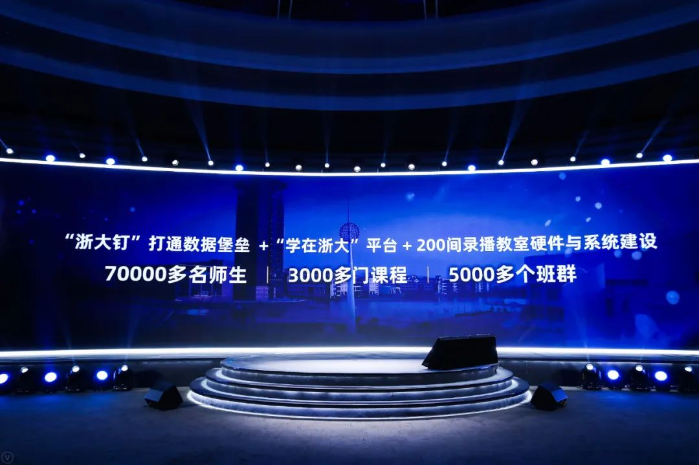

# [吴晓波：因为疫情，我们正在“孪生”一个云上的中国](https://www.36dianping.com/info/28344.html?presentid=webnews)

转载时间：2021.05.22（原文发布时间：2020.04.22）

 

转载作者：36氪企服点评小编

 

阅读次数：211次

编者按：本文来自微信公众号“吴晓波频道”（ID:wuxiaobopd），作者：吴晓波，36氪经授权发布。原题目《吴晓波：《激荡2020——疫情特别演讲》全文整理》

十多年前，我写了一本关于1978年后的中国企业变革史的书，写完后满天满地找书名，因为我想找一个词，它可以形容这个时代所有的冲突——它的跌宕性和它的戏剧性，但我很长一段时间都找不到这个词。

直到有一天，好像是天上掉下来一个词——“激荡”。我觉得这个词大概能形容过去40年的特点，就好像我家乡杭州的钱塘江一样，浩浩荡荡奔流不止，顺之者昌，逆之者亡。

而我们每个人，就像大江大河中的小小扁舟，身不由己地接受时代给予我们的所有激荡，同时，也在这样的身不由己中，完成自己的更新和塑造。

我们每一个人，每一个组织，每一个城市，每一个国家都是如此，后来我便为这本讲述企业变革史的书起了一个书名，叫《激荡三十年》。

而此时此刻，我们正在经历的2020年，也是充满着这种戏剧性、偶然性、不确定性和巨大的激荡感。

## 01 对未知保持敬畏心

海明威在《老人与海》中有一句话说：“所有的意外都是意料之中的事情。”但是，想想我们正在经历的2020年，它带给我们每个人，带给我们这个国家，甚至是带给我们这个地球的，恐怕是这些年来最大的意外感。

如果你打开自己在去年12月份或者是今年1月初所做的2020年计划，你会发现所有计划都已经面目全非。而造成这个巨大意外的，是一个我们看不见的敌人，名字叫“新冠肺炎”。

美国人类学家戴蒙德（Jared Mason Diamond）在他的著作《枪炮、病菌与钢铁》中说，整个近代史上，人类主要的敌人不是老虎、狮子，也不是洪水、地震，而是天花、流行性感冒、肺结核、疟疾、瘟疫、麻疹和霍乱，是那些我们无法用肉眼看到的流行病菌。不仅仅是近代史，人类历史的某些阶段，恐怕都曾经被这些“无形”的敌人所击倒。

欧洲中世纪时曾暴发黑死病，短短6年（1347—1353）造成2500万人死亡。历史文化名城威尼斯当年有10万人口，黑死病期间，将近一半人丧生。所以，这些看不见的病菌是人类很长时间内需要面对的无形的敌人。

到了近代，随着技术的变革，有一些思想家认为情况正在发生变化。2016年，以色列思想家尤瓦尔·赫拉利（Yuval Noah Harari）在《未来简史》中有一段非常自信的表述：

千百年来，人类一直面临三大重要生存考验：第一个是饥饿，第二个是战争，第三个是瘟疫。但是这些课题在新世纪都呈现出消失的趋势。

我在2016年读到尤瓦尔·赫拉利这本书时，非常激动，联想起戴蒙德的话，想起人类近代史上种种病毒带给我们的伤害，我多么希望赫拉利讲的这句话是正确的。他还说当战争、饥饿和瘟疫不再是致命性问题时，人类面临的就是新的挑战，例如人工智能等等。

我们很希望尤瓦尔·赫拉利的这段话代表着对从未来的某种预言，但是回想过去的十多年，从2003年的非典，到十年前的H1N1流感，到今天在非洲还未被消灭的埃博拉，再到此时此刻全球正在遭遇的这场新冠肺炎疫情，我们就会发现这位以色列的思想家太自信了。

病毒，这个看不见的敌人，两千多年来不断骚扰我们、攻击我们，试图毁灭我们，直至今天还未放弃努力。我们仍然无法在非常短的时间内找到解决它们的方法和武器，所以，当我们对技术、知识和人类本身充满自信的同时，我们也依然要对自然和未知领域保持极大的敬畏心。

## 02 中国抗疫成功的5条经验

1月23日，中国湖北省武汉市封城，我想很多年后“1·23”会成为一种国民记忆，这是2020年所有突变开始的时间点。

这张图是“1·23”以后，中国确诊新冠肺炎人数的增长曲线图。下面的是死亡人数，截至4月11日，全中国确诊的人数是83386人，累计死亡3349人，这是过去20年，我国遭遇的来自病毒的最大一次袭击。中国政府以一种非常决绝的办法——封城，来阻击这个敌人。

我有一个老师是1930年出生的，今年90岁了，住在上海。1月份我给他打电话，我说在我的认知范围内，1978年后中国从未发生过封城这样的事，国民经济体系停摆，街道上的咖啡馆、电影院、商场、工厂全部停业停产，整个的城市、整个的社会静悄悄地等待那个魔鬼离开。我请教他：您活了90岁，在这90年的历史中，有没有发生过这样的事？

老先生想了一想告诉我：“我记得1945年底，中国人民解放军打进上海，当时国民政府通过大喇叭和电台告诉上海市民，要打仗了，大家不要离开自己家里。但是从窗口向下望，满街都是要逃出这个城市的人。”

也就是说，这九十年来，即便在战争的状态下，也没有出现过整个城市静悄悄，所有的社会组织、经济组织停摆的情况。我们是付出了巨大的代价，来应对这场新冠肺炎疫情的。

大家看这个曲线，从2月中旬慢慢趋缓。今天我在台上演讲，台下还有很多的工作人员是戴着口罩的。但是，现在的杭州、上海、北京、深圳，中国绝大多数的城市交通已经恢复，商场开始营业，中国70%的工厂企业进入开工的状态。4月1日，工信部在新闻发布会上表示，截至3月28日，全国规模以上工业企业平均开工率达到了98.6%。

当整个中国的疫情增长曲线慢慢趋缓时，我们看看世界发生的情况。

中国以外第一例新冠肺炎被发现，是1月8日，发生在泰国。但是当“1·23”武汉封城时，世界上绝大多数的国家都把新冠肺炎仅仅看成是一个中国事件。

我记得我在1月中下旬去日本，下飞机后有两个记者拿着话筒问我，你们中国发生疫情，你感觉怎么样？但是当我们走出机场，走在日本的马路上，“中国新冠肺炎疫情”就只是报纸上和网络上的事情，离日本人的日常生活很远。

之后慢慢地，韩国、日本、意大利、英国、法国、德国、美国，感染新冠肺炎的人数不断增加，到了3月16日，海外确诊的病例和死亡人数双双超过了中国。

我们今天在这里演讲时，中国可能已经是全球最安全的一个避风港。如果你今天在全世界发放10000张来中国的机票和船票，我估计这10000张机票和船票的价格会被炒得非常非常昂贵。

因为在过去七十多天的时间里，中国通过种种努力，至少是在我们这个国境之内，我们成功控制住了新冠肺炎疫情的蔓延。但是看全世界的数据，还在不断上涨。

最近很多国际性的展会纷纷宣布取消，东京奥运会延期一年举行，米兰时装周取消了，汉诺威工业博览会取消了。在2020年未来几个月内，疫情对全球的经济、政治、社会还会产生怎样的冲击，在今天仍然是一个巨大的问号。

为什么从“1·23”之后到今天，仅仅七八十天的时间里，中国能够把这一疫情控制住？上海华山医院的感染科主任张文宏，因为他非常敢讲真话，现在他是一位“网红”医生。

他前两天说了一句话：“中国疫情控制的速度，在医学史上不曾发生过。”可见从一个专业流行病专家的眼光来看，在这么短时间能将一个国家范围内的疫情控制住，在医学史上都堪称奇迹。

中国是怎样做到对疫情强有力的控制呢？我想这其中一定是有一些中国经验的，我归纳了五条。

第一条中国经验，政府的高效管制。“1·23”武汉封城后，中国很多大型城市都下发了封城、停产等管制性政策，从中央、省市，到一个街道、行政村、自然村，在过去3个月内，我们所有行政系统都极大地发动起来。这次疫情是对中国执政效率和执政穿透力的极大考验，我们中央到县市到乡村的管理能力都得到了很大的验证。

第二条中国经验，全民的主动配合。疫情最严重的时期，我们所有的人都关在家里，不能随意离开，出门必须要戴口罩，从一个城市到另外一个城市，需要按规定进行7天或14天的隔离。

我想这些管制行为对于每个人而言，都是不舒服、不愉快的，但是这个国家99.9%以上的人都在尽力配合这一次政府的管制行为。因为大家都知道，在这个看不见的敌人面前，我们的能力、我们的生命、我们的取向都是一样的，政府的政策得到了全国人民的配合。

第三条中国经验，也是我们必须要感激的，是中国整个医疗系统的无畏支持。“1·23”武汉封城一个多月的时间，全国有4万多名医护人员赶往湖北抗击疫情。

“1·23”是除夕前夜，除夕夜那一天，全中国有5支医护队从广州、杭州、哈尔滨、上海、深圳出发，其中，有近300人在除夕夜当天赶到武汉。四天后，已有6000多名医护人员在湖北展开救援工作。如果没有医护人员的无私奉献，疫情的控制也不会那么高效。

我从日本回到杭州那天，刚出海关就看见出口边的凳子上有两个小姑娘，看上去非常年轻，头靠着头地睡在那里。工作人员和我讲，这两个姑娘是浙江卫校刚刚读大学的孩子，她们是00后，年龄比我女儿还小，作为志愿者来到杭州机场，协助进行疫情管制。

我看到那个场景的时候就在想，如果她们的爸爸妈妈看到自己的女儿，凌晨两点在非常空旷寒冷的机场凳子上头靠着头地睡着，他们一定会非常疼惜的，是吧？如果是我的女儿，我会非常疼惜。

不过，你再想想，可能这两个00后的姑娘就是在那张凳子上完成了她们的成人礼，是一场意外、一场灾难，让她们在一夜之间突然意识到自己的责任心，成为一个能够对社会有付出的人，对人们有帮助的人。

第四条中国经验，广大企业在这场疫情中承受了巨大的代价。仅仅是服务行业，从1月底到2月底，中国餐饮业的损失就高达5000亿人民币左右，而中国大旅游行业的损失在1万亿左右。

所以这一次，我们付出了几万亿人民币的代价完成对疫情的控制。在这次疫情中，中国每家企业和我们每个人一样，都付出了巨大的代价。

第五条中国经验，是信息能力的呈现。

如果这次新冠肺炎疫情发生在十年前或者二十年前，例如非典时期，政府高效管制是否会发生？还是会发生；全民主动配合会不会发生？还是会发生；医护无畏支援会不会发生？还是会发生；企业忍痛协作会不会发生？还是会发生——这四条经验，是中国国情所具有的传统和能力的激发。

但是在十年前、二十年前，第五项能力，或者说第五项中国经验，应该是不会发生的，因为那时候的我们谈不上所谓的信息能力。

## 03 中国的“新基建”

在写“中国企业变革史”时，我常常想，我们这个国家在过去四十年里赶上了“两趟车”：

第一趟，我们赶上了工业革命的末班车。1978年中国打开国门，中国成为了全世界最大的制造产能的承受国。我们由一个制造能力短缺的国家，成为今天的全世界第一大制造国，我们能够生产全世界60%的消费品，通过改革开放，我们幸运地赶上了工业革命“末班车”。

第二趟，更幸运的是，我们赶上了互联网的头班车。1946年世界上有了第一台电脑，在电脑被发明50年后，1990年代中期，出现了互联网把电脑连在一起。

中国有一些非常有名的企业，比如新浪、搜狐、网易、腾讯、百度、阿里、携程、360、京东，全部诞生在1998年的二季度到1999年的四季度。那十几个月，是中国互联网企业创业者集体登上舞台的时刻，也就是从那时候到今天这20年间，我们可以毫不夸张地讲，中国是被互联网改变得最彻底的国家。

现在，每年大概有三千多万中国国民去旅游，无论你到欧洲还是东南亚，你会发现在那些国家的地铁里看手机，商场里买东西，它的信息传输速度和支付方式都比中国落后。无论那是个多么发达的国家，都比中国落后。为什么呢？因为中国被互联网改造最彻底。

过去二十年，互联网对中国产业经济发起了6次重大的冲击波。

第一，它改变了人和信息的关系。

二十年前我们怎样获得新闻呢？通过看报纸、看电视。我们怎样对另外一个人表达感情呢？通过写信，把想说的话写在纸上，贴一枚8分钱的邮票寄过去。然后时间好缓慢地走，直到那个爱我的人把信寄还给我们。

有了互联网以后，我们不需要买报纸了。打开电脑你就可以看到无数的新闻，我们还会在新闻里迷路。我们如果喜欢一个人，可以给他写E-mail，或者用QQ，用一些即时通信系统，在一秒之内就告诉他“我想你了” “我想见到你” “我有什么事跟你商量”。所以互联网的第一个冲击波，是改变了人和信息的关系。

第二，互联网改变了人和服务的关系。

2002年有了淘宝，2003年有了支付宝，电子商务降临到这个国家，改变人和商品的关系。到了2008、2009年出现了一个词叫“O2O”，Online To Offline，我们如何订机票、如何订酒店、如何叫一份外卖，这些服务行业被彻底重构，线上和线下所有生产要素和服务要素的重构。

第三，互联网改变人和金钱，人和银行之间的关系。我们都知道，大概是在2013年出现了一个词，叫“互联网金融”，后来也发生了一些互联网金融的新闻事件。

第四，互联网改变了人和空间的关系。2016年底，有人提出了“新零售”，希望所有的人通过线下和线上之间的购物服务，能够形成闭环的系统。

第五，互联网又试图改变人与城市之间的关系。

过去二十年，当信息、购物、服务、金融、空间被一一改造以后，各位想想中国还有什么元素没有被改造过的？

任何国家的经济体系都有一个基础设施，叫国民经济的基础设施。这个世界上的水、空气、氧气非常便宜，无所不在，在地球生活的每一天，你都不能离开它们，它们是人生存的基础设施。

在互联网之前，这个国家的基础设施是什么呢？是交通、电力、金融、能源、教育、卫生、通信设施，我们活在这个地球上，少了这其中任何一个，都没法儿好好过日子，这是关系到国计民生的支柱性产业和基础设施。

在今天，你会发现中国的基础设施不仅仅是交通、电力、金融、能源、教育、卫生、通信设施，还有什么，是我们离不开的？我们早上睁开眼和晚上睡觉时，都永远无法离开的东西——社交、电子商务、移动支付、物流、媒体资讯，我想缺少这其中任何一项，我们在今天的中国都是寸步难行，无法过上毫无阻碍的正常生活。

这意味着，过去二十年，国民经济的基础设施由物理性层面叠加出了一个信息化层面的基础设施。

在今天中国的所有支柱性体系里，物理化系统里的国民经济基础设施，大部分都是被国有企业控制，由央企和地方支柱性企业管控大部分的物理性基础设施。而信息化的基础设施，就是由1998—1999年诞生的互联网公司，这批民营企业造就的。今天中国的产业经济、所有制结构都因此发生了巨大的变化——互联网再造了国民经济的基础设施。

2015年，第一届大数据博览会在贵州贵阳举办，这是中国第一次举办大数据博览会。中国很多大数据公司的服务器都装在贵阳的一些山洞里面，使之成为中国的“大数据之城”。阿里巴巴的创始人马云在2015年这次会议上进行演讲，他讲了一句话：

未来最大的能源不是石油而是大数据。

各位知道石油是工业革命的基础，所有机床和油轮的转动都不能没有石油。我们国家有一座城市——大庆。“大庆”这个名字的来源，就是因为1959年我们在那个地方发现一个油田，周恩来总理满含热泪地说：“中国今天终于脱掉了贫油国家的这顶帽子，我们的国民经济终于具备了独立运转的能力。”所以给那个地方取名“大庆”。

但是在2015年，马云说“未来最大的能源不是石油，而是大数据”。在当时，这句话对绝大多数的国民、企业家、从业者和媒体人而言，还是很陌生的，大家都在想，是不是马云老师又在危言耸听了。但是在今天，2020年的4月份，我们发现这句话可能是对的，“未来最大的能源不再是石油，而是大数据”。

我们确实看到，这次中国新冠肺炎疫情的有效控制，除了政府、全民的配合，医护人员的无私支持，企业的忍痛协作以外，另外一个最重要的能力是过去二十年来，这个被互联网改变得最为彻底的国家，它所形成的智能化信息能力在拯救这个国家。

## 04 疫情下的城市治理

我们一个一个层面来分析，什么叫智能拯救中国。

我们先来看看疫情下的城市治理。“1·23”是什么事情？武汉封城。我们对新冠肺炎疫情的控制是从城市开始的。那么，哪些城市在过去的七八十天里，对疫情管制能力最强？

我的家乡在杭州，它可以说是全球第一座有“城市大脑”的城市。我们看1—2月份的数据，除了湖北以外，全国确诊人数最多的省份就是浙江省。因为浙江省的民营企业很发达，有很多湖北人在浙江打工，也有很多浙商在湖北和中部一带经商，人口大量流动造成很长一段时间里，浙江省的确诊和疑似患者排全国第二位。

但是你也会发现，在过去这段时间里，浙江省没有出现疫情暴发和蔓延的景象，而且死亡率非常低，甚至其省会城市杭州，在2月19日宣布西湖景区开放——这时候距离“1·23”只过去了不到一个月，杭州西湖是全中国新冠肺炎疫情暴发期间，第一批恢复开放的大型景区之一。

有一次我和某位市领导交流，我说咱们胆子忒大了，全中国都静悄悄的，我们把西湖景区开放，那天西湖边有约五千多名游客，你不怕其中出现哪怕就一个疑似或确诊的患者吗？

他告诉我，吴老师你不用担心，我们做这件事是冒险了，但是我们是有“城市大脑”的城市，我们对此做好了充分应对措施。

作为全国感染人数排名第二的省份的省会城市，为什么杭州市敢第一个开放西湖景区？因为过去几年，这座城市干了一件事，希望用智能化、数据化的方式来管理这座城市。

两年前，我在浙江卫视参加知识跨年演讲，与我同台的是阿里云创始人、中国工程院院士王坚，原来叫“王博士”，现在叫“王院士”。

我记得王坚在那次节目中讲的一句话：“世界上最遥远的距离不是从南极到北极，而是从红绿灯到交通摄像头。”他说，这两个东西通常在同一根杆子上，但是过去几十年，它俩从未被联系起来。马路交通是否堵塞，红绿灯管红绿灯的事儿，交通摄像头管交通摄像头的事，它们没有任何关联。

我们去到国外，看到他们有一个办法，如果你想过十字路口，就摁一下电线杆的按钮，你按完按钮，红绿灯就可以转换。那个红绿灯靠什么控制？靠人脑控制，靠人类的手控制。

而过去的几年，杭州市就在干一件事，把红绿灯和交通摄像头连起来。杭州市“城市大脑”的第一步，就是管制了杭州市的十几个最拥堵的交通路口，把它们的红绿灯和交通摄像头联系起来，就可以知道此时此刻这条马路有没有车经过。这十几个十字路口控制完以后，又是一千多个十字路口，再接着变成了两千多个十字路口。

朋友们，在两年前，杭州是全中国交通堵塞率排名第3的城市，但是今天，杭州是全中国交通堵塞率排第57名的城市。我们是怎么从第3名掉到了第57名呢？是杭州市多了很多的红绿灯，还是杭州市多了很多的交通警察？都没有，我们就是把红绿灯和交通摄像头连起来了，形成了一张以交通为要素的“交通大脑”。这仅仅是“城市大脑”中的一个脑袋，就是“交通大脑”。

以此类推，除了交通，“城市大脑”要把很多的社会系统、政务系统、语音信息、视频信息和城市动态感知的信息联系起来，形成城市运营的基础性设施，然后把这些基础系统连接到两个平台：一个是政企在线服务平台，即政府和企业之间、营利性组织之间的关系平台；另一个是社会治理的平台，即政府和这个城市几百万市民的交互关系。

当信息输入，经过各方处理，就可以分成便民服务、重点区域服务、社会治理指数、未来社区、平安校园等服务，以及协同工作指导督查、跨部门协同办公、业务协同支撑、智能辅助、企业服务，最终形成了这两个平台。

当数据输入这两个平台后，进行联动协同，就形成了我们的“城市大脑”模型。

杭州市从2016年开始建立“城市大脑”，到现在过去了四年。为什么杭州市敢于在2月19日全中国疫情最严重的时候开放景区呢？为什么浙江省能够在感染病例数据全国排名第二的背景下有效控制疫情呢？除了行政效率，至关重要的就是我们掌握了新的工具和能力——“城市大脑”。

在2月11日，杭州市推出了“杭州健康码”。我们每个人手机里面都有，在外面行走出入，都会被要求出示杭州绿码，检测体温。杭州绿码是什么呢？本质上是把卫生系统整合，进行全民覆盖、动态管理。

当杭州小区实施最严格的封闭式管理时，我们还是要到超市买东西，一户家庭每两天可以让一个人出门采购生活必需品，如何确保他是安全的呢？就是依靠健康码，它以最便捷的方式对我们的健康进行认定，这是全球第一个绿码模型。

如果杭州没有从2016年开始进行“城市大脑”建设，等到今年年初疫情暴发，市委书记拍脑袋说，明天我们搞一个杭州绿码，能行吗？肯定不行。健康码是在正在成长中的“城市大脑”的基础设施上建设的。

2月11日杭州健康码出现后，全国各地都推出了健康码，名字也都不一样，有的是健康码，有的叫申保通，但是它的模型就是杭州绿码。

全世界正在抗疫的国家和城市，如果有一点“城市大脑”的基础设施，我非常建议他们学习杭州健康码的经验。因为这是在应急环境下，改变城市运转的基础工具和城市运营的一种方式。

今天的中国，不仅仅杭州市在进行这样的城市治理。我们看到河南郑州，在10天时间里建成了7个防疫系统，从小区，到医院，到政策辅导，到定点人员的排查，到整个医疗系统、物流系统，这7个防疫系统的动态管理在10天内建成，也是得益于郑州过去几年具备了“城市大脑”的基础建设。

这些成功经验告诉我们，什么是今天的城市治理所必须具备的能力，这件事正在被重新定义。

如果一座城市高楼林立，有很多绿地，风景优美，算不算一个合格的城市呢？你说了不算，谁说了算？老天爷说了算，它只要下一场雨就知道了。有的城市下过雨后仍然高楼林立，绿地茵茵，人们的生活正常进行，但有的城市在经过一场雨后，完了，发生水灾了，汽车被淹在水里，冲锋艇就上街了。

中国很多超大城市都曾经发生过诸如此类的悲剧。所以法国大作家雨果说，下水道是一座城市的良心。而今天，我们要说一座城市的“城市大脑”，一座城市的云能力，决定了这座城市的应急能力。

过去三个月，我们非常清晰地看到那些具备了“城市大脑”能力，具备了云管理能力的城市，是疫情防控效率最高的城市。

经过这次疫情，我们也越来越强烈地意识到，在人工智能的环境下架构城市的智能化是如此重要——这次疫情给中国所有的市长们好好地上了一堂课。

## 05 疫情下的企业管理 

那么在疫情下，企业又有怎样的表现呢？

过去这三个月，中国倒闭了三十万家规模以上企业，我们付出了几百、几万亿的代价控制疫情。但是，老板还要赚钱，员工还要工作，在整个社会完全停滞的情况下，企业该如何自救呢？

浙江有一家知名鞋企“红蜻蜓”，老板姓钱。过去三十多年，中国的鞋类品牌销售都遵循一个指标，在全国开设连锁店。中国有2800多个县，如果你可以在每个县都开设一家专卖店那就非常厉害了，你就是全国品牌。

在过去二十多年，这位钱老板就干一件事：吭哧吭哧地开连锁店，开了4000多家。他可以拍胸脯说，我在全国有4000多家连锁店，所以我的红蜻蜓是全国性品牌。

但是疫情暴发了，钱老板遇到了创业以来最具有毁灭性的事件。4000多家门店全部停业，店里8000多名员工每个月还要领几千万的工资，更可怕的是，这种情况也不知道会持续多久。什么时候会开城呢？开城后还有多少人直奔你的专卖店来呢？你8000名员工还剩多少人呢？几百个经销商要如何应对呢？

这个世界上有很多变化，而人的变化是通常由两种情况带来的：一种是主动求变，主动迎接和拥抱变化；另一种是被打到墙角，绝地求生的本能。

我觉得红蜻蜓这次转型属于后者，本能的绝地反弹。我的店都关掉了，我的员工天天待在家里怎么办？还是得卖鞋。怎样卖鞋？网上去卖。于是，钱老板亲自带领员工上阵直播，过去两个月他们举办了3338场直播，发动了8583个员工，共有750个经销商参与，最后通过直播卖鞋收获了5300万的营业额。

经历这样的变化后，钱老板说了三个“没有”：

第一个“没有”——如果没有疫情，我们不会想到全体动员做直播。钱老板50岁了，不可能去做直播。也许我们会寄希望于淘宝、天猫店、拼多多卖货，去小红书种种草，但是如果今天没有疫情，他是不会被逼到这条路上去的。

第二个“没有”——如果公司之前没有建立一套CRM系统，8000多个员工要如何联系，700多个经销商又该在哪个平台上互动，所有的数据要怎样完成统计？红蜻蜓之所以可以做3000多场直播，发动8000多名员工，是因为在疫情前已经有2—3年数据化能力建设，依靠CRM和云服务系统，才能在网上卖掉5000多万的货。

第三个“没有”——如果没有这次实验，我们不会意识到世界已经改变了，今天的太阳不是昨天的太阳了，我们永远也回不到24小时之前了。

其实发出这些感慨的，不仅仅是红蜻蜓的钱老板，很多实体企业的老板在过去2个多月都亲自上阵，他们有的是50后，有的是60后，有的是70后，有些可能从来没在网上买过东西，更别说在网上卖过东西。

例如我的一个朋友许知远同学，疫情前他来杭州做《十三邀》，我跟他都是第一次走进淘宝网红店，看小姑娘对着手机屏幕卖牛奶、卖衣服，我们俩看着，都张嘴傻站在那儿。

许知远开了一个书店叫“单向街”，我也是股东，十多年从没有拿到过分红，完全靠情怀撑着。这次疫情来了，情怀也靠不住了。因为情怀再大，门口没有人，书店还是开不下去。那许知远怎么办呢？他跑到薇娅那儿做直播去了。

以前，许知远经常对我说，晓波，你不要去做生意，你好好地待在书房写东西不好吗？

我说不行，这个世界已经发生了巨大的变化，如果我不到跑一线，不深入去看看这个国家的细胞怎样运转，我怎么写财经作品呢？

这次他比我还积极，毕竟我还从没去薇娅那儿卖过书呢，这兄弟已经去了。为什么这些知识分子、企业家纷纷跑去做直播了呢？所有人都是被危机逼到死路上，不得不做出应对和改变。

我们巴九灵有一个App叫“890新商学”，很小，现在大概有30多万注册用户。我们还有一个部门专门做企业家培训，每年培训近3000名企业家，做线下活动，每场最少200人，最多800人。

原本，企业大学在年后计划有十多场授课演讲，“1·23”后全部取消，我对小伙伴们说，没有办法，全部要转型。

于是，他们做了一个“加油！老板”的线上课程包。2月16日，我也亲自上阵，做了自己第一次线上直播，在此之前我也没想到利用互联网平台做直播，分享企业应该如何自救。从2月16日至今，我们一共举办了23场直播课，累计1500万人次观看，其中我讲了3场。【点击进入App，观看直播合集】

我从没有做过直播，但就像许知远一样，他必须要在薇娅的直播间为他的单向街求生存，我也必须要在手机前、在书房里为我的“890新商学”求生存。做完这些直播，我发现，今天的太阳不再是昨天的太阳，整个的企业教育和商业环境，都发生了巨大的变化。

我想，过去70多天中，所有在疫情下挣扎的人们，都会相信我所讲的这句话：“在这个充满黑天鹅的时代，我们只有向死而生。”所有变化都不是在一个风和日丽的日子里发生的，而是在雷电交加的时候，逼着你做出选择。

但向死而生并不是一时冲动，至少在商业上不仅仅是冲动，你需要有三种东西。

“生”的方向在哪里？怎样求生？用什么办法到达那里呢？

条条大路通罗马，首先方向对了，那个方向叫“罗马”，然后你要找对路径，有的人用3天，有的人用30年，都能到罗马，你来选择一条路。确定路径后，你还需要选择工具，有的骑车、有的骑马、有的赶驴。

作为企业精英，当黑天鹅发生时，我们要告别过去，跳出舒适区，跳出那四千个专卖店给你造成的舒适区，跳出一个书店给你造成的舒适区，跳出传统企业培训给你造成的舒适区，找到改变的方向、路径，以及抵达的工具，而这些能够被量化的能力，就是一个企业家的创新力。

大家都知道蒙牛，疫情来了，员工不能上班，那牛能不上班吗？总不能都关14天隔离吧。它们还得“上班”挤牛奶，向全中国的消费者供应你的蒙牛牛奶。

我们看照片，蒙牛的牛和普通的牛有什么区别呢？它脖子上佩戴着一个智能脖环，脖环内置传感器，牛和人一样，生病感冒发烧时，心跳、体温都会发生变化，通过智能脖环抓取数据，就可以检测牛的健康状况。

过去几年，蒙牛一直在以智能的方式采集这一万头牛的源头数据，然后通过PaaS系统和SaaS系统，从牛的健康到牛奶的安全，管制整个的供应链系统。蒙牛还通过钉钉这样的专业工具，将员工、经销商、供应链每个环节上的人员和渠道全部有效地管制起来。

在疫情的环境下，像蒙牛这样的企业，怎样保证每个消费者每天拿到的每一瓶牛奶都是健康的呢？除了责任心、勇气以外，还很重要的就是企业必须具备智能化的工具。工具再造了生产力，工具再造了企业的核心竞争力。

我还调研过一家制造业企业鸿达模具，它生产的产品叫电机铁芯模具。它是中国典型的中小企业，企业不大，一年营收约5000多万，员工200多人，但其产品在中国有70%的市场占有率。

这类企业很不起眼，但是中国的国民经济中有一个数据形容它，叫“56789”——它们贡献了中国50%的税收，60%的GDP，70%的专利新产品发明，80%的就业和90%的企业数量。如果它们垮掉了，中国就垮掉了。

这次新冠肺炎疫情无疑对鸿达这样的企业造成巨大冲击，最艰难的时候只有70人上班，整体产能下降超过60%。怎么办呢？他们采用了阿里云的数字工厂平台，在云的意义上重构公司的管理能力，把所有的系统——员工的报到、员工的复工管理、售后管理，全部通过平台进行工厂再现。

迈克尔·波特说：“没有一个战略是自发而生的。” 每个企业都有战略，在调整战略时，肯定不是创始人和决策者躲在一个办公室密谋产生结果。战略哪里来的？战略都是基于竞争产生的，所以波特的那本书叫《竞争战略》。

竞争，有的是来自你的对手，有的是来自实验室，有的是来自危机带给你的挑战，当这些外在、内在的因素发生变化时，一个企业的战略才有可能发生变化。

用凯文·凯利的话来说，未来消灭你的那个人，永远不会出现在你写的名单里。这就是今天这个不确定性的世界带给我们的挑战，也是这个商业世界的性感之处。所有的变化都以你没有预料到的方式和角度对你发动了攻击。

## 06 疫情下的公共服务系统 

再来看看疫情治理中，我们的公共服务系统。

封城以后，社会的很多要素和机能也被迫停滞。湖北有一家企业叫农信银行，它服务的都是农民，养鸡的、养鸭的、养猪的。

在疫情发生时，他们是这个社会最脆弱的细胞，不仅自己的生命安全受到威胁，自己的财产——那些猪、鸡、鸭，也受到严重的生命威胁，这些农民没钱买饲料喂养它们，养活了它们也不知道能卖给谁。湖北农信银行服务的就是这一群人。

当疫情发生后，农信银行自己的信贷系统停滞了，怎么办？他们把所有的数据搬到线上，建构了中国第一个有云营业厅的银行，让那些养鸡、养鸭、养猪的农户，通过在线视频进行开户、面签和核准，通过云平台和云视频双录，向小微农户发放贷款，在过去两个多月，他们共发放了1.3亿的贷款。

这1.3亿的背后，就是几万家、十几万家养猪、养鸡、养鸭农户，他们的生机和他们的生命线。智能化大数据拯救了这家银行，也拯救了这些数以万计的农户。

疫情期间，广州发生了一个非常紧急的事件。当时有一艘邮轮停靠在广州港，邮轮上共有8000多位游客，结果在这些游客中有人被确诊新冠肺炎。于是，广州疾控中心必须立刻对这8000多人员进行普查，调查他们的行动路线和健康状况。

将8000多位从广州港发散出去的旅客一一找到，疾控中心需要花多长时间？7天、10天？无论是7天还是10天，对于新冠肺炎疫情这样的状况来讲，后果都是不堪设想的，而答案是：一个月。

于是，广州疾控中心马上找到阿里云寻求援助，阿里云团队在早上8点40分接到需求，下午15点30分，他们完成了系统搭建，通过智能系统将短信发布给8000名游客，到了晚上23点47分，这8000名游客的排查结果已经全部报送到广州疾控中心的办公桌上。

这样的速度和能力，不是某一个人或某一个组织靠激情、靠口号、靠勤勉就可以完成的，它靠的是今天正在发生的这一场智能工具革命。依靠工具产生的效率，改变以往很难想象的公共服务任务和需求。

例如社区。我们在疫情期间，可以去社区领取口罩。想想社区的网格员每天坐在办公室要联系成千上万户人家发口罩，该打多少电话？在应急环境下，这肯定是一个难以完成的任务，好在我们现在可以靠另外一个“人”——机器人，通过AI呼叫联系社区人员，把口罩精准、及时地交付到每一个人的手上。

再举个例子，学校。浙江大学是全中国学生人数较多的大学，我父母就在浙大工作，我从小在学校校区里生活成长。突然有一天，因为疫情的关系学校关闭，70000多名师生不能上课了，怎么办？

浙江大学在7天时间里，在云上建设了一个浙江大学。这件事并不轻松，物理系、化学系、电子工程系，各系都是独立的岛屿，每天有不同的老师在不同的教室上课。要在7天建设云上的浙江大学，如果没有工具的帮助，如果没有云服务，这可以说是一个不可能的任务。

但是浙大通过“浙大钉”的方式，打通各个院系间的系统堡垒，将线下200多间教室变成了能够实现线上录播教学的场景，并且组建了5000多个班级群，让3000多门课程的老师在自己的家里和书房上课。7天以后，浙大7万多名师生得以在自己的家里，继续正常的大学教育。

这就是云技术给这个国家、这个社会、这个大学造就的新的能力。

如果没有这次疫情，我们可能不会知道杭州已经有了全球第一个“城市大脑”，红蜻蜓的钱老板不会直播，浙江大学也不会想到立刻建一个云上大学。可能其中有些项目是在原本的规划里，但是计划是两三年后，“1·23”这次疫情后，这些任务迅速摆在你面前，需要你在7个小时、7天内完成。

当然，这些压迫式的任务会给中国的城市治理、企业运营和社会公共服务造成巨大冲击和挑战。我们刚才所讲到的这些案例和它们所产生的变化，原本在70天前都不可能发生，也不可能都集中式发生。当这些能力发生时，中国的确诊人数曲线已经往下走了，但是在全球范围内呢？我们看到，英国首相进过ICU，美国好莱坞明星都已被感染，在很多国家的数据曲线急剧上扬。

这时候我们中国的企业家朋友，就在想一件事：过去70天里面我们面对灾难的经验，我们所形成的面对挑战的能力，有没有可能输出给全世界呢？

接下来，我们来看看，此时此刻正在发生的事。

## 07 中国经验输出给全球

浙江大学附属第一医院有一位很有名的医生李兰娟，她是中国传染病领域名列前茅的专家，在过去几十天里面，她和钟南山成为中国抗疫战争里最有名的两大院士。疫情发生时，她在第一时间带团队赶到武汉治疗了大量新冠肺炎病人，过去70天里，形成了对新冠肺炎的临床治疗和判断能力。

那有没有可能把李兰娟团队的经验，和浙江大学附属第一医院的能力，输出给全世界的医院呢？

可以的。浙江大学附属第一医院建立了一个云医生平台，通过钉钉的工具，和全世界400多家医院形成了医生之间的互通关系。这种交流互通可以实时到达，背后可能就是几十万、上百万条生命。这就是我们中国医生正在做的事情——开始把自己抗击疫情的能力进行输出。

阿里云本身也在输出能力，阿里云达摩院输出AI技术，一个是CT影像分析，一个是全基因组的测序分析。

阿里云AI诊断技术帮助医生通过CT影像快速进行新冠肺炎筛查，已在中国近170家医院上线，20秒即可完成一次CT诊断，准确率达96%。目前，阿里云向全球免费开放这一技术，已经在日本医院落地使用，另有数十个国家正在推进落地。

再例如全基因组测序分析，它覆盖95%以上的病毒基因，优势是准确度达到99%以上，并且平均每个样本的总处理速度提升了5倍，数据分析速度提升了近50倍。在国内，武汉市和浙江省内的102个县级单位的样本全部交由这个技术进行处理。

20多年前，中国国民经济由物理层面的基础设施决定：交通、电力、能源、卫生、教育系统等等物理化能力。而20年后的今天，信息化层面的基础设施出现了，从社交到电商、到支付、到物流、到信息咨询。

当国民经济的技术设施开始出现物理化和信息化双重叠加时，在疫情的冲击下，或者说，在越紧急的情况下，它们所呈现出的生产效率和生产能力越为明显。在这次疫情中，我们正在孪生出一个云上的中国，我们的生意、生活、社交、服务，以及我们很多的城市管理都被交托至云端，这是这次疫情挑战中，我们这个国家所做出众多应对的基础。

英国的传奇首相丘吉尔曾经在二战爆发时说：

纳粹德国的飞机正在轰炸我们的伦敦城，整个欧洲都处于被纳粹势力的攻击之下，欧洲有可能沦陷，但是我们千万不要浪费了这场危机，因为危机会把我们逼到墙角，让我们看清自己，那个看到平时在潜意识、在舒适区、在正常生活环境下所没有发现的自己。

人的能力，城市的能力，企业的能力，都在危机环境下产生了。在封城、几十万家企业倒闭、出现上万亿的损失之后，我们也因此发现了新的可能性。

## 08 被全速重构的新基建

今天有一个词，“新基建”，在疫情下，我们的新基建正在被全速重构。

第一个就是云服务应用平台，经过新冠肺炎疫情得到了极大的激发和使用。

第二个是“城市大脑”工程的建设。杭州健康码、杭州第一个开放西湖景区，都带给全中国的市长朋友们一个极大的提示，从此时此刻开始，我们怎样像杭州、郑州、深圳一样，也为我们的城市建构一个“城市大脑”。

下一次危机，可能不叫新冠肺炎了，谁都不知道它叫什么，当它来临的时候，我们的城市能否快速应对？所以，本次疫情必然推动全国“城市大脑”工程的建设。

第三个，全国联网系统正在全速重构。前两天我从杭州坐高铁到上海，下车后，我拿着手机扫描了上海高铁站的二维码，上海的卫生系统就立刻通过我的杭州绿码确认我是一个健康人，我得以顺利进入上海，自由行走。

在疫情前，上海和杭州两个城市的卫生系统里公民卫生系统是隔绝的，中国存在无数的信息孤岛，但是疫情迫使大家必须交换信息，打通系统。所以这次新冠肺炎疫情，有可能推动全国信息联网系统的建设。

第四个，被全速重构的是5G网络建设。现在我们对数据的传输速度，对通信系统环境的要求越来越高了。我们知道2019年被称为“5G元年”，2019年中国的5G基站达到10万个，2020年年底预计达到60万个，三年后我们再做演讲的时候，中国将会有400万个5G基站，到那个时候中国就会变成5G全面覆盖的国家，而5G会成为新基建的重要基础建设设施。

第五个，公共健康卫生系统。新冠肺炎疫情让我们意识到中国的公共健康卫生系统非常薄弱，医护人员是这次抗疫行动中最重要的贡献者，但中国每千人所拥有的护士人数是欧盟的1/10，是美国的1/12。我们很多医院的设施仍然无法满足广大城乡民众对健康的需求。

很多人都知道，每天早上城市里两个地方的人最多，一个是地铁站，一个是医院挂号处，为什么这些地方出现了拥堵和堵塞，就是因为供给不足。所以新冠肺炎疫情给我们带来提示，未来我们是否可以在公共健康卫生领域投入更多，我们的医院、医疗设备、药品流通等领域有没有可能发生新的变化。

当然，这些应用和系统可能很久以前就出现在政府的工作规划中，只不过是2020年的疫情放大了它们的迫切性，使之迅速被提上议事日程，加速新基建的建设。

接下来我们看看被全速重构的产业。产业作为基础建设，也在被全速重构。如果再过十年，我有机会再写一本中国企业变革史，我会把2020年称为“中国企业服务软件的元年”。

今天我们打开App store排行榜，前十名中有5—6个都是企业服务的软件。70天前，它们的排名可能在一百名以后，为什么今天会跑到前五、前三甚至是第一名呢？因为疫情，员工无法返工，于是被迫使用在线视频，开设在线课程，将信息交付和管理系统全部放进去。在使用的过程中，应用不断迭代，等到疫情结束后，它们就会变成一种新的工作方式、生活方式、运营方式。所以变化养成了新的可能性和新的方式。

人工智能产业将走出寒冬。Gartner曲线认为，人工智能第一次出现在2012年，在2016年达到爆点，满城都在讨论人工智能，资本投入几百亿的钱，但对人工智能的认知还是非常贫瘠。中国在2012—2016年创业的人工智能公司，90%都已经倒闭，因为找不到应用场景。

但是这一年，越来越多的云应用产生了，越来越多的AI服务产生了，人工智能好像突然走出寒冬，找到了应用场景。

接下去是死而复生的在线教育产业。中国人对教育的投入无比巨大，但线上、线下教育要怎么融合呢？这个问题，在很长一段时间里，连新东方的俞敏洪都没想明白。但因为疫情，连浙江大学这样一座正常教育体制内的大学都需要在网上建一所云大学，让几万名师生在网上读书。疫情也激发了在线教育的复苏和一种新的可能性。

最后，是营销模式全面迭代的消费品产业。我们看到卖鞋子、卖床垫的，像我们这样卖企业培训的，所有与产品相关的企业，在突然间面临一个既有的流通渠道瓦解的情况，我们必须寻找新的商业模式。

所以在未来，线上营销、社区化营销、私域流量影响、会员营销等等都会变成消费品企业、服务型企业运营的常态。同时，这也意味着在未来，有一些工作很可能就不见了。如果鞋店的工作人员需要一边在实体店卖鞋，一边在直播里卖鞋，将实体店方圆1公里以内的消费者导流到一个用户平台上进行24小时运营和服务，那么没有在线化直播能力和运营能力的营业员就会被淘汰。

因此，在这个产业被彻底重构的环境下，那些更刚性的、更坚硬的、缺乏柔性能力的、无法自我迭代和不具备学习能力的职业就会“被消失”。

尤瓦尔·赫拉利在《未来简史》中曾经说道：“到2030年，99%的人会变成无用之人。”

在这次疫情下，我们发现这个变化的确在发生，我们每个人的生存能力、职业能力、学习能力，都得到了极大的考验和极大的印证。

每一次破坏的结果，都意味着一次重生。但我们也必须要明白，破坏发生意味着既有秩序的瓦解，而破坏所产生的重生，一定不是一次愉快的重生，一定不是一次皆大欢喜的重生。在重生的过程中，充满着各种挣扎、冲突和恐惧。越大的破坏，所带来的重生就越彻底，但是它给我们带来的恐惧也越庞大。

写《未来简史》的尤瓦尔·赫拉利前两天在网上写了一篇文章——《新冠病毒之后的世界》，这篇文章在全世界的媒体和社交平台上流传甚广。他说什么呢？

他说，此次新冠肺炎疫情造成了一个景象，它逼迫各国政府在非常短的时间之内——可能是24小时、7天或者是一个月——做出一个在过往可能需要一年、几年的时间去讨论、让公民公投后才能做出的结论。比如说意大利需不需要封城，英国人上街要不要强制戴口罩，可能过往花几年时间讨论才能做出的决定，今天必须48小时之内做出，它逼迫整个行政系统必须产生自己的应对方法。

赫拉利提出了一个好问题，新冠肺炎疫情把各国的国家治理能力和大数据有可能对产业和个人隐私造成的挑战推至台面上，就像1776年有人把羊吃人的信息放到报纸上进行讨论一样。接下来，就是人用什么样的制度和能力，来攻克这些变化给我们带来的负阻力。

变化带来重生，所有的重生一定伴随新的恐惧诞生，面对恐惧诞生迎难而战的能力，就是人类进步的基本动力。

经过这次疫情，我想每个人都在重新思考一些问题。比如说：什么是价值，怎样体现人的生存的价值？什么是好的城市，什么是好的企业，什么是好的员工？再比如：什么是健康，什么是财富，金钱对我们到底意味着什么？我们还会思考，什么是快乐？

就好像我在杭州机场看到那两个00后的姑娘，疲倦地头靠着头地睡在机场长凳上，那个场景是疫情带给我们的压迫，但是在这个场景的背后，可能意味着一个人的重生，一个人成长礼的发生。

甚至是赫拉利对人类进步所提出的种种警告，都是对我们生存状况的一种警示，警示我们面对挑战必须要做出的应对。

我特别喜欢一个加拿大的歌手，叫做Cohen（莱昂纳德·诺曼·科恩，Leonard Norman Cohen），他写过一首歌词，其中一句歌词是：“万物皆有裂痕处，那是光漏进来的地方。”

我特别喜欢他唱的这首歌，疫情就像一块突然崩裂的巨石，如果一块巨大的石头在我们面前崩裂，有的人感到绝望和恐惧，觉得末日即将来临；而有的人则看见了科恩所说的万物皆有裂痕处，看到了漏进来的光，然后迎向光接受挑战。

我想每个城市、每个人、每个企业，我们的国家，包括今天正在经受挑战的所有国家和人民，我们都在一块崩裂的巨石前看到了光，在进行着自己的挑战。

2020年才刚刚开始，就充满戏剧性和挑战，我们期待到2020年结束时，我们可以对自己说：在过去这个难忘的、不可选择的一年，我们让自己、让这个国家变得更好。

在这里，我们祝福2020，祝福中国，祝福这个世界。

本文根据吴晓波最新演讲《激荡2020——疫情特别演讲》现场速记整理

该文观点仅代表作者本人，36氪系信息发布平台，36氪仅提供信息存储空间服务。