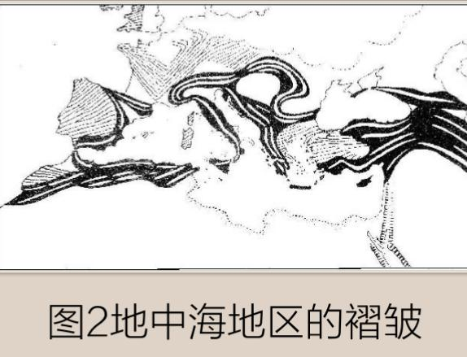

# 荐读

本月17日，我将开启意大利文艺复兴之旅，为期11天。重点目的地有佛罗伦萨、米兰和威尼斯，而这三个地点中我最看重的是佛罗伦萨。而且我的鸿学院核心课程《辉煌的佛罗伦萨》也将目光聚焦在这座现代金融起源之城。

因此本月荐书是《美第奇家族的兴衰》，作者是英国历史学者克里斯托弗·希伯特(Christopher Hibbert)。让我们一起来关注这座城里的大佬：美第奇家族。

现代金融发源于意大利的威尼斯、比萨、佛罗伦萨等商业共和国，佛罗伦萨后来居上，成为欧洲制造业中心、地中海贸易中心、基督教世界金融中心、文艺复兴中心、共和制度中心，成为文艺复兴时期欧洲世界的翘楚。而为此在政治、经济和文化等领域做出杰出贡献的美第奇家族自然不容忽视。

不读美第奇家族无法看清佛罗伦萨的兴衰成败，不读佛罗伦萨无法了解现代金融体系的发展历程。

【本书导读】家族兴衰背后不应忽视的“影子”
《美第奇家族的兴衰》核心是美第奇家族的发迹和没落，始于15世纪30年代，美第奇王朝在近乎传奇的科西莫·德·美第奇的领导下崛起。中间经历了他们作为文艺复兴时期一些伟大艺术家和建筑师的资助者的黄金时代，再到美第奇家族的各位教皇和大公统治的时代，直至佛罗伦萨陷入衰败与破产以及1737年美第奇家族血脉的终结。

看尽美第奇家族从卑微到拥有强大的金融网络，再到掌握政治宗教的权力，最后到血脉终结的历史轨迹。我们会发现这背后总有个“影子”挥之不去，这便是佛罗伦萨的世界金融中心地位，它的崛起和衰败才是左右美第奇家族命运的重要力量。
因此，美第奇家族的兴衰和佛罗伦萨的兴衰不可割裂开来。

分析历史需具备时代眼光和世界视角，在时间和空间的坐标系中将美第奇家族定位。在此过程中，你会发现，美第奇家族的所做所为反映着时代发展变化的潜在趋势，它的不断积累必然会发生表象化的大变化，这就是所谓的“潜流突变”。

所以，本书的读法要着重了解佛罗伦萨和意大利半岛政治经济文化的相关知识，将家族故事与时代背景结合起来。

希望通过这样的阅读方法了解这段历史，把握意大利民族性的细微特质，为我们看清当下意大利局势、意大利南北方差异、意大利与欧盟关系等问题提供不一样的思路。

希望大家能够通过阅读这本书，找到发现近代意大利、发现现代金融体系根系的线索，建立起理解西方政治经济的框架，更好地指导我们今天的决策。

# 城市和公司富强的原因初探 ——《美第奇家族的兴衰》读后感 第II版 by 成小精大白痴

**【前言】**

1.因要备考注会，工作任务繁重，抽出的时间无法满足阅读并提取大量客观事实验证主观观点的要求。但，我提出的一些思路，或许可以被用来当做老师思想的某些素材，不管怎样，我尽力了。

2.通过《美第奇家族的兴衰》这本书，我将我认为目前有兴趣的、对现实与指导意义的主题以章呈现，章与章之间并没有太大的逻辑关系，仅用于产生思想的共鸣，特此说明。

**第一章：利润的构成**

 

十三世纪末，佛罗伦萨的巴尔迪、 佩鲁齐和阿奇艾乌奥利三大家族成为遍及欧洲最大的银行机构，十四世纪40年代，上述家族破产后，美帝奇家族方能重组资产逐渐壮大，当经济壮大后才有政治、文艺。故本章主要讨论1000-14世纪中叶（欧洲黑死病导致经济萧条之前）的事件，寻找佛罗伦萨壮大的原因。

以现代会计学为基础，按中世纪毛纺织业的成本构成修正后，**利润=①营业收入-②经营成本-③税金及附加-④财务费用-⑤管理费用-⑥销售费用**

**①** **营业收入=单价\*销量**

**单价**:由于货币流通情况在大部分书籍中找不到，故单价仅假设为稀少的东西更贵，普遍的东西单价相对较高，忽略通货膨胀影响。 

**销量：** 

**一是打通贸易通路**

1.威尼斯人因其转口贸易模式，与法兰克人王国等缔结贸易协定，威尼斯人与多国贸易协定逐渐扩张市场，佛罗伦萨货物通过这些城市转口贸易出海；

2.十二世纪，地中海地区的海上贸易扩张到法兰西和西班牙海岸，波罗的海的一些新兴城市，与北海诸港联合形成汉萨同盟；

3.1202年，第四次十字军东征，进攻君士坦丁堡，打通东方和非洲的贸易通道；

4.蒙古攻下巴格达，继续西征，连接欧洲和世界各地的贸易通道——丝绸之路被打通:从成吉思汗到蒙哥汗时期,蒙古人通过对疆域的拓展、通商、设驿、驻军遣官等措施复兴、拓展和维护了陆上丝绸之路；

5. 马可波罗1275年到达元朝，路线为威尼斯-地中海-黑海-巴格达-波斯湾-霍尔木兹海峡之后出海。

6.据记载，十四世纪初的佛罗伦萨商人巴尔杜齐、皮科洛等人还到过北京做买卖。

**二是产品质地优良**

1.原材料质地优良。布匹加工业的原料粗呢，全部从国外运来——主要从英国、弗兰德尔和法国香槟市集等地收集。毛织业的羊毛取自西班牙、英国和北非（突尼斯和阿尔及利亚）等地。

\2. 掌握了印染技术。纺织印染所需的上等染料则从埃及、波斯甚至印度进口。佛罗伦萨出品的毛织品不易褪色，鲜明靓丽的颜色远销海外。

3.购买者可支配收入可承受单价。佛罗伦萨早期毛织品满足大众需要，但佛罗伦萨后期外来呢绒深加工业主要是高端产品，主要购买者是贵族等阶级，加工成品大部分运销西欧和中东，而非老百姓，之后地中海区域更需要的是大众可承受的毛织品。

**②** **经营成本**

**原材料**：主要从英国、西班牙进口 。一段时间内，英王室给予佛罗伦萨公司出口英格兰羊毛的特权，控制了毛纺织业的原材料。后由于部分国家对羊毛出口增加关税或在本国发展羊毛加工业，故原材料成本将不断升高。

**燃料、动力**：城市分几种模式，1.威尼斯模式，海港城市主要发展转口贸易，如热那亚、比萨、那不勒斯。2.内陆城市，将制造业和银行业结合为一体，如佛罗伦萨、锡耶纳、卢卡、普拉托等。3.单纯制造业，此处略。锡耶纳在动力方面不如佛罗伦萨，后者更靠近河流，更有利于发展漂洗磨，减少人工成本，提高生产效率。

**人工：**由于西欧社会生产力明显进步，重梨得到广泛使用，农业劳动生产率不断提高，拓荒面积与日俱增，社会声誉产品稳步增加，商品粮日益丰盈。社会分工日渐扩大，手工业从农业中分离出来，手工业者聚集在人流教会的地方，庄园逃出的农奴和职业商人也汇集于集市，从事简单的商品经济，使得集市贸易空前发展。欧洲城市的兴起以商业的发展为条件，职业商人、手工业者和逃亡的农奴构成了城市的最初居民。就人工成本来说，应该每个城市差不多，但经济水平高的城市人口应偏多。1289年，佛罗伦萨共和国废除农奴制，农奴获得人身自由，但未获得土地，只好到城市里手工坊充当雇工谋生，城市人口增长，农奴制的废除为资本主义生产关系的诞生扫清了障碍（人工成本进一步降低）。

**折旧摊销**：海港城市转口贸易不存在此说，内陆城市折旧摊销假设水平差不多，推理漂洗磨的折旧摊销应替换并小于非近水城市的人工成本。

**③** **税金及附加**

主要是贸易中转城市的关税。意大利城市贵族们甚至商业贸易的繁荣与否不仅关系到自己的经济利益，而且与自己的政治地位紧密相连，制定的是鼓励商业发展的政策，各类交易主体在各种经济活动中的平等关系促进贸易的顺利发展。

**④** **财务费用：**与当地银行发展程度相关。

**⑤** **管理费用**：与当地行会的业务成熟程度、是否限制本行业发展相关（而英国行会是封建性组织，组织通过种种清规戒律限制生产的发展）。

**⑥** **销售费用：**贸易通道上向其他国家支付的通关费、特许经营等费用。

**综上：**

1.城市的经济发展容易因货物物流运输路线的变化（含地缘政治变化）和产品需求变化（从长远来看，大宗商品比奢侈品在人类经济奋进中的作用更大）导致贸易额的剧烈波动和变化，贸易额剧烈波动不利于城市可持续发展，产品需求变化又与购买者阶层及购买力相关。

2.城市执政势力的资产配置和经营方式，决定了城市的经济贸易政策。（如部分封建势力主要以占有大部分土地剥削农民的方式）当底层人民生活难以为继，固有势力被社会发展的浪潮推翻的原因，实质上为财力的逐步下滑（因社会治理需要财政支出）。

3.同等成本构成情况下，有几种情况可以战胜竞争对手：一是找准需求，创新技艺，形成独门绝技；二是根据成本构成，最大范围的找到、发挥和利用天然禀赋，人为创造条件（垄断）降低成本；三是利用金融（含贷款、汇票等）的力量。

**第二章：贸易的细节**

借用一个人购买东西的流程，引申到国际易来看，主要分为三个流程：

**流程一：知晓并成交**

首先应有人口往来，不论是丝绸之路的A-B,B-C，

……，Y-Z一步步传导，还是像美洲大发现一样A-B直接知晓。但重点是，必须有人口往来，方能知晓、成交。（换到今天就是落地签、睦邻政策等）

**流程二：支付货款**

中世纪欧洲，由于弗罗林的广泛应用，货币被统一，支付变得更加容易，有的银行开到国外的分行，进一步支撑了支付信用，交易的便捷有利于贸易的推进。货币能被接受的前提是本来就使用该种货币、常年有贸易往来、该货币发行地经济发展持续、健康，但重点是，当地能够接受支付的货币。（换到今天就是人民币的国际化）

**流程三：物流到货**

物流到货也许是所有流程中**最重要的**，如果能控制整个物流渠道（销售渠道），控制关键节点（如君士但丁堡），则一是能够扩张市场，二是能够减少通关费，增加利润。控制的方法，要不是军事争夺（十字军东征），要不是扶植代理人（安如王国），要不是缔结贸易协定（威尼斯人做法）。否则，你必须牺牲利润给代理中断直接贸易（换到今天是代购）。但重点是，是否具备安全的把货物按时送到买家手中（如威尼斯的海上军事力量）。（换到今天来说就是中国一带一路是否能确保沿途货物运输的安全）

**主题三：商业的精细深耕与基业长青**

（本节没有太多客观事实支撑，纯属推测，

望老师根据自己的积累判断是否有效）

**材料1**：1268年，法国安如的查理成立那不勒斯王国，佛罗伦萨三大家族联合向新国王贷款，垄断粮食贸易的垄断权和税收权，开始转口贸易、政府贷款；

**材料2**:1340年，欧洲经济萧条，英国国王无法偿还债务，佛罗伦萨银行业受到重创，佛罗伦萨的三个主要银行相继迅速破产，美第其银行在上述银行基础上重组；

**材料3**：14世纪八十年代期间，维尔依的生意处于繁荣兴盛时期，大部分应归功于乔凡尼迪比奇德美帝奇管理下的罗马分行的成功，罗马分行贡献了大部分利润，法兰西斯科 达帝尼在亚维农和比萨的商业分号年平均利润高达20%；（但同一时期，呢绒年产量2万匹，相当于1300年的1/4）；1397年，乔凡尼在佛罗伦萨成立了一个总公司，美第奇家族的乔凡尼凭借其曾成功地管理一家罗马银行的经历，以及自身的商业天资，在佛罗伦萨——因为能够提供很好的投资机会，佛罗伦萨是欧洲银行业的中心——创建了美第奇家族银行，从此开始了这个家族在佛罗伦萨的辉煌历史。在罗马也建立了属于美第奇银行的第一家分行。罗马分行的兑换业务如日中天，成为美第奇银行利润的主要来源，收益高达30%以上。1402年，美帝奇在威尼斯开设了一家公司，银行从威尼斯与东方的贸易中得益，罗马公司扩大，那不勒斯和罗马东南八十里的家爱他都开设了分公司，银行总共雇佣了17个人，其中5人在佛罗伦萨总公司，其余12人分别在罗马、威尼斯、那不勒斯和加挨塔等；

**材料4**:1402年，乔凡尼资助巴尔瑟萨，后者正在竞选教皇；1410年，巴尔瑟萨被选为教皇，成为教皇约翰23世，美帝奇银行接管了元老院的财政管理；1421年，罗马教皇任命美帝奇银行经管教廷教产；

**材料5**：1408年，乔凡尼当银行利润增加时，不断在佛罗伦萨周边的马格罗、托斯卡纳的山上购买农场。

**材料6**：美帝奇银行在银行的经营方式上不像巴尔迪银行和佩鲁齐银行，巴尔迪银行和佩鲁齐银行采用高度集中的体制，在这种高度集中的体制下，一个分行的破产极容易引起连锁反应，导致整个银行体系崩溃，美帝其银行采用一种分散的体制，从柯西莫开始，美帝奇银行的总行和各个分行就保持着一种合伙关系，美帝银行与各地分行的代理人签订合约，分行的代理人在分行的资本中投入一定的资金，这样就保证了代理人能够积极地参与经营并小心地规避可能发生的风险。

综上，仅从经济上判断（不含由经济延伸的政治、文化、艺术），有如下几点可能对美帝奇银行的壮大有一定关系：

1.乔万尼本人从小经长时间专业训练，并有着优秀的成绩（成功地管理一家罗马银行）；

2. 1397年，乔凡尼在佛罗伦萨成立了一个总公司，同一时期，佛罗伦萨呢绒年产量2万匹，相当于1300年的1/4，推测应该已经是低估，乔凡尼入手的时间是经济触底反弹期；

3. 1408年，乔凡尼当银行利润增加时，不断在佛罗伦萨周边的马格罗、托斯卡纳的山上购买农场。显示出其资产配置于新兴资产如加工厂、银行及传统资产（土地），特别是土地，当城市人口增加，农村人口减少，农村土地价格应处于低点，乔万尼会低吸资产。

4. 美帝其银行采用一种分散的体制，柯西莫的决定多少受他父亲影响，不但风险分散，还设立激励机制，体现了良好的经营管理能力（故中国金融向外走出去开放还不一定是全资在当地设立银行，有其他方式，亚投行模式也不错）。

以上是我比较感兴趣的点，没怎么谈艺术、文化，是因为所有的艺术、文化是基于老百姓生活安康的水平，一切源于经济。

**第四章 美帝奇家族幕后的金权原则**

**第一部分  原始积累**

**一、人类人格发展的一种需求**

1954年，马斯洛出版《动机与人格》书中提出了五个层次的需求：生理、安全、爱于归属、受尊重、自我实现。之后在他去世前，发表了《Z理论》，提出第六层“自我超越”。在我们可认知的范围内，大部分后代（子女）中“自我超越”比率已较低，在这小群人中，存在小部分人具有“超越父母辈”和“为家族、城市、国家而努力”的需求。乔瓦尼•德•美第奇（柯西莫的父亲）的父亲留下的遗产要分给一个遗孀和5个儿子，乔凡尼后来也懂得了财富的可贵。

**二、初步资本积累**

经查询，乔瓦尼•德•美第奇早期经营钱庄，通过辛勤劳动拥有了2家羊毛加工工厂（主营业务是羊毛加工业和贸易业，该行业当时养活了3万人口），靠在他堂兄分行做学徒自己开了分行。根据相关信息，13世纪以来，经过十字军东征的洗礼，欧洲通向地中海、红海和印度洋的传统海洋贸易路线被阿拉伯人切断，意大利成为欧洲最主要的贸易大国（进出口业务），同时，由于意大利人在跨国贸易扩张中积累了大量周转资金和财富，专门从事货币汇兑、货物抵押、结算、保险和有息贷款的商业银行在佛罗伦萨纷纷诞生。这样推算乔瓦尼•德•美第奇初步资本积累一是因为处于像新加坡一样处于得天独厚的交通区位优势；二是赶在了“风口浪尖”，选对了高速发展的行业，当时的贷款需求十分旺盛。传统贵族阿比奇拥有的资产如土地（租金、税负）、粮食无法通过贸易赚取利润，而美弟奇家族银行业、贸易业符合当时的发展趋势。

**三、逐步壮大资产**

**（一）处事原则**

乔瓦尼•德•美第奇提出“远离公众视线”，“谨慎小心”，“谦逊温和”，“低调”，“对富人和权贵不冒犯，对穷人和弱者要永远慷慨”，“为了避免被嫉妒，想要达到什么目的会想方设法让提议看起来是由别人而非他提出的”他认为“权力不该用来为强者锦上添花，应该为弱者雪中送炭”。

**（二）辅佐权力中心**

1414年年底教皇约翰前往康斯坦茨时，美第奇银行代表随行成为教皇科萨的金融顾问，据说是美弟奇银行为教皇筹集了一万达科特金币买官钱获得教廷业务代理地位。之后也向那不勒斯国王付出赔款、筹集赎金解救教皇等代价。至此，权力的垄断确保美帝奇家族从伦敦、到突尼斯所有流向教廷的教区税和其他税金都流经美弟奇家族银行。

**第二部分  家族发展的原因**

**一、精于主营业务，确保持续现金流**

美第奇家族早起精于银行业，如现代上市公司一样，一个行业最终可持续发展活到最后的寡头都是精于主业能牢牢保证现金流的企业。在柯西莫的领导下，家族银行生意不断扩大。

**二、不断发掘创新技术的经济动力源**

**（一）全世界范围内获取书籍、手稿**

柯西莫尊敬古典知识和古典理念，柏拉图研究院，藏书室，柯西莫代理人一直按照他的指示在欧洲各地乃至近东地区搜集一切能找到的珍惜收稿（但他却把宗教方面的书籍送给了圣马可修道院）。皮耶罗为美弟奇藏书室购买大量的稀有手稿，他花几小时来看这些书，翻书页时都十分小心，好像是一摞黄金。

**（二）鼓励开发无权力民众的智慧**

科西莫尊重艺术家们不为世人接受的古怪性格，给予他们创作的自由，在他身边聚集着一批像多纳泰洛、布鲁内莱斯基这样的大师，菲利波在别人眼中是嫖客和扒手，但柯西莫还是请他来为自己工作，米开朗基罗、布鲁诺莱斯基、波利切利、伽利略，艺术家们产出不同风格的壁画、雕塑等工艺品。洛伦佐慷慨赞助佛罗伦萨最杰出的艺术家：波提切利、达芬奇、米开朗琪罗、韦罗基奥等等。

**（三）开发生产、经营等实业技术**

柯西莫取得托斯卡纳地区农业、排水和灌溉方面的进步，促进橄榄种植和银矿开采开凿运河等。富朗切斯科在研究化学、炼金术、熔炼、吹制玻璃、宝石镶嵌和钻石切割等记忆。

源源不断的创新技术一是促进有智慧的民众公平竞争，二是智慧产出的产品促进了产业化，三是前两者进一步促进佛罗伦萨对外贸易的发展，对老百姓的经济水平提高有一定作用。

**三、持续壮大家族地位**

柯西莫担保行会，资助商人，帮助贵族，对穷人施慈善之举。柯西莫“支持社会下层民众、反对大领主”的观点。柯西莫时期，贵族被定义为平民，出身卑微但有真才实学的人在佛罗伦萨历史上第一次被是为有能力担任政府职务的人。1439年说服教皇将希腊东正教和罗马天主教大会改在佛罗伦萨召开，加强东罗马帝国的统治者联系，也给佛罗伦萨的银行家、贸易者和商人带来商业机会。斯福尔扎最终以胜利者姿态入主米兰于1450年成为公爵，也是柯西莫为其提供贷款并用上了自己的政治和外交影响力。通过加强家族联盟、与国家间的贸易壮大政治地位。

**四、提升家族形象**

**（一）基础设施建设**

圣母百花大教堂作为地标，是意大利半岛最伟大的建筑，和世界最大的壁画之一。圣乔瓦尼巴蒂斯塔西礼堂大门，大教堂巨型穹顶等，柯西莫在1434-1471年仅建筑、宫殿、基础设施、慈善和税款上的开销就达到了惊人的663755弗罗林币。1563年左右，佛罗伦萨开设医院及大学。特别注意的是建筑物能长久保存，建筑物上均有美帝奇家族的标志，提醒民众美帝奇家族对佛罗伦萨的贡献，是现代品牌形象推广的一种运用。

**（二）娱乐活动和宗教节日**

回到马斯洛需求层次，文化艺术让底层百姓在满足吃饱喝足需求后有了更高一级的幸福感，属于一个给公民提供的公共服务。费尔迪南多的宗教宽容政策吸引了欧洲各国的人们来此生活。他还举办露天表演、化装舞会和奇幻秀。纷繁的娱乐活动、文化艺术进一步弱化了宗教在人们心中的影响，提高了民众对其家族的归属感，也强化了美帝奇家族的形象。

上述两者从一定程度上实现了财富转移，富人接济穷人的作用，减少社会贫富分化。

**五、操控政策到控制政权**

**（一）不能控制政府的窘境**

1930年退出战争委员会前往维罗纳一样，1433年的柯西莫选择再次离开佛罗伦萨前往穆杰罗的房产待了几个月，同时把自己在罗马和那不勒斯分行的钱币寄存在教堂修道士那里以免于没收。可见，对政权、政策没有控制力的前提下，自身财产、性命风险敞口很大。

**（二）操控佛罗伦萨政策、政权**

1434年，柯西莫被流放回来后，协助制定财政政策，每当遇到政治压力或军事威胁时，美弟奇家族可以委托精心挑选的选举官来操控候选人名单，防止敌人当选执政官，大部分选举官都与美第奇家族有各种各样的关系，且大部分劳动者依然没有政治权利，通过这些打造势力根基，到1458年，最新建立的司法委员会通过美弟奇一派提议各种措施，首席执政官权力也大大增加。1466年，议会同意组建最高司法委员会，美第奇家族的权利又得到了巩固。

**（三）影响教会**

洛伦佐费心打探教皇品味，将佛罗伦萨帕琪宫等别墅和地产送给了教皇的儿子，欧洲都接受了未来教廷的政策将由佛罗伦萨直接决定的事实。

**（四）直接控制佛罗伦萨政权**

1546年，柯西莫找到一栋建筑，将散落在佛罗伦萨各处的司法和行政机构及几个主要行业协会集中到一起（主抓行政区内经济），便于掌控一切。

**六、加强国防**

在勒班陀之战中，柯西莫下令建造船只，招募水手和购买国外奴隶，创立新的作战骑士组织“圣斯特凡诺骑士团“，他打造出的佛罗伦萨船队把土耳其舰队彻底赶出东地中海发挥巨大作用。这比传统的雇佣兵制度更可靠，更有利于政权稳定。

**第三部分  家族没落的原因**

**一、直系血脉传承断裂**

小部分美帝奇家族成员因家族斗争牺牲，大部分是因为当时的医疗技术不发达恶性疾病夺取了美帝奇家族成员的生命。

**二、大经济环境造成地区、家族收入下降**

1478年，佛罗伦萨经济开始衰退，部分是因为英国人开始自己制造布料，几乎停止了对意大利的羊毛出口。欧洲的中心已经开始逐渐转移到了大西洋沿岸的西班牙、葡萄牙、英国和荷兰，意大利作为欧洲和东方贸易交通的重要地位在接下来几个世纪逐渐被取代。奥斯曼土耳其帝国的战乱阻断了和东方贸易的通道， 1492年哥伦布新大陆的发现和通往东方新航道的开发，使得深处欧洲内部的意大利大小公国，走向了不可避免的衰落。1670年，托斯卡纳财政形势因贸易迅速衰败、人口因疟疾、文艺和农业落后导致的食物短缺而锐减。1723年，佛罗伦萨成立见到最多的是乞丐、流浪汉和修道士。 

**三、不精于主业**

洛伦佐不像祖父那样善于经营，给了分行经理们太多权限，过分依赖于阿谀奉承总经理不明智的建议，洛伦佐承认自己不是很明白这些事情，造成管理失误、过度贷款，伦敦分行、步履和分行、米兰分行纷纷倒闭。他还挪用了指定他为监护人并委托他代管两个堂弟的基金，私自动用国库的钱财，当然也少不了佛罗伦萨银行业的崩坏带来的影响。皮耶罗•德•洛伦佐•德•美弟奇将已经濒临瓦解的银行生意全交给了不能胜任的叔祖父。

**四、文化影响逐渐衰减** 

1491年，洛伦佐在画作和雕塑上花的钱比他祖父少得多，而且没有坚持完成一些由他祖父发起修建的工程，他扩充的多是花瓶、珠宝、古董、铜像、勋章等他认为“合理的投资”，可推断他已经没有把基础设施建设等利民的投入放在重要的位置。后皮耶罗•德•洛伦佐•德•美弟奇对生意事物不闻不问，把时间都花在户外游玩和诗歌创作上，国家大事被交给他的秘书处理。

**五、物极必反，宗教治理趁势回归**

1494年，国王查理八世离开佛罗伦萨后，市政厅建立的最高司法委员会取代美弟奇委员会，佛罗伦萨统治权交给圣马可修道院的院长，一个教会控制的神权政府，国家按照经文管理。萨沃纳罗拉布道，进一步禁锢人民的思想。娱乐活动和宗教节日被萨沃纳罗拉禁止。由于美第奇家族的银行业已经衰落，为了重新给家族寻找生财之路，利奥十世开始大肆发放赎罪券---一种用金钱可以购买的大赦证明书。赎罪券被发往欧洲的各个教区，强制教区主教出售给所属教民。这个行为为利奥十世聚敛了大量财富，但也激怒了德国一个小教区的教士---马丁路德，点燃了宗教改革运动的导火索。1633年伽利略以“反对教皇、宣扬邪学”被罗马宗教裁判所判处终生监禁。当思维创新大大改变传统思想，将触动既有阶层利益。这也是乔瓦尼一直强调的“如要改变政治结构，则精心计算把可能产生的对传统的冒犯降低到最小。”
**六、外国军事力量强大，未匹配对应的国防力量**

一是法兰西王国的国力迅速恢复，人口远远超越西欧其他国家，也拥有欧洲最庞大的常备军，而意大利各国之间仅通过外交关系维系商业往来，内部纷争也会因国家财力而使用雇佣军或者拉拢国外势力应对，而雇佣军经常被发现是不值得信任的；二是意大利战争中火器得到了广泛使用，火炮首次参加了野战，对思想落后的宗教国家优势明显。

**总结  人类金权原则**

**（仅限于非信用货币时代）**

**战争的目的：**抢夺存量财富（国家、贵族、民众财富）、占领贸易区位要到、控制该区域未来税收权和市场。

**企业、国家的兴衰：**货币作为操纵人类、影响政策的工具，它的流向影响企业、区域、国家的繁荣水平，它与战争相辅相成，有货币的地方充满战争，发生了战争的地方，人口减少，财富消失，货币流失。

**家族、企业、城市、国家稳定持续传承、存续、发展、强大，须达到：**

**一、处于重要的贸易要道**

如处于天生的贸易要道，可增加可贸易品的销量，带来外来人口/劳动力。

**二、具备能满足特定市场需求产品的生产/供应技术**

如不满足第一点，则具备生产/供应技术能抢占市场先机是非常重要的：

（一）市场为货币流动可达渠道的区域；

（二）产品应不是满足基础生活需要的，而是可贸易的、可流通的、需求量大的、能在一定时期内赚取利润的；

（三）生产/供应技术应是领先于大部分人，尽最大可能不被他人、城市、国家盗取的，应鼓励持续发展技术/创新；

积累货币是关键事项，是建立国防的物质基础。

**三、防御技术领先**

不管是政府、贵族还是百姓，当货币积累到一定程度，必然引起矛盾，内部贫富分化引起内部矛盾，货币相对于外部财富更多则引起战争。大量的财富应匹配对应的硬性防御手段，不管是购买还是自行研发，应配备先进的国防和战略战术，保卫存量生产力、技术、资产、货币等以时间为代价构建的物质及以经济为代价构建的文化。建立防御系统，是社会稳定的基石。

**四、稳定运营**

**（一）基层生活稳定**：基层生活得到保障，以人为个体单位，逐渐从保证治安、增加就业岗位、增加城市基础设施向提高生活水平，提高艺术文化精神享受，提高精神自由愉悦度过度，控制贫富分化，自由的思想环境、优质的生活环境能激发民智，形成产品先进的生产/供应技术。

**（二）扩大联盟**：以仁慈为道德准绳，满足多方利益相关者需要，不树立死敌，扩大自身联盟。

**（三）得到政治支持/控制政府政策**：经济反哺政治体系，以进一步巩固国防，增加经济体可持续发展能力。

**（四）优化管理水平**：经营管理应是持续优化的，以实现优胜劣汰后的最终存活和壮大。

# 《美第奇家族的兴衰》读后感 by 盲眼钟表匠 

**摘要**

本文试图通过对亚平宁山脉，阿尔卑斯山脉，以及意大利周围的两大内海，对为什么文艺复兴，以及银行业发展在于意大利做出合理的解释。可以得出以下结论:亚平宁山脉对意大利文化政治开明做出了贡献，阿尔卑斯山脉为意大利的发展提供了必要的物质条件，位于地中海中部的亚平宁半岛为意大利发展提供了良好的地理位置，而两大内海保护了意大利的文化。

**正文**

从表面上看，美第奇家族的兴起是由于科西莫对于家族的杰出贡献，正如宋老师所说，个人的英雄成败只是深海潜流碰撞出的朵朵浪花，美第奇家族的兴起绝非偶然，本人试图从地理的原因解释佛罗伦萨兴起的原因。

我们可以看到在美第奇家族兴起之前，意大利在商业贸易等方面就已经领先于欧洲其他地区。在12世纪末，意大利人就到了香巴尼市，并使其发展为国际金融中心。13世纪发展到英国，意大利经济的繁荣很大程度上是由于复式记账法的兴起，但是为什么复式记账法会起源于意大利，文艺复兴也会起源于意大利呢？

**亚平宁山脉的影响**

从欧洲历史可以发现，欧洲的平原地区并不富裕，反而充斥着饥荒，瘟疫，而山地则有效的避免城市生活的渗透，反而没有盘根错节的土地贵族，与强加的束缚与统治。而意大利中部恰好存在亚平宁半岛，我认为这对意大利的发展有很重要的影响。佛罗伦萨在13世纪废除农奴制，并且建立了执政官体系，在征税上并没有出现像法国那样强征税金，在政治生态上要优与其他欧洲国家，威尼斯没有土地贵族的限制，因而成为一个商业立国的城市，佛罗伦萨在13世 纪也大量与土地贵族斗争，以追求法律前的平等，在书中也可以看到意大利人对战争的厌恶以及烂漫。客观上，宽松的文化政治氛围是文艺复兴起源于意大利的原因 之一，就像中国的百家争鸣，正是因为政治环境的相对宽松使春秋战国时期中国思想界十分繁荣。此外亚平宁山脉也为季节性的迁徙提供了可能性。

**地中海对意大利的影响**

地 中海破碎的地形也为意大利的文化技术交流提供了便利，意大利并不存在与外界巨大的文化隔阂，自由交往的文化为意大利文艺复兴提供了便利，其次，破碎的地形 方便了贸易发展，意大利处于地中海沿岸，而当时欧洲并没有发展出大规模的远洋贸易，意大利自然成为地中海沿岸的贸易枢纽。贸易的发达导致了复式记账法在意 大利的发明。

我们可以从佛罗伦萨最后的衰落来进行对比，从中可以看到，佛罗伦萨衰落有许多原因。包括科西莫一世等人的一些错误，英国布料生产，但我们应该注意到佛罗伦萨在18世纪衰落，16世纪最为兴盛，16世纪远洋贸易还未兴起，而18世纪欧洲人已经掌握了控制大西洋的航海技术，导致意大利控制的地中海贸易地位一落千丈。地中海的衰落就在于失去对大西洋的控制。意大利只不过是其中的代表罢了。基于以上观点，我认为，意大利的兴起很大程度上与当时远海航行技术落后有一定关系。

**山前地带的影响**

亚 平宁山脉前方的两块高原（西部大致延伸到翁布里亚和托斯卡纳，东部延伸到阿普利亚）对于意大利的发展也起到了很大作用，交通要道经过这两片前山地带阿普利 亚高原自古以来就是海洋和几乎荒无人烟的穆尔杰内陆之间的居民聚居中心，而且早已是文化中心。由于地处交通要冲，它很早就受到来自西方的影响—— 因而顺利地接受了拉丁文明也不断通过海洋从东方吸收来自希腊和阿尔巴尼亚的新事物，因而给人这样一个印象，似乎在其历史的某些时期，阿普利亚与意大利半岛 简直脱离了关系。这些前山地带对于意大利的文化发展也起到的重要作用。可以看到，意大利主要的城市也都分布在意大利北部的山前地带。

意大利靠近沿海，土地贫瘠，导致牲畜廋弱，重犁无法在地中海地区推广，粮食生产无法发展，且多山地，也导致了其无法养活庞大的人口，自热环境的缺陷也逼迫意大利必需发展贸易业。且意大利处于亚欧轴线上，文化传播速度相对较快，也是其经济、文化繁荣的原因。

**阿尔卑斯山脉的影响**

此外，意大利北部的阿尔卑斯山脉也对意大利的经济发展起到了很大作用。

虽然阿尔卑斯山阻隔了意大利与其他国家的交流，但是我们可以看到意大利与德意志的关系，甚至意大利的繁荣也与德意志有莫大关系，里昂也与意大利资本有关，德意志地峡的存在可能对意大利的文化经济交流产生了一定的促进作用。

阿 尔卑斯山的存在不但没有阻碍意大利经济的发展，反而阿尔卑斯山有许多山区道路，与外界联通，这些道路的修建促进了意大利的分工与合作。且这些道路促进了从 英国与西班牙进口的羊毛进入佛罗伦萨，优质的羊毛也成为佛罗伦萨工业起步的重要原因。阿尔卑斯山脉也使当地可以进行季节性放牧，对意大利发展有一定的促进 作用，且阿尔卑斯山脉是台伯河、阿诺河等河流的源头，在波河北岸，融雪为意大利城市发展提供了充足的灌溉水源，也为佛罗伦萨地区毛纺织业的发展提供了先决 条件。再者，亚平宁山脉大量的森林资源也满足了意大利的城市取暖，更重要的是大量木材支撑了意大利造船业发展。

**位于地中海中心的意大利**

意 大利的亚平宁半岛把地中海一分为二，虽然处于地中海中心位置，土地贫瘠，时常受到进攻，但半岛依然是欧洲人力资源最丰富，潜力最大的地区。其位于黎凡特地 区与西欧地区之间，自然的承担起了文化与经济交流的责任。且背靠黎凡特地区的腹地，也对其发展有极大的益处，我们应该注意佛罗伦萨虽然繁荣，但粮食的匮乏 也与其他地区一样，在1375年至1791年间，共发生了111次饥荒，而在同一时期，大丰收只有16次。意大利的位置让其粮食供应会比其他欧洲地区更宽裕，从黎凡特运来的粮食很容易到达意大利，如1540年， 悲剧重演。正当佛罗伦萨准备再次关上城门、让乡村听由命运的支配时，满载黎凡特谷物的船舶抵达里窝那港，拯救了这个地区。粮食的匮乏也迫使意大利必需向往 发展贸易，以换取必要的粮食且位于地中海中间位置也便于意大利劫掠过往运载粮食的商船，威尼斯就经常劫掠过往的商船，可能较其他地区较为丰富的粮食供应也 是意大利繁荣的原因之一。只有得到粮食，田地才有可能让给建筑制造业与商业得到发展。而制造业发展必然带动借贷的产生，这可能也是意大利银行业兴起的必要 条件。

**两大内海的影响**

意 大利的两侧的亚德里亚海与第勒尼安海也对意大利起到重要作用，第勒尼安海资源丰富，守住了海上进出口的重要通道。除了罗马帝国，没有任何的文明能长期占有 优势，这也保证了意大利文化不被外族染指，更重要的是其贸易通道的重要地位，正如宋老师说的，渠道为王，拉古萨人的货船承运西西里的小麦和盐，远届西班 牙、大西洋和黎凡特地区。这也是科西莫策划的结果，且内部交往十分频繁，促进了文化以及经济的发展，这可能与意大利文艺复兴有一定关系，威尼斯生活十分优 裕，那是因为它的水路交通网使它能一直到伦巴第的卡萨尔马焦雷去采购粮食和羊奶酪， 还因为各条海路在运送小麦、食油、葡萄酒、鱼、活家禽以及因冬季的严寒而必不可少的木柴方面更加方便。且由于天然地理位置，海面平和，也极大促进了商贸发 展，而亚德里亚海的主要特点是在南端呈现瓶颈状收缩。这使亚得里亚海构成一个整体。控制了这个狭窄的通道，也就等于控制了整个海域。亚德里亚海也催生出威 尼斯等重要港口。

**气候的影响**

意大利的气候也对意大利经济发展产生了一定影响，由于冬季气候条件恶劣，影响了那不勒斯银行的活动。这些银行每逢冬天总是把存款用于息金投资。而在夏天，它们则把钱用来购买王国内的大宗农产品和进行农产品投机，可能也影响了意大利银行业的发展。

一 般来说，城市发展银行业必须先经过工业的扩展，佛罗伦萨也符合这一规律，佛罗伦萨远离海洋，且交通不便，有利于其工业的发展，正是工业的扩展为其银行业发 展打下了基础。布罗代尔认为银行业与商业的发展是因为工业受阻，可能正是因为佛罗伦萨的先天劣势条件，使得佛罗伦萨有发展工业的条件，进而进化出银行业。

以上是我个人从地理方面对中世纪意大利崛起于欧洲的解读分析，其中必然有许多逻辑上或其他方面的不足，望老师批评指正。

# 《美第奇家族的兴衰》三大线索是什么，宋老师是如何利用思维导图的？

**开宗明义：读书会给你的是思维体系不是知识碎片**

在经济全球化和经济结构深度整合的大背景下，了解全世界国家的历史文化成为进一步看清世界发展趋势的当务之急。

互联网时代出现的知识信息大聚涌，使获得知识本身的成本无限趋近于零，但是如何更好的组织和运用知识的能力在不断升值。

好比建筑材料与建筑物的关系，建筑材料杂乱堆积是无法建造出杰出的建筑物来的。读书人就要做的就是一个建筑物的伟大设计师。

**一本好书相当于一座伟大的建筑。**

我们读书的目的：

1：掌握一本书的内部逻辑框架；

2：从书的体系中间收集有价值的信息，融入自己的知识体系之中。

 好比我们食物消化的过程，将书中的知识拆解为自己可以理解的内容，并最终将这些内容化为己有。

古代知识体量比较小，可以通读并进行知识垄断，从而获得某种程度的权利。

在现代社会知识垄断已经不可能，想要自我提升，就必须能够通过书籍构建或者完善自己的知识体系，并顺应时代发展形成跨国界、跨学科的新的知识视野。

我们的读书会的特殊意义就在这里，并不是传授知识，而是帮助大家进行思维体系整合的系统性阅读。

**读书重在选择**，读书本身所花的时间最多占1/3，幸运地找到一本好书所花的时间要占2/3。

读书会的另一个目的是希望通过选书能帮大家找到高质量的好书。

 **谈谈《美第奇家族的兴衰》里的三大线索**

《美第奇家族的兴衰》和《金雀花王朝》是分别介绍中世纪晚期的意大利和英国的书。

两本书所处的时代大致是13世纪到16世纪这三百年时间，这一时间段是当今世界主要的社会制度、经济制度、金融制度、法律制度等出现的时间段。这样一个历史“大拐点”的时间段值得我们深入了解和研究。

 **而我们普遍对这个时期知之甚少。**

《美 第奇家族的兴衰》描绘的是文艺复兴时期意大利的全景图。《金雀花王朝》则介绍英格兰的起源，它为什么会形成日后的大英帝国。之后还会介绍法国和德国在这个 时间段中的情况（目前我也不知道到底是哪两本书）。我们会通过四本书四个国家，系统性的介绍欧洲的这个历史时期，形成对这个时期的欧洲历史的结构性认识。

之后会在这个结构性认识的基础上对比相同时间段中国的南宋、元和明时期，希望能建立欧洲和中国两大文明体系的比对标准，并从中提炼出属于自己的认识历史的方法论。

针对《美第奇家族的兴衰》这本书，阅读的关键在于关注重要的时间点和人物。本书讲的重点是15世纪这一百年即柯西莫、皮埃罗、洛伦佐这三代人所处的时间段。

**本书的三个大线索就是**：

1. 柯西莫为什么放弃同威尼斯的同盟，而与米兰结盟？

2. 为什么洛伦佐敢于单刀赴会，前往那不勒斯？

3. 美第奇家族和教皇的关系为何会左右家族乃至佛罗伦萨的兴衰？

柯西莫与米兰结盟的背后原因是为了与威尼斯竞争，打破威尼斯对东方的市场垄断，获取黎凡特（东地中海沿岸）地区，特别是君士坦丁堡的商品市场。

柯西莫清楚地知道为了让佛罗伦萨的毛纺织品有更大的市场和获得更高的利润，必须获得黎凡特地区的市场，而想要获得东方市场就必须和传统的东方市场的垄断者威尼斯竞争，这就是隐藏在历史表现下面的经济因素。

因为这一时期佛罗伦萨掌握着巨大的商品市场，拥有高额利润，所以美第奇家族对于艺术品的投资金额也是巨大的，从而进入了文艺复兴的鼎盛时期。因此要了解佛罗伦萨和文艺复兴，15世纪的这一百年是最重要的时期。

 **如何利用思维导图？**

读懂一本书需要多于这本书很多的知识作为解读的背景，《美第奇家族的兴衰》这本书是解读意大利文艺复兴的一个引子或一条线索，故事背后的原因需要个人阅读时继续探索。

外国历史书籍人物关系和历史事件如何理顺，使脑子里面有一张清楚的历史年表呢？

我会用思维导图对这些历史事件人物进行整理，**也就是“画”出你的思维**。

用流水账的形式记录历史大事件，用不同颜色标记不同事件，比如：黄色代表金融事件，粉红色代表政治事件，蓝色代表外力事件等等，然后再对这些事件进行关系梳理，找到其中的逻辑对应性和逻辑关系，建立深入的理解。

 **伴读小鸿鸿有话说**：思维导图这个软件我也尝试用了一下，只有掌握了软件的操作，就可以根据自己的构想，来“画”出自己的思维，软件里面有很多应用模板，可以根据不同的需求选择已有的思维构架进行思维填充。彩虹填充色我觉得是最大亮点，方便的填充色选择，会让人想花更多的时间投入到思维的“绘画”上。