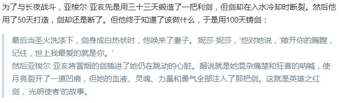
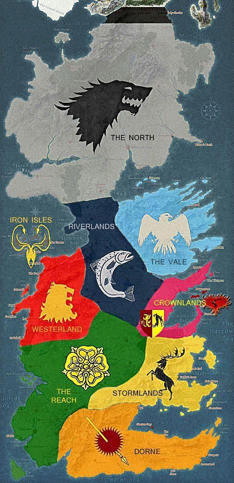

# 荐读

比起意大利诸多城邦国家崛起于文艺复兴时代，英国成就“日不落帝国”可谓后起之秀。“光荣革命”和工业革命驱动着英国成就一个时代的辉煌，这种突变的潜流其实在英格兰建国之初就开始酝酿，而成就这一切的基石尽在金雀花王朝。

因此本月荐书是《金雀花王朝：缔造英格兰的武士国王与王后们》，作者是英国历史学者丹·琼斯。让我们一起探寻大不列颠之根：金雀花王朝。

金雀花王朝是英格兰的第二个王朝，1066年诺曼底公爵威廉踏上这座大岛，并成功征服当地的盎格鲁撒克逊人建立起英格兰的第一个王朝：诺曼王朝，成为众人敬仰的“征服者”威廉。金雀花王朝则是威廉的孙女的儿子即亨利二世缔造的近三百年的王朝。

金雀花王朝之所以重要，正如作者所说，“金雀花王朝的历代君王不仅将英格兰缔造为一个政治和军事实体，还发明了‘英格兰’的概念，这个概念在今天和在过去一样重要”。

这就是金雀花王朝的重要性，英国未来的政治法律制度发源于此，著名的《大宪章》在“软剑王”约翰时期订立，并成为“权利法案”重要的法理根据。
“亚瑟王”的传说在这个时期形成，成功塑造了英格兰的骑士精神，不仅体现了国王的尚武精神，而且深远地影响了英国绅士文化的形成。

英格兰的地理疆界也形成于这个时期，于苏格兰、威尔士以及与法国和伊比利亚半岛的关系也成形与这个时期。

这就是金雀花王朝塑造的英格兰，没有金雀花王朝就没有今天的英国。

【伴读小鸿鸿的导读】寻根之旅，就是要了解“根”
《金雀花王朝：缔造英格兰的武士国王与王后们》是作者丹·琼斯精心编排的历史读物，被称作真实的“冰与火之歌”。作者的历史叙述都是经过有意安排的，读者一旦进入本书的大框架后，便会着迷于作者的叙述，迫不及待地想要追看下一个历史瞬间。不仅是因为作者善于讲故事的笔触，而且是因为金雀花王朝的国王们各具鲜明特色，只要攻克名字重复的难关后，就很难将他们混淆了。

本书的读法，除了一些必备的欧洲中世纪的基督教知识之外，还要大体知道金雀花王朝的王室谱系。
好在本书开篇为读者精心制作了这样的谱系，便于读者阅读时“回头看”。

除此之外，阅读时的关键词就是“根”了，英国的文化之根，就植于这个时代。

无论是政治上的议会制度、法律上的司法体系建设、限制国王权力的条约的产生、骑士精神的塑造、民族意识的产生、民族文化的发展，这些英国独有的文化原点都出现在金雀花王朝，加上作者戏剧化的描写，会让读者的寻根之旅更富趣味。

# 《金雀花王朝》- 兴衰解读及其副产品 by  沉沙

宋 老师常说西方思想体系里有着不断强化的思想齿轮，借助刚性思想齿轮的联动，建立起了强大的思想和现实世界的体系。那么日常生活中分析问题时，就需要我们培 养起这种利用刚性思想齿轮思考问题的习惯，所谓刚性思想齿轮，我认为就是这种思想齿轮运行的结果，放到任何不同的体系中都可以产生相同的效果。在阅读《金 雀花王朝》时同样如此，要用刚性的思想齿轮来理解引起各种历史事件发生的内在原因，而不是用历史事件来考验人的记忆力。我们常说的历史不会重演，但总是极 其相似，当你掌握了一定的思想齿轮之后，就可以用来演绎很多现象的发展趋势或者倒推其过往的发展脉络。

我 使用的第一个思想齿轮是收支平衡的盈余效应。从字面很容易理解，就是收入要大于等于支出。对于任何生命体系来说，要维持本身的存在和发展，他从外界获取的 资源就必须大于其在运行过程中消耗和付出的资源，只有这样生命体系才能得到发展。这样的生命体系小如细胞大如地球，细胞大家都可以理解，而大如地球，则根 据凯文凯利的《失控》里对生命的理解，从某种意义上讲，地球也是一个生命体，这个巨大岩石为了保存从太阳获取的能源，形成了厚厚的大气层，利用大气层保温 的效果使地球表面获取的热量大于其散发出去的热量，这才使地球上能够进化出丰富多彩的生命体系，那么在这个生命体系内的人类（包括人类组成的各种组织如： 家庭、部落、民族、国家和联盟等）更是无法摆脱这一原则的束缚。而在实际生活中谁也无法准确把握平衡点，只能尽最大可能做到收入的资源大于支出的资源，也 就是必须要有盈余才能维持体系的正常运转。

第 二个思想齿轮是技术对社会生产效率的加速效应。生命体系内每个生产单位的生产效率决定了这个生命体系内资源产出的效率，而对每个生产单位的生产效率起决定 性作用是可以普及的技术，人类社会的发展历程中，由采集狩猎到农耕文明是耕种技术的发展，由农耕文明到工业文明是工业技术的发展，及至到现在我们正在经历 由信息技术向人工智能技术发展的阶段，这其中每一个阶段的跨越都伴随着社会总资源的爆炸性增长，所以我认为可普及的技术，对社会总资源的增长起了决定性作用。打个比方技术与社会生产率的关系就好比加速度与速度的关系，加速度越大， 速度的增长率就越高。也许还有很多观点认为人的欲望、贪婪等人性的品质决定了人对社会资源增长的需求，好吧，这些关于人性的东西不符合我对刚性思想齿轮的 定义，欲望贪婪等人性品质在很多时候也会将社会资源毁灭，而不像技术那样不论放到哪里，只要它能够被普及，就一定能提高社会生产效率进而提高社会资源增长 的速度。

那 么通过以上两个思想齿轮的相互协作，人类社会的现状应该是高度发达，每个个体都充满了满足感的社会，因为技术增加社会总资源，资源的增加使收支平衡的盈余 增加，从而为社会发展的不确定性提供可靠的保障，而社会的发展进步又会使技术得到提升，就这样形成一个完美的正循环。但是问题来了，我们这个世界的真实情 况是全方位的不平衡，那么是什么导致了各个地区发展的不平衡，我觉得这里一定是缺少了一个思想齿轮来解释这个导致地区发展不平衡的原因。

记 住，这个思想齿轮必须是刚性的，像那些文化、人种、体制等因素都不够硬，因为同样的这些因素放在不同的地方产生的效果总是不同的，如果要举例子我大概会想 到利比亚，这个国家当初独立时领导层都是从美国返回的非洲裔黑人，这些沐浴于美国先进的文化体制中的文明人给利比亚带去的却是独裁和腐败。受宋老师关于西 班牙、印度和高棉帝国这三期鸿观节目的启发，我发现地理环境在第一和第二齿轮的正循环作用中扮演着电阻的作用，电阻在电路中会消耗电能，但是又能起到保护 电子元器件的作用。所以我的第三个思想齿轮是地理环境的电阻效应，我所指的地理环境包括了地势地貌、气候、物产等人类生活的总体环境，电阻效应限制了生命 体系在物理空间上的扩展能力，又对生存其中的生命体系起到了保护作用，这样在保证生命体系多样性的同时又使各个生命体系相互竞争。

说了这么多，该讲讲如何用这三个思想齿轮来分析金雀花王朝的兴衰史极其副产品了。

在我看来，金雀花王朝可分为鼎盛期和反攻期。

亨 利二世后期为鼎盛期，其领地包括英国岛的英格兰、苏格兰、威尔士、爱尔兰和欧洲大陆的诺曼底、安茹、布列塔尼、阿基坦。苏格兰和威尔士的多山多河地貌、爱 尔兰海峡和英吉利海峡就是起到了地理电阻效应的作用，而当时社会的生产技术还是处在在农耕和畜牧业的状态，所以以当时的社会生产效率所产生的盈余效应只能 让亨利二世勉强做到维持金雀花王朝的完整性，为做到这一点，亨利二世在英格兰本土采取了和先辈一样的做法——文治，即通过协商以法案的形式满足本土各诸侯和教会势力的利益诉求（诸侯也是受收支平衡的盈余效应限制的），换取其对英格兰国王的效忠和纳税义务，因为英格兰本土地理条件复杂，地理的电阻效应非常明显，如果要以武力维持统治，对盈余资源的消耗将是毁灭性的，更何况还可能会触发英吉利海峡这个超级电阻效应。在欧洲大陆上也同样采取和先辈一样的做法——武治，即通过在各领地上的巡游来收取税收，以武力维持其统治。欧 洲大陆相对平坦，这可以从亨利二世几次传奇性的行军记录得出结论，地理的电阻效应相对较弱，盈余资源的消耗可以负担。通过以上措施，亨利二世从两地获得了 可持续的盈余资源，用于维持其统治是绰绰有余的，比如宗教问题、领地内的叛乱问题、继承人的叛乱问题等，但是这些资源却无法让他进一步开拓疆域，他对图卢 兹的进攻就可以看出金雀花王朝的扩张极限，我想精明的亨利二世也很清楚这一点，所以凡是对维持王朝完整性无益的盈余资源消耗，亨利二世是绝对不会付诸行动的。例如十字军东征，他情愿与教会交恶也不愿进行十字军东征，然而利用教会的影响力征服爱尔兰，却是亨利二世十分乐意为之的。因 为这个行动有利于增加金雀花王朝的盈余资源。分析到这儿，我们也许就可以明白亨利二世为什么在继承人的选择上一直犹豫不决，他对理查一世醉心于十字军东征 十分不安。而事实也确实如此，理查一世为了实现自己十字军东征的梦想，获得了教会和诸侯的全力支持，征收了大量的税金和物资，还欠下了巨额的债务和赎金， 严重透支了金雀花王朝未来几年的盈余资源，而他在平息叛乱的时候死于意外之箭，更是加剧了情况的恶化，他的继任者约翰国王面对的是一个财政破产，欧洲大陆 领地的领主因不满继承安排而纷纷投向法兰西国王的严峻局面。约翰国王根本没有足够的时间稳定欧洲局势，只能寄希望于英格兰微弱的盈余资源来挽回局面，但是根据地理电阻效应的原理，约翰国王根本就无法实现这一梦想，于是欧洲大陆上的领地分崩离析，只能全面收缩至英国本土，勉力挣扎！

至此，金雀花王朝进入了另一个时期——反攻期。

这个时期金雀花王朝几乎丢失了欧洲大陆的所有领地，法兰西王朝的领地得到空前扩张，相应的其实力也得到相应的提升，此消彼长，金雀花王朝损失惨重。法兰西王朝领地的地理环境相对平坦，法兰西国王只要有足够的时间整合境内的资源，总是能够形成相对的中央集权，因为地理的电阻效应小，对盈余资源的消耗少，中央只要有意愿总能够将资源不断地积累，形成相对的强中央弱地方的局面。此后，法兰西王室在十字军东征、圣物购买、对外扩张和宗教控制等方面定期投入充足资源，从而能够长期维持法兰西王朝的集权统治。

此后，约翰国王之后的历代金雀花国王都一心想要反攻回欧洲大陆，恢复金雀花王朝的鼎盛时期。“约翰们”要达成这一目标就必须克服以下三个难关：一是维持英格兰王室在英格兰本土的中央集权；二是克服英吉利海峡的电阻效应；三是战胜国土面积庞大的法兰西王国。这三个难关一个比一个艰巨，要解决这三个问题，“约翰们”需要大量的资源，这些资源首先要用于维持英格兰本土的稳定与发展，然后在此基础上如果有大量盈余并且持续积累的情况下，才能实现恢复鼎盛时期的梦想。但是如果在生产技术没有对社会生产效率产生加速效应的前提下，要实现这个梦想，将会带来更具破坏性的后果。

首先我们要了解的是维持英格兰王室统治地位的“约翰们”，他们包括约翰国王、亨利三世、爱德华二世和理查二世。由于英格兰国王先辈们采取的文治措施，英格兰各个诸侯、教会势力与国王之间在英格兰本土范围内始终保持着势均力敌的状态，反攻期的“约翰们”为恢复祖先的荣光，需要大量的资源用于贿赂欧洲大陆的盟友和对法国作战，由于他们所继承的都是一个濒临破产的王国，英格兰本土对内矛盾激化，对外欠债累累，所以“约翰们”都 是绞尽脑汁希望能获取更多的资源，不但要还清债务，还要维持王国稳定，更是要有足够的能力恢复金雀花王朝的辉煌，这在技术没有实现质的飞跃的当时，就是一 件不可能完成的任务。约翰国王主要是进行法制改革，利用国王的司法审判权向诸侯和教会谋取利益，但是随着利益需求的越来越巨大，不断打破了利益各方的利益 平衡点，在忍无可忍的情况下，引发了反抗约翰国王的战争，最终签订了著名的《大宪章》。亨利三世与诸侯的利益之争也以《牛津条约》的签订而宣告失败，王权 也被诸侯委员会架空，而对王朝辉煌的追求也因与路易九世签订《巴黎条约》而丧失了合法性的基础，最终亨利三世效仿忏悔者爱德 华，依靠教会的势力最终稳定住了英格兰王国的政治局面。爱德华二世时期，海关关税被意大利银行家控制，在帮助宠臣与诸侯争利的过程中，被迫再次协定《大宪 章》，王权也被十二人委员会架空，为征服苏格兰只能向教皇借款，最终在内忧外患的风雨飘摇中，爱德华二世退位。理查二世时期，社会生产率有一定提高，平民 阶层崛起，平民议员也已产生，农民起义多次被镇压，同时与诸侯的争斗也一直在持续着，在此过程中理查二世依靠宗教的力量，不断加强王权的神圣性，通过建立 私人武装，玩弄权术，发放空白借条、空白特许状和赦免令等形式向臣民勒索，最终他的臣民们彻底背叛了理查二世，通过选举产生了新的国王亨利四世，从此金雀 花王朝终结，英格兰国王的王权也不再神圣。

接下来就是分析一克服英格兰本土岛屿地理电阻效应的爱德华一世。爱德华一世与理查一世一样热衷并参与了十字军东征，而他东征经费的来源是向意大利银行借款，继承王位后爱德华一世进行了财务创新，通过向卢卡的里卡尔迪银行借款，定期向僧俗征收赋税，迫害犹太人敛财，征收羊毛税等一系列措施，爱德华一世获得了大量的资源，完成了大举征伐威尔士，并在征服之后大兴土木，同时实现了对苏格兰的彻底征服，这些行为鼓舞了英格兰诸侯和教会的士气，维护了王权的权威。但是在爱德华一世希望恢复金雀花王朝的昔日辉煌，而跨越英吉利海峡对法国作战的时候，沉重的成本负担，使国内在征税等问题上产生了一系列问题。爱德华一世迫于形势只得与法兰西签订停战协定，以避免失去诸侯和教会对王权的支持。终其一生，爱德华一世实现了英格兰王国在本土岛屿的全盛，但是付出的代价是财政上的巨大亏损，后继者为弥补这个漏洞，注定无所作为。

创造辉煌战绩的爱德华三世及其黑太子的故事，就不再赘述了。与爱德华一世类似，爱德华三世在其统治期内采取了一系列积极的财政政策，向佛罗伦萨的巴尔迪家族、佩鲁奇家族、波尔蒂纳里家族、卢卡的布斯德拉古家族、汉萨同盟、低地国家的银行和商人大举借款（三世对盟友的贿赂导致了佛罗伦萨的巴尔迪银行走向破产），征收重税，操控羊毛市场，增加商品税和出口税，为稳定社会加强剥削，出台了《劳工法》（加上当时的战争、黑死病人口锐减导致了理查二世时期的农民起义），出售羊毛特许状等，聚集了大量的资源，完成了空前的战绩，但是同样，其后继者为此付出了更大的代价。

综上所述，金雀花王朝的“约翰们”以自己的方式解决英格兰本土的、英吉利海峡的和欧洲大陆的地理电阻效应产生的资源损耗问题。实现的手段是征收重税、迫害敛财和借贷等方式，这些方式使得英格兰提前透支生产盈余，如果未来的技术没有空前发展，实现对社会生产效率的加速效应，那么就无法在填补以前透支的同时，保持社会的高速发展。所以金雀花王朝在反攻期内的发展趋势就像波涛汹涌的海浪，高低起伏，极度不稳定，最终拍散在沙滩上。

金雀花王朝的兴衰是人类历史中的一朵浪花，但是她孕育出的政体模式成为近代政治文明的典型范式。

本书开始部分，亨利一世为维持英格兰的稳定，并且赢得英格兰诸侯支持其对诺曼底的征服，授予英格兰诸侯以《自由宪章》，在保障诸侯权益的同时，也对王权加以限制。这一制度制定的本身就是地理电阻效应对收支平衡的盈余效应造成影响的产物。否则亨利一世将无法获得足够的资源用于克服英吉利海峡这个超级地理电阻效应，实现对诺曼底领土的彻底征服。而之后所有的国王都因技术加速效应的缺失，受制于收支平衡的盈余效应和地理的电阻效应，使《自由宪章》不断得到升级变成不同版本的《大宪章》，又演化出诸侯委员会、议会、贵族议员和平民议员等等，逐步奠定了现代民主体制的雏形。最终在1689年进化出君主立宪制，继而为1765年工业革命的完成奠定了制度基础，真正实现了技术对社会生产效率的加速作用，从而使收支平衡的盈余资源效应大大加强，为英国在全球范围内建立霸权帝国创造了必不可少的条件。

不仅如此，随着工业革命的爆发，一场工业技术的全球革命迅速蔓延，各个图强的国家为了迅速崛起，也纷纷仿效英国发起政治革命，但是我始终觉得政治体制是每个国家在适应本土地理环境的过程中演化而来的，是有着强烈的地域特征的，如果强行照搬照抄一定走入死胡同，而真正重要的是技术能否在经济体内全面普及，让技术对社会生产效率的加速作用真正体现出来，这样才能促进收支平衡的盈余效应，进而形成社会发展的正循环，所以英国的原生民主制度是适应技术在英国社会经济中全面普及的政治体制，其它仿效的民主都是披着民主外衣的本土原生政治制度，也只有通过这样的方式才能快速学会适合本国特性的技术普及方式，真正实现社会生产效率的加速。

​     通过金雀花王朝的兴衰我们也可以看出，我们现在今天花明天的钱的金融模式并不是现代经济的独创，理查一世、爱德华一世和爱德华二世早已使用得炉火纯青，但 是为什么他们没有我们现在玩得转，这是因为当时的技术并没有得到飞速发展，他们今天借明天的钱在明天来临的时候没有足够的资源弥补当时受到损失的经济体， 所以爆发了经济危机，进一步带来了政治危机。那么在今天，我们的技术一直保持着持续的发展，从蒸汽机到内燃机到电气化到电子化到信息化再到现在人工智能的技术发展进程，我们的社会生产效率在技术的加速下也保持着迅猛的增高。在此情况下，我们基本可以保持这套金融模式的持续运转，所以，我觉得如果有一天我们最先进技术的普及速度低于我们对未来资源的消耗速度，那么真正的经济危机就会来临了。

# 《金雀花王朝》- 拨开英国工业革命起源之雾 by 盲眼钟表匠

工业革命为什么会爆发在英国却没有发生在法国？为什么英国爆发了工业革命？而法国却爆发了革命，且如此曲折？英国的工业革命与金雀花王朝有什么样千丝万缕的联系？对今天的中国又有什么样的启示？

从金雀花王朝这本书中我们可以看到英法两国不断的发生战争，而法国似乎在大部分时间处于优势，英格兰国王不得不向法国国王俯首称臣。但四百年后的工业革命却爆发在英国而不是法国，我想这值得思考。我认为，两国向外扩张的动力强弱导致了两国不同的历史走向。

一直到十八世纪初，英法两国的斗争并没有出现很大的差距，但我认为两国不同的政治制度导致了两国不同的命运。我们可以看到在金雀花王朝统治时期英国就确立了大宪章以试图控制王权，虽然几次被国王废除但依然有着十分重要的意义。后来英国爆发光荣革命，成立议会制度。而法国在路易十四继位时，专制王权到达极盛。不同的政治制度对于两国的发展是十分重要的，可以看到法国在18世纪甚至出现了贵族反扑，原本被削弱的贵族权力被加强，贵族强占公共地。两国的政治气氛不同，从法国强征税金中也可以看出，为了维持财政的稳定，法国国王经常采取许多非法的手段强征税金。试想如果一个国家的政府都没有诚信可言，那么这个国家的商业怎么可能繁荣？信贷又如何发展？没有信贷的发展国家又如何发展商业。

此外，我认为两国向外扩张的动力的不同也导致了两个发展不同的道路，向外扩张的动力对于一个国家的发展的重要性，这点我在直播中也提到过。在签订巴黎条约后，在与法国大陆竞争中处于劣势，国内工人工资上涨导致成本上涨，英国的商品无法于荷兰或法国进行竞争，因此只能改进本国技术并向海外进行扩张寻求原材料的供应。且英国相比于法国是一个岛国，拥有更多的海港，更利于加入大西洋贸易，天然的海港也促进了英国航运业的发展，可以看到英国夺取海上霸权起了极大的作用。而法国毗邻的比斯开湾由于森林的大量消耗以及缺乏河流运送木材，在17世纪比斯开湾造船业的衰落，而英国有大量山地且河流密布，并不存在木材枯竭的问题，充足的木材供应对英国造船业发展起到了十分关键的作用。且英国四面环海，渔业资源丰富，有世界著名的北海渔场。宋老师以前在阐述美国新英格兰地区时就提到，新英格兰地区就是靠捕鱼业起家，发展了自己独特的航运业，英国丰富的渔业资源对于其发展航运业也有所帮助。英国在1660到1730的时间内为了发展殖民地需要，船只的吨位与数量都有很大的增长。从农业上来看，法国向外扩张的动力也不如英国，英国在工业革命前夕人口大量增长，大量增长的人口虽然带来大量劳动力，这对爆发工业革命也是十分重要的，但也增加了英国的人口负担，法国国土面积是英国（含爱尔兰）的1.78倍，法国耕地面积是英国的2.68倍，草原面积却只有英国的69%。1500年英国人口只相当于法国的25%，但是到1800年工业革命时期英国人口已经相当于法国的59%，意味着法国人均耕地是英国的1.59倍，人均草原面积却只是英国的41%。人口的负担迫使英国不得不进行技术革新并继续对外扩张，英国后来也发生了圈地运动，很大程度上也与人口压力有关，大量的农村人口进入城市也为工业革命的爆发注入了新鲜的血液，而法国则不存在英国这样的人口压力，对外扩张与技术革新明显不如英国有动力。

在信贷上两国也有许多的不同，英国在金雀花王朝统治时期就有一套相对完整的信贷体系，甚至理查对其兄弟的贷款也被以各种方式索回本利。虽然看起来可能有点不近人情，但是正是这种商业精神使得英国的信贷可以发展，虽然在金雀花王朝时期的信贷依然十分脆弱，以弗雷斯鲍迪为首的意大利商行因为英格兰的违约破产，可以看到意大利商人对爱得华三世，但也可以看到巴迪公司破产后，该公司扣押了英国的代表，直到英国政府承诺付清本利后才将其代表释放，这种令中国人难以想象的手段促使了英国信贷业的发展，如果没有诚信，那么信贷的发展无异于一纸空文。在爱德华四世统治的最后十年，债务减少到适度的比例，各项债务可以偿还，这也使得英国的信贷业可以平稳的进行发展。而法国，相比于向银行家借贷，法国更习惯于向臣民借贷，这种制度显然难以促进本国信贷的发展，且由于强行要求官员借贷，且经常拒绝偿还，导致了法国财政体系效率低下，且难以统一财政，也导致国王对大臣的贪腐行为采取放任的态度。由于皇室的奢侈，这样的借贷愈加频繁，为了借到钱财，国王经常用皇室的物品进行抵押，这也是皇室信誉崩塌的显著特征。皇室债券甚至能用其百分之一的价格购买，其信誉之低可见一斑，由于法国的内战造成的分裂，大量金融家被杀害，政治形势的混乱不可避免的导致了法国的经济的倒退，货币大量贬值。16世纪法国的许多政策可以追至路易十一的时候，路易十一将主要的收税限制在农村而将消费税限制在城市，且几个城市在很久以前就免除了直接税，作为对价，路易希望可以获得这些城市的礼品，补助金以及无息贷款，有的贷款甚至不需要偿还。这些负担最后必然由农民承担，路易还减免了第三阶级中的最富裕的人的中间税，这种行为导致了法国财政体系的永久歪曲，没有一个合理的财政体系又怎么发展经济。

记得宋老师说过但凡物质丰富的大国都很难形成工匠精神，英国作为一个岛国，耕地面积不如法国，长期以来也与欧洲保持距离，匮乏的物资可能也对英国技术的革命产生了一定的影响，由于造船业不如英国，直接导致了英法两国在奴隶贸易上法国的吃亏，英国依靠海军控制了海上贸易的通道，法国在七年战争之间与西印度殖民地的贸易中断。

宋老师在核心课程中也提到，百年战争英国毛纺织业的发展为英国后来的工业革命打下了极好的基础。不可否认的是，正是集市在13世纪的发展使得英国英国的漂洗机有了发展的动力，当时佛罗伦萨兴起的时候，意大利人也是在此时到达英国，对英国集市的兴起可能起到了一定的作用，意大利先进的商业手段对英国可能也有一定影响，且英国多山地，也使得漂洗机的发展有了天然的地理优势，因此漂洗机在英国大量普及，使得漂洗机的使用成了一种习惯，庄园领主与教会都积极的投资，可能与佛罗伦萨全民记账推动了佛罗伦萨商业的发展，漂洗机的大量使用也使得英格兰人慢慢有了对于工业的认识，且对漂洗机的大量投资也推动了英国信贷以及商业的发展。可以看到当英国的工业达到成熟后封建社会解体，农奴制消失，而且英国的大宪章限制了王权的发展，使国王无法命令领主才导致国王不得不向羊毛业收取高额赋税。从这个角度来看，大宪章对于英国的发展也有极大的意义。

由于英国向外扩张而法国向外扩张力度不如英国，并向内扩张导致了大量的负债，而英国则偿还了负债，并且有所盈利，法国加入北美战争甚至导致了革命的爆发。英国为什么会爆发工业革命，国内的需求日益增加且在外部面临压力，此外国内有大量有助于工业发展的信用机构，人口大量增加，中产阶级下层人数增加，还拥有强大的国家机器，资本的深化发展，而法国在一定程度上并不具备这样的条件，法国当时信奉马尔萨斯的人口理论，人口数量比英国要少，且殖民贸易不如英国，更是减少了廉价劳动力，且法国的信贷机构发展并不如英国。在金雀花王朝这本书中我们也可以看到虽然法国在很长一段时间对英国是有极大优势的，但英国的弓箭技术却优于法国，并在很长的一段时间中给法国带来了很大的麻烦。我对此的原因并不十分清楚，希望宋老师能给予解释，我只能做出一点猜想，宋老师以前在课程中也提到过法国人骨子里的那种骄傲，虽然国力不如现在的德国，但依然认为自己是欧洲的老大，至少在心里上这样认为，这种想法也阻碍了欧洲经济的整合，可能正是法国这种骄傲的性格阻碍了自身民族的发展。而英国作为一个岛国则没有法国的烂漫，相反更加刻板，可能正是这种刻板让英国人更富有工匠精神，正是这种工匠精神推动了技术的革新。

由此，我们可以得到一些借鉴，首先，信用对于一个国家的发展十分重要，中国近期的假疫苗轰动全国，按宋老师的说法，信用的缺失是很重要的原因，不只是疫苗，地方政府大量借贷违约最后由央行兜底不也是信用缺失吗，一个国家要有稳定的经济环境，要融入国际贸易，信用无疑是十分重要的，孔子说的，民无信不立，如果政府信用缺失又何以为立，又如果融入对不守信用几乎零容忍的外国企业？如何进行国际贸易呢？其次，经济发展需要向外扩张的动力。深化改革是一方面，对外的扩张更为重要，从历史上看没有国家是通过向内扩张最后崛起，中国就是一个很好的例子，中国并没有向外扩张，而是向内扩张，最后导致与西方的分流。还有就是关键的技术应该掌握在自己手里，可以看到欧洲17世纪，哪个国家有强大的海军就能获得更多的利益，并向外扩张，这也对今天的中国有借鉴意义。对于美国的步步紧逼，我认为对于中国既是挑战更是机遇，这给了中国向外扩张的动力，一带一路很大程度上就是被美国的TPP逼出来的，对中兴的制裁也是对中国的逼迫，可以看到历史上没有逼迫的国家就很难发展，法国的各项条件都比英国优越，却没有爆发工业革命，反而爆发革命。《枪炮、病菌与钢铁》里面有一章的题目就叫《需要之母》，也就是需要是科技创造的必要条件，正是美国的逼迫，使得中国有发展的迫切需求，这对于中国来说并不是一件坏事。作者认为技术的进步有四个条件，一比现有技术有更大的经济利益，无论是漂洗机的普及还是蒸汽机的改良都符合这一条件。其二是考虑社会价值与声望，工业革命必然有其社会价值。第三是符合既得利益，我们可以看到漂洗机的普及得到了庄园主和教会的极大推广。第四新技术的优点要容易看到，这在工业革命也表现得十分明显，对于今天的中国来说，要革新技术也要符合这四点，缺一不可，宋老师不推荐投入大量资金发展芯片，我认为是有道理的，发展芯片很难带来短期的经济利益流入，第一条就不符合所以，投入大量资金研发显然是效率低下的，应该重点扶持才能高效率的利用资金，近期的仿制药也是一个道理。

以上是个人的一些观点，可能有一些错误，希望宋老师能批评指正。

# 《金雀花王朝》中隐含的《权力的游戏》结局 by 张峻恺 

《金雀花王朝》大概是我两年前读过的一本书，这本书总体上读起来的感觉可以说是非常的凌乱，因为英国人起名字实在是很没水平，每个国王不是叫亨利就是叫爱德华，而且这些人看起来名字差不多，但是却有可能并没有血缘关系，可见当时英国的文化落后程度，但我当时比较感兴趣的是“玫瑰战争”这段历史，因此在网上也看了不少“玫瑰战争”和《权力的游戏》的关系的文章和信息，因此整理下了以下这篇文章，就作为我的读后感分享吧。

 

《权力的游戏》最后一季大概在2019年就会开播，大家对接下来谁领便当，和异鬼何时开战，以及最后谁夺取了铁王座都有了很多的假设和讨论。由于小说和电视剧都没有完结，各种猜想很多，要猜测接下来剧情的发展，首先应当有一个基点，就是谁最后夺得了铁王座？网上大致上有三派的意见：

 

1、**龙妈夺王派**：理由很简单，因为龙妈从电视剧开始到现在一直开外挂，感觉整部剧最终都要为她万民来朝。同时，龙妈也是正统的坦格利安“疯王”嫡子孙，持这派观点的人最多；

 

2、**琼恩.斯诺夺王派**：由于之前斯塔克家族所有的有主角光环的人全部领了便当，因此现在看起来斯诺已经是斯塔克家族中最有主角光环的人了，同时在第六季结束的时候，布莱恩也已经揭开了斯诺的身份，斯诺乌鸦变凤凰，由原来斯塔克的私生子变成了具有坦格利安家族血统的王子；

 

3、**小恶魔夺王派**：这一派观点粗粗看起来有点不可思议，因为小恶魔天生不足，同时血统也没有前两位那么纯正，但是在网上的确也有不少人支持这一派观点，而且还有剧照图为证，说明小恶魔其实也是坦格利安血统后代，因为龙妈战死，斯诺做了异鬼王，最后只能由小恶魔当国王；

我首先想表达一下我的预测，我认为第二种说法最符合逻辑，就是斯诺最终夺得铁王座，我的逻辑的基点就是：

 

**一、****红白玫瑰战争：**英国的“红白玫瑰战争”是作者创作《权力的游戏》的考据原型，红白玫瑰战争最终的结果就是兰开斯特和约克两个家族人都死得差不多了，最后由凯瑟琳王后的私生子（或者叫”拖油瓶“）亨利·都铎开创了“都铎王朝”，这和斯诺私生子的身份很一致。

 

**二、****预言和传说：**小说对整个大陆的开篇传说是：亚梭尔·亚亥如何驱赶长夜黑暗，如何打败夜鬼的传奇故事，也预示着一个勇者要用一把特殊的剑插入自己心爱的人的心脏，从而变成带着火焰的光明之剑打败夜王。从逻辑上看，有一把瓦雷利亚钢剑的斯诺现在就缺一个心爱的人，这人很大可能就是自带火焰的龙妈。

 

## 一、英国红白玫瑰战争

英国红白玫瑰战争是兰开斯特家族（House of Lancaster）和约克家族（House of York）长达一百年的内战，光听这两个家族的名字，是不是和剧中兰尼斯特和斯塔克两个家族的名字就很像了？

金雀花王朝爱德华三世皇族兰开斯特红玫瑰和约克的白玫瑰两个家族都是(Plantagenet)皇族分支，英王后裔。玫瑰战争不是当时所用的名字，它来源于两个所选的家徽。

玫瑰战争的时代大概是中国的明朝，可以这么说，当时的英国和中国的各种差距还相当的大，英国就连北部的苏格兰都还没有统一，苏格兰地区还是荒蛮之地，英格兰地区也好不到哪里去，在整个落后的欧洲也属于二、三流国家，因此起名字也没有啥水平，每个国王、公爵都叫亨利、爱德华、约翰什么的，我们就不展开来介绍玫瑰战争的整个过程了，有兴趣大家自己看各种书和百度百科，看的时候可以参考原《罗辑思维》的李源同学整理出来的人物考证表：

总结来说，英国玫瑰战争的结局就是凯瑟琳王后嫁给亨利五世前，和欧文·都铎公爵生的“拖油瓶”孩子亨利·都铎最终开创了使英国真正强盛的“都铎王朝”。英国历史上最著名的伊丽莎白女王，也是属于都铎王朝的子孙。这和斯诺的身世是不是很接近？

 可能有些人会质疑，凭什么一个虚构的小说要参照史实来写？就不能虚构一个惊艳的结局吗？其实也有这种可能，但是要知道，英国是一个很尊重传统的保守国家，和中国一样，同样很重视本国的历史。对于大作家来说，在作品中暗合一些历史可以整体提高作品的逼格。比如罗琳阿姨的《哈利·波特》中，魁地奇就暗合了英国贵族传统的马术比赛。这样的暗合让英国传统的贵族和知识分子读起来，就会有会心一笑的感觉。

 这与我们的思维模式类似。很难想象金庸在写虚构的武侠小说，比如《倚天屠龙记》的时候，让张无忌最终干掉朱元璋，自己当皇帝。

 金庸如果这样写，他的作品在你的心目中一定会低几个层级的。

## **二、预言和传说**

 除了以上历史的推论点外，还有一个斯诺夺得铁王座的论据就是书中的预言和传说：

 **关于预言：**

 小说中的预言有很多，许多文字有点类似于《红楼梦》的各种判词，预示着一个人物的结局。关于打败异鬼的英雄，书中有这样的预言文字，这里只节选几段：

大概的意思就是，未来将有个亚亥转世的英雄会使用“英雄之红剑”，打败夜王，而这个英雄，在“烟与盐”之地，红女巫曾经说过，这个“烟与盐”之地就是龙石岛，而现在龙妈，斯诺，小恶魔都已经齐聚在龙石岛了，那到底谁是亚亥转世呢？我们再来看看亚亥的传说。

 **关于传说：**

 关于书中的世界观，传说在1万年前，一个叫亚梭尔·亚亥的英雄最终打败了夜王和异鬼，顺便一提，这个亚亥的原型可能就是英国传说中最著名的国王——亚瑟王，就是“石中剑”那个故事的主角，用一把神剑做了国王。说回书中的亚亥，亚亥打败夜王的方式很特别：

简单说，要打败夜王，首先你要有一把神剑，然后插入自己心爱人的胸膛，拔出来后，估计这把剑就会着火，用火之剑去打败冰冷的夜王。

现在斯诺有一把瓦雷利亚钢剑，龙妈和斯诺到现在都还没有爱人，他们两个接下来要在一起擦出火花这个逻辑应该很合理吧？但是有人也会说，他们两个不是姑侄关系吗？的确，但是也不要忘了，该剧第一季就已经做了铺垫，说坦格利安家族喜欢近亲结婚，因此每次生孩子的时候，“上帝都会扔一枚硬币，这孩子要不优秀，要不疯狂”。按照小说的一贯风格，这些铺垫到最后都是会有所暗示的。

当然啦，因为作品名字叫《冰与火之歌》嘛。冰如果是斯诺，火就应该是龙妈，如果是龙妈最后拿剑去捅斯诺感觉也说得通，但是感觉这瓦雷利亚钢剑怎么都和龙妈气质不配，斯诺拿着带火的瓦雷利亚钢剑，骑着龙去和夜王作战的画面会比较合理一些。同时呢，由于龙妈是姑姑，而且血统也比斯诺要纯正，如果两个人相爱，斯诺要做国王，那么龙妈就一定要死去，死去的唯一理由，就是要打赢夜王。

## 三、小说中的一些现实原型

对于一个作家来说，即使是有着天马行空的想象能力，他的一些世界观其实也无法脱离其地理环境的制约。比如对于吴承恩来说，由于身处大陆，所以在创作《西游记》的时候，他就想象世界就是由四个大陆组成的。唐朝所在的大陆是“南瞻部洲”，孙悟空出生的东部大陆叫“东胜神洲”，而唐三藏要去取经的地方是西方的“西牛贺洲”。

虽然乔治·马丁是一个美国人，但本人是个很传统的天主教徒，对英国的传统文化也非常了解。因此小说中有很多地方和在英国的历史上都能找到原型。

**1、异鬼和黑死病**

 对于欧洲人来说，中世纪爆发的黑死病是深刻在骨子里的恐怖印记。黑死病即鼠疫，十四世纪在欧洲大陆大范围爆发。原本通过老鼠传播，后来直接通过人，甚至死人传播。得了黑死病的人，全身都会发黑，三天内死去，死去的人的尸体必须马上处理，比如烧掉，否则就会让更多的人得病，这和剧中异鬼的桥段非常类似。整个欧洲在大概50年时间里，因为黑死病死去了三分之一人口，堪比两次世界大战，并且由于黑死病肆虐，天主教十字军和伊斯兰国家的战争进入全面休战的状态。可见黑死病对于不同民族来说，是关乎到生死存亡的事情，各种宗教、利益矛盾都只能放下，这和剧中对异鬼的最终一战也有着异曲同工之妙。

**2、北境长城和哈德良长城**

剧中北境长城用来抵御野人的桥段，对应的原型，其实是英国的一段历史和遗迹。罗马帝国时期，为了抵御北方的苏格兰人，罗马皇帝哈德良在公元2世纪，在英格兰与苏格兰边境，建造了哈德良长城。剧中的野人都是红色头发的，没错，这些野人的原型就是苏格兰原住民，红色头发就是他们的种族特征，可以参考电影《勇敢的心》。而守护北境长城和临冬城的人都是黑色头发，这其实暗示着这些人是驻守英格兰的罗马人后裔。

**3、七国时代**

 肯特王国、萨塞克斯王国、韦塞克斯王国、埃塞克斯王国、诺森布里亚、东盎格利亚王国和默西亚王国，是英国历史上的确存在的七大王国。它们存在的时间是从5世纪到9世纪，是居住在英格兰的盎格鲁-撒克逊部落的非正式联盟。

但是这七个王国所处的时代远没有《权力的游戏》那样先进，当时英国还是蛮荒之地，使用的武器都是青铜器，而这七个名义上的王国，其实也只是七个小部落而已，要真的按当时的生产力水平拍成电视剧简直就没法看了。

 好的，先杂七杂八的写到这里吧，期待这一季的精彩故事。

