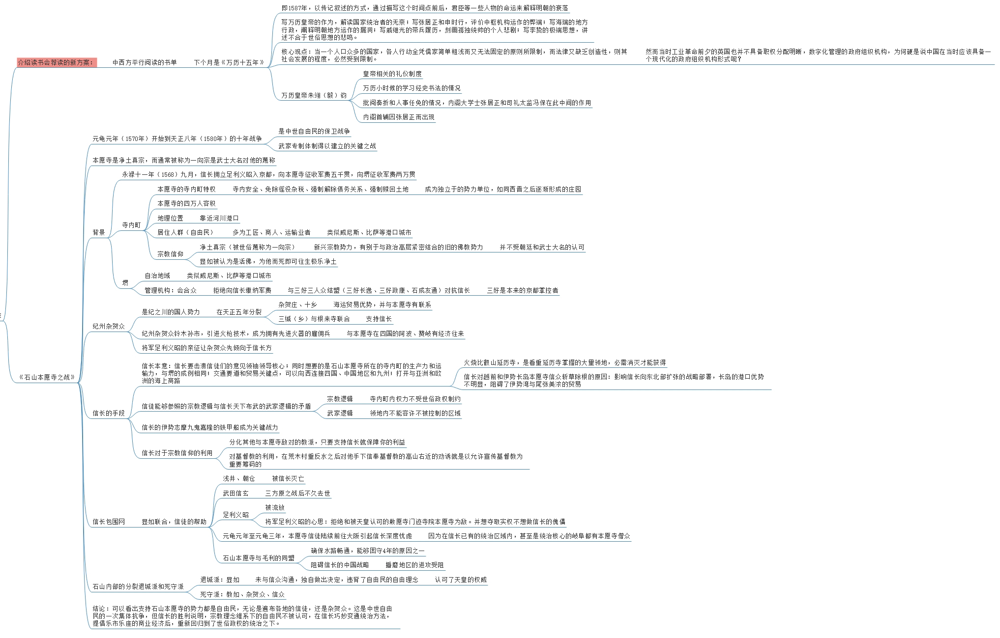
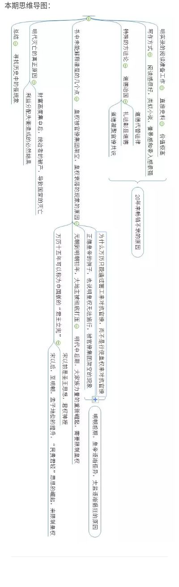

# 荐读

1453年君士坦丁堡陷落，这一年对于基督教世界和伊斯兰教世界来说，都是难忘的一年。这一年标志着奥斯曼帝国开始控制欧亚大陆的传统商路，欧洲由此产生大航海的原动力，商业革命进入高潮，工业革命即将接踵而至。

正当世界的西方掀起解放生产力，构建新型商业模式的当口，世界的东方此时屹立着的大明王朝来到了1587年，即万历十五年。

黄仁宇聚焦这一年，写成了《万历十五年》一书。9月我们来读这本书。

这本书以传记体的叙事方式，通过描写1587年这个时间点前后，君臣等一些人物的命运来解释明朝衰落的原因。

写万历皇帝的作为，解读国家统治者的无奈；写张居正和申时行，评价中枢机构运作的弊端；写海瑞的地方行政，阐释明朝地方运作的漏洞；写戚继光的带兵履历，刻画孤独统帅的个人悲剧；写李贽的极端思想，讲述不合于世俗思想的悲鸣。

“当一个人口众多的国家，各人行动全凭儒家简单粗浅而又无法固定的原则所限制，而法律又缺乏创造性，则其社会发展的程度，必然受到限制。”

作者认为，中国在明清后落后于世界的原因，是“中国两千年来，以道德代替法制，至明代而极，这就是一切问题的症结”。

1587年悲剧性的结束，被作者称为历史上一部失败的总记录。

让我们聚焦1587年，这平凡的一年。

# 《万历十五年》- 万历，明朝的掘墓人？ by 盲眼钟表匠

《万历十五年》一书企图从许多微小的事件中解释明朝衰败的原因。清人写明史时写到明朝亡于崇祯实亡于万历，很大程度上清人认为万历的长期怠政最终导致了明朝的衰败，但我认为就算万历皇帝勤于政事，也无力改变明朝灭亡的结局。

 《万历十五年》的作者认为明朝在1587年，制度已至山穷水尽，文官的权力盛极一时，他们大多数有着广泛的家族和社会关系，还扭曲了当时的官场生态。政治中枢的运行被官僚习气掣肘，官场与社会底层民众脱节严重，最终自我画圈，腐败盛行，瓦解了以张居正为首的改革派的改革成果。

 中国的人情社会、常以道德要求别人。诚然这也是有道理的，但是我想从经济的角度去剖析明朝衰败的原因。

 1587年万历十五年，表面上风平浪静，但实际上暗流涌动，努尔哈赤崛起于白山黑水之间，日本攻打朝鲜，而世界上也发生着巨大变化，1566年尼德兰革命爆发，荷兰登上历史舞台，奥斯曼帝国处于极盛。而大明王朝内部却暗流涌动，张居正变法失败，贫富差距拉大，我认为这是大明王朝丧钟敲响的时刻。

 张居正变法很大程度上是为了解决明朝日益严重的土地兼并问题，其中的一条鞭法就是解决这一问题的政策，但在书中我们也可以看到一条鞭法执行难度巨大。张居正最后被打倒表面上是因为张居正本人的飞扬跋扈以及贪腐问题，但我认为更为重要的是张居正的改革触碰了既得利益者的蛋糕，如果仅仅针对张居正本人那么为什么张居正死后的新政基本上都被废除呢？

 明朝一个十分严重的问题就是南北发展的不平衡，南北发展不平衡的格局从宋朝就已经定下。在明朝愈加严重，可以看到，明朝被大顺政权推翻，而李自成就是一个陕西人。古代普通百姓向上晋升的通道主要是科举考试，但是科举考试往往需要耗费大量的钱财，而严重的南北发展不平衡很大程度上限制了北方人向上晋升的通道，而南方士族则拥有更多晋升的机会。从历史上看一旦向上晋升的通道被堵死那么必然出现一系列社会问题，就像宋老师提到的德国爆发一战二战的原因，已经中东为什么恐怖主义频发，很大程度上因为当地下层百姓看不到向上晋升的希望。

 历史上的“反贼”造反的口号里都有均田赋这一条，土地兼并的问题在中国古代可以说是十分严重，宋朝末年蔡京让土地兼并达到了高潮。宋老师在直播课中提到一个社会当百分之十的人切走了国民收入中百分之五十的蛋糕时，那么社会必然出现各种问题。

 在《二十一世纪资本论》一书中也写到R（资本收益率）＞G（经济增长率）是导致贫富分化严重的重要原因。当然这个结论在明朝可能不是很适用。但是明朝末年的通货膨胀确是个不争的事实。明朝末年，白银的短缺很大程度上导致了明朝最后的灭亡。白银的短缺导致通货膨胀加剧，物价飞涨，且为了应对边患，明朝增加各种苛捐杂税导致民不聊生，万历可谓中国历史上对开采金银最为热衷的皇帝，竟至“无地不开，中使四出。”闹得“群小藉势诛索，不啻倍蓰，民不聊生”。在加上大量官员的贪污导致国内金银更加稀缺。而通货膨胀必然导致更加严重的贫富分化。有人认为通货膨胀可以降低资本收益率从而缓解贫富差距的分化，但《二十一世纪资本论》的作者却认为在通货膨胀的时候理财变得更为重要，明朝末年人们并没有太多理财的渠道，主要是土地兼并，于是有钱的人能获得更多土地进而导致贫富分化的加剧，总而言之，通货膨胀的影响不是降低资本的平均收益，而是重新分配资本收益。尽管通胀的影响极其复杂且涉及诸多方面，但大量证据都表明，由通胀造成的财富再分配基本上是“劫贫济富”。

张居正的一条鞭法将各种实物税变为银两，百姓只需要缴纳银两即可，很大程度上杜绝了官员贪腐的现象，但是中国并不产银，大量银元来自国外，明朝末年白银短缺，特别是在北方地区与外国商贸不发达的地区更是缺少银两，官员便可借此盘剥百姓，且一条鞭法中要求将百姓所交的碎银熔化重铸为银锭后才能作为赋税存入国库。而由于冶炼技术不发达，碎银变为银锭势必会产生损耗，这些损耗就被称为火耗。因为火耗的存在，就必须再向百姓征收火耗钱，而这又让官员们有了可乘之机。在地方官员的小动作下，征收的火耗往往大于实际火耗，而这之间的差额就流入了地方官的腰包。由此造成了新的腐败和浪费。一条鞭法还间接导致许多农民不在经营地产而进行贸易赚取钱财一定程度上也导致了农业的减产。

 明朝的税收制度也是导致其灭亡的重要原因，万历皇帝曾经派出大量太监去民间搜罗钱财，并增加税费，明朝末年为了平定起义与边患更是加收了大量税收导致官逼民反，而由于食利者阶级的阻力，税制改革无法进行下去，大量地主隐瞒土地，且根据明朝的律法规定，举人（及以上功名）、僧侣、皇室宗亲等阶层是可以不纳税的。这也是为何普通百姓和无功名的地主会用“投献”的方式，将自己土地挂在特权阶层名下的原因。这些原因直接导致中央税收严重不足，最后税收只能让普通百姓来承担，必然导致民不聊生，官逼民反。

 从这些分析可以看出，万历皇帝确实很难改变土地兼并的现象，海瑞曾经打击过土地兼并，甚至拿首辅徐阶开刀，最后也没能改变土地兼并的趋势，还被认为志大才疏，我认为明朝并非亡于万历，而是长期以来土地兼并导致了明朝最后的衰败。

 通过以上的分析，明朝灭亡的经济原因主要是土地兼并导致贫富分化加剧，以及税收制度的缺陷。我认为这对当今社会是有很多借鉴意义的。

 首先我想讨论税收问题，现在许多国家实行累进税率的政策，表面上看确实能很好的抑制贫富分化的加剧，但在当前资本自由流动的世界中，国家间的税收竞争开始增强，这让许多国家免除了累进所得税中对资本收入的征税。欧洲的情况尤其如此，那些相对较小的国家早已被证实无力达成协调的税收政策。其结果就是无休止的竞次，导致降低公司税的税率，免除对利息、红利和其他金融收入的征税等，而其后果都要由劳动收入来承担。导致税率由累进变成了累退，必然加剧贫富分化。但中国目前许多企业生存困难，大量经济资源流入房地产当中，实体经济发展困难，与清朝末年的商帮有相同的地方，有限的经济资源无法投入实体经济扩大市场而是投入土地当中，必然导致实体经济低迷，国家更应该从税收上给实体企业一些发展的空间。

 贫富分化也是重要的问题，宋老师在直播课中认为百分之十的人占有国民收入的百分之五十时会出现许多社会问题，这个现在是百分之四十三，已经到了黄线，财富的集中导致中产阶级失去消费能力，而到了四十几岁后人们的消费欲望下降，如果没有消费能力与消费欲望，实体经济的发展必然因为缺少市场雪上加霜，那么中国跨过中等收入陷阱必然更加困难，抑制贫富分化，税收也是十分重要的，就我认为房产税、遗产税以及累进税率都是需要的，甚至推出资本税，前文已经提到R＞G的理论，中国和其他资本主义国家一样通过推高资产价格来拉动经济发展，必然导致更加严重的贫富分化，而中国的政府执行力度是要比欧洲国家强的，如果这个精英阶层与政府愿意推行税制改革那么推行这样的改革是要比欧洲国家要轻松的。进来曝光出的许多网贷丑闻，滴滴打车爆出的命案，教育医疗的资本化爆出的一系列问题很大程度上也是资本管制懈怠导致。正像亚里士多德特别指出的，无界限的财富是危险的。对资本进行有效管制是十分必要的。

 此外大量食利者拥有大量房产与中国历代的土地兼并也有许多相同点，王安石、张居正等一批政治家都用各种方法抑制土地兼并，土地与住房相同都是百姓的刚性需求，古代地主拥有大量土地后，百姓只能租借地主的土地，承受高昂的租金，而当今的食利者拥有大量房产与资本后便可抬高房价，甚至房租，现在一二线城市房租暴涨也说明了这一点，面对高昂的房租房价，百姓如何有多余的消费能力，如何有生育的欲望？

 万历十五年，表面风平浪静，实则暗流涌动，平静之中更是孕育着巨大的危机，作者通过万历皇帝、张居正、申时行、戚继光、李贽、海瑞看似平淡无奇的宦海沉浮，揭开了大明王朝平静背后的危机与清朝人所说的明朝亡于崇祯实亡于万历的原因。

 最后我想提出一些不同的看法，宋老师曾经在直播课中提到过如果明朝发行政府债券向民间借贷那么明朝很可能不会那么快灭亡。个人认为这种看法有待商榷，首先，长久以来中国并没有这种购买国债的传统，发行国债百姓是否会认可？其次，中国人长期以来保有资产的方式大部分是购买土地，可以看到清朝的各大商帮在获取利润后大量购买地产而不是将更多的资金投入商业中。明朝末年普通百姓并没有多余资产去购买国债，世家大族购买大量土地，是否愿意放弃实物资产土地去换取政府一张国债的凭证呢？且当时大明王朝风雨飘摇，而中国人并没有欧洲那样的契约精神，其风险可想而知，有多少世家大族愿意去购买国债呢？

 希望宋老师批评指正

# 聚焦一个年份和一场战役

# 宋鸿兵-收官解读

