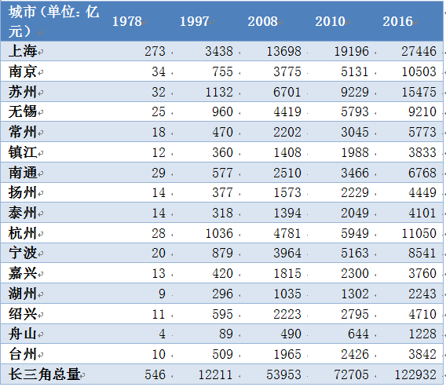
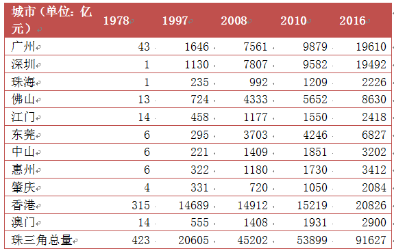
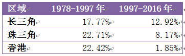
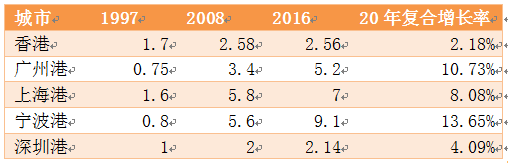
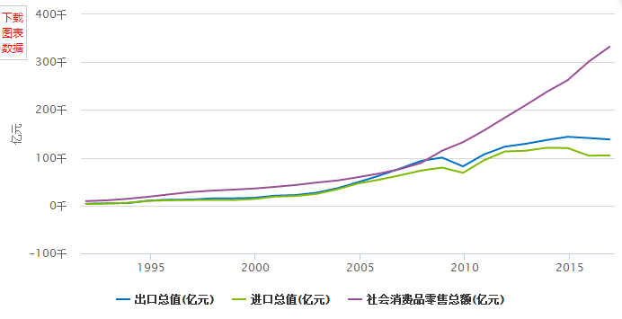
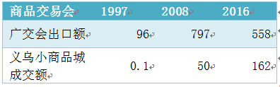
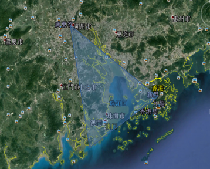
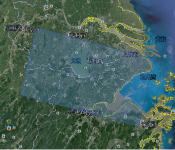
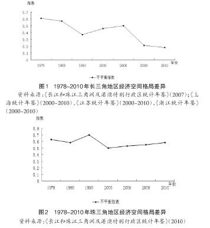

# 荐读

14世纪的佛罗伦萨掀起了西洋文艺复兴的浪潮，他们追寻古代希腊罗马文化的真善美，并从中意识到人性的可贵。从此西洋乘着文艺复兴的浪潮驶向现代化。

在人们向西审视西洋文艺复兴结出的灿烂成果时，却忽视了比西洋早300年的11世纪，东洋大陆早已吹起的文艺复兴之风。
这股东洋文艺复兴之风，被日本历史学家宫崎市定称为“宋代的文艺复兴”，写在《东洋的近世：中国的文艺复兴》这本书中。

宫崎市定是日本京都学派的史学泰斗，是“宋代文艺复兴论”的提出者。

宫崎市定将东洋与西洋对比，认为文艺复兴主要表现在哲学的复古思想、文体的变革、印刷术的发达、科技的进步以及艺术的发达。核心则是人们的历史觉醒，人们开始意识到明天可能会更好，开始审视历史，寻找历史的真谛。

儒学到底是考据文辞还是探究儒家思想的真意？诗歌的创作到底是堆砌辞藻还是抒发真情实感？绘画是专属于神佛还是反映自然之美？

人们这样的历史觉醒，当然是和经济的发展分不开的，宫崎市定在本书中讲到宋代之所以掀起文艺复兴的浪潮，是因为货币经济空前繁荣，人们在保证生存之后，开始思考生活的意义，这正是人们觉醒的原点。

宫崎市定从思想、经济、政治多角度分析“量”的不同，并从中抽象出可以与西方文艺复兴相比较的“参数”。通过不一样的研究方法，论证“宋代文艺复兴论”。

东洋与西洋的发展一向都有着千丝万缕的联系，宋代的文艺复兴到底有着怎样独特的魅力？

赶快走进宫崎市定的理论世界，感受东洋大陆吹起的文艺复兴之风吧！

# 《东洋的近世》- 联想香港的未来之争 by 张峻恺

《东洋的近世》谈到了商路的重要性，书中谈到了为何中国的重心是如何从长安转移到江苏浙江一带的，原因是因为气候变化导致土地肥力的变化，以及海运对陆运的冲击导致大运河和浙江成为商业中心的过程。这让我想到了一个大家争论的问题，到底香港未来会不会再次成为中国的经济中心？香港是否会再现东方之珠的辉煌？这个问题需要从商路的变迁来看，我先把结论说出来，香港未来只会成为中国重要的5个或者10个城市之一，不会再成为当年的那个“香港”。

和香港黄金年代相比，香港回归后在区域性经济和政治上的确地位有所下降，但是造成香港地位下降的原因到底是什么呢？是因为大陆的政治干涉？某任特首的决策失误？还是由于香港的阶级撕裂呢？总结香港繁荣的历史原因，无非这么三类：

一类观点认为是英国在殖民时期在香港建立的现代自由、民主、法制制度和市场经济，其实这一类的观点都可以归结于学术上制度决定论（The Institutions Hypothesis），

另一派观点认为，香港之所以成为香港，是因为香港人独有的艰苦拼搏的“狮子山精神”文化，这一类观点可以归结于学术上人种决定论（The Racial Hypothesis）。

剩下的一类观点其实都可以归结为地理环境决定论（The Gepgraphy Hypothesis），主要观点是，香港的之所以成为现在的香港，是由于香港独特的地理位置所决定的——香港是在背靠中国大陆唯一的开放港。

虽然说以上三种决定论均为香港的繁荣带来了影响，但是如果要讨论最重要的因素，笔者还是比较倾向于地理环境决定论，这也是《东洋的近世》所强调的商路变化的重要性。

地理环境变化对一个地区的经济政治具有绝对的影响作用，在笔者看来，香港回归后的20年，其实本质是中国贸易重心内陆迁移过程，大家经常讨论的大陆干预，阶级撕裂，政策失误等，其实均不能扭转香港的区域性地位下降的命运。我们可以尝试把这套方法用来探讨我们所了解的香港的发展和未来，笔者的观点是，香港，未来可能会变成中国最重要的三大、五大、十大城市之一，至于理由，这就要从香港的地理环境和香港为何会成为英国殖民地和香港如何会繁荣开始谈起。

**一、英国为什么会选择香港作为殖民地港口？（地理位置造就渔村改转港口）**

我们大家都知道，当年英国殖民香港，其实主要是因为为了让具有特许经营权的东印度公司在中国做生意，东印度公司主要是要从中国进口茶叶，并给中国大陆输出鸦片，这两项都是暴利行业。那其实问题来了，香港和珠三角一带又不是茶叶主产地，又不是鸦片主要的消费地，为啥英国人要选择香港作为殖民地港口呢？泉州、宁波、旅顺、天津这样港口不更能降低运输成本吗？但其实是不可能的，因为乾隆年间，清政府开始规定，全中国只能广州“一口通商”，同时规定洋人不得进城，特此还在广州古城外设立的清政府特许经营的十三行与洋人做贸易。

我们来看看香港与广州的地理位置关系，英国东印度公司的船要进入中国大陆，就必须从中国南海再到珠江口一带，从香港附近海域经珠江进入到广州十三行一带和中国商人进行贸易。香港位处亚热带，气候温和，终年不结冰，水深港阔，适合大型轮船停舶。广州当时已经是一个超过100万人口的大城市，在一口通商100多年期间，在广州十三行附近已经形成了一条完整的货运转运产业链，英国人的货物从十三行可通过转运产业从陆路和海路向整个大陆转运。广州话“咕哩”其实就是当时洋人对“苦力”发音不准，遗留到了现在的广州话词语，其实反映了当时洋人对在十三行一带从事货运生意的劳动力需要和洋人发生信息上的交流。而当时其实广州人极度的惧怕洋人，把洋人都叫做“鬼”、“鬼佬”，有史料记载广州城内有多次针对洋人的暴力活动，同时广州人民也一直要求政府禁止洋人入城。因此，英国人当时选择离广州最近的一个入海口香港作为在中国大陆经商的殖民地，应该是一个从地理上的最优选择，香港也因为英国和清朝间的贸易，从一个小渔村历史上第一次跃升为大城市。接下来，苏伊士运河的开通和广九铁路的正式通车，进一步巩固了香港的转港口地位。

**二、是什么造就了香港黄金年代？（制造业转珠三角造就香港奇迹）**

世界上的大城市很多都是港口城市，比如纽约，东京、巴塞罗那，因为港口的地理位置造就了人、财、物的聚集，聚集现象就会产生分工协作，劳动效率提升并产生产业升级。在大陆改革开放前，香港在长达100多年的港口转运城市化后，在本地就发展出了，金融、轻工业、造船、房地产等现代化产业结构，在大陆1979年改革开放后，香港的经济奇迹，其实就是香港的产业结构向大陆转移所成就的。但问题来了，为什么是香港？而不是台湾、日本、欧洲的其他一些资本主义经济体的向大陆产业转移呢？这其实还是因为香港的地理位置独特所决定的。

1978年，中央决定开始尝试对外招商引资，名义上是引资，其实中国并需要的并不是国外的钱，而是国外的现代化先进技术，中国领导人已经意识到，靠上海、东北的一些老厂，是无法实现国家的现代化的。中央开始在招商引资的时候，其实曾经向德国、日本、美国推销过中国的开放政策，希望欧美发达国家可以来华投资。但是，在1979年深圳特区正式成立的时候，其实真正吸引过来的，只有香港的资本。欧美发达国家经过多次和大陆领导人的沟通，虽然也对大陆巨大的市场垂涎三尺，但欧美人对当时中国的政府沟通情况非常吃力和不适应，但是香港却不一样，一是由于香港始终还是与大陆相连，香港人在大陆封闭的期间其实民间也一直与国内有沟通往来，和中国政府沟通相对于欧美有一定的优势；二是由于当年60-70年代大量的大陆移民偷渡到香港，这里的一部分人通过在香港的打拼积累了一定的财富，这些人由于原来可能就是广东某县的村民张狗蛋、王麻子、李嘉诚，重新回来大陆投资与政府也并不存在太多的沟通障碍。有关统计数据显示，1979年到1996年内地引进的外商直接投资里面60%来自香港，而广东省这个比例高达80%。港商在珠江三角洲开设的工厂有2万多家，1996年港商制造业企业在珠三角直接投资有600多亿港元，40多万家企业，直接雇用了400多万人，而直接为这些企业服务的还有100多万人。

**三、香港未来是否还会再创辉煌（大陆贸易重心从珠三角向长三角转移）**

香港回归这20年到底经济发展是不是真的大不如前，我们可以从一些数据上来进行分析：

表1 改革开放后，珠三角和长三角主要城市GDP数据对比（注：香港、澳门按美金当时汇率折算统计）

数据取自《广东统计年鉴》、《上海统计年鉴》、《江苏统计年鉴》、《浙江统计年鉴》

表2 长三角、珠三角、香港回归前后20年增速对比

虽然GDP统计只是一种经济数据，并不能反映香港实际情况的方方面面，但是无论如何，作为现代社会科学论证，还是要基于数据来去分析背后的问题。从数据上看，改革开放后，香港经济保持着年均22%的高速发展，通过产业转移，带领着珠三角地区大大领先于长三角的经济增速。但是在1997年香港回归后，香港连续经历了1997亚太金融危机和2008年美国次贷危机，经济一蹶不振，20年平均经济增速只有1.85%，可以说基本没有经济增长，并且拖累整个珠三角地区落后于长三角地区经济增速，这一趋势还有扩大的迹象。至于为什么香港乃至整个珠三角经济会出现被长三角赶超的现象，我们试着从地理环境的角度来论证一下：

1、香港已经不是大陆唯一的开放港口

广州人有一句老话大概意思就是“骗钱的买卖都是香港人教的”，意味着上一辈的广州人，如果想做一门生意，就必须依赖香港的独特地缘优势，去引入技术、人才、或者金融服务。但是时至今日，随着大陆的全面开放，如果杭州想引入一条德国的自动化生产线，已经不需要通过香港了，而且随着互联网技术的不断发展，技术，人才，资金等稀缺资源已经不在需要通过转港口来积累和提供服务，因此直接的结果就是会导致香港的香港人、财、物的分流。

表3 中国主要港口吞吐量对比（单位：万吨）

数据来源：中国港口信息网

世界目前主要物流货运80%集中在海运，从世界上看，转港口货运量对经济地区发展有决定性的影响，将决定一个地区的世界地位，因此近代世界上的现代化大都市大多都是港口城市。从中国几个重要港口上来看，香港在1997年回归后，贸易中心和经济中心逐渐已经被大陆其他港口所替代，不同于长三角港口货运量的突飞猛进，香港港口吞吐量不仅增加缓慢，并且在2008年-2011年出现历史性拐点，从此出现负增长。而长三角上海、宁波-舟山港，已经逐步发展为世界第一大港口，区域性地位此消彼长作用可见一斑。

2、中国已从外向型出口经济转为内向型内需经济，孤悬的香港并不占优势

自改革开放以来，中国经济一直是外向型经济，97年之前，中国进出口贸易大概占50%，但是在2007年前后，国内贸易的增速开始与进出口贸易增速拉开了差距，并从2014年开始，进出口贸易进入负增长年代，国内贸易开始占到60%以上。

图4 国内贸易和进出口贸易年总量

上文提到过，香港及其珠三角从历史上一直都是外向型贸易为主，而长三角从历史上就是京杭大运河内需经济主导的区域，并且到了近代，“苏南模式”是主导长三角一带经济变革的乡镇经济模式，其偏重也是满足内需。我们可以从全国两个区域经济市场晴雨表来看看两种模式开始逆转的趋势：

表4 广交会出口额和义乌小商品成成交额（单位：亿美元）

广交会是中国外贸的晴雨表，其实也是珠三角外向经济的重要指标，从2008年开始，广交会出口额出现较大规模的持续下降，而长三角的义乌小商品城，则由于内需拉动，每年成交额都不断创新高。

3、长三角未来比珠三角有更加有利的城市集群和分工协作地理优势，香港处于地理位置再吃一亏

过去读到改革开放成功经验的时候，总有个问题不解，似乎珠三角在改革开放后成功模式是建立了许多独立的制造业“专业镇”，而在长三角的改革模式却更倾向于在一个地方的国有企业和乡镇企业改革成功后，周边城市很快的把模式推广和复制，形成一个较大区域的产业链。其实这种区别是由于两区域的地形所决定的，请看两个区域的地图：

先来看珠三角地形图，其实珠三角是一个被周边山区包裹着的斜三角，面积约5.5平方公里，斜三角的顶端就是广州，香港三角的一个底角，三角的中央是一大片的珠江湾，珠江湾将珠三角隔离成两块，因此形成了许多的独立专业镇，这种地理结构就决定了广州是珠三角的“集散地”，香港是珠三角“门户”的双巨头结构。

图5 珠三角平原地形图

再来看看长三角的地形图，相比于珠三角平原，长三角平面面积要开阔得多，长三角城市群面积有11万平方公里，但其实由于周边没有像珠三角一样的群山环绕，广义上的长三角平原有22万平方公里，也就是有着比珠三角大2-4倍的城市群面积。且长三角横跨三省，除了GDP超过2万亿的上海一枝独秀外，其余1万亿左右的5座城市南京、无锡、苏州、杭州、宁波均匀的分布在以太湖为中心的长方形区域内，区域协同性更强，6大城市各自吸引来自3省乃至全国的人才，更利于人口集聚，产业分工和交通运输。

图6 长三角平原地形图

引用《长三角与珠三角经济格局动态发展比较》文章使用罗伦兹曲线来分析两个区域的不平衡指数可发现，珠三角双巨头结构导致区域城市的不平衡指数在扩大，而整个长三角，区域城市间的发展要平衡很多。

图7 引用罗伦兹曲线比较长三角区域发展要比珠三角平衡

**四、结语**

当然，《东洋的近世》所谈到的东西方的分流和文艺复兴原因只是一种假设，研究一个地方的经济政治历史并不是一门精密的科学研究，因为你没办法在一个区域用不同的理论在一定的时间内重复一百次去证明一个理论的正确性，对于香港的研究，只能对比类似区域和对比不同时间来进行分析。不管再不愿意承认大陆的重要性也好，香港的兴盛都与大陆有着直接的关系，近代香港出现过两次的衰落，一次是太平天国运动，把大陆南北通道打断了，导致香港的经济衰退和上海的崛起；一次是50-60年代，随着大陆文革和西方制裁，香港进入到严重的经济衰退中。一个区域的地理是确定的，但是环境是改变的，和达尔文的适者生存理论一样，当环境改变时，一个地区的地理位置可能会相应的从优势变为劣势，香港的现状，其实并不以香港人的意志为转移。