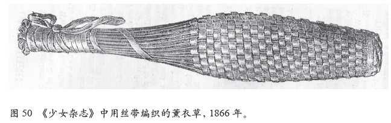

# 翻看《成为一名维多利亚人》了解英国维多利亚时代的秘密

2009年，历史学家露丝·古德曼化身农夫，亲身体验维多利亚时期的日常生活整整一年；

2011年，她与主任药师尼克·巴伯等人开了一家真正的维多利亚时期的药铺；

2012年，她“穿越”到都铎时期，化身修道院的佃农，体验田间耕作、春秋交替；

2014年，她写下《成为一名维多利亚人》；

2016年，她写下《成为一名都铎人》；

……

**她是露丝·古德曼，英国自由历史学家、BBC历史农场系列纪录片主持人、历史顾问和畅销书作家。**

**在她的带领之下，我们将体验一次复古、颠覆、浪漫旖旎的穿越之旅。**

☀切实体会维多利亚人的观念、手艺和风俗

☀亲手制作紧身胸衣、牙膏、卫生巾、化妆品……

☀循着烹饪指南料理维多利亚餐食

☀感受雅与俗、禁锢与放浪的碰撞

**在她的带领之下，我们将了解现代小资生活缘起何处。**

☀个人卫生、厨房科学和性等方面极大的观念革新

☀健身房、运动场、酒吧和泳池，运动有益、消遣无罪

☀通勤时代已然到来：地铁、公交马车、火车是最普遍的代步方式

☀义务教育兴起，莘莘学子向梦想出发

**在她的带领之下，我们将了解繁荣总是伴随着一部分落寞与黑暗。**

☾工业革命到达峰端，女工和童工不见天日

☾酒水掺假，鸦片是贫穷婴儿的“助眠”工具

☾农业遭受冲击，环境遭到破坏

☾性爱双标：男性外遇无罪，女性却被误读

英国起源的秘密在金雀花王朝，英国现代生活缘起的秘密在维多利亚时代。《成为一名维多利亚人》通过珍贵图片资料，描绘维多利亚时代不同社会阶层人们的真实生活图景。

想要穿越时空去感受英国维多利亚时代的生活气息吗？翻开这本书走进最真实的维多利亚时代吧！

## 维多利亚人“秘密”的起床方式和“科学”的室内通风理论

**本文为《成为一名维多利亚人》书籍内容节选**

**“秘密”的起床方式**

黎明的到来预示着大部分劳动人民要起床了，但也有很多人有着更固定的起床时间。对于那些必须准时早起的人（比如工厂工人）而言，“敲窗人”（Knocker-upper） 的存在则显得无比重要。他们手持一根长长的木杆和一盏提灯，在街上走走停停，用长杆敲打客户的窗玻璃。这种不寻常的职业产生的原因之一，是钟表售价昂贵使 工人阶级难以负担。对于敲窗人来说，投入些资本买块表却可以用来谋生。他们从夜晚一直工作到凌晨，每次叫醒服务都会给自己带来1便士的收入。从朴茨茅斯到因弗内斯，大不列颠的工业城镇几乎都能找到这样的服务人员。不仅如此，这种职业甚至扩展到了一些小市集，比如位于赫特福德郡的鲍尔多克。那里的三大啤酒厂家之一也雇佣了一名敲窗人，负责在凌晨3点叫醒运货的马车车夫。尽管鲍尔多克的总人口只有2 000，却有大量的晨工在铁路公司、酿造厂和小作坊里工作，这保证了敲窗人总能有口饭吃。

**“科学”的室内通风理**

维多利亚人卧室里的窗户总是整夜打开着，以保证室内空气循环。这项习惯基本上是源于阿诺特（Arnott）博士在著作中对污浊而沉闷的房间提出的警示。阿诺特博士是一名受人尊敬的科学家，他是英格兰皇家协会（Royal Institution）的成员，对大气现象和“公共卫生”问题的研究饶有兴趣。他在当时的主流媒体上发表了关于某次实验的报告，其中某些模糊的言论引发了维多利亚民众对室内缺氧现象近乎偏执的恐惧。这份报告提道：“夜间，如果人们在自己的床帐顶部挂上一只金丝雀，早上起来时，就会发现它已经死掉了。”

阿诺特博士和当时的其他研究者主要研究二氧化碳的积累现象。在通风不佳的空间里，二氧化碳通常会变为碳酸（Carbonic Acid）。当然，如果缺氧，人类在封闭环境中确实会窒息。但人们担心有炭火和煤气灯的常规家庭环境也会对呼吸系统造成危害，即使不引起窒息，吸入高浓度的二氧化碳也会造成中毒和疾病的发生，从而威胁人体健康。鉴于人们待在卧室的时间比较长，这种情况更让人不安。派伊·亨利·谢瓦斯（Pye Henry Chevasse）是一位在维多利亚时代专为普通民众撰写健康指南的医学博士，他热衷于将当时有限的研究结果传得骇人听闻。“睡在没有通风装置的房间里简直就是疯了——这就是在吸入毒气啊；至于二氧化碳，这种排汗产生的废弃物，肺部无时无刻不在向外排放的气体，是……致命的！”这是个很有影响力的论点，以至于整个世纪都没有权威媒体有信心能推翻它。有一些科学家试图通过给所需的氧气量分级来量化问题，比如乔蒙（Chaumont）博士，他提出每人每小时需要4 000立方英尺的氧气来保证生命健康。这样的氧气量需要10英尺高、10英尺宽、40英尺长的房间才能装下，而一般的维多利亚人的房间满足不了这种需求。21世纪，分析报告把谢瓦斯和他的同僚的错误简单地解释为低估了室内外的空气对流。

如今，就算我们住房的密闭程度不知要比维多利亚时代高上多少倍，人们也几乎不会担心发生二氧化碳中毒的危险。事实上，即使有高密封的双层玻璃，烟囱也早就消失在历史的长河里。现代研究仍指出，室内空气每2～3个 小时就会完成一次完全更换。然而，维多利亚时代不仅提倡时刻保持烟囱打开着（无论是否使用），而且还建议不管什么天气，都要把框格窗的上下格齐齐推开，以 保证新鲜空气能自由流动，拂过整个房间。对于那些没有烟囱的屋子，则可以在门上装一扇气窗。当窗户打开时，就能带来一些穿堂风。

如果你有幸成为一名维多利亚人，但实在忍不了窗户始终开着，那你可以靠一碗水来提高室内空气质量。这个小窍门在那时相当流行，“在房内放上一碗水”，在“几个小时”里，这碗水会吸收一切生活浊气，空气将“在水被彻底污染的同时，变得纯净”。另一种检测碳酸含量的小实验则在指南类书籍和学校的教科书里都有描述。《家庭生活科学》（The Science of Home Life）是一本专为校园女生设计的书。书里提道：“如果在浅盘或者茶碟里倒入一些澄清的石灰水，使之暴露在空气中，并静置一个小时左右，我们会发现液体表面出现了一层白色薄膜或底部有沉积物。这就证明，空气中存在碳酸。”不幸的是，从科学的角度来说，这两个实验的准确度极低。譬如，后面那项实验主要是因为石灰水中的水分蒸发，析出溶质；至于前一项实验，水被“污染”很可能纯粹是臆想和幻觉。无论如何，当时的流行观念很少能得到科学方法的佐证。

那 么当时的人们是否真的一年到头都开着窗户呢？实际情况似乎并非如此。根据慈善家、研究人员和政府官员提供的关于穷苦人民生活状况的资料，孩子们夜晚会在床 垫上挤作一团。在永远敞开着的窗户下，能够让他们感到些许温暖的，只有日间的服装和彼此。父母们想尽力做点正确的事。他们害怕孩子们会中毒，尽管没法给孩 子们提供温暖，还是会把窗户打开。其他报道一样夸张，比如一大群人挨肩叠背地睡在窗户紧闭、密不透风的屋子里。对这些人来说，温暖环境比有毒空气更具影响 力。亨利·梅休（Henry Mayhew）是《纪事晨报》（The Morning  Chronicle）的一名新闻记者，他在回忆对穷苦百姓的采访时提道：“在死寂的深夜里，他们呼出的浊气在密闭的卧室中升起，化成恶臭的蒸气，令人窒 息。”

## 维多利亚人荣耀的象征 ——那是肥皂的香气

尽管除臭剂到20世纪才开始普及，晨间洗漱却改变了维多利亚人对气味的看法。随着更多人（多为中产阶级）开始在清晨使用肥皂和热水，体味从此打开了一个全新的局面，有了分裂国民的意味。1850年，威廉·萨克雷（William Thackeray）在他的小说《潘丹尼斯的历史》（The History of Pendennis）中创造了“下层民众”（Great Unwashed）一词。很快，该词被广泛接受，并被用来形容工人阶级，以将他们与上层社会的人区别开来。中产阶级和更上层的人们闻起来与下层民众十分不同——有着浓郁的肥皂味，更重要的是没有一丝汗臭味。维多利亚时代的肥皂以动物油脂和烧碱（Caustic Soda）为原材料，浓烈的气味有效地遮掩住了大部分体味。19世纪末，薰衣草、紫罗兰和玫瑰等香味的肥皂开始流行，人们在个人清洁习惯上投入了更多的精力。虽然这些迷人的花香并不能完全掩盖肥皂本身的气味，但这特殊的香气还是成为一枚嗅觉上的荣誉勋章，一份只有可以洗澡的人群才能享用的荣耀。

虽 然大量的体力工作让衣服邋遢不已，体味不堪入鼻，但工人阶级对于用水清洗身体这一方法还是持保留态度。他们也不会去购买或是借阅最新的健康指南和家庭手册 等倡导这一方法的读物。仔细思索，或许造成这一现象的重要原因是条件拮据，无论洗澡还是洗衣，他们很少具备这两项活动所需的硬件条件。

肥皂和热水对于这些徘徊在贫困线上的人们来说已经够奢侈了，更不要说洗衣设备本身所需的费用。按维多利亚时代的物价来算，4盎司一块的肥皂条（与现在英国市面上的肥皂尺寸差不多）就相当于一大块牛肉的价钱。一个遵循新清洗理念的中产阶级家庭，每星期能用掉3～4块肥皂条，这远超平民家庭的承受范围。甚至到了19世纪末，主流技术革新引发了多次物价下调，但对于工人家庭来说，清洗身体和服装所必需的肥皂仍旧占据了每月支出预算的5%。这样的额外花费将意味着烧水用的铜壶无法出现在工人阶级家庭的房子里。也就在这时，衣服绞干机（Wringer）的出现使服装清洗工的数量有了显著的改变。但衣服绞干机很烧钱，所以直到19世纪末，大部分工人家庭没有做购买它的打算。因此，穷人和富人比起来差距那么大也就不足为奇了。

清洗服装（之后会详细讨论），是产生嗅觉差异的一个重要因素。承载着汗液和其他各种身体分泌物的脏衣服，很自然地成为滋生细菌和异味的理想温床。羊毛是让汗液自然蒸发最有效的材料。21世纪的徒步旅行者和登山爱好者重新悟到了维多利亚人的经验，纯羊毛制品以“无臭”袜和美利奴羊毛（Merino-wool）内衣为代表，再次受到追捧。在这一点上，高科技人造纤维无法与传统羊毛相媲美。

对于某些被衣服紧束或者汗液分泌很旺盛的身体部位，最明智的选择是穿上一层易脱易洗的服装。紧绷的束胸内衣和衣服的袖管、腋窝处都是维多利亚女人心中的大麻烦。虽然女式背心（Vests）和无袖衬裙可以清洗，但穿件保护服（Dress Protectors）也是不错的选择。这是一种小巧的，可拆卸的衬垫，能塞进裙子、垫在腋窝处。由于它可以单独取出来清洗，因而确保了精致华美却脆弱的衣裙不会被毁掉。这种保护服如今在英国传统的缝纫店里依然可以买到。

爽身粉（Dusting Powders） 是让身体呈现理想香味，引起嗅觉差异的另一因素。它以淀粉或者滑石粉为基质，可以加一点儿香料，也可以不加，能吸收汗液并且轻易去除污渍。大小药房的货架 上都能找到它的身影。最昂贵的爽身粉装在一种圆形的陶瓷罐中，表面还附有一块海绵，方便蘸取。便宜点儿的则在盖子上设有一个孔，方便人们使用的时候直接抖 动，让粉末直接从孔里落到皮肤上。对于那些条件拮据，只求便宜的顾客，小贩们卖的是最普通的淀粉或粉末，而且是论重量卖。如果有人还担心体味问题，那这里 还有最后一招：用布蘸着氨水擦拭腋下和其他“体味易发区”。氨水能杀死引发体味的细菌，是一种非常有效的除臭剂。也可以用醋擦拭，不过效果稍弱一些。虽然醋的杀菌效果没有氨水那么强，但有一个好处，那就是对于敏感型肤质而言，醋的刺激作用要小很多。

除了摆脱恼人的体味，维多利亚人的个人卫生观念还围绕着健康展开。而这一时期有关健康的研究，却在经历着有史以来最大的革新。

维多利亚时代，微生物理论的基本架构虽已成型，但并没有完全得到证实。直到19世纪60年代初，路易·巴斯德（Louis Pasteur） 才向世人证明了事物的衰变是由空气中存在的微生物造成。他的实验很简单：将一组材料暴露在空气中，另一组放置在真空状态下。在真空中的样本一直没有腐烂， 直到空气被导入器皿。自此，人们相信，小到只有在显微镜下才能看得到的微生物就是衰变的根源。衰变和腐坏并不如人们之前所想为自然生成，而是生物活动的结 果。生物可以被消灭——在理想情况下，用某种药剂能够消灭细菌，却不会伤害病人。巴斯德的下一个突破就是确定了石炭酸在杀菌方面的用途。

当人们逐渐接受这些观点之后，越来越多关于已知微生物的信息涌现出来。在这股全新的实验热潮中，最杰出的发现来自伦敦流行病学会（Epidemiological Society of London）创始人之一约翰·斯诺（John Snow）博士。他在1854年爆发的霍乱中，成功找出了疫情的来源，指出每一起霍乱病例都源于索霍区百老大街一处被感染的水泵。几乎可以肯定，正是由于处理了这处受感染的水泵，无数的生命才得以拯救。

瘴气理论认为，所有的疾病都由不干净的空气引起，但病人身上所表现的病症是由其本身，而不是感染源决定。在旧理论中，同样邪恶的瘴气在一个人的身体上可以表现为肺病，而在另一个人身上可能就成了胃病，这取决于患者的体格特征和所处环境。直到1879年，德国医生罗伯特·科赫（Robert Koch）首次证明了某种特定的微生物是某种特定疾病的病原。到1884年，伤寒、麻风、白喉、结核、霍乱、痢疾、淋病、疟疾、肺炎和破伤风的致病细菌被相继发现并区分开来。这是认知的革命性转变，对之后的疾病研究和医疗手段都有着巨大影响。然而，在清洁问题上，它似乎改变了一切，却又什么都没有改变。

如果细菌真的存在于每一个角落——在空气中，在水里，在一切物体表面，那么清洁就变得前所未有的重要。祛除污垢一直被认为是保护家庭免受疾病困扰的良方。人们之前是为了避免受到不洁空气的污染而清理垃圾，而现在，却是为了消除细菌本身。最终，所有曾经被奉为教条的清洁习惯依旧全都适用，且有效。

微生物理论，就如旧理论一样，提倡注重个人卫生，定期清空污水池、打扫房间、清洗服装、擦洗厨房、洗净碗碟，如此种种。不论基于何种理论，家政工作都对保持健康有着重要意义。社区清洁工作也是如此：微生物防治与瘴气防治采取的措施一样——完善城镇垃圾管理，定期清扫街道，起诉在公共场合倾倒垃圾的行为。在微生物理论和瘴气理论下，保持个人卫生也同样对疾病预防有着重要作用。这让人们相信干净的身体既不会污染空气也不会滋生病菌。

如果汉娜·卡尔威克在微生物理论被广泛接受和认可之后，依然在厨房进行晨间洗漱工作，她就再也不用担心热水会打开毛孔的问题了。她可能不再只是想洗手，而是更想给手消毒。

彼时，石炭酸依然是很受欢迎的杀菌剂之一。它除了能在药店里以水剂和粉末的形式出售，也能掺入肥皂中进行售卖。这样一来，清洁就不再只是愉悦视觉和嗅觉的行为了。石炭酸自身的刺鼻气味赋予“干净”这个词一种全新、无菌的含义。在当时，闻起来有石炭酸肥皂气味的女仆通常都能得到女主人的信任与青睐。如果你想感受维多利亚时代的清洁感，现在市面上一种“焦油”肥皂（Coal Tar Soap）与之类似，不过其内部的活性成分被换成了茶树精油。值得一提的是，我们的制造商仍保留了石炭酸气味，因为时至今日，这种气味仍带有一些暗示安全无菌的文化意味。

